# Anwendungsfall: Erstellen eines Empfehlungsformulars{#use-case-creating-a-refer-a-friend-form}


In diesem Beispiel möchten wir den Empfangenden in der Datenbank einen Wettbewerb anbieten. Das Web-Formular soll einen Abschnitt zur Eingabe der Antworten enthalten und einen anderen zur Eingabe der E-Mail-Adresse eines Freundes.

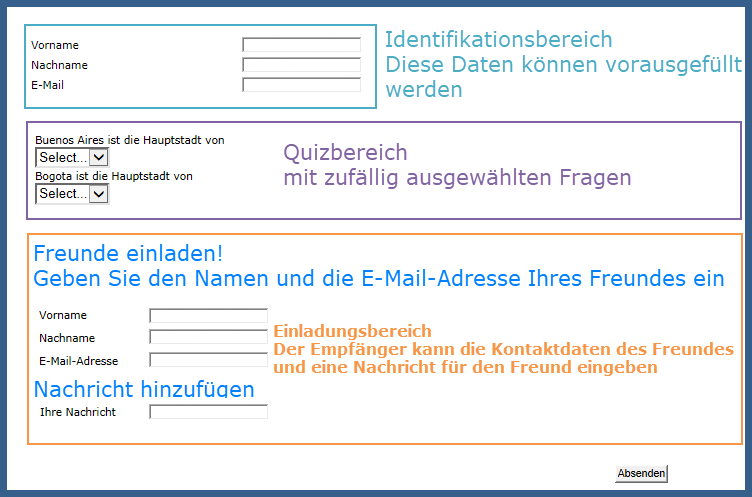

Die Identifizierungs- und Gewinnspiel-Bereiche werden durch die zuvor beschriebenen Prozesse erstellt.

Um den Freunde-Werben-Bereich zu konfigurieren und zu erstellen, gehen Sie folgendermaßen vor:

1. Erstellen Sie ein Gewinnspiel-Webformular mit Fragen und einem Eingabefeld für die Kontaktinformationen des Angeworbenen wie unten dargestellt:

   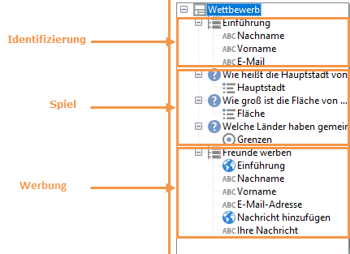

   Im Feld **Ihre Nachricht** können Sie eine Nachricht für die angeworbene Person eingeben. Die werbende Person muss auch ihren **Nachnamen**, **Vornamen** und ihre **E-Mail-Adresse** eingeben.

   Die in den Feldern eingegebenen Informationen werden in einer speziellen Tabelle, der Besuchertabelle, gespeichert.

   >[!NOTE]
   >
   >Solange der Angeworbene noch nicht sein Einverständnis gegeben hat, können Sie ihn nicht gemeinsam mit den Werbern in der Datenbank speichern. Er wird deshalb vorübergehend in der **Besuchertabelle** (**nms:visitor**) gespeichert, die für virale Marketing-Kampagnen verwendet wird. Diese Tabelle wird regelmäßig durch **Bereinigungsprozesse** geleert.
   >
   >In diesem Beispiel möchten wir Empfangende dazu bewegen, an dem von ihren Werbenden empfohlenen Wettbewerb teilzunehmen. In dieser Nachricht möchten wir ihnen jedoch auch ein Abonnement für einen unserer Informationsdienste anbieten. Wenn sie sich anmelden, können sie in der Datenbank gespeichert werden.

   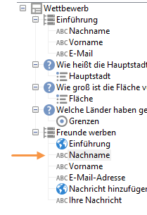

   Der Inhalt der Felder für die Angeworbenen wird im Skript zur Profilerstellung und in der an sie gesendeten Nachricht verwendet.

1. Erstellen Sie zunächst ein Skript, das den Werber mit dem Angeworbenen verbindet.

   Es enthält die folgenden Anweisungen:

   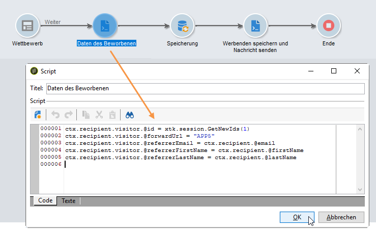

   ```
   ctx.recipient.visitor.@id = xtk.session.GetNewIds(1)
   ctx.recipient.visitor.@forwardUrl = "APP5"
   ctx.recipient.visitor.@referrerEmail = ctx.recipient.@email
   ctx.recipient.visitor.@referrerFirstName = ctx.recipient.@firstName
   ctx.recipient.visitor.@referrerLastName = ctx.recipient.@lastName
   ```

   Der Nachname, der Vorname und die E-Mail-Adresse, die in den Identifizierungsbereich der Seite eingegeben werden, werden als Nachname, Vorname und E-Mail-Adresse des Werbers identifiziert. Diese Felder werden erneut in den Nachrichtentext eingefügt, der an die angeworbene Person gesendet wird.

   Der APP5-Wert entspricht dem internen Namen des Webformulars: Mit dieser Information können Sie den Ursprung des Angeworbenen ermitteln, d. h. den Besucher mit dem zu seiner Erstellung verwendeten Webformular verbinden.

1. Mithilfe der Speicherungsbox können Sie Informationen erfassen und in der Datenbank speichern.

   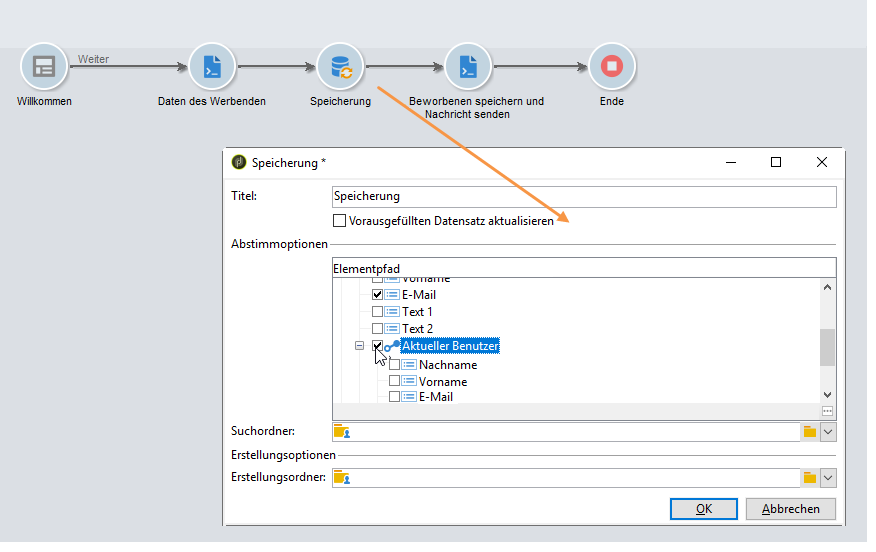

1. Erstellen Sie dann die Versandvorlage, die mit dem in Schritt 1 erstellten Informationsdienst verknüpft ist. Sie wird im Feld **[!UICONTROL Choose scenario]** des Informationsdienstes ausgewählt.

   Die Versandvorlage zur Erstellung der Freunde-Werben-Nachricht enthält die folgenden Informationen:

   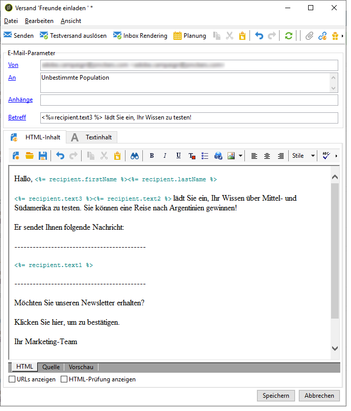

   Diese Vorlage hat die folgenden Eigenschaften:

   * Wählen Sie die Besuchertabelle als Zielgruppen-Mapping aus.

     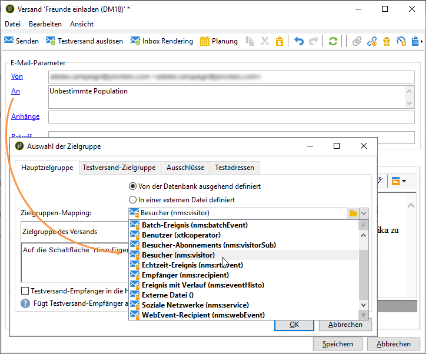

   * Die Kontaktinformationen der angeworbenen Person sowie die Informationen der werbenden Person werden der Besuchertabelle entnommen. Sie werden mithilfe der Schaltfläche „Personalisierung“ eingefügt.

     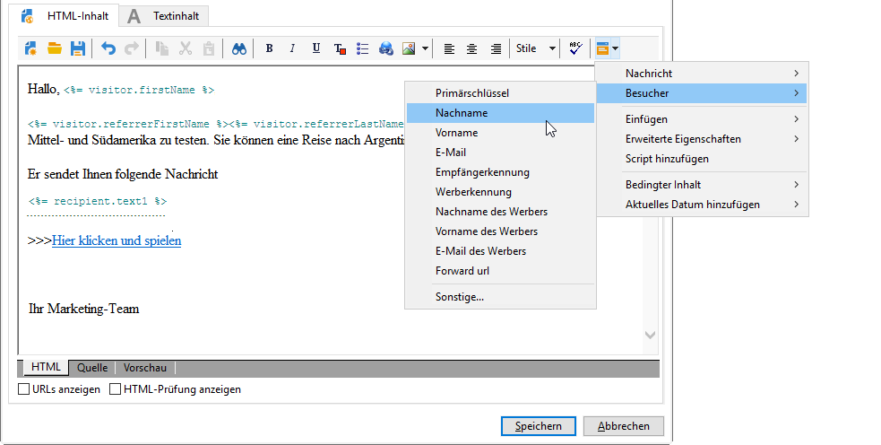

   * Diese Vorlage enthält einen Link zum Gewinnspielformular und den Abonnementlink, über den der Angeworbene einen Newsletter abonnieren kann.

     Der Abonnementlink wird über einen Gestaltungsbaustein eingefügt. Standardmäßig können Profile für den **Newsletter**-Dienst angemeldet werden. Dieser Gestaltungsbaustein kann entsprechend Ihren Anforderungen angepasst werden, sodass Sie den Empfänger auch für einen anderen Dienst anmelden können.

   * Der interne Name (hier „referrer“) wird im Nachrichtenversand-Skript wie unten dargestellt verwendet.

   >[!NOTE]
   >
   >Weiterführende Informationen zu Versandvorlagen finden Sie in der [Dokumentation zu Campaign v8](https://experienceleague.adobe.com/docs/campaign/campaign-v8/send/create-templates.html?lang=de){target="_blank"}.

1. Erstellen Sie das zweite Skript zur Bereitstellung der Abonnement-Nachrichten.

   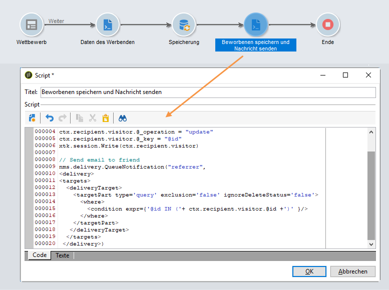

   ```
   // Updtate visitor to have a link to the referrer recipient
   ctx.recipient.visitor.@referrerId = ctx.recipient.@id
   ctx.recipient.visitor.@xtkschema = "nms:visitor"
   ctx.recipient.visitor.@_operation = "update" 
   ctx.recipient.visitor.@_key = "@id" 
   xtk.session.Write(ctx.recipient.visitor)
   
   // Send email to friend
   nms.delivery.QueueNotification("referrer",
   <delivery>
   <targets>
     <deliveryTarget>
       <targetPart type='query' exclusion='false' ignoreDeleteStatus='false'>
         <where>
           <condition expr={'@id IN ('+ ctx.recipient.visitor.@id +')' }/>
         </where>
       </targetPart>
      </deliveryTarget>
     </targets>
    </delivery>)
   ```

1. Veröffentlichen Sie das Gewinnspielformular und senden Sie den Kontakten der ursprünglichen Zielgruppe eine Einladung. Wenn einer davon einen Freund einlädt, wird ein Versand auf der Basis der **Freunde-Werben**-Vorlage erstellt.

   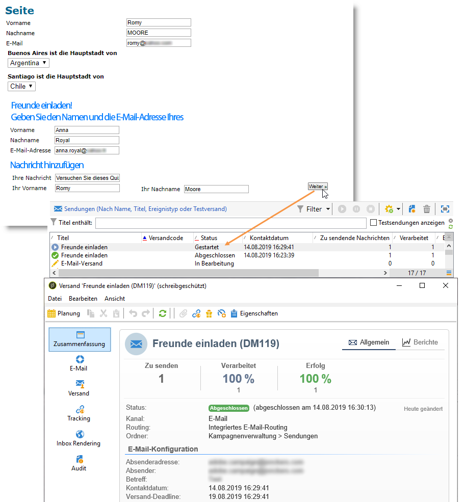

   Der Angeworbene wird zum Besucherordner im Knoten **[!UICONTROL Administration > Besucher]** hinzugefügt:

   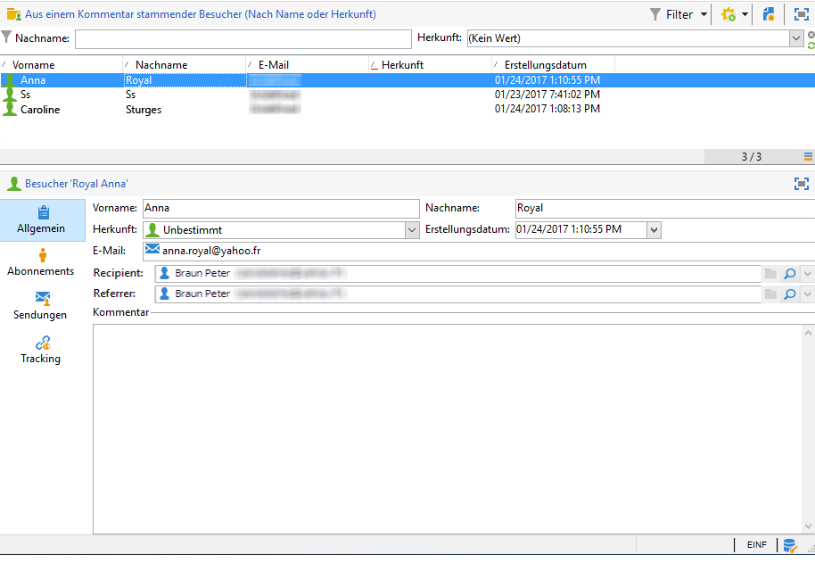

   Das Profil enthält die Informationen, die von der werbenden Person eingegeben wurden. Es wird basierend auf den im Formularskript eingegebenen Konfigurationen gespeichert. Wenn sich die angeworbene Person für ein Abonnement des Newsletters entscheidet, wird sie in der Empfängertabelle gespeichert.
