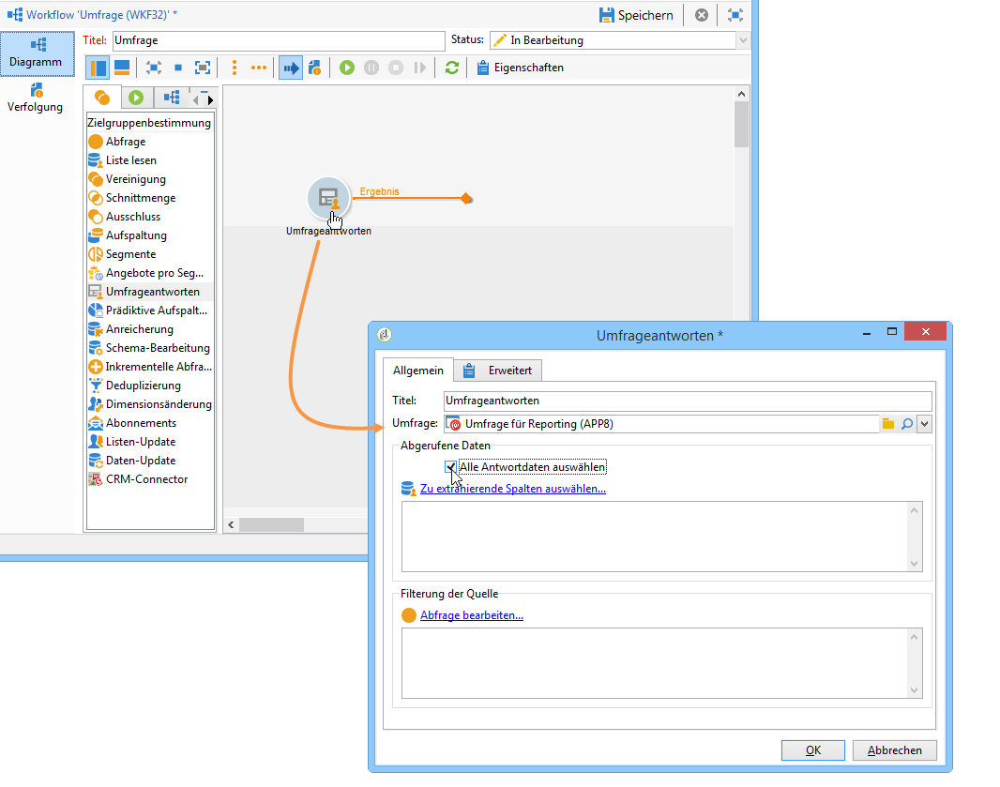
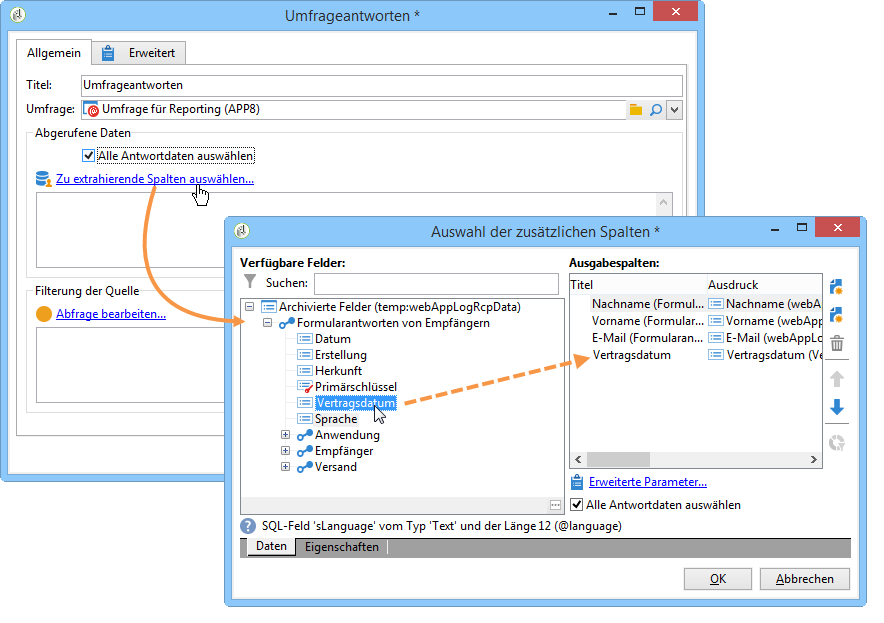
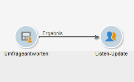
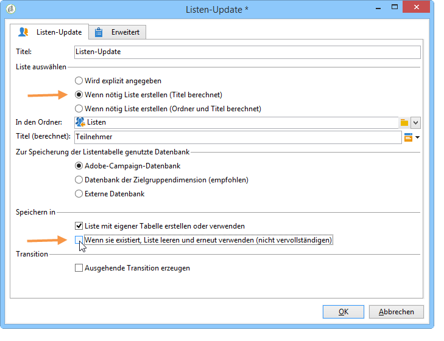
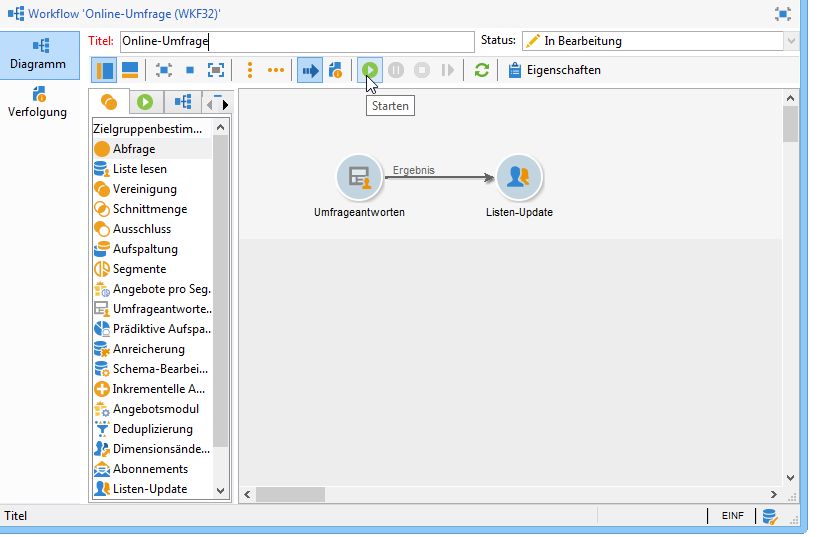
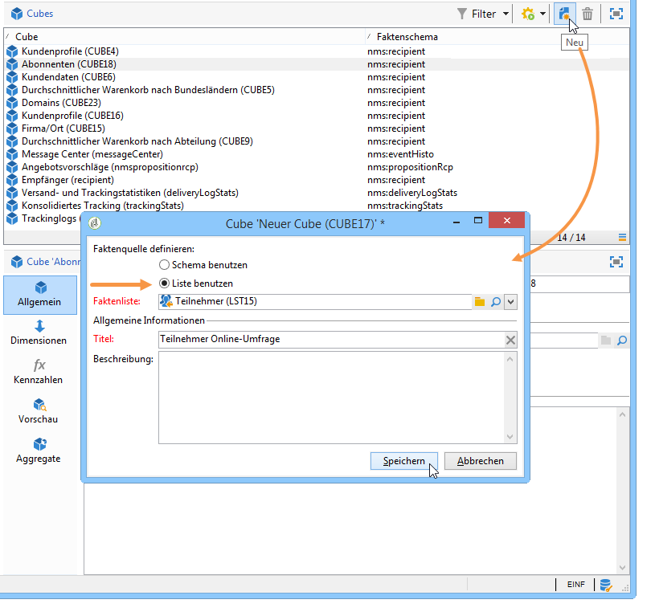
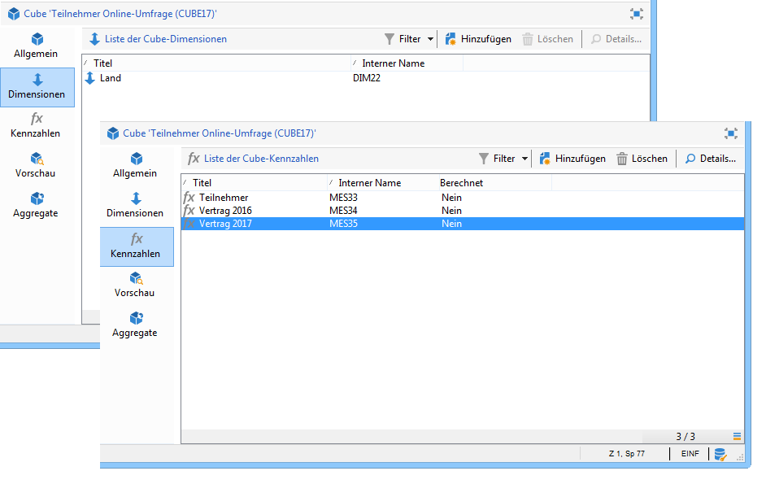
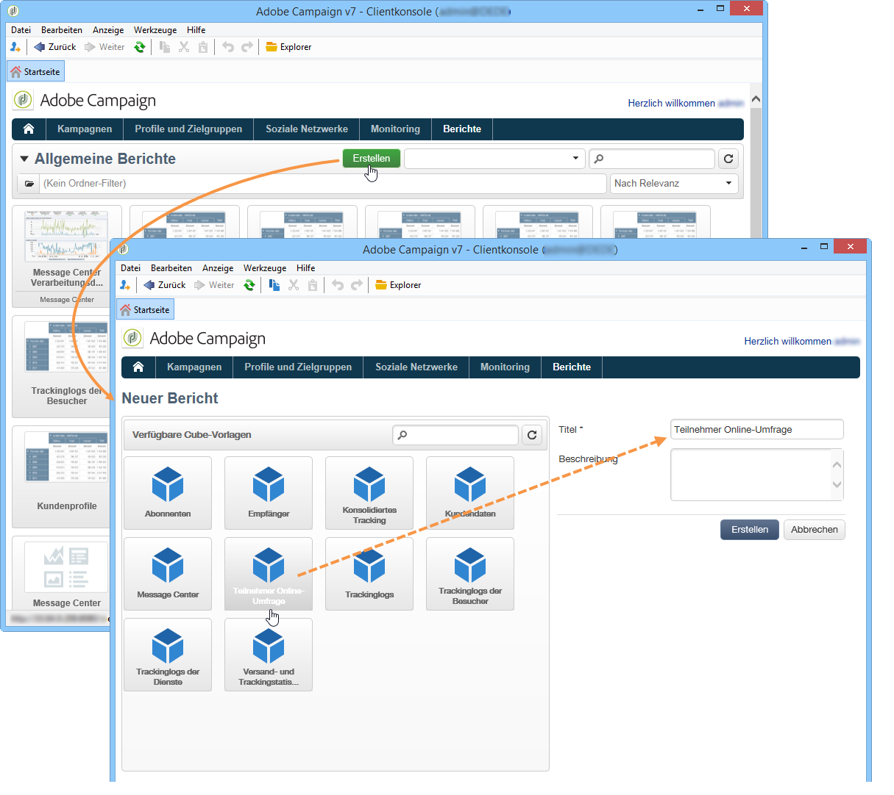
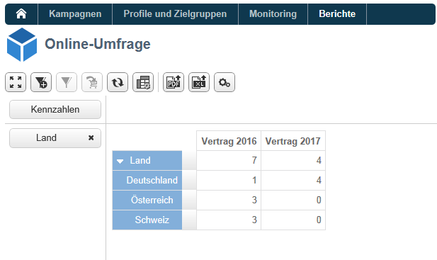

# Anwendungsfall: Bericht zu Antworten auf eine Online-Umfrage anzeigen{#use-case-displaying-report-on-answers-to-an-online-survey}

Die Antworten auf Adobe Campaign-Fragebögen können abgerufen und in dedizierten Berichten analysiert werden.

Im unten stehenden Beispiel werden die Antworten auf eine Online-Umfrage gesammelt und in einem Bericht in Form einer Pivot-Tabelle angezeigt.

Gehen Sie wie folgt vor:

1. Erstellung eines Workflows zum Abruf der Umfrage-Antworten und ihrer Speicherung in einer Liste.
1. Erstellung eines Cubes, der die Daten der Liste verwendet.
1. Erstellung eines Berichts mit einer Pivot-Tabelle und Anzeige der Antwortenaufschlüsselung.

Voraussetzung für die Durchführung dieses Anwendungsbeispiels sind ein Fragebogen und zu analysierende Antworten auf diesen.

>[!NOTE]
>
>Dieser Anwendungsfall kann nur implementiert werden, wenn Sie die Option **Umfrage-Manager** erhalten haben. Prüfen Sie diesbezüglich Ihren Lizenzvertrag.

## Schritt 1: Erstellung des Workflows für Datenabruf und -speicherung {#step-1---creating-the-data-collection-and-storage-workflow}

Gehen Sie wie folgt vor, um die Antworten der Umfrage abzurufen:

1. Erstellen Sie einen Workflow mit der Aktivität **[!UICONTROL Umfrageantworten]**. Weiterführende Informationen zur Verwendung dieser Aktivität finden Sie in [diesem Abschnitt](../../surveys/using/publish-track-and-use-collected-data.md#using-the-collected-data).
1. Öffnen Sie die Aktivität und wählen Sie die Umfrage aus, deren Antworten analysiert werden sollen.
1. Aktivieren Sie die Option **[!UICONTROL Alle Antwortdaten auswählen]**, um alle verfügbaren Informationen abzurufen.

   

1. Zu extrahierende Spalten auswählen (in diesem Fall: Alle archivierten Felder auswählen). Dies sind die Felder, die die Antworten enthalten.

   

1. Fügen Sie nach der Konfiguration des Antwortenabrufs eine Aktivität vom Typ **[!UICONTROL Listen-Update]** hinzu, um die abgerufenen Daten zu speichern.

   

   Geben Sie in dieser Aktivität die zu aktualisierende Liste an und deaktivieren Sie die Option **[!UICONTROL Löschen und ggf. erneut verwenden der Liste (andernfalls zur Liste hinzufügen)]** : Antworten werden der vorhandenen Tabelle hinzugefügt. Mit dieser Option können Sie auf die Liste in einem Cube verweisen. Das mit der Liste verknüpfte Schema wird nicht bei jeder Aktualisierung neu generiert, was die Integrität des Cubes garantiert, der diese Liste verwendet.

   

1. Speichern und starten Sie den Workflow, um die Konfiguration zu beenden.

   

   Die angegebene Liste wird daraufhin erstellt und mit dem Schema der Umfrageantworten ergänzt.

1. Fügen Sie eine Planung hinzu, um einen täglichen Abruf der Antworten und die Aktualisierung der Liste zu konfigurieren.

   Die Aktivitäten **[!UICONTROL Listen-Update]** und **[!UICONTROL Planung]** werden erläutert in .

## Schritt 2: Erstellung des Cubes und seiner Kennzahlen {#step-2---creating-the-cube--its-measures-and-its-indicators}

Erstellen Sie anschließend den Cube und konfigurieren Sie seine Kennzahlen: Sie werden bei der Erstellung der Indikatoren verwendet. Die Indikatoren werden später im Bericht angezeigt. Weitere Informationen zur Erstellung und Konfiguration von Cubes finden Sie unter [Über Cubes](../../reporting/using/ac-cubes.md).

Im vorliegenden Beispiel basiert der Cube auf den Daten der Liste, die im zuvor erstellten Workflow angereichert wird.

Definieren Sie die Dimensionen und Kennzahlen, die im Bericht angezeigt werden sollen. Hier möchten wir das Vertragsdatum und das Land des Befragten anzeigen.

Im **[!UICONTROL Vorschau]**-Tab können Sie die Anzeige des Berichts überprüfen.

## Schritt 3: Berichterstellung und Konfiguration der Datenanzeige in der Tabelle {#step-3---creating-the-report-and-configuring-the-data-layout-within-the-table}

Erstellen Sie anschließend einen auf dem Cube basierenden Bericht, um dessen Informationen zu nutzen.

Passen Sie die anzuzeigenden Informationen entsprechend Ihren Bedürfnissen an.

