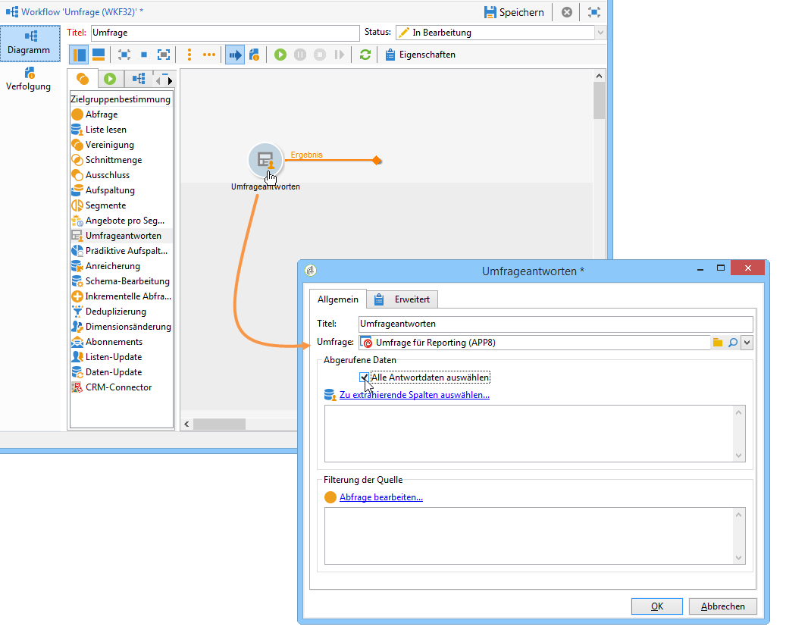
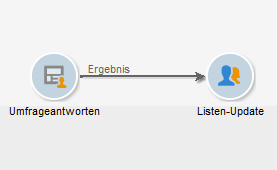
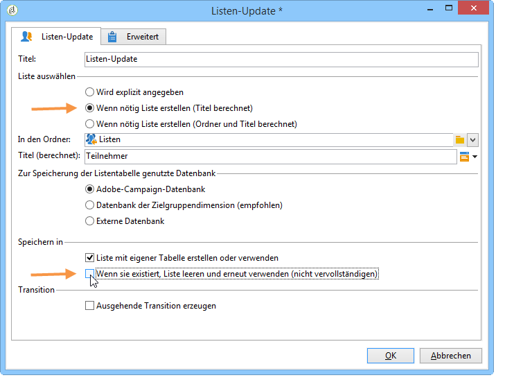
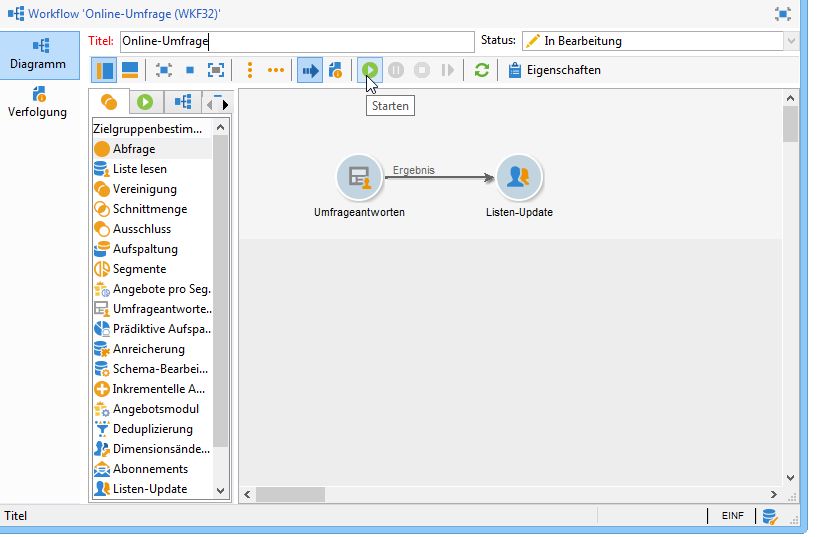
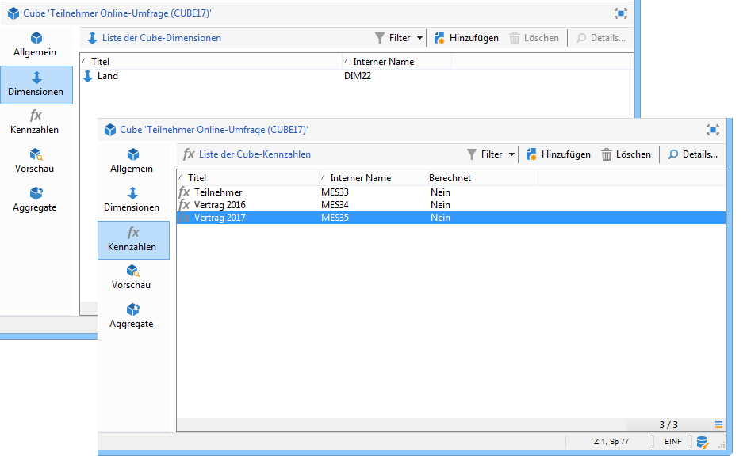
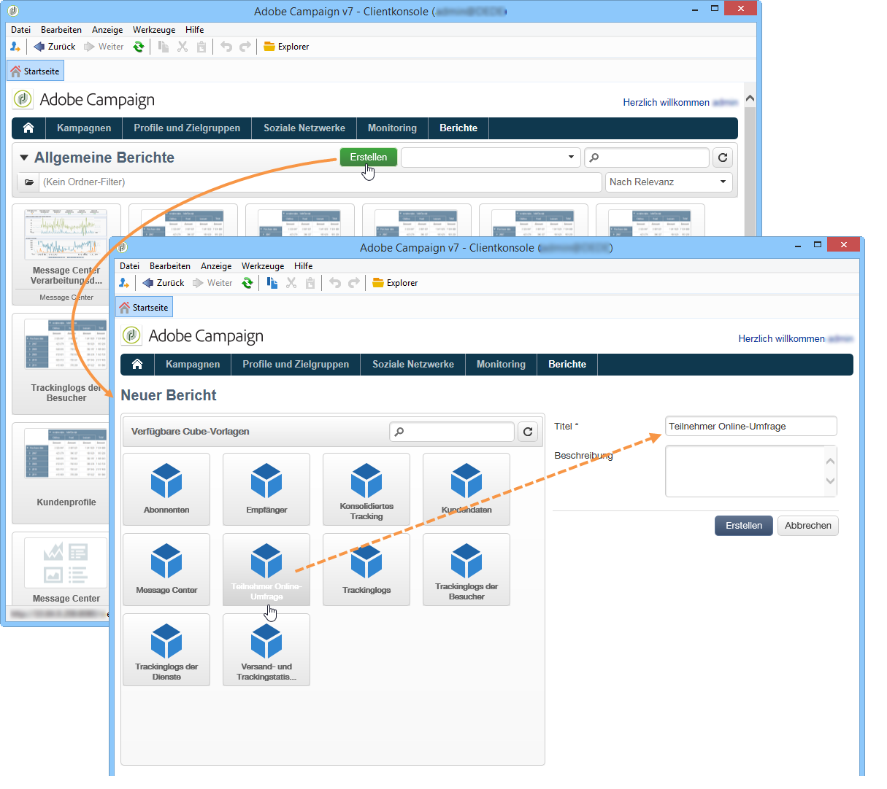
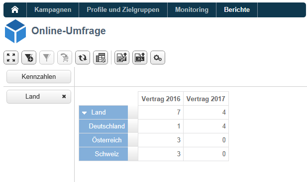

# Anwendungsfall: Bericht zu Antworten auf eine Online-Umfrage anzeigen{#use-case-displaying-report-on-answers-to-an-online-survey}

Die Antworten auf Adobe-Campaign-Fragebögen können abgerufen und in dedizierten Berichten analysiert werden.

Im unten stehenden Beispiel werden die Antworten auf eine Online-Umfrage gesammelt und in einem Bericht in Form einer Pivot-Tabelle angezeigt.

Gehen Sie wie folgt vor:

1. Erstellung eines Workflows zum Abruf der Umfrage-Antworten und ihrer Speicherung in einer Liste.
1. Erstellung eines Cubes, der die Daten der Liste verwendet.
1. Erstellung eines Berichts mit einer Pivot-Tabelle und Anzeige der Antwortenverteilung.

Voraussetzung für die Durchführung dieses Anwendungsbeispiels sind ein Fragebogen und zu analysierende Antworten auf diesen.

>[!NOTE]
>
>Dieses Anwendungsbeispiel kann nur durchgeführt werden, wenn Sie die Option **Survey Manager** erworben haben. Überprüfen Sie Ihren Lizenzvertrag.

## Schritt 1: Erstellung des Workflows für Datenabruf und -speicherung {#step-1---creating-the-data-collection-and-storage-workflow}

Gehen Sie wie folgt vor, um die Antworten der Umfrage abzurufen:

1. Erstellen Sie einen Workflow mit der Aktivität **[!UICONTROL Umfrageantworten]**. Weiterführende Informationen zur Verwendung dieser Aktivität finden Sie in [diesem Abschnitt](../../surveys/using/publish-track-and-use-collected-data.md#using-the-collected-data).
1. Öffnen Sie die Aktivität und wählen Sie die Umfrage aus, deren Antworten analysiert werden sollen.
1. Aktivieren Sie die Option **[!UICONTROL Alle Antwortdaten auswählen]**, um alle verfügbaren Informationen abzurufen.

   

1. Wählen Sie die zu extrahierenden Spalten aus (hier: Alle archivierten Felder). Die Antworten werden in diesen Feldern gespeichert.

   

1. Fügen Sie nach der Konfiguration des Antwortenabrufs eine Aktivität vom Typ **[!UICONTROL Listen-Update]** hinzu, um die abgerufenen Daten zu speichern.

   

   Geben Sie in dieser Aktivität die zu aktualisierende Liste an und deaktivieren Sie die Option **[!UICONTROL Wenn sie existiert, Liste leeren und erneut verwenden]**: Die Antworten werden so der existierenden Tabelle hinzugefügt. Dies ermöglicht es, die Liste in einem Cube zu referenzieren: Das mit der Liste verknüpfte Schema wird nicht bei jeder Aktualisierung neu erzeugt, dadurch wird die Vollständigkeit des diese Liste verwendenden Cubes garantiert.

   

1. Speichern und starten Sie den Workflow, um die Konfiguration zu beenden.

   

   Die angegebene Liste wird daraufhin erstellt und mit dem Schema der Umfrageantworten ergänzt.

1. Fügen Sie eine Planung hinzu, um einen täglichen Abruf der Antworten und die Aktualisierung der Liste zu konfigurieren.

   Die Aktivitäten **[!UICONTROL Listen-Update]** und **[!UICONTROL Planung]** werden erläutert in .

## Schritt 2: Erstellung des Cubes und seiner Kennzahlen {#step-2---creating-the-cube--its-measures-and-its-indicators}

Erstellen Sie anschließend den Cube und konfigurieren Sie seine Kennzahlen: Sie werden bei der Erstellung der Indikatoren verwendet. Die Indikatoren werden später im Bericht angezeigt. Weitere Informationen zur Erstellung und Konfiguration von Cubes finden Sie unter [Über Cubes](../../reporting/using/ac-cubes.md).

Im vorliegenden Beispiel basiert der Cube auf den Daten der Liste, die im zuvor erstellten Workflow angereichert wird.

Definieren Sie die im Bericht anzuzeigenden Dimensionen und Kennzahlen. Im Beispiel werden das Vertragsdatum und das Land des Teilnehmers angezeigt.

Im **[!UICONTROL Vorschau]**-Tab können Sie die Anzeige des Berichts überprüfen.

## Schritt 3: Berichterstellung und Konfiguration der Datenanzeige in der Tabelle {#step-3---creating-the-report-and-configuring-the-data-layout-within-the-table}

Erstellen Sie anschließend einen auf dem Cube basierenden Bericht, um dessen Informationen zu nutzen.

Passen Sie die anzuzeigenden Informationen entsprechend Ihren Bedürfnissen an.

