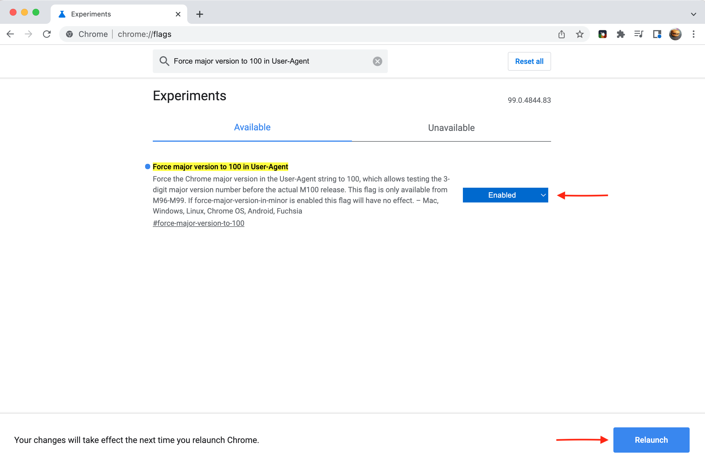

# Die dreistellige Browserversion wirkt sich auf die Campaign-Webkomponenten aus {#version-100}

Google und Mozilla warnen, dass Chrome und Firefox aufgrund der kommenden 3-stelligen Versionen einige Websites beschädigen könnten.

Chrome v100 is set for release on **March 29, 2022**, and Firefox v100 on **May 3, 2022**.

Microsoft hat Edge v100 Anfang März 2022 veröffentlicht.

Die Änderung der Versionsnummer von 2 auf 3 Stellen kann beim Besuch von Websites, die für diese Änderung nicht vorbereitet sind, zu Problemen führen. Einige Webseiten werden in diesen neuen Browserversionen möglicherweise nicht mehr korrekt angezeigt.

Die Kompatibilität der wichtigsten Websites wurde bereits früher getestet. Wenn es Probleme mit Sites gibt, die nicht behoben werden können, bevor diese Versionen veröffentlicht werden, verfügen Unternehmen über Backup-Pläne, die sicherstellen, dass die Sites nicht betroffen sind.

Potenzielle Probleme oder Funktionsverluste auf der Website stammen aus der Benutzeragenten-Zeichenfolge, die Browser an besuchte Websites senden: Der Benutzeragent ist eine Zeichenfolge, die vom Browser an die Website gesendet wird, um der Site mitzuteilen, welcher Browser und welche Version Sie verwenden, und die zugehörige Technologie. Wenn Ihr Browser eine Anforderung an eine Website sendet, identifiziert er sich mit der Benutzeragenten-Zeichenfolge, bevor der angeforderte Inhalt abgerufen wird. The data in the user agent string help the website to deliver the content in a format that suits your browser. The version of the user agent is incremented to match the browser version number. Moving from 2 to 3-digits can cause issues.

## Sind Sie betroffen?{#version-100-impact}

Adobe recommends you to test your Campaign web applications, including web forms and surveys, to make sure they will still work fine with these new browser versions.

Diese Empfehlung gilt für alle Webanwendungen, insbesondere wenn Sie JavaScript-Code eingefügt haben.

You must check both with all browsers, mobile and desktop.

## Wie testen Sie?{#version-100-test}

Sie können Ihre Browser so konfigurieren, dass die Version jetzt als 100 gemeldet wird und dann alle Probleme, auf die Sie stoßen, melden und korrigieren.

Mit diesen Einstellungen sendet der Browser die neue Benutzeragenten-Zeichenfolge an Websites und gibt an, dass der Browser v100 ist. Wenn Probleme mit Ihren Webformularen auftreten, sollten Sie einen Fehler für den Browser-Editor erstellen. Erwägen Sie, diese Webformulare neu zu erstellen, bevor diese Aktualisierungen allgemein verfügbar sind.

### Testen mit Firefox 100{#test-firefox-100}

Um Ihre Webseiten mit Mozilla Firefox 100 zu testen, können Sie die bevorstehende Änderung des Benutzeragenten in Ihren Web-Apps simulieren, indem Sie die Zeichenfolge Ihres Benutzeragenten manuell ändern.

1. Öffnen Sie Firefox, geben Sie ein. `about:config` in der Adressleiste und drücken Sie die Eingabetaste.
1. Search for `general.useragent.override`.
1. Wählen Sie &quot;String&quot;und klicken Sie auf das Pluszeichen (+).

   

1. Geben Sie folgenden Text in das Feld ein:

   ```
   Mozilla/5.0 (Windows NT 10.0; rv:100.0) Gecko/20100101 Firefox/100.0
   ```

1. Click on the blue checkmark button to save the setting.
1. Schließen Sie den Browser und starten Sie ihn neu.

Wenn Sie Ihren Benutzeragenten wieder auf die Standardeinstellung zurücksetzen möchten, gehen Sie einfach zurück zu `about:config` und suchen Sie nach `general.useragent.override` wieder einstellen.  Wenn es angezeigt wird, klicken Sie auf das Papierkorbsymbol, um die Einstellung zu löschen, und starten Sie den Browser neu.

### Test mit Chrome 100{#test-chrome-100}

Um den Google Chrome 100-Benutzeragenten in Ihren eigenen Web-Apps zu testen, können Sie diesen Test mit den folgenden Schritten aktivieren:

1. Chrome öffnen, eingeben `chrome://flags` in der Adressleiste und drücken Sie die Eingabetaste.
1. Suche `Force major version to 100 in User-Agent` in das Suchfeld ein und aktivieren Sie es wie unten dargestellt.

   

1. Restart the browser.
1. Schließen Sie die `chrome://flags` Registerkarte.

To change user agent back to its default, simply follow this process and change the flag&#39;s setting to `Default` and restart the browser.


### Testen mit Microsoft Edge 100{#test-ms-edge-100}

Ab Version 97 können Site-Eigentümer diese Version emulieren, indem sie das Experiment-Flag aktivieren.  `#force-major-version-to-100` in `edge://flags`.

1. Microsoft Edge öffnen, eingeben `edge://flags` in der Adressleiste und drücken Sie die Eingabetaste.
1. Suchen Sie nach `force-major-version-to-100` und aktivieren Sie es wie unten dargestellt.

   

1. Starten Sie den Browser neu.
1. Schließen Sie die `edge://flags` Registerkarte.

Um den Benutzeragenten wieder auf die Standardeinstellung zu setzen, führen Sie diesen Prozess aus und ändern Sie die Einstellung des Kennzeichens in `Default` und starten Sie den Browser neu.
