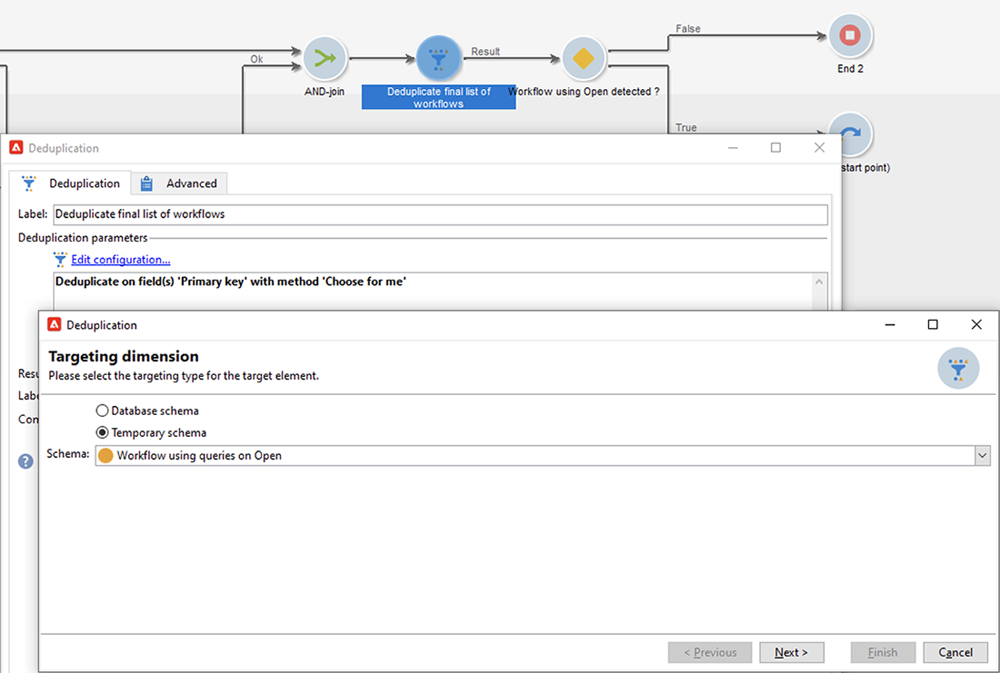

# Datenschutz bei E-Mails in der Mail-App von Apple


## Was hat sich verändert?

2021 führte Apple neue Datenschutzfunktionen für seine native Mail-App ein. Diese App enthält jetzt die Apple-Funktion zum Datenschutz bei E-Mails. Im Grunde können Absender keine Tracking-Pixel mehr verwenden, um Informationen über Empfangende zu erfassen, die sich für die Aktivierung der Apple-Datenschutzfunktion für E-Mails entschieden haben.

## Wie wirkt sich dies auf meine Kampagnen aus?

Adobe Campaign bietet die Möglichkeit, Tracking-Pixel zur Verfolgung von E-Mail-Öffnungen zu verwenden. Sie können diese Funktion nicht nur für Targeting und Kampagnen, sondern auch für Metriken verwenden. Sie können beispielsweise Öffnungsraten für E-Mails verwenden, um die Effektivität der Kampagne und die Benutzerinteraktion zu messen. Kurz gesagt, die Segmentierung, das Targeting und die Metriken können sich auf Ihre Kampagnen auswirken.

## Welche Maßnahmen sollte ich ergreifen?

Die neue Funktion von Apple ist das, was in der Branche hinsichtlich des Datenschutzes von E-Mails zu erwarten ist. Wir empfehlen dringend, dass Sie die Empfehlungen von Adobe befolgen.

### Auswirkungen auf Ihre Kampagnen-Trigger bewerten

Prüfen Sie, wie sich diese Änderungen auf Ihre aktuellen Kampagnen-Trigger auswirken. Identifizieren Sie die Workflows, in denen E-Mail-Öffnungen als Kriterium für Segmentierung, Zielgruppenbestimmung oder Retargeting verwendet werden. Lesen Sie die [Tipps und Tricks](#find-email-open-tracking).

### Speichern Ihrer Daten

Speichern Sie Ihre Daten und konsolidieren Sie Ihr aktuelles Wissen zu Geräten. Sie können wichtige Leistungsindikatoren (KPIs) auf dem Benutzeragenten basieren. Sie können beispielsweise KPIs für Profile von Personen erstellen, die die iOS- und die Apple-E-Mail-App verwenden. Lesen Sie die [Tipps und Tricks](#preserve-tracking-data).

### Archivieren Sie Ihre Trackinglogs über den Aufbewahrungszeitraum hinaus.

Archivieren Sie Ihre Trackinglogs über den Aufbewahrungszeitraum von Adobe Campaign hinaus:

1. Überprüfen Sie die Dauer des Aufbewahrungszeitraums in Ihrer Kampagneninstanz.
1. Überprüfen Sie Ihre aktiven Zielgruppen-Mappings. Bestimmen Sie, ob Sie zusätzlich zur nativen Profiltabelle benutzerdefinierte Profiltabellen verwenden (`nmsRecipient`).
1. Exportieren Sie Ihre Trackinglogs aus Adobe Campaign. Schließen Sie die Protokolle ein, die Daten zum Benutzeragenten und zum Betriebssystem enthalten.

### Bewertung des aktuellen Trends bei den Öffnungsraten

Bestimmen Sie, welcher Anteil Ihrer Zielgruppe die Apple-E-Mail-App auf einem iOS-Gerät verwendet.
Mithilfe dieser Bewertung können Sie potenzielle anormale Lücken und deren Ursache identifizieren. Sie können feststellen, ob eine Lücke auf Leistungsprobleme bei Kampagnen oder auf die Datenschutzfunktion von Apple zurückzuführen ist. Lesen Sie die [Tipps und Tricks](#measure-ios-footprint).

### Kampagnenstrategie und Leistungsmetriken neu bewerten

Vor allem empfehlen wir dringend, dass Sie Ihre Kampagnenstrategie und Ihre Kampagnenleistungsmetriken proaktiv neu bewerten. Sie können sich erneut auf zuverlässigere Metriken konzentrieren, z. B. Clickthroughs, Produktansichten und Käufe.

Es wird empfohlen, dass Sie die derzeit verfügbaren Daten untersuchen und die Korrelation zwischen Öffnungsraten und anderen Metriken bewerten. Wenn diese Metriken konsistent korrelieren, können Sie Ihre Trigger mit einem guten Vertrauensniveau verbessern.

## Tipps und Tricks

### Messen des gesamten iOS-Fußabdrucks {#measure-ios-footprint}

Um Einblicke aus Adobe Campaign-Daten zu gewinnen, können Sie vordefinierte Berichte verwenden:

* Bericht **[!UICONTROL Betriebssysteme]**

  Verwenden Sie diesen Bericht, um den Besucheranteil nach Betriebssystem und Version zu ermitteln. [Weitere Informationen](../../reporting/using/global-reports.md#operating-systems)

  Sie können die Aufschlüsselung Ihrer Besucher nach Betriebssystem im Verhältnis zur Gesamt-Besucherzahl anzeigen.

  

  Für jedes Betriebssystem können Sie die Aufschlüsselung der Besucher nach Betriebssystemversion anzeigen.

  

* Bericht **[!UICONTROL Aufschlüsselung der Öffnungen]**

  Verwenden Sie diesen Bericht, um den Anteil der E-Mail-Öffnungen nach Betriebssystem zu ermitteln. [Weitere Informationen](../../reporting/using/global-reports.md#breakdown-of-opens)

  

### Bestimmen, wie das Öffnungs-Tracking von E-Mails verwendet wird {#find-email-open-tracking}

Sie können die Workflows identifizieren, in denen E-Mail-Öffnungen als Kriterium für Segmentierung, Zielgruppenbestimmung und Retargeting verwendet werden.

Verwenden Sie ihierzu das Attribut **[!UICONTROL type]** der getrackten Link-URL (**[!UICONTROL url/@type]**). Bei E-Mail-Öffnungen ist dieses Attribut auf **[!UICONTROL Öffnen]** eingestellt. Dieses Attribut ist im Abfrageeditor verfügbar, in er Aktivität **[!UICONTROL Abfrage]** eines Workflows und in vordefinierten Filtern. Sie können dieses Attribut als Targeting-Kriterium für Marketing-Kampagnen verwenden.


In diesem Beispiel möchte ein Marketing-Experte ein Prämienangebot an die Empfangenden senden, die in den letzten sieben Tagen eine bestimmte E-Mail geöffnet und im letzten Monat einen Kauf getätigt haben. In Workflow-Abfragen können Sie E-Mail-Öffnungen auf unterschiedliche Weise verwenden:

* Sie können E-Mail-Öffnungen als Targeting-Kriterium in einer Abfrage verwenden.

  Sie können als Filterbedingung festlegen, dass der URL-Typ der Trackinglogs eines bestimmten Versands auf **[!UICONTROL Öffnen]** eingestellt sein muss.

  

* Sie können einen vordefinierten Filter verwenden. Weitere Informationen finden Sie in der [Dokumentation zu Campaign v8](https://experienceleague.adobe.com/docs/campaign/automation/workflows/use-cases/designing-queries/create-a-filter.html?lang=de){target="_blank"}.

  

  Sie können diesen vordefinierten Filter in Abfrageaktivitäten in Workflows verwenden.

  

  >[!NOTE]
  >
  >Über einen Workflow lassen sich die Targeting-Kriterien eines vordefinierten Filters nicht anzeigen.

Um die Liste der Workflows abzurufen, in denen E-Mail-Öffnungen als Targeting-Kriterium verwendet werden, müssen Sie das `xtk:workflow`-Schema abfragen. Der Inhalt des Workflows wird im **[!UICONTROL XML-Memo (data)]** im XML-Format gespeichert.


Sie können festlegen, dass die Workflows diesen Inhalt enthalten müssen:

`expr="[url/@type] = 2"`

Dieses Targeting-Kriterium bedeutet, dass der Typ der verfolgten URL auf **[!UICONTROL Öffnen]** eingestellt sein muss.


#### Anwendungsbeispiel und Beispielpaket

Sie können dieses Implementierungsbeispiel verwenden, um die Workflows zu identifizieren, in denen E-Mail-Öffnungen als Targeting-Kriterium verwendet werden, und um eine Benachrichtigung an den Kampagnenbetreiber Ihrer Wahl zu senden. Sie können diese Implementierung für diese Zwecke verwenden:

* Sie können die potenziellen Auswirkungen des Wechsels von E-Mail-Öffnungen zu anderen KPIs in Ihren Zielgruppen-Workflows messen. Wenn Sie keine E-Mail-Öffnungen verwenden, ist keine weitere Aktion erforderlich.
* Wenn Sie Ihre Implementierung neu bewerten, können Sie dieses Beispiel verwenden, um zu vermeiden, dass Workflows übersprungen werden.

Dieses Beispiel zeigt eine benutzerdefinierte Implementierung in einem einzelnen technischen Workflow.


>[!IMPORTANT]
>
>Das Paket wird nur als Beispiel bereitgestellt und von Adobe als Produktfunktion nicht unterstützt.
>
>Möglicherweise müssen Sie den Beispiel-Code an Ihre Kampagnenimplementierung anpassen.
>
>Der Endbenutzer ist allein für die Installation und Verwendung dieses Beispielpakets verantwortlich.
>
>Es wird dringend empfohlen, dieses Paket in einer Nicht-Produktionsumgebung zu testen und zu validieren.

Laden Sie das [Beispielpaket](assets/PKG_Search_workflows_using_Opens_in_queries_V1.xml) und installieren Sie es. [Weitere Informationen](../../platform/using/working-with-data-packages.md#importing-packages).

Nachdem Sie das Paket installiert haben, können Sie über den Ordner auf den Workflow zugreifen, der die vordefinierten technischen Workflows in Ihrer Instanz enthält:

`/Administration/Production/Technical workflows/nmsTechnicalWorkflow`

Wählen Sie in der Benutzeroberfläche **[!UICONTROL Administration]** > **[!UICONTROL Produktion]** > **[!UICONTROL Technische Workflows]**.


Der Workflow umfasst die folgenden wichtigsten Schritte:

1. Auflisten der Workflows, in denen E-Mail-Öffnungen als Targeting-Kriterium verwendet werden
1. Listen Sie die vordefinierten Filter auf, in denen E-Mail-Öffnungen als Targeting-Kriterium verwendet werden.
1. Auflisten der Workflows, in denen diese vordefinierten Filter verwendet werden
1. Führen Sie die beiden Workflows-Listen in einer Liste zusammen.
1. Senden Sie eine E-Mail-Benachrichtigung an den angegebenen Benutzer.

Der Workflow umfasst die folgenden Schritte:

1. Die erste Aktivität ist eine Abfrageaktivität im `xtk:workflow`-Schema. Diese Aktivität wird verwendet, um in der entsprechenden Instanz die expliziten Workflow-Abfragen zu finden, die E-Mail-Öffnungen als Targeting-Kriterium enthalten.

   

   

   

   Daraufhin wird eine Liste der Workflows zurückgegeben.

   

   Da diese Informationen wiederverwendet werden, wird der Name der Arbeitstabelle in einer Variablen der globalen Workflow-Instanz gespeichert.

   

1. Eine zweite Abfrage wird verwendet, um die vordefinierten Filter zu finden, die E-Mail-Öffnungen enthalten.

   

   

   

   Daraufhin wird eine Liste vordefinierter Filter zurückgegeben.

   

1. Diese Liste vordefinierter Filter wird verwendet, um die Workflows zu finden, in denen diese Filter verwendet werden.
1. Beide Workflows werden in einer Liste zusammengefasst.

   Zu diesem Zweck wird JavaScript-Code verwendet.

   

   ```javascript
   const queryPredFilter = xtk.queryDef.create(
     <queryDef schema={vars.targetSchema} operation="select">
        <select>
          <node alias="@id" expr="@id" />
          <node alias="@name" expr="@name"  />
        </select>
        <where/>
     </queryDef>
       ).ExecuteQuery()
   
   var qDef =
     <queryDef schema="xtk:workflow" operation="select">
       <select>
         <node expr="@id"/>
         <node expr="@internalName"/>
         <node expr="@label"/>
       </select>
       <where>
         <condition boolOperator="OR" expr={"data like '%expr=[url/@type] = 2%'" }/>
       </where>
     </queryDef>
   
   for each (var filter in queryPredFilter) {       
   
      //logInfo (filter.@name);
      var condition;
      condition =<condition boolOperator="OR" expr={"data like '%" + filter.@name + "%'" }/>
      qDef.where.appendChild(condition);   
   
   }
   
   var queryWorkflowList = xtk.queryDef.create(qDef);
   var workflowList = queryWorkflowList.ExecuteQuery();
   
   var sWorkflowList = "";
   var iCount = 0
   for each (var workflow in workflowList) {       
   
      //logInfo ("Workflow ID: " + workflow.@id + " in " + instance.vars.mainTargetSchema);
   
      iWorkflowId = workflow.@id;
      iWorkflowName = workflow.@internaName;
      iWorkflowLabel = workflow.@label;
   
       xtk.session.Write(
             <{instance.vars.mainTargetSchema.split(':')[1]}
               _operation="insertOrUpdate"       
               _key="@id"
               xtkschema={instance.vars.mainTargetSchema}
               id={iWorkflowId}
               internaName={iWorkflowName}
               label={iWorkflowLabel}
             />
       )
   }
   ```

1. Doppelte Workflows werden aus der zusammengeführten Liste entfernt.

   

1. Es wird ein Test durchgeführt, um zu überprüfen, ob die Liste nicht leer ist.

   

   Wenn die Liste nicht leer ist, wird sie in eine HTML-Tabelle für E-Mail-Benachrichtigungen eingefügt.

   

   ```js
   const queryWorkflow = xtk.queryDef.create(
       <queryDef schema={vars.targetSchema} operation="select">
           <select>
               <node alias="@id" expr="@id" />
               <node alias="@internalName" expr="@internalName"  />
               <node alias="@label" expr="@label"  />
           </select>
           <where/>
       </queryDef>
   ).ExecuteQuery()
   
   var sWorkflowList = '<table border="0" >';
   
   sWorkflowList = sWorkflowList + "<tr><th>Worklow Id</th><th>Name</th><th>Label</th></tr>";
   
   for each (var workflow in queryWorkflow) {       
   
      sWorkflowList = sWorkflowList + "<tr>" +
                       "<td>" + workflow.@id + "</td>" +
                       "<td>" + workflow.@internalName + "</td>" +
                       "<td>" + workflow.@label + "</td>" +
                       "</tr>";
   
   }
   
   sWorkflowList = sWorkflowList + "</table>";
   
   instance.vars.workflowList = sWorkflowList;
   ```

1. Die HTML-Tabelle wird der Benachrichtigungsvorlage hinzugefügt.

   ```js
   <%= instance.vars.workflowLIst%>
   ```

   

   Die E-Mail-Benachrichtigungen enthalten die Liste der Workflows, die E-Mail-Öffnungen als Targeting-Kriterium in Abfragen enthalten.

   

### Aktuelle Tracking-Daten beibehalten {#preserve-tracking-data}

#### Welche Daten sind betroffen?

Profildaten werden mit Tracking-Daten aus Aktionen wie E-Mail-Öffnungen und Clickthroughs angereichert. Das Tracking bietet über den Benutzeragenten auch wichtige Informationen zu den Geräten des Benutzers, wenn diese Informationen verfügbar sind.

Kurz gesagt, Adobe Campaign-Tracking-Daten bieten folgende Informationen:

* Das Profil, das mit der Person verknüpft ist, die eine bestimmte E-Mail-Nachricht geöffnet oder angeklickt hat
* Das Öffnungsdatum
* Das verwendete Gerät, beispielsweise iPhone oder Mac
* Betriebssystem und Version, z. B. iOS 15, macOS 12 oder Windows 10
* Die Anwendung, wie eine E-Mail-Anwendung oder ein Webbrowser, und die Version, z. B. Outlook 2019

#### Warum sollte ich Tracking-Daten beibehalten?

Es wird dringend empfohlen, diese Daten aus mehreren Gründen beizubehalten:

* Diese Daten werden von Adobe Campaign für einen begrenzten Zeitraum aufbewahrt. Der Aufbewahrungszeitraum variiert je nach Konfiguration Ihrer Instanz.

  Überprüfen Sie die Einrichtung Ihrer Instanz. [Weitere Informationen](../../platform/using/privacy-management.md#data-retention)

* Zusätzlich zu den letzten Änderungen bei Apple können Sie Tracking-Daten verwenden, um einen immensen Wert hinzuzufügen und so die Interaktion Ihrer Zielgruppe zu fördern.
* Apple kann weitere Änderungen an seiner nativen Mail-App und seiner Funktion zum Schutz der Privatsphäre bei E-Mails vornehmen.

Aus all diesen Gründen empfehlen wir dringend, diese Daten so bald wie möglich zu exportieren. Andernfalls können Ihre Tracking-Daten für einen Teil Ihrer Zielgruppe negativ beeinflusst werden.

#### Wie kann ich Tracking-Daten beibehalten?

Um Tracking-Daten beizubehalten, müssen Sie sie aus Adobe Campaign in Ihr Informationssystem exportieren. [Weitere Informationen](../../platform/using/get-started-data-import-export.md)

>[!IMPORTANT]
>
>Im folgenden Beispiel wird das vordefinierte Schema `nms:Recipient` verwendet, das das standardmäßige Profilschema ist. Wenn Sie zusätzliche benutzerdefinierte Zielgruppen-Mappings verwenden, die an benutzerdefinierte Profile angehängt sind, empfehlen wir, diese Exportstrategie auf alle benutzerdefinierten Protokolltabellen zu erweitern. [Weitere Informationen](../../configuration/using/target-mapping.md)

##### Funktionsprinzip

Standardmäßig ist das Schema `nms:Recipient` mit drei Schemata verknüpft ist, die Sie exportieren müssen:

| Schema | Content |
| --- | --- |
| nms:trackingLogRcp | Nachverfolgen von Daten mit der Person, der Uhrzeit und der betroffenen Nachricht |
| nms:trackingUrl | Details zum Link, einschließlich der Art, z. B. Öffnen einer E-Mail oder Clickthrough |
| nms:userAgent | Informationen bezüglich des Gerätes |

Die Tabellen sind im Datenmodell verknüpft.


Verwenden Sie diese Beziehungen, um eine einzige Exportabfrage zu erstellen.


Sie können diese Daten mit nützlichen Informationen aus verknüpften Schemata anreichern:

| Schema | Content |
| --- | --- |
| nms:Recipient | Details zu Profilen |
| nms:Delivery | Informationen zur Nachricht, auf die der Benutzer reagiert hat |

Sie können das Ergebnis in eine externe Speicherlösung exportieren, die von Adobe Campaign unterstützt wird:

* SFTP
* S3
* Azure Blob

##### Implementierung

Dieses Beispiel zeigt, wie Sie Tracking-Daten aus Adobe Campaign exportieren können.

1. Erstellen Sie einen Workflow, der mit einer Abfrage beginnt.

   Die erste Abfrage dient zum Abrufen der Trackinglogs für die letzten drei Monate.
Sie können eine inkrementelle Abfrage verwenden, um nur noch nicht exportierte Einträge zu extrahieren.

   Fügen Sie alle erforderlichen Informationen aus dem Knoten **[!UICONTROL Zusätzliche Daten]** hinzu.

   

1. Hinzufügen einer Aktivität des Typs **[!UICONTROL Datenextraktion (Datei)]**. Ordnen Sie alle Daten aus der Abfrage einem Extraktionsdateiformat zu.

   

   Wählen Sie das Dateiformat aus, z. B. TXT oder CSV.

   

1. Fügen Sie die dritte und letzte Aktivität zum Hochladen der Datei in eine unterstützte Speicherlösung hinzu.


##### Erweiterte Implementierung: Aufschlüsselung nach iOS-Gerät

Sie können Workflows verwenden, um zu bestimmen, ob eine Empfängerin bzw. ein Empfänger die Mail-App von Apple verwendet. Sie können Trackinglogs nach Gerät aufteilen. Sie können beispielsweise Abfragefilter verwenden, um Einträge nach iOS-Gerät aufzuschlüsseln:

| Anwendung | Betriebssystem oder Gerät | Abfragefilter |
| --- | --- | --- |
| Apple Mail | iOS 15 | `operating System (Browser) contains 'iOS 15' and browser (Browser) contains 'ApplewebKit'` |
| Apple Mail | iOS 14 oder iOS 13 | `browser contains 'AppleWebKit' and operating System of browser contains 'iOS 14' or operating System of browser contains 'iOS 13'` |
| Apple Mail | iOS-Mobilgeräte: iPad, iPod und iPhone | `device (Browser) contains iPhone or device (Browser) equal to iPod or device (Browser) equal to iPad and browser (Browser) equal to 'AppleWebKit'` |
| Apple Mail | iPhone , iPad oder iPod | `browser (Browser) equal to 'AppleWebKit' and device (Browser) equal to iPhone or device (Browser) equal to iPod or device (Browser) equal to iPad` |
| Apple Mail | Mac | `browser (Browser) equal to 'AppleWebKit' and operating System (Browser) contains 'Mac'` |
| Safari | macOS | `browser (Browser) equal to 'Safari' and device (Browser) equal to PC and operating System (Browser) contains 'Mac'` |
| Safari | Mobilgeräte | `browser (Browser) equal to 'Safari' and device (Browser) equal to iPad or device (Browser) equal to iPod or device (Browser) equal to iPhone` |


Sie können diese Regeln für verschiedene Zwecke verwenden:

* Exportieren und Archivieren von Daten in eine externe Speicherlösung
* Berechnen der KPIs, die an Profile angehängt werden sollen
* Erstellen von Unterdrückungslisten
* Reporting

Diese Beispiele zeigen, wie Sie mithilfe von Workflows Einträge nach iOS-Gerät aufschlüsseln können:

* Der erste beispielhafte Workflow umfasst die folgenden Aktivitäten:

   1. Die erste Aktivität **[!UICONTROL Abfrage]** wird verwendet, um alle E-Mail-Öffnungen in den letzten drei Monaten auszuwählen.
   1. Eine Aktivität **[!UICONTROL Aufspaltung]** wird verwendet, um die Auswahl nach E-Mail-Anwendung, Browser, Betriebssystem und Gerät aufzuteilen.

   1. Eine Aktivität **[!UICONTROL Deduplizierung]** folgt jeder Aktivität des Typs **[!UICONTROL Aufspaltung]**. Die Aktivität **[!UICONTROL Deduplizierung]** wird verwendet, um doppelte E-Mail-Adressen zu entfernen.

      Die Aktivität **[!UICONTROL Deduplizierung]** wird nach der Aktivität **[!UICONTROL Aufspaltung]** verwendet, um zu vermeiden, dass Informationen zu Empfangenden verloren gehen, die verschiedene Geräte verwenden.

   1. Eine Aktivität **[!UICONTROL Ende]** folgt auf jede Aktivität **[!UICONTROL Deduplizierung]**.

  Dieser Workflow ist nützlich, wenn Sie Empfangende nur in der nativen Empfängertabelle für die Zielgruppenbestimmung speichern.

  

* Der zweite beispielhafte Workflow umfasst die folgenden Aktivitäten:

   1. Die erste Aktivität **[!UICONTROL Abfrage]** wird verwendet, um alle E-Mail-Öffnungen in den letzten drei Monaten auszuwählen.
   1. Eine Aktivität **[!UICONTROL Deduplizierung]** wird verwendet, um doppelte E-Mail-Adressen zu entfernen.
   1. Eine Aktivität **[!UICONTROL Verzweigung]** wird verwendet:

      * In einer Transition wird die Aktivität **[!UICONTROL Dimensionsänderung]** verwendet, um die Empfangenden zu finden, auf die sich das Trackinglog bezieht.
      * In der anderen Transition wird die Aktivität **[!UICONTROL Aufspaltung]** verwendet, um die Auswahl nach E-Mail-Anwendung, Browser, Betriebssystem und Gerät aufzuteilen.

   1. Eine Aktivität **[!UICONTROL Ende]** folgt jeder Transition nach der Aktivität **[!UICONTROL Aufspaltung]**.

  Dieser Workflow ist nützlich, wenn Sie Empfangende in einer anderen Tabelle als der nativen Empfängertabelle speichern.

  
