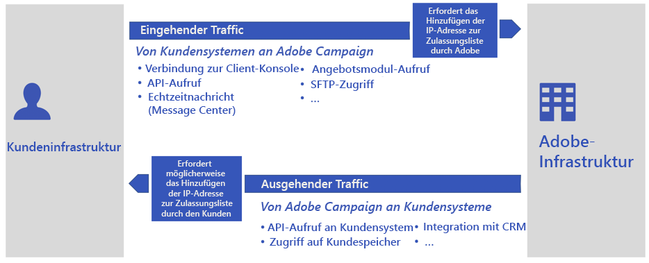

# Häufig gestellte Fragen zur Migration zur Public Cloud{#dc-faq}

Adobe nutzt das alte Rechenzentrum nicht länger: Campaign Classic-Instanzen müssen in Public Cloud Amazon Web Services (AWS) übertragen werden. [Erfahren Sie mehr über diese Initiative](dc-migration.md).

Nachstehend finden Sie eine Reihe allgemeiner Fragen zu diesem Projekt und zu den Auswirkungen auf Ihre Campaign-Umgebungen sowie weitere nützliche Informationsquellen.

Für alle anderen Fragen wenden Sie sich bitte an die [Adobe-Kundenunterstützung](https://experienceleague.adobe.com/?support-solution=Campaign&amp;lang=de#support).

## Auswirkungen auf die Infrastruktur

Die globalen Auswirkungen auf die Datenbank und Infrastruktur sind nachstehend aufgeführt.

* **Wird sich die Datenbank verändern? Welche Version hat die neue Datenbank? Welches Betriebssystem wird verwendet?**

  Adobe behält sich das Recht vor, die am besten geeignete Datenbank-Management-Engine auszuwählen und zu verwenden, um den Adobe Campaign-Dienst unter optimalen Bedingungen bereitzustellen.

  Darüber hinaus wird Adobe keine detaillierten Informationen zur Infrastruktur bereitstellen, um das beste Sicherheitsniveau zu gewährleisten.

* **Besteht das Risiko von Datenverlust?**

  Die Datenbank wird aus dem alten Rechenzentrum entfernt und in der Public Cloud (AWS) wiederhergestellt. Beim Neustart im neuen Rechenzentrum wird die Anwendung genau in dem Zustand fortgesetzt, in dem sie sich vor der Migration befand. Die Benutzer werden keinen Unterschied bemerken, außer dass sich einige geplante Aufgaben verzögern.

* **Gibt es Unterschiede in der Größe des Pakets zwischen dem alten Rechenzentrum und der Public Cloud?**

  Wir stellen in der Public Cloud (AWS) neue Paketdefinitionen bereit, die auf der aktuellen Datenbankgröße, der Festplattengröße usw. basieren. Wenn beispielsweise ein Kunde in alten Rechenzentren genau einen Anwendungs-Sserver hat, kann er je nach Paketdefinitionen zwei Anwendungs-Server in der Public Cloud (AWS) verwenden.

* **Wird sich die Build-Nummer oder die Campaign-Version ändern?**

  Als ersten Schritt werden wir den Campaign Classic-Build bei der Migration beibehalten.

  In einem weiteren Schritt werden wir mit dem Upgrade auf den neuesten Campaign Classic GA-Build fortfahren. Weitere Informationen hierzu finden Sie auf [dieser Seite](../../rn/using/rn-overview.md).

* **Was ist der Plan zur Behebung von Problemen nach der Migration?**

  Vor der Migration der Produktionssysteme sind umfangreiche Tests geplant. Bei Problemen bleibt die [Adobe-Kundenunterstützung](https://experienceleague.adobe.com/?support-solution=Campaign#support) der Hauptansprechpartner. Adobe hat ein Experten-Team zusammengestellt, das bei Bedarf zusätzliche Unterstützung bietet.

## Auswirkungen auf die Zustellbarkeit

Die globalen Auswirkungen auf IPs, Blockierungsliste, Subdomains und URLs sind unten aufgeführt.

* **Wie werden IPs auf der Zulassungsliste gehandhabt? Müssen Kunden für eingehenden Traffic von Campaign neue IP-Adressen auf die Zulassungsliste setzen?**

  Die IP-Adresse der Adobe-Server wird sich ändern. Deshalb müssen Kunden diese neuen IP-Adressen möglicherweise in ihrem System auf die Zulassungsliste setzen.

  [Weitere Informationen](#config) über IP auf der Zulassungsliste.

* **Wie werden Ports gehandhabt, die für den SFTP-/FTP-Zugriff auf die Zulassungsliste gesetzt werden?**

  Die SFTP-Konfiguration (öffentliche Schlüssel + IP auf der Zulassungsliste) wird ebenfalls vom alten Rechenzentrum in die Public Cloud (AWS) verschoben. Seitens des Kunden besteht kein Handlungsbedarf.

* **Werden IPs geändert?**

  Die IP-Adresse der Adobe-Server wird sich ändern. Deshalb müssen Kunden diese neuen IP-Adressen möglicherweise in ihrem System auf die Zulassungsliste setzen.

  [Weitere Informationen](#config) über IP auf der Zulassungsliste.

* **Wie wird die Zuordnung von Subdomains gehandhabt?**

  Bestehende Subdomains werden vom alten Rechenzentrum in die Public Cloud (AWS) verschoben. Dieser Prozess wird im Rahmen des Migrationsprozesses vom Zustellbarkeitsteam von Adobe gehandhabt.

  Adobe führt den Kunden durch die erforderlichen Tests, um sicherzustellen, dass die Konfiguration nach der Migration auf den neuen Public Cloud-Servern (AWS) erfolgreich durchgeführt wurde.

* **Entstehen durch die Migration neue URLs für Tracking, Ressourcen und Web-Anwendungen?**

  Nein, die bestehenden URLs bleiben erhalten.

* **Wird die Subdomain von Neolane.net in campaign.adobe.com geändert?**

  Sowohl `neolane.net` als auch `campaign.adobe.com` sind nach der Migration vorhanden. Um den Prozess zu vereinfachen, wird neolane.net auf neue Instanzen in der Public Cloud (AWS) umgeleitet, sodass der Kunde keine Änderungen vornehmen muss.

* **Was ist der Plan für IP Warming?**

  Zunächst wird die Zustellbarkeitsstatus der Plattform durch das Zustellbarkeits-Team von Adobe geprüft und ein Plan für den Wechsel zu den neuen IPs empfohlen. 

  Nach der Migration ist kein Warm-up erforderlich. Sollte jedoch in Ausnahmefällen ein Warm-up nötig sein, nimmt die [Adobe-Kundenunterstützung](https://experienceleague.adobe.com/?support-solution=Campaign#support) Kontakt zu den jeweiligen Kunden auf.

  Es ist jedoch geplant, diesen Vorgang für Ihr Unternehmen transparent zu gestalten, anders als beim während des Go-Live erfolgten ursprünglichen Ramp-up.

  Nach Abschluss der Migration wird die Campaign-Instanz völlig andere Sende-IPs aufweisen. Um eine reibungslose Migration zu gewährleisten, wird Adobe ein Ramp-up der neuen Sende-IPs durchführen, indem der Traffic schrittweise von den alten auf die neuen IPs umgestellt wird.

* **Werden auch URLs auf der Zulassungsliste verschoben?**

  Ja, dies wird in der Server-Konfigurationsdatei gespeichert, die von der Quelle in die neue Instanz kopiert wird.

* **Wie wird sich das auf unsere delegierte Subdomain auswirken, mit der wir unsere Kommunikation branden?**

  Die für die Marketing-Kommunikation verwendeten Subdomains bleiben unverändert. Abhängig von der Implementierung können jedoch auf der Client-Seite Aktionen erforderlich sein:
   * Bei einer Subdomain-Zuweisung an Adobe (Standard) übernimmt Adobe alle Änderungen und sorgt für einen nahtlosen Übergang.
   * Bei CNAME-Setup (Ausnahme) wird der Client aufgefordert, in Abstimmung mit Adobe Änderungen zu implementieren.

## Auswirkungen auf Konfiguration und Konnektivität

### Hinweis zur IP-Adresse auf der Zulassungsliste{#config}

Die Migration zur Public Cloud beinhaltet neue IPs für Adobe Campaign-Anwendungs-Server, sodass sich eine IP-Änderung auf die Konnektivität zwischen Adobe-Servern und Ihren Informationssystemen auswirken kann.

Betrachten wir die beiden Fälle:

* Eingehender Traffic: Die gesamte Netzwerkaktivität, die von Ihren Systemen oder Drittanbietern an Adobe Campaign-Servern initiiert wird. Die Konfiguration wird von Adobe vorgenommen und dann während der Migration von der bestehenden Cloud in die Public Cloud kopiert. Die Konnektivität für eingehenden Traffic bleibt dann wie nach der Migration erhalten und es werden keine Maßnahmen seitens des Kunden erwartet. 

* Ausgehender Traffic: Die gesamte Netzwerkaktivität, die von Adobe Campaign-Servern an Ihr Informationssystem oder Drittanbieter initiiert wird (z. B. SMS-Anbieter). Je nach den in Ihrem Unternehmen geltenden Sicherheitsrichtlinien kann das Ändern von IP-Adressen einen Zulassungslisten-Vorgang Ihres Informationssystems oder eines anderen Dritten erforderlich machen.

### Globale Auswirkungen

Globale Auswirkungen auf die Konfiguration, die Konnektivität mit anderen Systemen und Produkten, APIs und die Zeitzone sind nachstehend aufgeführt.

* **Wirkt sich die Migration auf die Konnektivität zu externen Konten aus?**

  Ja. Bei Integrationen von Drittanbietern, z. B. SMS-Anbietern, sollten neue IP-Adressen von Adobe Campaign-Anwendungs-Servern auf die Zulassungsliste gesetzt werden.

* **Beeinträchtigt die Migration die Konnektivität zu Adobe Analytics bei Verwendung des Genesis-Connectors? Wie sieht es mit dem Hinzufügen von Campaign-IP-Adressen zur Zulassungsliste in Adobe Analytics aus?**

  Die IP-Adressen der Adobe Campaign-Anwendungsserver ändern sich. Dieser Schritt wird von der Adobe-Kundenunterstützung nach der Migration ausgeführt.

* **Beeinträchtigt die Migration die Konnektivität mit anderen Adobe-Lösungen (AEM, Target usw.)?**

  Integrationen sind eine Kombination aus IP-Adressen, die auf der Zulassungsliste angegeben werden, und Webservice-Kontokonfiguration. Dies wird von der Adobe-Kundenunterstützung berücksichtigt und liegt in ihrem Verantwortungsbereich.

  Auf der Zulassungsliste werden IP-Adressen in der externen Lösung benötigt, da sich die IP der Anwendungs-Server ändert. Diese Informationen werden bereitgestellt. Andere Teile der Integration sind IMS-basiert und sollten unverändert funktionieren.

* **Was ist mit Kunden, die keine Organisations-ID für die IMS-Integration haben?**

  Kunden, die noch nicht in das IMS integriert sind, erhalten eine Organisations-ID, die mit ihrer Instanz verknüpft ist.

* **Sind Multi-Branding-Konfigurationen von der Migration betroffen?**

  Nachdem die Subdomain und alle zugehörigen Konfigurationen korrekt vom alten Rechenzentrum in die Public Cloud (AWS) verschoben bzw. umgeleitet wurden, sind keine Auswirkungen mehr zu erwarten.

* **Hat die Migration Auswirkungen auf die API-Konnektivität?**

  Die IP-Adresse der Adobe-Server wird sich ändern. Deshalb müssen Kunden diese neuen IP-Adressen möglicherweise in ihrem System auf die Zulassungsliste setzen.

  [Weitere Informationen](#config) über IP auf der Zulassungsliste.

* **Stellt Adobe sicher, dass alle JavaScript-Speicherkonfigurationsparameter nach der Migration korrekt eingestellt sind?**

  Adobe kopiert die Instanzkonfiguration aus dem alten Rechenzentrum in die Public Cloud (AWS), damit diese Werte auch nach der Migration erhalten bleiben.

* **Besteht die Gefahr, dass auf bestimmte Dateierweiterungen nicht mehr zugegriffen werden kann?**

  Es wird empfohlen, das Laden von Schriftartdateien und Outlook-Besprechungsdateien in den Ordner für öffentliche Ressourcen zuzulassen. Diese Konfiguration erfolgt in der aktuellen Datei `config-<instance>.xml`. Diese wird gemeinsam mit den Konfigurationsdateien in das neue Rechenzentrum kopiert.

* **Ändert sich die Zeitzone auf dem neuen Server? Können Kunden ihre aktuelle Zeitzone beibehalten?**

  Sie kann sich je nach dem Standort des neuen Servers ändern. Die Kunden können jedoch ihre aktuelle Zeitzone beibehalten.

  [Weitere Informationen](../../workflow/using/managing-time-zones.md) über die Zeitzonenverwaltung in Adobe Campaign Classic v7.

## Sicherheit und Berechtigungen

Durch diese Migration zur Public Cloud (AWS) werden die Kundenumgebungen entsprechend allen nötigen Sicherheitsanforderungen laufend auf den neuesten Stand gebracht. Dies umfasst:

* Regelmäßige neue Betriebssystem- und Sicherheits-Patches
* Isolierung der Infrastruktur nach Kunden
* Verwaltete Sicherheits- und Auditprüfungen zur Unterstützung von Cloud-Infrastrukturen wie Lastenausgleich, Netzwerksicherheitsregeln und Speicherverschlüsselung

Die Auswirkungen auf Berechtigungen, Zertifikate und SFTP-Zugriff sind unten aufgeführt.

* **Verschiebt Adobe alle Zertifikate auf die neuen Server?**

  Ja, bei dieser Migration werden alle Zertifikate verschoben.

* **Benötigt Adobe neue STP-Zugriffsschlüssel vom Kunden?**

  Nein, Adobe kopiert die SFTP-Zugriffsschlüssel auf den neuen Server.

* **Wie werden SFTP-Berechtigungen gehandhabt?**

  Wir stellen sicher, dass neue SFTP-Server, Benutzer, Verzeichnisse und Dateien genau dieselben Berechtigungen haben.

* **Wie sieht der Notfallplan aus, um die Betriebsbereitschaft der Kunden sicherzustellen, sollte die SFTP-Verbindung nicht hergestellt werden können?**

  Das einzige Konnektivitätsproblem, das auftreten kann, hängt mit der Zulassungsliste auf Kundenseite zusammen. Der Kunde sollte diesen Test in der Nicht-Produktionsumgebung durchführen, um sicherzustellen, dass alles funktioniert, bevor er zur Produktionsumgebung wechselt.

* **Gibt es spezielle Zulassungslisten-Konfigurationen für Rechenzentren, die ebenfalls migriert werden müssen?**

  Nein, es gibt keine rechenzentrenspezifischen Zulassungslisten-Konfigurationen, die gehandhabt werden müssen.

* **Stellt Adobe sicher, dass benutzerdefinierte Skripts in der neuen Umgebung ordnungsgemäß ausgeführt werden?**

  Bei der Kundenimplementierung können benutzerdefinierte Skripts (Perl/Shell/Python/JavaScript) in Workflows verwendet werden, um beispielsweise Dateien und Ordner zu bearbeiten.

  Auf der gehosteten Instanz werden Skripts nur über die JavaScript-Engine ausgeführt. Andere Implementierungen können zu Sicherheitslücken und Problemen nach dem Upgrade führen. Sie werden deshalb nicht unterstützt.

* **Wird die IMS-Integration in der neuen Instanz wie bisher funktionieren oder muss die Konfiguration aktualisiert werden?**

  Da wir die DNS-Namen beibehalten, sollte nach der Migration alles wie bisher funktionieren.

## Durchführung der Migration

Die globalen Auswirkungen während der Migration werden unten aufgeführt.

* **Sollten Vorkehrungen getroffen werden, um die Marketing-Aktivitäten während der Migration einzustellen?**

  Adobe empfiehlt, die Ausführung von Sendungen und Workflows zu verlangsamen und im Idealfall anzuhalten, bevor die Anwendung im alten Rechenzentrum heruntergefahren wird. Auf diese Weise wird der Neustart auf dem Cloud-Server (AWS) vereinfacht, da die Prozesse ausreichend Zeit hatten, ordnungsgemäß zu pausieren und den aktuellen Ausführungsstatus zu speichern.

* **Sind Ausfallzeiten des Adobe Campaign-Service zu erwarten?**

  Eine gewisse Ausfallzeit der Plattform ist bei der Migration unvermeidlich. Das Ziel dieses Plans ist es, Ihnen zu helfen, die Ausfallzeit möglichst gering zu halten.

  Die Datenübertragung zwischen den Rechenzentren ist der Teil des Vorgangs, der die größte Auswirkung auf die Ausfallzeit hat. Die Daten werden auf zwei Arten gespeichert:

   * In der Datenbank (die mit Abstand wichtigste)
   * In Dateien auf dem Anwendungsserver (Datenimport und -export)

  Die Reduzierung der Datenbankgröße ist von größter Bedeutung, um die Datenübertragung zu beschleunigen. Empfehlungen:

   * Reduzieren Sie die Aufbewahrungszeiträume historischer Daten (Versandlogs, Trackinglogs usw.).
   * Löschen Sie nicht mehr genutzte Datensätze aus anderen Tabellen (Sendungen, Empfänger, benutzerdefinierte Tabellen).

* **Wie hoch ist die geschätzte Ausfallzeit für die Migration einer Instanz?**

  Die Ausfallzeit hängt zur Gänze von der Größe der Datenbank und des SFTP-Dateispeichers des Kunden ab. Bitte wenden Sie sich an Ihre Kundenunterstützung, um eine ungefähre Dauer zu erfahren.

* **Was ist mit Nachrichten, die vom alten Server gesendet werden? Kann zu jedem Zeitpunkt auf Links zugegriffen werden?**

  Während der Migration bleibt nur ein Dienst funktionsfähig: die Umleitung von E-Mail-Links. Alle Empfänger gelangen beim Anklicken des Links in einer E-Mail auf die Landingpage. Diese Klicks werden jedoch nicht getrackt, sodass die Klickraten für die Sendungen, die kurz vor der Migration gestartet wurden, niedriger als gewöhnlich sein werden.

* **Was ist mit Mid-Sourcing/RT-Umgebungen?**

  MID-Sourcing und RT werden wie jede andere gehostete Infrastruktur gehandhabt.

* **In welcher Reihenfolge werden die Migrationen durchgeführt?**

  Die Umgebungen werden in der folgenden Reihenfolge migriert:

   1. Entwicklungsumgebungen
   1. Staging-Umgebungen
   1. Produktionsumgebungen
   1. RT-Umgebungen
   1. Mid-Sourcing-Umgebungen

* **Wie sieht der Rollback-Plan aus?**

  Der Rollback-Plan besteht darin, das DNS zurückzusetzen und den Lese- und Schreibzugriff zur Quelldatenbank wieder zu aktivieren. Dies erfolgt automatisch.

* **Können wir nach der Migration noch auf alte Instanzen zugreifen?**

  Nach Abschluss der Anwendungsmigration ist keine erneute Ausführung von Prozessen im alten Rechenzentrum geplant. Wir gehen davon aus, dass alle Daten im alten Rechenzentrum gelöscht werden können. Die einzige Ausnahme ist das temporäre Backup, bis die geplanten Backup-Vorgänge auf Public Cloud (AWS) ausgeführt wurden.

* **Wie viel Zeit steht für das Testen jeder Instanz nach der Migration zur Public Cloud zur Verfügung?**

  Abhängig von der Komplexität des Systems des Kunden ist zwischen der Migration der Staging-Umgebung und der Produktionsumgebung eine Wartezeit von mindestens 1 Woche erforderlich.

* **Wer kümmert sich um das Hinzufügen neuer IPs zur Zulassungsliste?**

  Das Team der Kundenunterstützung von Adobe sorgt dafür, dass Kunden und etwaige Drittparteien Zugriff auf das neue System haben, indem die neuen IP-Adressen auf die Zulassungsliste gesetzt werden.

## Support und andere nützliche Links{#support}

* [Migration zu Adobe Managed Services (Public Cloud)](dc-migration.md)
* [Jährliche Campaign-Aktualisierung](../../rn/using/rn-overview.md#yeary-upgrade)
* [Häufig gestellte Fragen zur Build-Aktualisierung](../../platform/using/faq-build-upgrade.md)
