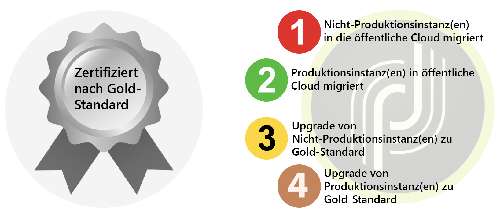

# Überblick{#dc-ovv}

## Kontext

Als geschätzter Adobe Campaign Classic-Kunde sind wir bestrebt, Ihnen das beste Erlebnis und die beste Wertschätzung zu bieten. Im Laufe der Jahre hat sich das Hosting unserer Kunden in der Cloud als überaus effizient und zuverlässig erwiesen.  Im Rahmen unserer [Gold Standard Initiative](../../rn/using/gold-standard.md) verschieben wir alle unsere Kunden zu Adobe Managed Services (Public Cloud on AWS), um bessere und zuverlässigere Services bereitzustellen.

Das Programm verfolgt drei Hauptziele:

* Behebung identifizierter Sicherheitslücken durch das Verlagern der Infrastruktur in eine sichere und moderne Umgebung (AWS)
* Beseitigen Sie potenziell aufwändige Skalierungsprozesse, gewähren Sie Zugriff auf unsere [erweiterten MTAs](../../delivery/using//sending-with-enhanced-mta.md) und verbessern Sie alle Wartungsdienstebenen.
* Bereiten Sie Ihre Instanz auf die Zukunft von Adobe Campaign Classic vor, einschließlich automatischerer, regelmäßiger Aktualisierungen, die nicht so viele Ressourcen und so viel Zeit erfordern.

### Glossar

* **Build-Aktualisierung** : Wenn die Adobe Campaign Classic-Software auf die neueste sichere Build-Nummer aktualisiert wird, sich jedoch auf derselben wichtigen/kleineren Build-Ebene befindet. Beispiel: Campaign v7 20.2.3 Build 9182 zu Campaign v7 21.2.5 Build 9188. [Weitere Informationen](../../platform/using/faq-build-upgrade.md).
* **MID/RT**  - In der Adobe Cloud gehostete Nachrichtenausführungsserver (MID für Batch-Kampagnen und RT für Echtzeit-Einzelnachrichten)
* **Gold Standard-Upgrade** : Dieses Programm bietet verbesserte Sicherheit, bessere Unterstützung, verbesserte Wartung und Stabilität. Es erleichtert auch zukünftige Upgrades und bietet Zugriff auf neue Funktionen in Campaign.  [Weitere Informationen](../../rn/using/gs-overview.md).
* **AWS**  - Amazon Web Services (Amazon Public Cloud)
* **SFTP**  - Secure File Transfer Protocol [Weitere Informationen](../../platform/using/sftp-server-usage.md).

>[!NOTE]
>Die Migration von Campaign Classic v7 zu Public Cloud betrifft nur Kunden, die **Adobe Managed Services** verwenden.

## Vorteile

**Sicherheit**

* Neueste Sicherheitskorrekturen
* Verschlüsselung ruhender Daten (Data-at-Rest)
* Verbesserte Authentifizierung (IMS)

**Infrastrukturen**

* Agile Hardware-Skalierbarkeit
* Schnellere Wiederherstellung
* Verbesserte Zuverlässigkeit und Stabilität
* Harmonisierte Betriebsverfahren

**Leistungen**

* Verbesserte E-Mail-Kapazität
* Größere Datenbanken
* Getestete Campaign-Version – Gold Standard

**Eine stabile und zuverlässige Lösung für Kunden von Adobe Campaign Classic**

1. Bessere Produktionsverfahren, die mehr Zuverlässigkeit, eine höhere Reaktionsrate bei Problemen und schnellere Wiederherstellung bei schwerwiegenden Störfällen bieten.
1. Höhere E-Mail-Sendekapazität. Die im neuen Rechenzentrum gehosteten Instanzen profitieren von einer speziellen Infrastruktur für die E-Mail-Zustellung. Dadurch kann die E-Mail-Zustellung beschleunigt oder die Anzahl von Versand-IPs verringert werden.
1. Verbesserte Hardware-Skalierbarkeit. Hardware-Ressourcen können wesentlich schneller aufgestockt werden. Die Dauer dafür würde anstelle mehrerer Tage nur mehr eine Stunde betragen.

**Gold Standard erleichtert zukünftige Upgrades**

1. Je länger Ihr Unternehmen mit der Aktualisierung wartet, desto komplexer wird Ihr Upgrade. Gleichzeitig steigt das Risiko von Sicherheitslücken (insbesondere beim Wechsel von einer älteren Version).
1. Mit dem Gold Standard-Upgrade wird Ihre Instanz auf den aktuellen Stand gebracht und kann mit weniger manuellen Eingriffen und weniger Ressourcen stärker automatisiert und regelmäßig aktualisiert werden.

## Informationen zur Migration

Die Migration der betroffenen Konten zu Adobe Managed Services (Public Cloud) erfolgt 2020/2021. Adobe begleitet Ihr Unternehmen durch diesen Prozess.

Zu Beginn dieses Vorgangs erhalten Kunden, für die eine Migration vorgesehen ist, eine E-Mail-Mitteilung von Adobe mit einem Zeitplan und einem Zugriff auf die Dokumentation. This will be your notification that your account is scheduled to be migrated.

Eine Migration kann durch [Öffnen eines neuen Support-Tickets für die Kundenunterstützung](https://experienceleague.adobe.com/?support-solution=Campaign#support) eingeleitet werden. Geben Sie in der Betreffzeile „Migrate to AWS“ (Zu AWS migrieren) ein.

### Ist diese Migration obligatorisch?

Diese Migration in die Cloud ist **der erste Schritt zur [Gold Standard-Zertifizierung](../../rn/using/gs-overview.md)** Ihrer Adobe Campaign-Instanzen. Diese Migration ist obligatorisch, wenn Sie in einem anderen Rechenzentrum als der Public Cloud (AWS) gehostet werden.

Die Adobe Managed Services-Cloud wird auf Amazon Web Services (AWS) gehostet, einer modernen, sicheren und optimierten Umgebung. [Weitere Informationen zu AWS](https://aws.amazon.com/application-hosting/benefits/).

Adobe plant die Stilllegung des alten Rechenzentrums. Die dort ausgeführten Adobe Campaign-Instanzen müssen in das neue Referenz-Rechenzentrum AWS übertragen werden.

Dies ist ein wichtiger Schritt, da im aktuellen Rechenzentrum **Sicherheitsrisiken und Leistungsprobleme** bestehen könnten.

Darüber hinaus ist diese Migration eine **Voraussetzung für jedes zukünftige Build-Upgrade** von Adobe Campaign. Im alten Rechenzentrum ist kein Build-Upgrade mehr möglich.

Adobe setzt alles daran, Ihre Daten zu schützen und Sie auf die künftige Nutzung von Adobe Campaign vorzubereiten. Wir sind auf Ihre Mitarbeit angewiesen, um diese Migration gemeinsam erfolgreich durchzuführen!

**Wir haben ein** Team engagierter Kundenbetreuer, Customer Success Manager, Produktmanager, Ingenieure, TechOps-Spezialisten und Produktberater zusammengestellt, um das Erlebnis reibungslos und nahtlos zu gestalten. Wir werden dafür sorgen, dass Sie über alle nötigen Projekt- und Kontaktinformationen verfügen.

Wir haben große Anstrengungen unternommen, um Technologien zu entwickeln, mithilfe derer diese Migration schnell, nahtlos und sicher durchgeführt werden kann.

### Einschränkungen

* Eine gewisse Ausfallzeit der Plattform ist bei der Migration unvermeidlich. Das Ziel dieses Plans ist es, Ihnen zu helfen, die Ausfallzeit möglichst gering zu halten.
* IP-Änderung für Datenintegrationen.
* Ramp-up der Zustellbarkeit neuer Sende-IPs. Es ist jedoch geplant, diesen Vorgang für Ihr Unternehmen transparent zu gestalten, anders als der während des Go-Live erfolgte ursprüngliche Ramp-up.

Weitere Informationen finden Sie unter Campaign-Migration zu [Häufig gestellte Fragen zu Public Cloud](dc-migration-faq.md).

## Der Weg zum Gold Standard-Zertifikat

Wir unterstützen Sie bei den Validierungsschritten zwischen den einzelnen Meilensteinen.

## Migrationspfad zur Public Cloud

Adobe führt die meisten Aktionen durch. Wir benötigen Sie nur zur Validierung und Abnahme.

## Migrationsrichtlinien

### Globaler Ansatz

**Datenbank**

Die Datenbank wird aus dem alten Rechenzentrum entfernt und in Public Cloud (AWS) wiederhergestellt. Beim Neustart im neuen Rechenzentrum wird die Anwendung genau in dem Zustand fortgesetzt, in dem sie sich vor dem Herunterfahren befand. Die Benutzer werden keinen Unterschied bemerken, außer dass sich einige geplante Aufgaben verzögert haben werden.

**IPs für den E-Mail-Versand**

Nach Abschluss der Migration wird die Campaign-Instanz völlig andere Sende-IPs aufweisen. Um eine reibungslose Migration zu gewährleisten, wird Adobe ein Ramp-up der neuen Sende-IPs durchführen, indem der Traffic schrittweise von den alten auf die neuen IPs umgestellt wird.

**IPs zur Datenintegration**

Die Client-seitige Datenintegration kann von der Änderung von IPs für die Datenintegration betroffen sein. Die Änderung kann sich auf beide Richtungen auswirken, je nachdem, ob Campaign als Server oder Client fungiert.
Typische Fälle:

* SFTP, beide Richtungen möglich
* HTTP, beide Richtungen möglich
* SMPP (Verbindung zum SMS-Anbieter), Campaign als Client, Änderung der Quell-IP

Im Allgemeinen bedeutet dies, dass der Client mögliche IP-Einschränkungen für seine Firewalls überprüfen und entsprechend anpassen sollte.*

**Campaign-Server**

Bestehende Campaign-Server (eigentlich Container) werden nach dem &quot;Lift and Shift&quot;-Ansatz in die Public Cloud (AWS) verschoben. Das heißt, es ist keine neue Serverinstallation erforderlich, sondern der gesamte Server wird in das neue Rechenzentrum übertragen. Der Vorgang erfordert nicht mehr Aufwand als eine technisch einfache Neukonfiguration.

**Servernamen**

Unter der für die Marketing-Kommunikation verwendeten Subdomain(n): bleibt unverändert. Abhängig von der Implementierung können jedoch auf der Client-Seite Aktionen erforderlich sein:

* Bei einer Subdomain-Zuweisung (Normalfall) übernimmt Adobe alle Änderungen und sorgt für einen nahtlosen Übergang.
* Bei der CNAME-Einrichtung (Ausnahme) muss der Client Änderungen implementieren. Dabei ist die Koordination mit Adobe ist erforderlich.

Für den Benutzerzugriff und die Datenintegration bleiben die Namen unter neolane.net unverändert.

Das bedeutet, dass die Änderung für Benutzer und im Fall von Implementierungen von Datenintegrationen transparent ist, wenn Servernamen nicht durch hartcodierte IPs ersetzt wurden.

### Vorbereitung

**IPs für den E-Mail-Versand**

Zustellbarkeit von Adoben bewertet zunächst den Zustellbarkeitsstatus der Plattform und empfiehlt einen Plan für den Wechsel zu den neuen IPs.

Adobe stellt dieselbe Anzahl von IPs im neuen Rechenzentrum bereit.

Sobald die neuen IPs bereitstehen, kann der Ramp-up der neuen IPs beginnen.

**Bereinigung der Anwendung** Die Datenübertragung zwischen den Rechenzentren ist der Teil des Vorgangs, der die größte Auswirkung auf die Ausfallzeit hat.

Die Daten werden auf zwei Arten gespeichert:

1. In der Datenbank (die mit Abstand wichtigste)
1. In Dateien auf dem Anwendungsserver (Datenimport und -export)

Die Reduzierung der Datenbankgröße ist von größter Bedeutung, um die Datenübertragung zu beschleunigen.

Empfehlungen:

* Reduzieren Sie die Aufbewahrungszeiträume historischer Daten (Versandlogs, Trackinglogs usw.).
* Löschen Sie nicht mehr genutzte Datensätze aus anderen Tabellen (Sendungen, Empfänger, benutzerdefinierte Tabellen).

### Ausführung

**Ausführung anhalten**

Es wird empfohlen, alle Ausführungen zu verlangsamen und idealerweise anzuhalten, bevor die Anwendung im alten Rechenzentrum heruntergefahren wird: Sendungen und Workflows. Auf diese Weise wird der Neustart auf der Public Cloud (AWS) vereinfacht, da ausreichend Zeit war, die Prozesse zu pausieren und den aktuellen Ausführungsstatus zu speichern.

**Während der Migration**

Während die Migration erfolgt, bleibt nur ein Dienst funktionsfähig: Umleitung von E-Mail-Links. Das bedeutet, dass Empfänger beim Anklicken eines Links in einer E-Mail auf die Landingpage gelangen. Diese Klicks werden jedoch nicht aufgezeichnet, sodass die Klickraten für die Sendungen, die kurz vor der Migration gestartet wurden, niedriger als gewöhnlich sein werden.

**Neu starten**

Nach der Migration in die neue Umgebung wird die Anwendung schrittweise neu gestartet:

* Zuerst der Zugriff auf die Konsole, damit Benutzer den Status überprüfen können, ohne dass Prozesse aktiv ausgeführt werden
* Anschließend Workflows und Sendungen

### Nach der Migration

**Löschen von Instanzen im alten Rechenzentrum**

Nach Abschluss der Anwendungsmigration ist nicht mehr geplant, einen Prozess im alten Rechenzentrum erneut auszuführen. Wir gehen davon aus, dass alle Daten im alten Rechenzentrum gelöscht werden können. Die einzige Ausnahme ist das temporäre Backup, bis die geplanten Backup-Vorgänge auf der Public Cloud (AWS) ausgeführt wurden.

**DNS-Zuweisung**

Bisher wurde die Domain, die zum Senden von E-Mails in Campaign verwendet wurde (in der Fehleradresse der Teil rechts neben dem @-Zeichen), Adobe zugewiesen. Die Zuweisung kann auf die AWS-DNS-Server geändert und implementiert werden.

## Support und andere nützliche Links{#support}

* [Häufig gestellte Fragen zur Migration zu Adobe Managed Services (Public Cloud)](dc-migration-faq.md)
* [Upgrade zum Gold-Standard](../../rn/using/gs-overview.md)
* [Häufig gestellte Fragen zum Build-Upgrade](../../platform/using/faq-build-upgrade.md)
