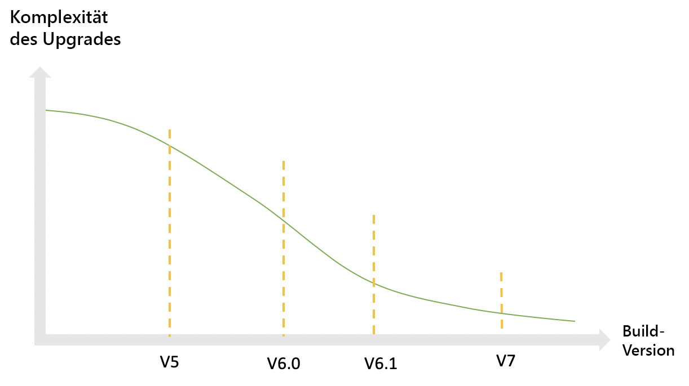
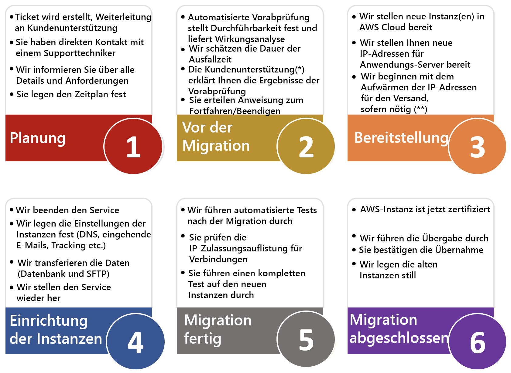

# Überblick{#dc-ovv}

## Kontext

Wir sind bestrebt, unseren geschätzten Kunden die optimale Nutzung von Adobe Campaign Classic zu ermöglichen und den maximalen Wert zu bieten. Im Laufe der Jahre hat sich das Hosting unserer Kunden in der Cloud als überaus effizient und zuverlässig erwiesen.  Im Rahmen unserer [Initiative mit jährlichen Aktualisierungen](../../rn/using/rn-overview.md#yearly-upgrade) transferieren wir jetzt alle unsere Kunden zu Adobe Managed Services (Public Cloud auf AWS), um bessere und zuverlässigere Services bereitstellen zu können.

Das Programm verfolgt drei Hauptziele:

* Behebung identifizierter Sicherheitslücken durch das Verlagern der Infrastruktur in eine sichere und moderne Umgebung (AWS)
* Entfernung umständlicher Skalierungsprozesse, Ermöglichen des Zugriffs auf unsere [erweiterten MTAs](../../delivery/using//sending-with-enhanced-mta.md) und Verbesserung der Wartungsqualität
* Vorbereitung Ihrer Instanz auf die Zukunft von Adobe Campaign Classic, einschließlich stärker automatisierter regelmäßiger Upgrades, die weniger Ressourcen und Zeit in Anspruch nehmen.

### Glossar

* **Build-Upgrade**: Vorgang, bei dem die Adobe Campaign Classic-Software auf die aktuellste, sichere Build-Nummer aktualisiert wird, während die Versionsnummer unverändert bleibt. Beispiel: von Campaign v7 20.2.3 Version 9182 auf Campaign v7 21.2.5 Version 9188. [Weitere Informationen](../../platform/using/faq-build-upgrade.md).
* **MID/RT**: Auf Adobe Cloud gehostete Nachrichten-Ausführungs-Server (MID für Batch-Kampagnen und RT für einzelne Nachrichten in Echtzeit)
* **Programm mit jährlichen Aktualisierungen**: Dieses Programm bietet mehr Sicherheit, bessere Unterstützung sowie verbesserte Wartung und Stabilität. Es erleichtert auch zukünftige Upgrades und bietet Zugriff auf neue Funktionen in Campaign.  [Weitere Informationen](../../rn/using/rn-overview.md#yearly-upgrade).
* **AWS**: Amazon Web Services (Amazon Public Cloud)
* **SFTP**: Secure File Transfer Protocol [Weitere Informationen](../../platform/using/sftp-server-usage.md).

>[!NOTE]
>Die Migration von Campaign Classic v7 zur Public Cloud betrifft nur Kunden, die **Adobe Managed Services** verwenden.

## Vorteile

**Sicherheit**

* Neueste Sicherheitskorrekturen
* Verschlüsselung ruhender Daten (Data-at-Rest)
* Verbesserte Authentifizierung (IMS)

**Infrastrukturen**

* Agile Hardware-Skalierbarkeit
* Schnellere Wiederherstellung
* Verbesserte Zuverlässigkeit und Stabilität
* Harmonisierte Betriebsverfahren

**Leistungen**

* Verbesserte E-Mail-Kapazität
* Größere Datenbanken
* Getestete Campaign-Version

**Eine stabile und zuverlässige Lösung für Kunden von Adobe Campaign Classic**

1. Bessere Produktionsverfahren, die mehr Zuverlässigkeit, eine höhere Reaktionsrate bei Problemen und schnellere Wiederherstellung bei schwerwiegenden Störfällen bieten.
1. Höhere E-Mail-Sendekapazität. Die im neuen Rechenzentrum gehosteten Instanzen profitieren von einer speziellen Infrastruktur für die E-Mail-Zustellung. Dadurch kann die E-Mail-Zustellung beschleunigt oder die Anzahl von Versand-IPs verringert werden.
1. Verbesserte Hardware-Skalierbarkeit. Hardware-Ressourcen können wesentlich schneller aufgestockt werden. Die Dauer dafür würde anstelle mehrerer Tage nur mehr eine Stunde betragen.

**Jährliche Aktualisierungen erleichtern zukünftige Aktualisierungen**

1. Je länger Ihr Unternehmen mit der Aktualisierung wartet, desto komplexer wird Ihr Upgrade. Gleichzeitig steigt das Risiko von Sicherheitslücken (insbesondere beim Wechsel von einer älteren Version).
1. Mit jährlichen Campaign-Aktualisierungen (ehemals als &quot;Gold Standard-Initiative&quot; bezeichnet) wird Ihre Instanz auf den aktuellen Stand gebracht und kann mit weniger manuellen Eingriffen und weniger Ressourcen stärker automatisiert und regelmäßig aktualisiert werden.

## Informationen zur Migration

Zu Beginn dieses Vorgangs erhalten Kunden, für die eine Migration vorgesehen ist, eine E-Mail-Mitteilung von Adobe mit einem Zeitplan und einem Zugriff auf die Dokumentation. This will be your notification that your account is scheduled to be migrated.

Sie können die Migration durch das [Erstellen eines neuen Support-Tickets bei der Kundenunterstützung](https://experienceleague.adobe.com/?support-solution=Campaign#support) einleiten. Geben Sie in der Betreffzeile „Migrate to AWS“ (Migration zu AWS) ein.

### Ist diese Migration obligatorisch?

Diese Migration in die Cloud ist **der erste Schritt zum [Programm mit jährlichen Aktualisierungen](../../rn/using/rn-overview.md#yearly-upgrade)** Ihrer Adobe Campaign-Instanzen. Diese Migration ist obligatorisch, wenn Sie in einem anderen Rechenzentrum als der Public Cloud (AWS) gehostet werden.

Die Adobe Managed Services-Cloud wird auf Amazon Web Services (AWS) gehostet, einer modernen, sicheren und optimierten Umgebung. [Weitere Informationen zu AWS](https://aws.amazon.com/application-hosting/benefits/).

Adobe plant die Stilllegung des alten Rechenzentrums. Die dort ausgeführten Adobe Campaign-Instanzen müssen in das neue Referenz-Rechenzentrum (AWS) übertragen werden.

Dies ist ein wichtiger Schritt, da im aktuellen Rechenzentrum **Sicherheitsrisiken und Leistungsprobleme** bestehen könnten.

Darüber hinaus ist diese Migration eine **Voraussetzung für jedes zukünftige Build-Upgrade** von Adobe Campaign. Im alten Rechenzentrum ist kein Build-Upgrade mehr möglich.

Adobe setzt alles daran, Ihre Daten zu schützen und Sie auf die künftige Nutzung von Adobe Campaign vorzubereiten. Wir sind auf Ihre Mitarbeit angewiesen, um diese Migration gemeinsam erfolgreich durchzuführen!

**Wir haben ein Team** aus engagierten Kundenbetreuern, Kundenerfolgs-Managern, Produkt-Managern, Ingenieuren, TechOps-Spezialisten und Produktberatern zusammengestellt, um diesen Prozess möglichst reibungslos und nahtlos zu gestalten. Wir werden dafür sorgen, dass Sie über alle nötigen Projekt- und Kontaktinformationen verfügen.

Wir haben große Anstrengungen unternommen, um Technologien zu entwickeln, mithilfe derer diese Migration schnell, nahtlos und sicher durchgeführt werden kann.

### Einschränkungen

* Eine gewisse Ausfallzeit der Plattform ist bei der Migration unvermeidlich. Das Ziel dieses Plans ist es, Ihnen zu helfen, die Ausfallzeit möglichst gering zu halten.
* IP-Änderung für Datenintegrationen.
* Ramp-up der Zustellbarkeit neuer Sende-IPs. Es ist jedoch geplant, diesen Vorgang für Ihr Unternehmen transparent zu gestalten, anders als beim der ursprünglichen Anfangsphase bei der Live-Schaltung.

Weitere Informationen finden Sie in den häufig gestellten Fragen zur Campaign-Migration zur [Public Cloud](dc-migration-faq.md).

## Migrationspfad zur Public Cloud

Adobe führt die meisten Aktionen durch. Wir benötigen Sie nur zur Validierung und Abnahme.

## Migrationsrichtlinien

### Globaler Ansatz

**Datenbank**

Die Datenbank wird aus dem alten Rechenzentrum entfernt und in der Public Cloud (AWS) wiederhergestellt. Beim Neustart im neuen Rechenzentrum wird die Anwendung genau in dem Zustand fortgesetzt, in dem sie sich vor dem Herunterfahren befand. Die Benutzenden werden keinen Unterschied bemerken, außer dass sich einige geplante Aufgaben verzögern.

**IPs für den E-Mail-Versand**

Nach Abschluss der Migration wird die Campaign-Instanz völlig andere Sende-IPs aufweisen. Um eine reibungslose Migration zu gewährleisten, wird Adobe ein Ramp-up der neuen Sende-IPs durchführen, indem der Traffic schrittweise von den alten auf die neuen IPs umgestellt wird.

**IPs zur Datenintegration**

Die Datenintegration auf Client-Seite könnte durch die Änderung der IPs für die Datenintegration beeinträchtigt sein. Die Änderung kann sich in beide Richtungen auswirken, je nachdem, ob Campaign als Server oder Client fungiert.
Typische Fälle:

* SFTP, beide Richtungen möglich
* HTTP, beide Richtungen möglich
* SMPP (Verbindung zum SMS-Anbieter), Campaign als Client, Änderung der Quell-IP

Im Allgemeinen bedeutet dies, dass der Client mögliche IP-Einschränkungen für seine Firewalls überprüfen und entsprechend anpassen sollte.*

**Campaign-Server**

Bestehende Campaign-Server (eigentlich Container) werden per „Lift and Shift“ in die Public Cloud (AWS) verschoben. Das heißt, es ist keine neue Server-Installation erforderlich, sondern der gesamte Server wird in das neue Rechenzentrum übertragen. Der Vorgang erfordert nicht mehr Aufwand als eine technisch einfache Neukonfiguration.

**Server-Namen**

Unter den für die Marketing-Kommunikation verwendeten Subdomains: bleiben unverändert. Abhängig von der Implementierung können jedoch auf der Client-Seite Aktionen erforderlich sein:

* Bei einer Subdomain-Zuweisung (Normalfall) übernimmt Adobe alle Änderungen und sorgt für einen nahtlosen Übergang.
* Bei der CNAME-Einrichtung (Ausnahme) muss der Client Änderungen implementieren. Dabei ist die Koordination mit Adobe ist erforderlich.

Für den Benutzerzugriff und die Datenintegration bleiben die Namen unter neolane.net unverändert.

Das bedeutet, dass die Änderung für Benutzer und im Fall von Implementierungen von Datenintegrationen transparent ist, wenn Servernamen nicht durch hartcodierte IPs ersetzt wurden.

### Vorbereitung

**IPs für den E-Mail-Versand**

Zunächst wird der Zustellbarkeitsstatus der Plattform durch das Adobe-Zustellbarkeits-Team geprüft und ein Plan für den Wechsel zu den neuen IPs empfohlen. 

Adobe stellt dieselbe Anzahl von IPs im neuen Rechenzentrum bereit.

Sobald die neuen IPs bereitstehen, kann der Ramp-up der neuen IPs beginnen.

**Bereinigung der Anwendung**
Die Datenübertragung zwischen den Rechenzentren ist der Teil des Vorgangs, der die größte Auswirkung auf die Ausfallzeit hat.

Die Daten werden auf zwei Arten gespeichert:

1. In der Datenbank (die mit Abstand wichtigste)
1. In Dateien auf dem Anwendungsserver (Datenimport und -export)

Die Reduzierung der Datenbankgröße ist von größter Bedeutung, um die Datenübertragung zu beschleunigen.

Empfehlungen:

* Reduzieren Sie die Aufbewahrungszeiträume historischer Daten (Versandlogs, Trackinglogs usw.).
* Löschen Sie nicht mehr genutzte Datensätze aus anderen Tabellen (Sendungen, Empfänger, benutzerdefinierte Tabellen).

### Ausführung

**Ausführungen anhalten**

Adobe empfiehlt, alle Ausführungen (Sendungen und Workflows) zu verlangsamen und im Idealfall anzuhalten, bevor die Anwendung im alten Rechenzentrum heruntergefahren wird. Auf diese Weise wird der Neustart auf der Public Cloud (AWS) vereinfacht, da es den Prozessen Zeit gibt, ordnungsgemäß zu pausieren und den Status der laufenden Ausführung zu speichern. 

**Während der Migration**

Während der Migration bleibt nur ein Service funktionsfähig: die Umleitung von E-Mail-Links. Das bedeutet, dass Empfänger beim Klicken auf einen Link in einer E-Mail auf die Landingpage gelangen. Diese Klicks werden jedoch nicht aufgezeichnet, sodass die Klickraten für die Sendungen, die kurz vor der Migration gestartet wurden, niedriger als gewöhnlich sein werden.

**Neu starten**

Nach der Migration in die neue Umgebung wird die Anwendung schrittweise neu gestartet:

* Zuerst der Zugriff auf die Konsole, damit Benutzer den Status überprüfen können, ohne dass Prozesse aktiv ausgeführt werden
* Anschließend Workflows und Sendungen

### Nach der Migration

**Löschen von Instanzen im alten Rechenzentrum**

Nach Abschluss der Anwendungsmigration ist keine erneute Ausführung von Prozessen im alten Rechenzentrum geplant. Wir gehen davon aus, dass alle Daten im alten Rechenzentrum gelöscht werden können. Die einzige Ausnahme ist das temporäre Backup, bis die geplanten Backup-Vorgänge auf der Public Cloud (AWS) ausgeführt wurden.

**DNS-Zuweisung**

Bisher wurde die Domain, die zum Senden von E-Mails in Campaign verwendet wurde (in der Fehleradresse der Teil rechts neben dem @-Zeichen), Adobe zugewiesen. Die Zuweisung kann auf die AWS-DNS-Server geändert und implementiert werden.

## Support und andere nützliche Links{#support}

* [Häufig gestellte Fragen zur Migration zu Adobe Managed Services (Public Cloud)](dc-migration-faq.md)
* [Jährliche Campaign-Aktualisierungen](../../rn/using/rn-overview.md)
* [Häufig gestellte Fragen zur Build-Aktualisierung](../../platform/using/faq-build-upgrade.md)
