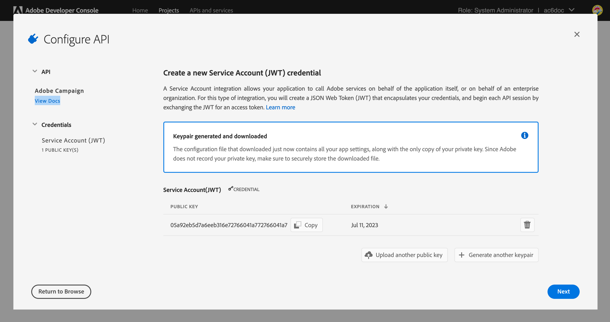

# Aktualisierung auf den neuen Zustellbarkeits-Server {#acc-deliverability}

Start [Version 7.2.1](../../rn/using/latest-release.md#release-7-2-2)setzt Adobe Campaign auf einen neuen Zustellbarkeits-Server, der hohe Verfügbarkeit bietet und Probleme mit der Einhaltung von Sicherheitsvorschriften behebt. Campaign Classic synchronisiert nun die Zustellbarkeitsregeln, Broadlogs und Unterdrückungsadressen mit dem neuen Zustellbarkeits-Server. Der alte Zustellbarkeits-Server wird am 31. August 2022 eingestellt.

Als Campaign Classic-Kunde müssen Sie den neuen Zustellbarkeits-Server implementieren **vor dem 31. August 2022**.

>[!NOTE]
>
>Weitere Fragen zu diesen Änderungen finden Sie im Abschnitt [FAQs](#faq)oder Kontakt [Adobe-Kundenunterstützung](https://helpx.adobe.com/de/enterprise/admin-guide.html/enterprise/using/support-for-experience-cloud.ug.html){_blank}.

## Was hat sich geändert?{#acc-deliverability-changes}

Aus Sicherheitsgründen nimmt Adobe ältere Rechenzentren außer Betrieb. Adobe Campaign Classic-Kunden müssen zum neuen Zustellbarkeits-Service migrieren, der auf Amazon Web Service (AWS) gehostet wird.

Dieser neue Server garantiert hohe Verfügbarkeit (99,9) und bietet sichere, authentifizierte Endpunkte, damit Campaign-Server die erforderlichen Daten abrufen können. Anstatt für jede Anfrage eine Verbindung zur Datenbank herzustellen, bewahrt der neue Zustellbarkeits-Server die Daten in einem Zwischenspeicher auf, um die Anfragen nach Möglichkeit zu beantworten. Dieser Mechanismus verbessert die Reaktionszeit.

## Sind Sie betroffen?{#acc-deliverability-impacts}

Alle Kunden sind betroffen und müssen auf [Campaign v7.2.1](../../rn/using/latest-release.md#release-7-2-2) (oder mehr) und ihre Umgebung implementieren, um vom neuen Zustellbarkeits-Server zu profitieren.

## Wie wird die Aktualisierung durchgeführt?{#acc-deliverability-update}

Als **gehosteter Kunde**, arbeitet Adobe mit Ihnen zusammen, um Ihre Instanz(en) auf die neuere Version zu aktualisieren und das Projekt in der Adobe Developer Console zu erstellen.

Als **On-Premise-/Hybrid-Kunde**, müssen Sie ein Upgrade auf [Campaign v7.2.1](../../rn/using/latest-release.md#release-7-2-2) (oder mehr), um vom neuen Zustellbarkeits-Server zu profitieren. Nachdem alle Instanzen aktualisiert wurden, müssen Sie [die neue Integration implementieren](#implementation-steps) auf den Zustellbarkeitsserver der Adobe zu gelangen und einen nahtlosen Übergang zu gewährleisten.

## Implementierungsschritte {#implementation-steps}

Im Rahmen der Integration des neuen Zustellbarkeits-Servers muss Campaign mit Adobe Shared Services über eine auf dem Identity Management Service (IMS) basierende Authentifizierung kommunizieren. Die bevorzugte Methode ist die Verwendung des Adobe Developer-basierten Gateway-Tokens (auch als Token für technische Konten oder Adobe IO JWT bezeichnet).


>[!WARNING]
>
>Diese Schritte sollten nur bei Hybrid- und On-Premise-Implementierungen durchgeführt werden.

### Voraussetzungen{#prerequisites}

Überprüfen Sie vor Beginn der Implementierung Ihre Instanzkonfiguration.

1. Öffnen Sie die Campaign-Clientkonsole und melden Sie sich als Administrator bei Adobe Campaign an.
1. Gehen Sie zu **Administration > Plattform > Optionen**.
1. Prüfen Sie, ob der Wert der Option `DmRendering_cuid` ausgefüllt ist.

   * Wenn die Option ausgefüllt ist, können Sie die Implementierung starten.
   * Wenn kein Wert ausgefüllt ist, kontaktieren Sie [Adobe-Kundenunterstützung](https://helpx.adobe.com/enterprise/admin-guide.html/enterprise/using/support-for-experience-cloud.ug.html){_blank}, um Ihre CUID zu erhalten.

   Diese Option muss für alle Campaign-Instanzen (MKT, MID, RT, EXEC) mit dem richtigen Wert angegeben werden. Wenden Sie sich als Hybrid-Kunde an Adobe, damit die Option in Ihren MID-, RT- und EXEC-Instanzen festgelegt ist.

### Schritt 1: Erstellen/Aktualisieren Sie Ihr Adobe Developer-Projekt {#adobe-io-project}

1. Rufen Sie die [Adobe Developer Console](https://developer.adobe.com/de/console/home) auf und melden Sie sich mit den Entwicklerzugriffsdaten Ihrer Organisation an.

   >[!NOTE]
   >
   > Stellen Sie sicher, dass Sie beim richtigen Portal der Organisation angemeldet sind.

1. Auswählen **[!UICONTROL Neues Projekt erstellen]**.
   


   >[!CAUTION]
   >
   >Wenn Sie bereits die Adobe IO JWT-Authentifizierungsfunktion für eine andere Integration verwenden, z. B. Analytics-Connector oder Adobe-Trigger, müssen Sie Ihr Projekt aktualisieren, indem Sie **Campaign-API** an dieses Projekt heran.

1. Auswählen **[!UICONTROL API hinzufügen]**.
   
1. Wählen Sie im Fenster **[!UICONTROL API hinzufügen]** die Option **[!UICONTROL Adobe Campaign]**.
   
1. Wenn Ihre Client-ID leer war, wählen Sie **[!UICONTROL Generate a key pair]** (Schlüsselpaar generieren) aus, um ein Paar aus öffentlichem und privatem Schlüssel zu erstellen.
   

   Die Schlüssel werden dann automatisch mit einem Standardablaufdatum von 365 Tagen heruntergeladen. Nach dem Ablaufdatum müssen Sie ein neues Schlüsselpaar erstellen und die Integration in der Konfigurationsdatei aktualisieren. Mit Option 2 können Sie Ihren **[!UICONTROL öffentlichen Schlüssel]** manuell mit einem längeren Ablaufdatum erstellen und hochladen.
   

   >[!CAUTION]
   >
   >Sie sollten die `config.zip` Datei, wenn die Download-Eingabeaufforderung angezeigt wird, da Sie sie nicht erneut herunterladen können.

1. Klicken Sie auf **[!UICONTROL Weiter]**.
1. Wählen Sie ein vorhandenes **[!UICONTROL Produktprofil]** aus oder erstellen Sie ggf. ein neues. Für dieses **[!UICONTROL Produktprofil]** ist keine Berechtigung erforderlich. Weitere Informationen finden Sie unter **[!UICONTROL Produktprofile]**, siehe [diese Seite](https://helpx.adobe.com/de/enterprise/using/manage-developers.html?lang=de){_blank}.
   

   Klicken Sie dann auf **[!UICONTROL Konfigurierte API speichern]**.

1. Wählen Sie in Ihrem Projekt **[!UICONTROL Adobe Campaign]** und kopieren Sie die folgenden Informationen unter **[!UICONTROL Service Account (JWT)]**

   

   * **[!UICONTROL Client ID]** (Client-ID)
   * **[!UICONTROL Client Secret]** (Client-Geheimnis)
   * **[!UICONTROL Technical account ID]** (Kennung des technischen Kontos)
   * **[!UICONTROL Organization ID]** (Organisationskennung)

>[!CAUTION]
>
>Das Adobe Developer-Zertifikat läuft nach 12 Monaten ab. Sie müssen jedes Jahr ein neues Schlüsselpaar generieren.

### Schritt 2: Hinzufügen der Projektanmeldedaten in Adobe Campaign {#add-credentials-campaign}

Der private Schlüssel sollte im Base64-UTF-8-Format kodiert sein.

Gehen Sie dabei folgendermaßen vor:

1. Verwenden Sie den in den obigen Schritten generierten privaten Schlüssel.
1. Codieren Sie den privaten Schlüssel mit dem folgenden Befehl: `base64 ./private.key > private.key.base64`. Dadurch wird der base64-Inhalt in einer neuen Datei `private.key.base64` gespeichert.

   >[!NOTE]
   >
   >Manchmal werden beim Kopieren/Einfügen des privaten Schlüssels automatisch zusätzliche Zeilen hinzugefügt. Vergessen Sie nicht, diese zu entfernen, bevor Sie Ihren privaten Schlüssel codieren.

1. Kopieren Sie die Inhalte aus der Datei `private.key.base64`.
1. Melden Sie sich über SSH bei jedem Container an, in dem die Adobe Campaign-Instanz installiert ist, und fügen Sie die Projektanmeldeinformationen in Adobe Campaign hinzu, indem Sie den folgenden Befehl als `neolane`-Benutzer ausführen. Dadurch werden die Anmeldeinformationen für das **[!UICONTROL Technische Konto]** in die Konfigurationsdatei der Instanz eingefügt.

   ```
   nlserver config -instance:<instance name> -setimsjwtauth:Organization_Id/Client_Id/Technical_Account_ID/<Client_Secret>/<Base64_encoded_Private_Key>
   ```

1. Sie müssen den Server anhalten und dann neu starten, damit die Änderung übernommen wird. Sie können auch einen `config -reload`-Befehl ausführen.

### Schritt 3: Aktivieren Sie den neuen Zustellbarkeits-Server

Jetzt können Sie den neuen Zustellbarkeits-Server aktivieren. Um dies durchzuführen:

1. Öffnen Sie die Client-Konsole und melden Sie sich bei Adobe Campaign als Administrator an.
1. Gehen Sie zu **Administration > Plattform > Optionen**.
1. Rufen Sie die Option `NewDeliverabilityServer_FeatureFlag` auf und setzen Sie den Wert auf `1`. Diese Konfiguration sollte für alle Ihre Campaign-Instanzen (MKT, MID, RT, EXEC) durchgeführt werden. Wenden Sie sich als Hybrid-Kunde an Adobe, damit die Option in Ihren MID-, RT- und EXEC-Instanzen festgelegt ist.

### Schritt 4: Überprüfen Sie Ihre Konfiguration

Führen Sie die folgenden Schritte aus, um zu überprüfen, ob die Integration erfolgreich war:


1. Öffnen Sie die Client-Konsole und melden Sie sich bei Adobe Campaign an.
1. Gehen Sie zu **Administration > Produktion > Technische Workflows**.
1. Starten Sie den **Zustellbarkeit** Workflow (deliverabilityUpdate). Dies sollte für alle Ihre Campaign-Instanzen (MKT, MID, RT, EXEC) durchgeführt werden. Wenden Sie sich als Hybrid-Kunde an Adobe, damit der Workflow in Ihren MID-, RT- und EXEC-Instanzen neu gestartet wird.
1. Überprüfen Sie die Protokolle: Der Workflow sollte fehlerfrei ausgeführt werden.


## Häufig gestellte Fragen {#faq}

### Welchen Zeitrahmen gibt es für die Aktualisierung?

Der Übergang zum neuen Zustellbarkeits-Server, der die Hinzufügung dieser verbesserten Funktionen und die Erhöhung der Sicherheit ermöglicht, beginnt am 22. Juli für gehostete Kunden (Campaign Managed Services). Alle gehosteten Kunden werden Ende August aktualisiert.

On-Premise- und Hybrid-Kunden müssen den Übergang im selben Zeitraum durchführen.

### Was passiert, wenn ich meine Umgebung nicht aktualisiere?

Jede Campaign-Instanz, die nicht bis zum 31. August aktualisiert wurde, kann keine Verbindung mehr zum Campaign-Zustellbarkeits-Server herstellen. Die **Zustellbarkeit** Der Workflow (deliverabilityUpdate) schlägt fehl, was sich auf Ihre Zustellbarkeit auswirkt.

Wenn Sie Ihre Umgebung nicht aktualisieren, werden die E-Mail-Einstellungen nicht mehr synchronisiert (MX-Verwaltungsregeln, Regeln für die Eingehende E-Mail, Regeln für die Domänenverwaltung und Regeln für die Bounce-Qualifizierung). Dies kann sich auf die Zustellbarkeit im Laufe der Zeit auswirken. Wenn eine wesentliche Änderung an diesen Regeln vorgenommen wird, müssen diese ab diesem Zeitpunkt manuell angewendet werden.

Nur für MKT-Instanzen [Globale Unterdrückungsliste](../../campaign-opt/using/filtering-rules.md#default-deliverability-exclusion-rules) betroffen ist.

