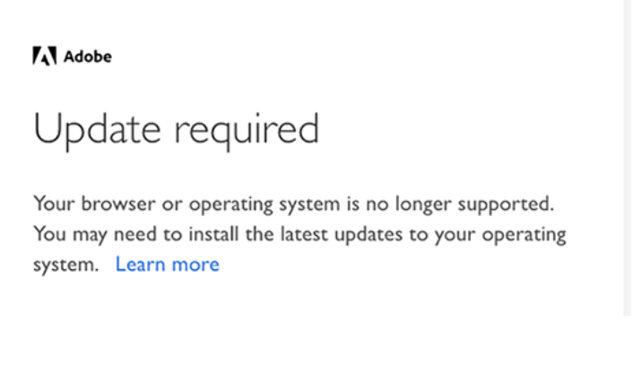

# Aktualisieren Ihrer Umgebung für die Verbindung zu Adobe Campaign mit IMS {#acc-ims-faq}

Am 30. Juni 2021 wurden Änderungen an [Adobe Identity Management System](https://helpx.adobe.com/de/enterprise/using/identity.html) (IMS) Anmeldefunktionen, die sich auf Ihre Fähigkeit auswirken könnten, Adobe Campaign weiterhin zu verwenden. Erfahren Sie, wie Sie sicherstellen, dass Sie Adobe Campaign Classic v7 ohne Unterbrechung weiterhin verwenden können.

## Was hat sich geändert?

Adobe Identity Service (IMS) beendete am **30. Juni 2021** die Unterstützung alter Internet Explorer-Versionen. [Weitere Informationen](https://helpx.adobe.com/de/x-productkb/global/update-operating-system-and-browser.html).

Adobe möchte die IMS-Funktionalität für alle Kunden ab dem 30. Juni 2021 beibehalten. IMS ist Teil des Sicherheits-Frameworks, das es Benutzern ermöglicht, sich bei der Client-Konsole anzumelden, also bei Adobe Campaign.

Um diese Funktion beizubehalten, müssen Kunden die Client-Konsole auf jedem Benutzer-Computer aktualisieren und sicherstellen, dass die neueste Aktualisierung Ihrer [Windows-Version](../../rn/using/compatibility-matrix.md#ClientConsoleoperatingsystems) mit **Internet Explorer 11** auf dem Computer jedes Benutzers installiert ist.

## Sind Sie betroffen?

Wenn Sie eine Verbindung zu Campaign [über eine Adobe ID](../../integrations/using/about-adobe-id.md) über den Adobe Identity Management Service (IMS) herstellen und eine ältere Campaign-Version als die unten aufgeführten ausführen, sind Sie betroffen.

Wenn Sie bereits ein Upgrade durchgeführt haben, aber eine alte Version von Microsoft Internet Explorer verwenden, müssen Sie auf Internet Explorer 11 aktualisieren.

## Wie wird die Aktualisierung durchgeführt?

* Wenn Sie gehosteter Kunde sind, hat Adobe Ihre Instanz(en) bereits auf die neuere Version aktualisiert.

* Als On-Premise-/Hybrid-Kunde müssen Sie ein Upgrade auf eine der neueren Versionen durchführen, um von der neuen Client-Konsole zu profitieren und einen reibungslosen Umstieg **vor dem 30. Juni 2021** sicherzustellen.

   Das Upgrade auf eine der folgenden neuen Versionen ist obligatorisch:

   * Gold Standard 11. [Weitere Informationen](../../rn/using/gold-standard.md)
   * Campaign-Version 21.1.3. [Weitere Informationen](../../rn/using/latest-release.md)
   * Campaign-Version 20.2.5. [Weitere Informationen](../../rn/using/release--2020.md#release-20-2-5-build-9188)
   * Campaign-Version 20.1.4. [Weitere Informationen](../../rn/using/release--2020.md#release-20-1-4-build-9126)
   * Campaign-Version 19.2.4. [Weitere Informationen](../../rn/using/release--2019.md#release-19-2-4-build-9082)

   Diese Versionen enthalten ein neues Verbindungsprotokoll. Ein Upgrade ist sowohl für den Campaign-Server als auch für die Client-Konsole erforderlich: Nachdem alle Instanzen ein Upgrade erhalten haben, muss die Client-Konsole auf diese Version aktualisiert werden, damit nach dem **30. Juni 2021** eine Verbindung zu Campaign hergestellt werden kann.

Stellen Sie außerdem sicher, dass das neueste Update Ihrer [Windows-Version](../../rn/using/compatibility-matrix.md#ClientConsoleoperatingsystems) mit **Internet Explorer 11** auf dem Computer jedes Benutzers installiert ist.

## Häufig gestellte Fragen

**Wie kann ich meine Campaign-Version überprüfen?**

[In diesem Abschnitt](../../platform/using/launching-adobe-campaign.md#getting-your-campaign-version) erfahren Sie, wie Sie Ihre Version überprüfen.

**Wie kann ich überprüfen, ob ich IMS verwende?**

Um Ihren Verbindungsmodus zu überprüfen, können Sie:

* Die Client-Konsole von Campaign starten und auf die Verbindungsparameter Ihrer Instanz zugreifen. Wenn die Option **Verbindung mit einer Adobe ID** ausgewählt ist, verwenden Sie Adobe IMS.

   

oder

* Starten Sie die Campaign Client-Konsole und überprüfen Sie Ihr Verbindungsfenster. Wenn Sie eine Verbindung mit einer Adobe ID herstellen (wie im folgenden Bildschirm dargestellt), verwenden Sie IMS.

   

**Verbindungswarnungsmeldung**

Die folgende Warnmeldung wird Benutzern angezeigt, wenn sie ihre Client-Konsole aktualisieren müssen oder eine alte Version von Microsoft Internet Explorer verwenden: **Sie müssen das neueste Update für Windows und/oder Ihre Adobe-Programme installieren.**

Wenn eine solche Warnung angezeigt wird, stellen Sie sicher, dass Sie die neuesten Updates des verwendeten Betriebssystems installieren. [Weitere Informationen](https://helpx.adobe.com/de/x-productkb/global/update-operating-system-and-browser.html)

Wenn Sie Ihre Internet Explorer-Version nicht aktualisiert haben, wird die folgende Meldung angezeigt und Sie können keine Verbindung mehr zu Adobe Campaign herstellen:

>[!NOTE]
>
>Wenden Sie sich bei Fragen zu diesen Änderungen an die [Adobe-Kundenunterstützung](https://helpx.adobe.com/de/enterprise/admin-guide.html/enterprise/using/support-for-experience-cloud.ug.html).

## Nützliche Links

* [Upgrade Ihrer Umgebung](../../production/using/build-upgrade.md)
* [Häufig gestellte Fragen zum Build-Upgrade](../../platform/using/faq-build-upgrade.md)
* [Neue Client-Konsole für Benutzer verfügbar machen](../../installation/using/client-console-availability-for-windows.md)
* [Campaign-Client-Konsole installieren](../../installation/using/installing-the-client-console.md)
* [Zugriff auf Adobe Software-Verteilung](https://experienceleague.adobe.com/docs/experience-cloud/software-distribution/home.html?lang=de)
* [Campaign Classic-Build herunterladen](https://experience.adobe.com/#/downloads/content/software-distribution/de/campaign.html)
