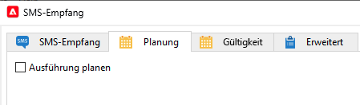

# Workflow-Aktivität SMS-Empfang für Mid-Sourcing-Infrastruktur {#inbound-sms}

## Einschränkungen {#limitations}

* Dieser Anwendungsfall gilt nur für die Marketing-Instanz, in der Sie InSMS-Daten aus der/den Mid-Sourcing-Instanz(en) erfassen.
* Implementieren Sie dieses Anwendungsbeispiel nicht in der Mid-Sourcing-Instanz.
* Pro externem Mid-Sourcing-Konto ist nur ein benutzerdefinierter Workflow verfügbar.

## Implementierung {#implementation}

1. Hinzufügen einer Erweiterung zum `nms:inSMS` Schema in Ihrer Marketing-Instanz. Die Erweiterung fügt dem `nms:inSMS` Schema und verfolgen Sie den Primärschlüssel des InSMS-Datensatzes, der von der Mid-Sourcing-Instanz stammt.

   ```
   <element img="nms:miniatures/mini-sms.png" label="Incoming SMS"
          labelSingular="Incoming SMS" name="inSMS">
   <dbindex name="midInSMSId" unique="false">
     <keyfield xpath="@extAccount-id"/>
     <keyfield xpath="@midInSMSId"/>
   </dbindex>
   
   <attribute label="External Mid SMS ID" name="midInSMSId" type="long"/>
   </element>
   ```

1. Um die Änderungen an den Schemas anzuwenden, starten Sie den Datenbankaktualisierungs-Assistenten. Auf diesen Assistenten kann über **Instrumente** > **Erweitert** > **Datenbankstruktur aktualisieren**. Er prüft, ob die physische Struktur der Datenbank mit der logischen Beschreibung übereinstimmt, und führt die SQL-Update-Skripte aus. [Weitere Informationen](../../configuration/using/updating-the-database-structure.md)

1. Beenden Sie den Workflow mit dem **SMS-Empfang**.

   Sichern Sie den entsprechenden Optionszeiger im folgenden Format: `SMS_MO_INDEX_{internal name of the workflow}_{name of the insms workflow activity}_{internal name of the external account to access the mid}`.

[Weitere Informationen zur Sicherung](../../production/using/backup.md)

1. (**OPTIONAL**), wenn Sie bereits eine Planung verwenden, öffnen Sie den Workflow und konfigurieren Sie ihn wie folgt neu:

   1. Replizieren Sie die aktuellen Einstellungen über die **Zeitplan** Registerkarte Ihres **SMS-Empfang** -Aktivität in Ihre externe **Planung** -Aktivität.

   1. Deaktivieren Sie die aktuelle Einstellung im **Zeitplan** Tab von **SMS-Empfang** -Aktivität.

      

1. Aktualisieren Sie die **SMS-Empfang** benutzerdefiniertes Skript.

   Ersetzen Sie den folgenden Block. Beachten Sie, dass dieses Skript ggf. variieren kann, wenn Sie diesen Code zuvor angepasst haben.

   ```
   var lastSynchKey = getOption('SMS_MO_INDEX_WKF1105_inSmsUS_smsmidus');
   
   var smsId = application.getNewIds(1);
   
   xtk.session.Write(<inSMS xtkschema="nms:inSMS" _operation="insert"
       id={smsId}
       origin={smsMessage.origin}
       message={smsMessage.message}
       providerId={smsMessage.messageId}/>);
   
   return 2;
   ```

   Mit dem folgenden neuen benutzerdefinierten Skript können Sie inSMS-Daten anhand eines zusammengesetzten Schlüssels aktualisieren, indem Sie den Primärschlüssel des Mid-Sourcing-Datensatzes und die externe Konto-ID des Marketing SMS-Routing kombinieren.
Befolgen Sie die unten stehenden Voraussetzungen:

   * Geben Sie den tatsächlichen Wert für ein `<EXTERNAL_ACCOUNT_ID>`, z. B. `var iExtAccountId=72733155`.
   * Achten Sie darauf, die folgenden Elemente im benutzerdefinierten Skript zu behalten:
      * `_operation="insertOrUpdate"`
      * `_key="@midInSMSId,@extAccount-id"`
      * `midInSMSId={smsMessage.id}`
      * `inSms.@["extAccount-id"] = iExtAccountId;{}`

   ```Javascript
   // please enter real external account ID to replace <EXTERNAL ACCOUNT ID>
   var iExtAccountId=<EXTERNAL_ACCOUNT_ID>;
   
   var inSms = <inSMS xtkschema="nms:inSMS" _operation="insertOrUpdate"
   
               _key="@midInSMSId,@extAccount-id"
               midInSMSId={smsMessage.id}
               message={smsMessage.message}
               origin={smsMessage.origin}
               providerId={smsMessage.providerId}
               alias={smsMessage.alias}
               messageDate = {smsMessage.messageDate}
               receivalDate = {smsMessage.receivalDate}
               deliveryDate = {smsMessage.deliveryDate}
               largeAccount = {smsMessage.largeAccount}
               countryCode = {smsMessage.countryCode}
               operatorCode = {smsMessage.operatorCode}
               linkedSmsId={smsMessage.linkedSmsId}
               separator = {smsMessage.separator}/>
   
   inSms.@["extAccount-id"] = iExtAccountId;
   
   xtk.session.Write(inSms);
   
   return 2;
   ```

1. Aktualisieren Sie das erweiterte Initialisierungsskript für eingehende SMS mit dem folgenden Skript.

   Das Skript setzt den Primärschlüsselzeiger auf 24 Stunden zuvor zurück. Der Workflow versucht, innerhalb der letzten 24 Stunden alle InSMS-Daten aus der Mid-Sourcing-Instanz erneut zu verarbeiten und der Marketing-Instanz fehlende Daten hinzuzufügen.

   ```
   // please enter real external account ID to replace <EXTERNAL_ACCOUNT_ID>
   // please enter real pointer option name to replace '<POINTER_OPTION_NAME>'
   // OPTION NAME format: SMS_MO_INDEX_{internal name of the workflow}_inSms_{internal name of the external account to access the mid}
   
   var queryDef = xtk.queryDef.create(
       <queryDef operation="getIfExists" schema="nms:inSMS" lineCount="1">
       <select>
           <node expr="@midInSMSId" alias="@midInSMSId"/>
       </select>
       <where>
           <condition expr="@midInSMSId != 0"/>
           <condition expr={"@created > SubHours(GetDate(), 24)"}/>
           <condition expr={"[@extAccount-id]=<EXTERNAL_ACCOUNT_ID>"}/>
       </where>
       <orderBy>
           <node expr="@midInSMSId"/>
       </orderBy>
       </queryDef>);
   
   var res = parseInt(queryDef.ExecuteQuery().@midInSMSId.toString());
   
   if( !isNaN(res) )
   setOption('<POINTER_OPTION_NAME>', res);
   ```

   >[!WARNING]
   >
   > * Wenn mehrere SMS-Routing-Konten mit derselben Mid-Sourcing-Instanz verknüpft sind, ist nur ein einzelner Workflow pro Mid-Sourcing-Instanz zulässig.
   > * Sie können eine beliebige externe Konto-ID verwenden. Die Rolle des Fremdschlüssels besteht darin, die Integrität der Datenabstimmung in Szenarien mit verschiedenen Mid-Sourcing-Servern zu wahren, in denen die Mid-Sourcing-SMS-ID in anderen Mid-Sourcing-Instanzen identisch sein kann.
   > * Wenn mehrere InSMS-Workflows pro Mid-Sourcing-Instanz vorhanden sind, kann es zu einer Datenduplizierung kommen, da die Mid-Sourcing-SMS-ID konstant bleibt, während die externen Konto-IDs variieren.

1. Speichern und starten Sie den Workflow neu.


