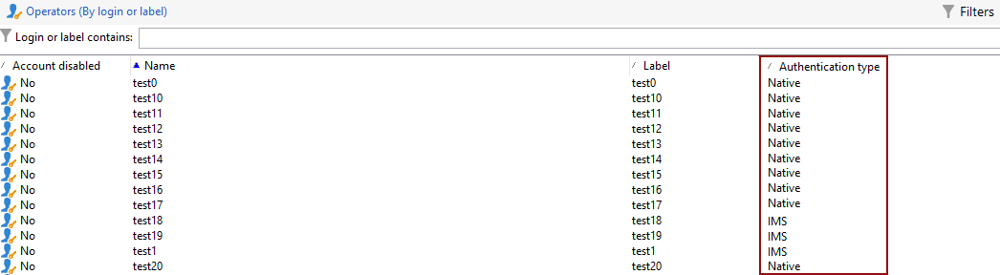

# Migrieren von Campaign-Benutzenden zum Adobe Identity Management System (IMS) {#migrate-users-to-ims}

Im Rahmen der Bemühungen, die Sicherheit und den Authentifizierungsprozess zu verbessern, empfiehlt Adobe Campaign dringend, den Authentifizierungsmodus für Endbenutzende von der nativen Authentifizierung mit Login/Passwort auf das Adobe Identity Management System (IMS) zu migrieren. Alle Benutzer sollten [Adobe Identity Management System (IMS) implementieren](https://helpx.adobe.com/de/enterprise/using/identity.html){target="_blank"} um eine Verbindung mit Campaign herzustellen.

Weitere Informationen zu dieser Migration finden Sie auf [dieser Seite](ac-ims.md).

## Was hat sich geändert? {#move-to-ims-changes}

Mit Campaign Classic können sich alle regulären Anwenderinnen und Anwender bereits mit ihrer Adobe ID über das Adobe Identity Management System (IMS) mit der Adobe Campaign Client-Konsole verbinden. Verbindungen mit Benutzername/Passwort sind jedoch noch weiterhin verfügbar. Dies ist ab Campaign v8 nicht mehr zulässig.

Darüber hinaus ruft die Adobe Campaign-Client-Anwendung zur Verbesserung der Sicherheit und des Authentifizierungsprozesses die Campaign-APIs jetzt direkt über das technische IMS-Konto-Token auf. Die Migration für technische Benutzende wird in einem speziellen Artikel beschrieben, der auf [dieser Seite](ims-migration.md) zu finden ist.

Diese Änderung ist bereits in Campaign Classic v7 möglich und wird für den Wechsel zu Campaign v8 **obligatorisch** sein.

Adobe unterstützt Sie bei dieser Migration. Im folgenden Artikel finden Sie detaillierten Kontext und Schritt-für-Schritt-Anweisungen.

## Sind Sie betroffen?{#migrate-ims-impacts}

Dieses Verfahren gilt für alle Benutzerinnen und Benutzer von Campaign, die noch keine Verbindung zu Campaign mit ihrer Adobe ID herstellen.

Wenn Benutzende Ihrer Organisation über ihr Login/Passwort eine Verbindung zur Campaign-Client-Konsole herstellen (auch bekannt als native Authentifizierung), sind Sie betroffen und sollten diese Benutzenden wie unten beschrieben zu Adobe IMS migrieren.

Die Migration auf das [Adobe Identity Management System (IMS](https://helpx.adobe.com/de/enterprise/using/identity.html){target="_blank"} ist eine Sicherheitsanforderung, um Ihre Umgebungen sicher und standardisiert zu gestalten, da die meisten anderen Adobe Experience Cloud-Lösungen und -Apps bereits auf IMS installiert sind.

Diese Änderung gilt ab Campaign Classic v7.4.1 (und für die neuesten [mit der IMS-Migration kompatiblen Versionen](ac-ims.md#ims-versions)) und ist **obligatorisch** für den Wechsel zu Adobe Campaign v8.

>[!IMPORTANT]
>
>**Auswirkungen auf den Control Panel-Zugriff**
>
>Wenn Sie Ihre Benutzerinnen und Benutzer zu IMS migriert haben, beachten Sie, dass jedes Produktprofil in der Adobe Admin Console, das das Wort „admin“ im Namen enthält (z. B. „Administratoren“, „Admin“, „Admins“, „Genehmigungsadmin“ usw.) automatisch Zugriff auf das Campaign Control Panel gewährt. Das Control Panel ist ein Self-Service-Tool, mit dem Sie wesentliche Änderungen an Campaign-Instanzen vornehmen können.
>
>Überprüfen Sie die Benennungskonventionen für Produktprofile sorgfältig, um sicherzustellen, dass nur autorisierte Benutzer Zugriff auf das Control Panel haben. Weitere Informationen zur Verwaltung von Control Panel-Berechtigungen finden Sie in der [Control Panel-Dokumentation](https://experienceleague.adobe.com/docs/control-panel/using/discover-control-panel/managing-permissions.html?lang=de){target="_blank"}.

## Wie migriert man gehostete und Managed Services-Umgebungen? {#ims-migration-procedure}

### Voraussetzungen {#ims-migration-prerequisites}

Bevor Sie mit dem Migrationsprozess beginnen, müssen Sie sich an Ihre Adobe-Kontaktperson für Migrationen (für Kundinnen und Kunden von Managed Services) oder an die Adobe-Kundenunterstützung (für andere gehostete Kundinnen und Kunden) wenden, damit die technischen Teams von Adobe Ihre bestehenden Benutzergruppen und spezifischen Berechtigungen zum Adobe Identity Management System (IMS) migrieren können.

### Die wichtigsten Schritte {#ims-migration-steps}

Die wichtigsten Schritte für diese Migration sind unten aufgeführt:

1. Adobe aktualisiert Ihre Umgebungen auf Campaign v7.4.1 (oder eine [mit der IMS-Migration kompatible Version](ac-ims.md#ims-versions)).
1. Nach dem Upgrade können Sie weiterhin neue Benutzende mit beiden Methoden erstellen, als native Benutzerin bzw. nativen Benutzer oder mit IMS.
1. Ihre internen Campaign-Admins müssen allen nativen Benutzenden in der Campaign-Client-Konsole eindeutige E-Mails hinzufügen und nach Abschluss dieses Vorgangs dem Adobe-Support bzw. der -Kundenunterstützung bestätigen, dass dies geschehen ist. Dieser Schritt wird in [diesem Abschnitt](#ims-migration-id) beschrieben.
1. Vereinbaren Sie mit dem Adobe-Support bzw. der -Kundenunterstützung einen Termin, an dem Adobe die automatisierte Migration für Ihre nicht-technischen Benutzenden und Produktprofile durchführen kann. Für diesen Schritt ist ein Zeitfenster von einer Stunde ohne Ausfallzeiten für Ihre Services erforderlich.
1. Ihre internen Campaign-Admins validieren diese Änderungen und geben sie frei. Nach dieser Migration dürfen Sie keinen weiteren Benutzenden mehr erstellen, die sich mit deren Login und Passwort authentifizieren.

Sie können auch Ihre technischen Benutzenden zur Adobe Developer Console migrieren, wie in [dieser Technote](ims-migration.md) beschrieben.

Bestätigen Sie anschließend den Abschluss dieser Migration Ihrer Adobe-Kontaktperson für Migrationen (für Managed Services-Benutzende) bzw. der Adobe-Kundenunterstützung (für gehostete Kundinnen und Kunden). Adobe markiert dann die Migration als abgeschlossen. Ihre Umgebung ist dann gesichert und standardisiert.

## Wie wird die Migration von Hybrid- und On-Premise-Umgebungen durchgeführt? {#ims-migration-procedure-on-prem}

Die wichtigsten Schritte für diese Migration sind unten aufgeführt:

1. Aktualisieren Sie Ihre Umgebungen auf Campaign v7.4.1 (oder eine [mit der IMS-Migration kompatible Version](#ims-versions)).
1. Nach dem Upgrade können Sie weiterhin neue Benutzende mit beiden Methoden erstellen, als native Benutzerin bzw. nativen Benutzer oder mit IMS.
1. Ihre internen Campaign-Admins müssen Adobe IMS wie in [diesem Abschnitt](../../integrations/using/configuring-ims.md) beschrieben konfigurieren.
1. Fügen Sie dann allen nativen Benutzerinnen und Benutzern eindeutige E-Mails in der Campaign-Client-Konsole hinzu. Dieser Schritt wird in [diesem Abschnitt](#ims-migration-id) beschrieben.
1. Erstellen Sie Benutzer und Produktprofile in Adobe Admin Console, wie in der Dokumentation zu [&#x200B; v8 beschrieben](https://experienceleague.adobe.com/docs/campaign/campaign-v8/admin/permissions/manage-permissions.html?lang=de){target="_blank"}.
1. Aktivieren Sie die Option **Verbindung mit Adobe ID** für alle Benutzenden.
1. Implementieren Sie Adobe IMS für Ihre Verbindung, wie auf [dieser Seite](../../integrations/using/implementing-ims.md) beschrieben.

Sie können auch Ihre technischen Benutzenden zur Adobe Developer Console migrieren, wie in [dieser Technote](ims-migration.md) beschrieben.

## Häufig gestellte Fragen {#ims-migration-faq}

### Wie werden nach der Migration Benutzende erstellt? {#ims-migration-native}

Adobe empfiehlt, IMS-Benutzende nur nach der Aktualisierung auf Campaign Classic v7.4.1 (oder eine [mit der IMS-Migration kompatible Version](#ims-versions)) zu erstellen.
Ab Campaign v7.4.1 können Sie die Erstellung nativer Benutzender verhindern, indem Sie Ihre Instanzkonfiguration aktualisieren, wie auf [dieser Seite](impact-ims-migration.md) beschrieben.

Als Campaign-Admin können Sie den Benutzenden Ihrer Organisation über die Adobe Admin Console und die Campaign Client-Konsole Berechtigungen erteilen. Benutzende melden sich mit ihrer Adobe ID bei Adobe Campaign an. Wie Sie Berechtigungen mit IMS einrichten, erfahren Sie in der [&#x200B; zu Campaign v8](https://experienceleague.adobe.com/docs/campaign/campaign-v8/admin/permissions/gs-permissions.html?lang=de){target="_blank"}.

### Wie kann ich E-Mails für aktuelle native Benutzende hinzufügen? {#ims-migration-id}

Als Campaign-Admin müssen Sie allen nativen Benutzenden über die Client-Konsole E-Mail-IDs hinzufügen. Gehen Sie dazu wie folgt vor:

1. Stellen Sie eine Verbindung zur Client-Konsole her und wechseln Sie zu **Administration > Verwaltung der Zugriffsberechtigungen > Benutzende**.
1. Wählen Sie in der Benutzerliste die zu aktualisierenden Benutzenden aus.
1. Geben Sie die E-Mail-Adresse der jeweiligen Personen im Abschnitt **Kontaktmöglichkeiten** des Benutzerformulars ein.
1. Speichern Sie Ihre Änderungen.

<!--You can also import a CSV file to update all your operator profiles with their email.-->

### Wie meldet man sich über IMS bei Campaign an? {#ims-migration-log}

In [diesem Abschnitt](../../integrations/using/implementing-ims.md) erfahren Sie, wie Sie eine Verbindung zu Campaign mit Ihrer Adobe ID herstellen.

### Wird es während dieser Migration zu Ausfallzeiten kommen? {#ims-migration-downtime}

Um die Migration von gehosteten und Managed Services-Kundinnen und -Kunden abzuschließen (Migration von Benutzenden und Produktprofilen), benötigt Adobe ein Zeitfenster von einer Stunde ohne Ausfall Ihrer Instanzen (Workflows usw.).

Während dieses Zeitrahmens müssen sich alle Campaign-Benutzenden abmelden und sich nach Abschluss der Migration zu IMS erneut mit ihrer Adobe ID anmelden.

Adobe empfiehlt dringend, dass alle Benutzenden während des Migrationsfensters abgemeldet sind.

### In meinem Unternehmen wird IMS bereits verwendet. Muss ich trotzdem eine IMS-Migration durchführen?{#ims-migration-needed}

Diese Migration umfasst zwei Aspekte: die Migration von Endbenutzenden und die Migration von technischen Benutzenden (wird in APIs in Ihrem benutzerspezifischen Code verwendet).

Wenn alle Ihre Benutzenden (Campaign-Benutzende) IMS verwenden, müssen Sie sich dennoch an den Adobe-Support bzw. die Kundenunterstützung wenden, um die Migration von Produktprofilen zu planen. Sie müssen auch technische Benutzende migrieren, die Sie möglicherweise im benutzerdefinierten Code verwendet haben. Weitere Informationen finden Sie auf [dieser Seite](ims-migration.md).

### Wie kann ich den Authentifizierungstyp meiner Benutzenden anzeigen?

Erfahren Sie, wie Sie den Authentifizierungstyp Ihrer Benutzenden in Campaign anzeigen:

1. Greifen Sie aus dem **Explorer** auf **Administration** `>` **Zugriffsverwaltung** `>` **Benutzende** zu.

1. Klicken Sie mit der rechten Maustaste auf die Kopfzeile und wählen Sie das Menü **Liste konfigurieren**.

   

1. Fügen Sie **Account deaktiviert** und **Authentifizierungstyp** als **Ausgabespalten** hinzu.

   

Sie können jetzt die Liste Ihrer **Benutzenden** und deren **Authentifizierungstyp** sehen.

>[!MORELIKETHIS]
>
>* [Migration von technischen Benutzenden zur Adobe Developer Console](ims-migration.md)
>* [Versionshinweise zu Adobe Campaign Classic v7](../../rn/using/latest-release.md)
>* [Was ist das Adobe Identity Management System (IMS)](https://helpx.adobe.com/de/enterprise/using/identity.html){target="_blank"}
