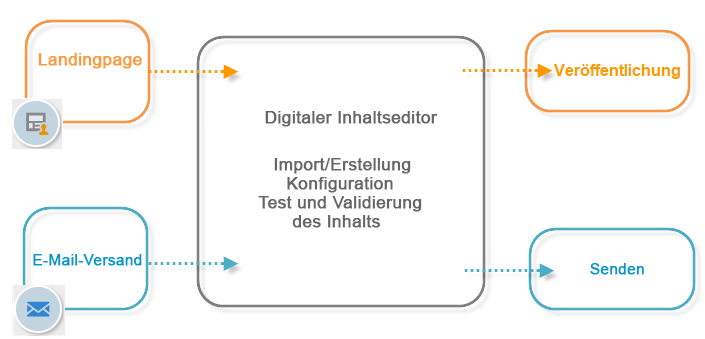

# Über den HTML-Editor von Campaign{#about-campaign-html-editor}

Der **Digital Content Editor (DCE)** ist ein HTML-Inhaltseditor, mit dem Sie Vorlagen oder Inhalte im HTML-Format in Adobe Campaign einfach erstellen oder ändern können.

Mit dem Digital Content Editor können Sie Seitenelemente einfügen und formatieren sowie Datenbankfelder Elementen einer HTML-Seite zuordnen. Der Digital Content Editor ist standardmäßig verfügbar, wenn eine Seite für eine Webanwendung oder ein Versand mithilfe einer Vorlage erstellt wird, in der der DCE aktiv ist.

>[!NOTE]
>
>Mit dem DCE können Sie ausschließlich die in diesem Abschnitt aufgeführten Aktionen ausführen.
>
>Wenn Sie serverseitigen JavaScript-Code hinzufügen möchten, sollten Sie dafür Gestaltungsbausteine verwenden. Weiterführende Informationen zur Erstellung und Änderung von Gestaltungsbausteinen finden Sie auf [dieser Seite](../../delivery/using/personalization-blocks.md).

>[!CAUTION]
>
>Aus Datenschutzgründen empfehlen wir die Verwendung von HTTPS für alle externen Ressourcen.

## Allgemeine Verwendung des Digital Content Editors {#content-editor-general-operation}

Dieser Abschnitt enthält die wichtigsten Schritte zum Bearbeiten und Hochladen von Inhalten, die im Rahmen einer Webanwendung und eines Versands mit dem DCE bearbeitet wurden.

Allgemein gilt:

Gehen Sie zur Erstellung einer Webanwendung wie folgt vor:

* Erstellen Sie eine Webanwendung. Weitere Informationen hierzu finden Sie unter [Landingpage erstellen](../../web/using/creating-a-landing-page.md).
* Wählen Sie vorhandenen Inhalt aus oder erstellen Sie Inhalt aus einer Standardvorlage; weiterführende Informationen dazu finden Sie unter [Vorlagenverwaltung](../../web/using/template-management.md).
* Bearbeiten und konfigurieren Sie Inhalte; weiterführende Informationen dazu finden Sie unter [Bearbeiten von Inhalten](../../web/using/editing-content.md).
* Publizieren Sie die Webanwendung; weiterführende Informationen dazu finden Sie unter [Publizieren des Inhalts](../../web/using/creating-a-landing-page.md#step-3---publishing-content) und auf [dieser Seite](../../web/using/publishing-a-web-form.md#managing-web-forms-delivery-and-tracking).

>[!NOTE]
>
>Ein vollständiges Beispiel für die Implementierung des DCE im Rahmen einer Webanwendung finden Sie unter [Landingpage erstellen](../../web/using/creating-a-landing-page.md).

Gehen Sie zur Erstellung eines E-Mail-Versands wie folgt vor:

* Erstellen Sie einen Versand aus einer Vorlage vom Typ „E-Mail“, in der der DCE aktiv ist.
* Wählen Sie vorhandenen Inhalt aus oder erstellen Sie Inhalt aus einer Standardvorlage.
* Bearbeiten und konfigurieren Sie den Online-Inhalt.
* Führen Sie den Versand durch. Weitere Informationen hierzu finden Sie in [diesem Abschnitt](../../delivery/using/steps-about-delivery-creation-steps.md).

>[!NOTE]
>
>Ein vollständiges Beispiel für die Implementierung des DCE im Rahmen eines E-Mail-Versands finden Sie in [diesem Anwendungsbeispiel](../../web/using/use-case--creating-an-email-delivery.md).

