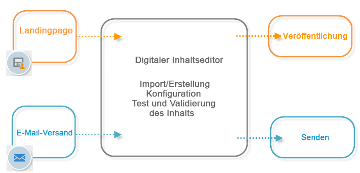

# Erste Schritte mit dem Campaign-HTML-Editor{#about-campaign-html-editor}

Der **Digital Content Editor (DCE)** ist ein HTML-Inhaltseditor, mit dem Sie Inhalte oder Vorlagen im HTML-Format in Adobe Campaign einfach erstellen können.

Mit dem Digital Content Editor können Sie Seitenelemente einfügen und formatieren und Datenbankfelder Elementen einer HTML-Seite zuordnen. Dieser Editor ist verfügbar, wenn Sie eine Seite für eine Web-Anwendung oder Sendungen anhand einer DCE-Vorlage erstellen.

>[!NOTE]
>
>Wenn Sie Server-seitigen JavaScript-Code hinzufügen müssen, verwenden Sie Gestaltungsbausteine. Weitere Informationen finden Sie in der [Dokumentation zu Campaign v8](https://experienceleague.adobe.com/docs/campaign/campaign-v8/send/personalize/personalization-blocks.html?lang=de){target="_blank"}.

>[!CAUTION]
>
>Alle externen Ressourcen müssen mit einer HTTPS-URL referenziert werden.

## Wichtige Schritte zur Verwendung des Digital Content Editors {#content-editor-general-operation}

In diesem Abschnitt werden die wichtigsten Schritte zum Bearbeiten und Hochladen von mit dem DCE bearbeiteten Inhalten im Kontext einer Web-Anwendung und des Versand-Designs beschrieben.

Allgemein gilt:

Um eine einfache **Web-Anwendung** zu erstellen, müssen Sie folgende Schritte ausführen:

1. Web-Anwendung erstellen – [Weitere Informationen](creating-a-landing-page.md)
1. Wählen Sie vorhandenen Inhalt aus oder erstellen Sie Inhalt aus einer Standardvorlage – [Weitere Informationen](template-management.md).
1. Inhalt bearbeiten und konfigurieren – [Weitere Informationen](editing-content.md)
1. Web-Anwendung veröffentlichen – [Weitere Informationen](creating-a-landing-page.md#step-3---publishing-content)

>[!NOTE]
>
>Ein vollständiges Implementierungsbeispiel im Kontext einer Web-Anwendung finden Sie in [diesem Abschnitt](creating-a-landing-page.md).

Um einen **E-Mail-Versand** zu erstellen, müssen Sie folgende Schritte ausführen:

1. Versand aus einer DCE-Vorlage erstellen – [Weitere Informationen](use-case-creating-an-email-delivery.md)
1. Wählen Sie vorhandenen Inhalt aus oder erstellen Sie Inhalt aus einer [Standardvorlage](template-management.md).
1. Bearbeiten und konfigurieren Sie den Online-Inhalt.
1. Führen Sie den Versand durch. Weitere Informationen finden Sie in der [Dokumentation zu Campaign v8](https://experienceleague.adobe.com/docs/campaign/campaign-v8/send/create-message.html?lang=de){target="_blank"}

>[!NOTE]
>
>Ein vollständiges Implementierungsbeispiel im Kontext eines E-Mail-Versands finden Sie in [diesem Anwendungsfall](use-case-creating-an-email-delivery.md).
