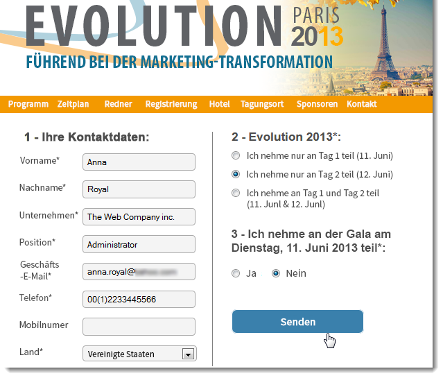
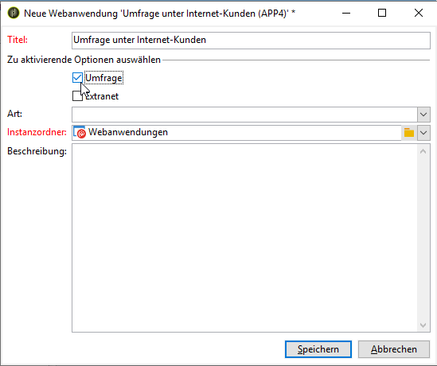

# Erste Schritte mit Web-Anwendungen{#about-web-applications}

Adobe Campaign ermöglicht Ihnen, mit Daten aus der Datenbank dynamische und interaktive Webanwendungen zu erstellen und zu veröffentlichen, wobei die Inhalte auf die jeweiligen Benutzerrechte abgestimmt sind.

Sie können Seiten erstellen (z. B. ein Bearbeitungsformular in einem Extranet oder Benachrichtigungsformulare, die Daten aus der Datenbank mit Tabellen, Diagrammen, Formularen usw. beinhalten). Mit dieser Funktion können Sie Webseiten entwerfen und posten, auf denen Benutzer Daten suchen oder eingeben können.

Dabei kann es sich um ein Anmeldeformular handeln, dessen Felder wie unten dargestellt mit Daten aus der Adobe Campaign-Datenbank vorausgefüllt wurden:

Dieses Kapitel bietet einen Überblick über die Verwaltung von Webanwendungen.

>[!NOTE]
>
>Informationen zur Optimierung der Sicherheit von Webanwendungen finden Sie in der [Checkliste für Sicherheit und Datenschutz](https://helpx.adobe.com/de/campaign/kb/acc-security.html).

>[!CAUTION]
>
>Aus Datenschutzgründen empfehlen wir die Verwendung von HTTPS für alle externen Ressourcen.

## Webanwendungsbereich {#web-application-scope}

Webanwendungen in Adobe Campaign bieten folgende Funktionen:

* Erstellung eines Formulars mit mehreren Seiten. Weiterführende Informationen hierzu finden Sie auf dieser [Seite](../../web/using/about-web-forms.md).
* Mehrsprachige Umfrageverwaltung mit einem integrierten Übersetzungs-Tool. Weiterführende Informationen hierzu finden Sie auf dieser [Seite](../../web/using/translating-a-web-application.md).
* Grafische Benutzeroberfläche zur Seitenverwaltung, mehrspaltiges Seiten-Layout. Weiterführende Informationen hierzu finden Sie auf dieser [Seite](../../web/using/designing-a-web-application.md).
* Personalisierte Darstellung und Feldposition. Weiterführende Informationen hierzu finden Sie auf dieser [Seite](../../web/using/editing-content.md#adding-personalization-content).
* Anzeige von Umfragefeldern entsprechend den Antworten. Weiterführende Informationen hierzu finden Sie auf dieser [Seite](../../web/using/form-rendering.md#defining-fields-conditional-display).
* Zufällige Anzeige von Fragen. Weiterführende Informationen hierzu finden Sie auf dieser [Seite](../../web/using/building-a-survey.md#adding-questions).
* Bedingte Anzeige von Seiten. Weiterführende Informationen hierzu finden Sie auf dieser [Seite](../../web/using/defining-web-forms-page-sequencing.md#conditional-page-display).
* Informationsprüfung vor der Validierung abhängig vom erwarteten Datentyp (Zahl, E-Mail-Adresse, Datum etc.) und von den Pflichtfeldern. Weiterführende Informationen hierzu finden Sie auf dieser [Seite](../../web/using/form-rendering.md#defining-control-settings).
* Einladungen oder Benachrichtigungen per E-Mail. Weiterführende Informationen hierzu finden Sie auf dieser [Seite](../../web/using/publishing-a-web-form.md#delivering-a-form-via-email).
* Personalisierung von Fehler- und Beendigungsnachrichten. Weiterführende Informationen hierzu finden Sie auf dieser [Seite](../../web/using/defining-web-forms-properties.md#setting-up-an-error-page).
* Verwendung von Bildern, Videos, Hypertext-Links, Captcha etc. Weiterführende Informationen hierzu finden Sie auf dieser [Seite](../../web/using/editing-content.md).
* Überwachung der Antworten in Echtzeit Weiterführende Informationen hierzu finden Sie auf dieser [Seite](../../web/using/publish--track-and-use-collected-data.md#response-tracking).

Das optionale Modul zur Umfrageerstellung (**Umfrage**) bietet die folgenden zusätzlichen Funktionen:

* Dynamische Erweiterung der Datenbank: Erstellung von Antworten, die nicht in der ursprünglichen Datenvorlage enthalten sind. Weiterführende Informationen hierzu finden Sie auf dieser [Seite](../../web/using/managing-answers.md#storing-collected-answers).
* Erstellung spezieller Berichte Weiterführende Informationen hierzu finden Sie auf dieser [Seite](../../web/using/publish--track-and-use-collected-data.md#reports-on-surveys).

Gegenüber Webanwendungen verfügen Umfragen über eine vereinfachte grafische Benutzeroberfläche mit weniger Steuerelementen zur Bearbeitung.

>[!NOTE]
>
>Weitere Informationen zu Umfragen finden Sie in [diesem Abschnitt](../../web/using/about-surveys.md).
>
>Die allgemeinen Funktionen von Webformularen in Adobe Campaign werden in [diesem Abschnitt](../../web/using/about-web-forms.md) beschrieben.

## Implementierung von Webanwendungen {#web-application-implementation}

Gehen Sie wie folgt vor, um eine Webanwendung zu erstellen und zu veröffentlichen:

1. Erstellen Sie den Inhalt (Felder, Listen, Tabellen, Diagramme etc.).

   Sehen Sie sich dazu auch den Abschnitt zu den Feldern an, die für Formulare zur Verfügung stehen. Alle diese Felder sind auch für Webanwendungen verfügbar. Diese Informationen finden Sie auf [dieser Seite](../../web/using/adding-fields-to-a-web-form.md).

1. Sie können nach Bedarf die Schritte zum Vorausfüllen, Testen und Speichern hinzufügen und das Zugriffskontrollsystem konfigurieren (hauptsächlich für Extranet-Publikationen).
1. Publizieren Sie die Webanwendung, um sie im Extranet oder in Adobe Campaign verfügbar zu machen.

## Erstkonfiguration von Webanwendungen {#web-application-initial-configuration}

Die Erstellung von Webanwendungen erfolgt über den Link **[!UICONTROL Webanwendungen]** in den Tabs **[!UICONTROL Kampagnen]** und **[!UICONTROL Profile und Zielgruppen]**.

Gespeichert werden Webanwendungen im Knoten **[!UICONTROL Ressourcen > Online > Webanwendungen]** des Adobe Campaign-Baums. Konfigurationen befinden sich in folgenden Ordnern:

* **[!UICONTROL Administration > Konfiguration > Formular-Rendering]**: enthält die Rendering-Vorlagen für Webformulare (Anwendungen und Umfragen). Die Vorlage ermöglicht die Erstellung eines Formulars. Zusätzlich wird ein CSS-Stylesheet verwendet, das auf Vorlagenebene überschrieben werden kann. Weiterführende Informationen dazu finden Sie auf [dieser Seite](../../web/using/form-rendering.md#selecting-the-form-rendering-template).
* **[!UICONTROL Ressourcen > Vorlagen > Webanwendungsvorlagen]**: enthält Formularvorlagen. Diese sind zur Erstellung eines Formulars oder einer Webanwendung erforderlich.

## Webanwendungsvorlagen {#web-application-templates}

Standardmäßig bietet Adobe Campaign für jede verfügbare Webanwendung eine Vorlage.

>[!NOTE]
>
>Sie können eine vorhandene Webanwendung in eine Vorlage konvertieren. Wählen Sie dazu das Formular aus und klicken Sie mit der rechten Maustaste darauf. Wählen Sie **[!UICONTROL Aktionen > Als Vorlage speichern...]** aus.

Neue Vorlagen werden im Adobe Campaign-Baum im Knoten **[!UICONTROL Ressourcen > Vorlagen > Webanwendungsvorlagen]** erstellt.

Im Erstellungsassistenten können Sie wie unten dargestellt die zu aktivierenden Optionen auswählen.

>[!CAUTION]
>
>Die verfügbaren Anwendungen hängen von Ihren Optionen und Modulen ab. Nähere Informationen dazu entnehmen Sie bitte Ihrem Lizenzvertrag.

