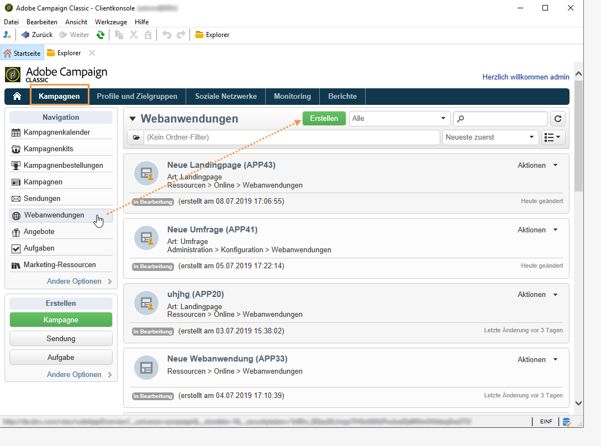
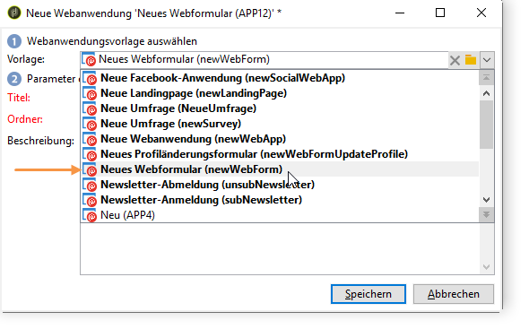
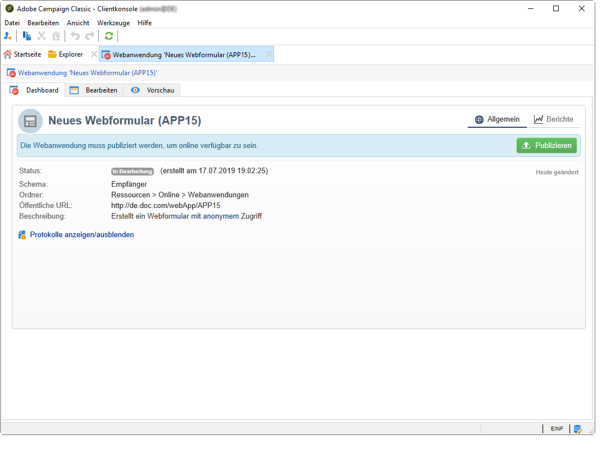
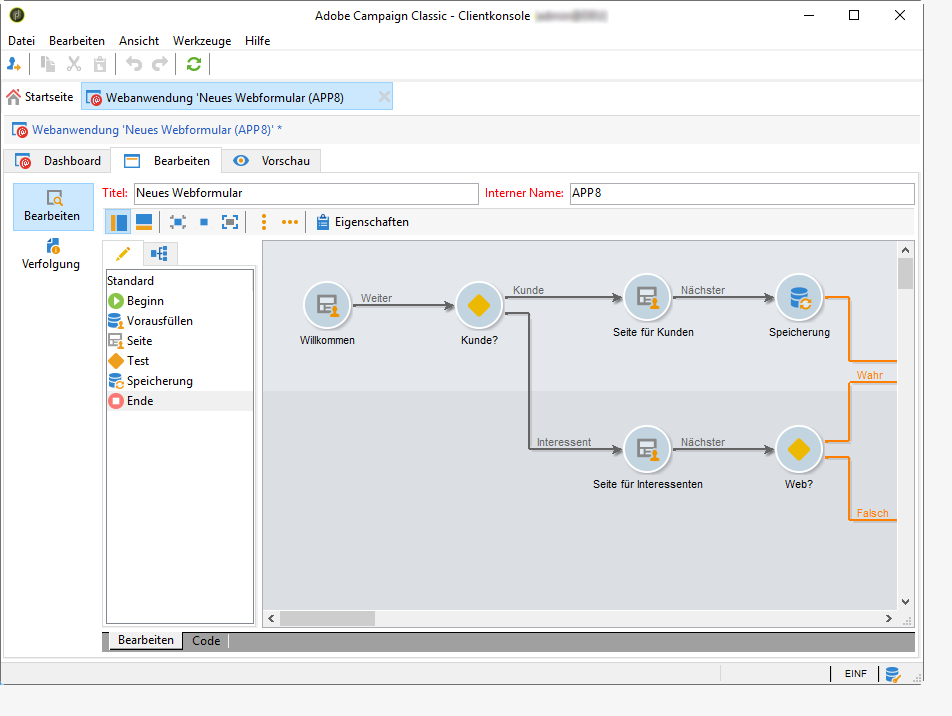
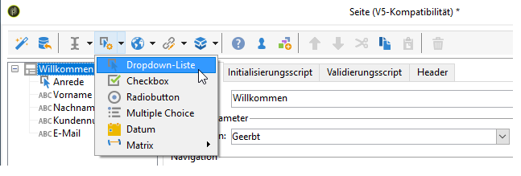
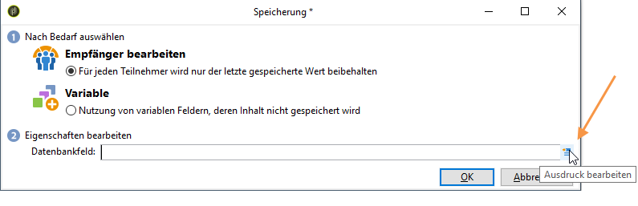
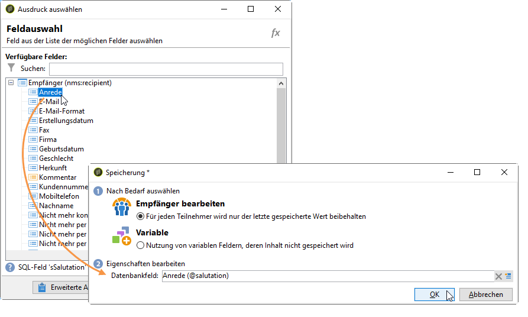

# Über Webformulare{#about-web-forms}

Adobe Campaign verfügt über ein grafisches Modul zur Definition und Publikation von Webformularen. Damit können Sie Seiten erstellen, die Eingabe- und Auswahlfelder sowie Daten aus der Datenbank enthalten. Daraus lassen sich wiederum Webseiten zusammenstellen und veröffentlichen, in denen Benutzer Informationen anzeigen oder eingeben können.

In diesem Kapitel erfahren Sie, wie Webformulare erstellt und verwaltet werden, wie Felder und Seiten verwaltet werden und wie der Speichermodus funktioniert.

>[!CAUTION]
>
>Aus Datenschutzgründen empfehlen wir die Verwendung von HTTPS für alle externen Ressourcen.

## Schritte zur Erstellung eines Webformulars {#steps-for-creating-a-web-form}

In diesem Abschnitt werden die Schritte zur Erstellung eines Formulars vom Typ **webForm** in Adobe Campaign sowie die verfügbaren Optionen und Konfigurationen beschrieben. Mit Adobe Campaign können Sie dieses Webformular Benutzern zur Verfügung stellen sowie Antworten erfassen und in der Datenbank archivieren.

>[!CAUTION]
>
>Zur Konfiguration von Webanwendungen und Webformularen benötigen Sie eine vertikale Auflösung von mindestens 900 Pixel (z. B.: 1.600 x 900).

Der Zugriff auf Webformulare erfolgt über das Menü „Webanwendungen“ auf dem Tab **Kampagnen**. In der Baumstruktur von Adobe Campaign befinden sie sich unter dem Knoten **[!UICONTROL Ressourcen > Online > Webanwendungen]**.

Um ein Webformular zu erstellen, klicken Sie oberhalb der Webanwendungen-Liste auf die Schaltfläche **[!UICONTROL Erstellen]**.

Wählen Sie die Webformularvorlage aus (standardmäßig **[!UICONTROL newWebForm]**).

Damit gelangen Sie zum Dashboard des Formulars.

Im Tab **[!UICONTROL Bearbeiten]** können Sie den Inhalt erstellen.

Um das Webformular zu definieren und zu konfigurieren, gehen Sie folgendermaßen vor:

* Erstellen Sie zunächst die erforderlichen Seiten und Steuerelemente: Eingabefelder, Dropdown-Listen, HTML-Inhalte etc.

   Dieser Schritt wird weiter unten genauer beschrieben.

* Definieren Sie die Seitenreihenfolge und legen Sie für die Anzeige der Seiten Bedingungen fest.

   Dieser Schritt wird unter [Seitenreihenfolge eines Webformulars definieren](../../web/using/defining-web-forms-page-sequencing.md) beschrieben.

* Übersetzen Sie den Inhalt bei Bedarf.

   Dieser Schritt wird unter [Webformular übersetzen](../../web/using/translating-a-web-form.md) beschrieben.

## Über die Erstellung von Webformularen {#about-web-forms-designing}

Die Seiten des Formulars werden mit einem bestimmten Editor erstellt, mit dem Sie Eingabebereiche (Text), Auswahlfelder (Listen, Checkboxes usw.) und statische Elemente (Bilder, HTML-Inhalte usw.) definieren und konfigurieren können. Diese können in Containern gruppiert und ihr Layout an Ihren Bedarf angepasst werden (weitere Informationen finden Sie unter [Container erstellen](../../web/using/defining-web-forms-layout.md#creating-containers)).

In den folgenden Abschnitten wird beschrieben, wie Sie den Inhalt und das Layout von Formularen definieren.

* [Felder zu einem Webformular hinzufügen](../../web/using/adding-fields-to-a-web-form.md),
* [HTML-Inhalt einfügen](../../web/using/static-elements-in-a-web-form.md#inserting-html-content),
* [Statische Elemente in einem Webformular](../../web/using/static-elements-in-a-web-form.md),
* [Layout eines Webformulars definieren](../../web/using/defining-web-forms-layout.md).

>[!NOTE]
>
>* Während Sie die Seite erstellen, können Sie sich im Tab **[!UICONTROL Vorschau]** das endgültige Rendering ansehen. Um Änderungen zu übernehmen, muss das Formular zuerst gespeichert werden. Etwaige Fehler werden im Tab **[!UICONTROL Log]** angezeigt.
>* Damit die Anzeige der Seiten und die Speicherung der Informationen in der richtigen Reihenfolge ablaufen, aktivieren Sie im Webformular den Debug-Modus. Gehen Sie dazu in den Untertab **[!UICONTROL Vorschau]** und aktivieren Sie die Option **[!UICONTROL Debug-Modus aktivieren]**: Alle erfassten Informationen und möglichen Ausführungsfehler werden am unteren Rand einer jeden Seite angezeigt.

>

### Symbole der Symbolleiste verwenden {#using-the-icons-in-the-toolbar}

Sie können ein Eingabefeld auch mithilfe der Symbole in der Symbolleiste oder eines Rechtsklicks einfügen.

Wählen Sie in diesem Fall den Typ des hinzuzufügenden Feldes und den Antwort-Speichermodus aus.

Klicken Sie auf **[!UICONTROL OK]**, um die Auswahl zu bestätigen.

