<?xml version="1.0" encoding="UTF-8"?>
<xliff xmlns="urn:oasis:names:tc:xliff:document:1.2" xmlns:okp="okapi-framework:xliff-extensions" xmlns:its="http://www.w3.org/2005/11/its" xmlns:itsxlf="http://www.w3.org/ns/its-xliff/" version="1.2" its:version="2.0">
<file original="help/web/using/adding-fields-to-a-web-form.md.mdsc" source-language="en-US" target-language="en-XX" datatype="x-text/markdown">
<body>
<trans-unit id="tu186" xml:space="preserve">
<source xml:lang="en-US">https://experienceleague.adobe.com/en/tools/campaign-api</source>
<target xml:lang="en-XX">https://experienceleague.adobe.com/de/tools/campaign-api</target>
</trans-unit>
<trans-unit id="tu1" restype="x-YAML_METADATA_HEADER_VALUE" xml:space="preserve">
<source xml:lang="en-US">Add fields to a web form</source>
<target xml:lang="en-XX">Hinzufügen von Feldern zu einem Web-Formular</target>
</trans-unit>
<trans-unit id="tu2" restype="x-YAML_METADATA_HEADER_VALUE" xml:space="preserve">
<source xml:lang="en-US">Add fields to a web form</source>
<target xml:lang="en-XX">Hinzufügen von Feldern zu einem Web-Formular</target>
</trans-unit>
<trans-unit id="tu3" xml:space="preserve">
<source xml:lang="en-US">Also applies to v8</source>
<target xml:lang="en-XX">Gilt auch für v8</target>
</trans-unit>
<trans-unit id="tu4" xml:space="preserve">
<source xml:lang="en-US">Also applies to Campaign v8</source>
<target xml:lang="en-XX">Gilt auch für Campaign v8</target>
</trans-unit>
<trans-unit id="tu5" xml:space="preserve">
<source xml:lang="en-US">Add fields to a web form</source>
<target xml:lang="en-XX">Hinzufügen von Feldern zu einem Web-Formular</target>
</trans-unit>
<trans-unit id="tu6" xml:space="preserve">
<source xml:lang="en-US">In a Web form, fields enable users to enter information and select options. Web forms can offer input fields, selection fields, static and advanced content (captchas, subscriptions, etc.).</source>
<target xml:lang="en-XX">Über Felder in einem Web-Formular können Benutzende Informationen eingeben und Optionen auswählen. Web-Formulare können Eingabefelder, Auswahlfelder sowie statische und erweiterte Inhalte (Captchas, Abonnements usw.) enthalten.</target>
</trans-unit>
<trans-unit id="tu7" xml:space="preserve">
<source xml:lang="en-US">When you use the assistant to add fields, the field type is detected automatically based on the selected field or storage variable. You can edit it using the <ph id="1" ctype="x-STRONG_EMPHASIS">**[!UICONTROL </ph>Type<ph id="3" ctype="x-LINK_REF">]**</ph> drop-down box in the <ph id="5" ctype="x-STRONG_EMPHASIS">**[!UICONTROL </ph>General<ph id="7" ctype="x-LINK_REF">]**</ph> tab.</source>
<target xml:lang="en-XX">Wenn Sie über den Assistenten Felder hinzufügen, wird der Feldtyp automatisch auf der Basis des ausgewählten Felds oder der Speichervariablen erkannt. Den Feldtyp können Sie im Tab <ph id="5" ctype="x-STRONG_EMPHASIS">**[!UICONTROL </ph>Allgemein<ph id="7" ctype="x-LINK_REF">]**</ph> über das Dropdown-Feld <ph id="1" ctype="x-STRONG_EMPHASIS">**[!UICONTROL </ph>Typ<ph id="3" ctype="x-LINK_REF">]**</ph> bearbeiten.</target>
</trans-unit>
<trans-unit id="tu8" xml:space="preserve">
<source xml:lang="en-US"><ph id="1" ctype="x-IMAGE">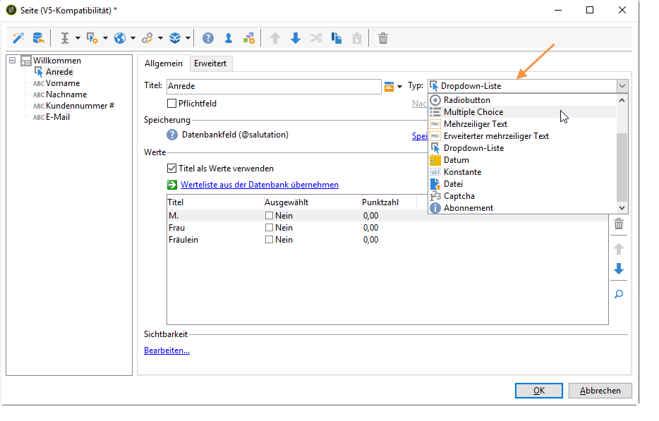</ph></source>
<target xml:lang="en-XX"><ph id="1" ctype="x-IMAGE"></ph></target>
</trans-unit>
<trans-unit id="tu9" xml:space="preserve">
<source xml:lang="en-US">When using the buttons in the toolbar, select the type of field you want to add.</source>
<target xml:lang="en-XX">Wenn Sie die Schaltflächen in der Symbolleiste verwenden, wählen Sie den Typ des Felds aus, das Sie hinzufügen möchten.</target>
</trans-unit>
<trans-unit id="tu10" xml:space="preserve">
<source xml:lang="en-US">The following types of field are available:</source>
<target xml:lang="en-XX">Folgende Feldtypen sind verfügbar:</target>
</trans-unit>
<trans-unit id="tu11" xml:space="preserve">
<source xml:lang="en-US">Text/number input. See <ph id="1" ctype="x-LINK">[</ph>Adding input fields<ph id="2" ctype="x-LINK">](#adding-input-fields)</ph>.</source>
<target xml:lang="en-XX">Text-/Zahleneingabe. Siehe <ph id="1" ctype="x-LINK">[</ph>Eingabefelder hinzufügen<ph id="2" ctype="x-LINK">](#adding-input-fields)</ph>.</target>
</trans-unit>
<trans-unit id="tu12" xml:space="preserve">
<source xml:lang="en-US">Drop-down list selection. See <ph id="1" ctype="x-LINK">[</ph>Adding drop-down lists<ph id="2" ctype="x-LINK">](#adding-drop-down-lists)</ph>.</source>
<target xml:lang="en-XX">Auswahl per Dropdown-Liste. Siehe <ph id="1" ctype="x-LINK">[</ph>Dropdown-Listen hinzufügen<ph id="2" ctype="x-LINK">](#adding-drop-down-lists)</ph>.</target>
</trans-unit>
<trans-unit id="tu13" xml:space="preserve">
<source xml:lang="en-US">Multiple choice via checkboxes. See <ph id="1" ctype="x-LINK">[</ph>Adding checkboxes<ph id="2" ctype="x-LINK">](#adding-checkboxes)</ph>.</source>
<target xml:lang="en-XX">Multiple Choice über Checkboxes. Siehe <ph id="1" ctype="x-LINK">[</ph>Checkboxes hinzufügen <ph id="2" ctype="x-LINK">](#adding-checkboxes)</ph>.</target>
</trans-unit>
<trans-unit id="tu14" xml:space="preserve">
<source xml:lang="en-US">Exclusive selection via radio buttons. See <ph id="1" ctype="x-LINK">[</ph>Adding radio buttons<ph id="2" ctype="x-LINK">](#adding-radio-buttons)</ph>.</source>
<target xml:lang="en-XX">Auswahl über Radiobuttons. Siehe <ph id="1" ctype="x-LINK">[</ph>Radiobuttons hinzufügen<ph id="2" ctype="x-LINK">](#adding-radio-buttons)</ph>.</target>
</trans-unit>
<trans-unit id="tu15" xml:space="preserve">
<source xml:lang="en-US">Vote in an option grid. See <ph id="1" ctype="x-LINK">[</ph>Adding grids<ph id="2" ctype="x-LINK">](#adding-grids)</ph>.</source>
<target xml:lang="en-XX">Abstimmungsoptionen in einer Tabelle. Siehe <ph id="1" ctype="x-LINK">[</ph>Tabellen hinzufügen<ph id="2" ctype="x-LINK">](#adding-grids)</ph>.</target>
</trans-unit>
<trans-unit id="tu16" xml:space="preserve">
<source xml:lang="en-US">Numbers and dates. See <ph id="1" ctype="x-LINK">[</ph>Adding dates and numbers<ph id="2" ctype="x-LINK">](#adding-dates-and-numbers)</ph>.</source>
<target xml:lang="en-XX">Zahlen und Daten. Siehe <ph id="1" ctype="x-LINK">[</ph>Datum und Zahlen hinzufügen<ph id="2" ctype="x-LINK">](#adding-dates-and-numbers)</ph>.</target>
</trans-unit>
<trans-unit id="tu17" xml:space="preserve">
<source xml:lang="en-US">Subscription/unsubscription to an information service. See <ph id="1" ctype="x-LINK">[</ph>Subscription checkboxes<ph id="2" ctype="x-LINK">](#subscription-checkboxes)</ph>.</source>
<target xml:lang="en-XX">Anmeldung/Abmeldung für einen Informationsdienst. Siehe <ph id="1" ctype="x-LINK">[</ph>Abonnement-Checkboxes<ph id="2" ctype="x-LINK">](#subscription-checkboxes)</ph>.</target>
</trans-unit>
<trans-unit id="tu18" xml:space="preserve">
<source xml:lang="en-US">Captcha validation. See <ph id="1" ctype="x-LINK">[</ph>Inserting a captcha<ph id="2" ctype="x-LINK">](#inserting-a-captcha)</ph>.</source>
<target xml:lang="en-XX">Captcha-Prüfung. Siehe <ph id="1" ctype="x-LINK">[</ph>Captcha einfügen<ph id="2" ctype="x-LINK">](#inserting-a-captcha)</ph>.</target>
</trans-unit>
<trans-unit id="tu19" xml:space="preserve">
<source xml:lang="en-US">Download button. <ph id="1" ctype="x-LINK">[</ph>Uploading a file<ph id="2" ctype="x-LINK">](#uploading-a-file)</ph>.</source>
<target xml:lang="en-XX">Schaltfläche „Herunterladen“. <ph id="1" ctype="x-LINK">[</ph>Datei hochladen<ph id="2" ctype="x-LINK">](#uploading-a-file)</ph>.</target>
</trans-unit>
<trans-unit id="tu20" xml:space="preserve">
<source xml:lang="en-US">Hidden constant. See <ph id="1" ctype="x-LINK">[</ph>Inserting a hidden constant<ph id="2" ctype="x-LINK">](#inserting-a-hidden-constant)</ph>.</source>
<target xml:lang="en-XX">Ausgeblendete Konstante. Siehe <ph id="1" ctype="x-LINK">[</ph>Ausgeblendete Konstante einfügen<ph id="2" ctype="x-LINK">](#inserting-a-hidden-constant)</ph>.</target>
</trans-unit>
<trans-unit id="tu21" xml:space="preserve">
<source xml:lang="en-US">Please specify the response storage mode: update a field in the database (stores only the last value saved) or store in a variable (the answer is not stored). For more on this, refer to <ph id="1" ctype="x-LINK">[</ph>Response storage fields<ph id="2" ctype="x-LINK">](web-forms-answers.md#response-storage-fields)</ph>.</source>
<target xml:lang="en-XX">Spezifizieren Sie den Speichermodus für Antworten: ein Feld in der Datenbank aktualisieren (nur der zuletzt gespeicherte Wert wird behalten) oder in einer Variablen speichern (die Antwort wird nicht aufbewahrt). Weiterführende Informationen finden Sie im Abschnitt <ph id="1" ctype="x-LINK">[</ph>Speicherfelder für Antworten<ph id="2" ctype="x-LINK">](web-forms-answers.md#response-storage-fields)</ph>.</target>
</trans-unit>
<trans-unit id="tu22" xml:space="preserve">
<source xml:lang="en-US"><ph id="1" ctype="x-regxph" equiv-text="[!NOTE">[!NOTE]</ph></source>
<target xml:lang="en-XX"><ph id="1" ctype="x-regxph" equiv-text="[!NOTE">[!NOTE]</ph></target>
</trans-unit>
<trans-unit id="tu23" xml:space="preserve">
<source xml:lang="en-US">By default, the field is inserted at the bottom of the current tree. Use the arrows in the toolbar to move it up or down.</source>
<target xml:lang="en-XX">Standardmäßig wird das Feld unten im aktuellen Baum eingefügt. Mit den Pfeilen in der Symbolleiste kann es nach oben oder unten bewegt werden.</target>
</trans-unit>
<trans-unit id="tu24" xml:space="preserve">
<source xml:lang="en-US">Field creation assistant</source>
<target xml:lang="en-XX">Assistent zur Felderstellung</target>
</trans-unit>
<trans-unit id="tu25" xml:space="preserve">
<source xml:lang="en-US">For each page of the form, you can add a field via the first button in the toolbar. To do this, go to the <ph id="1" ctype="x-STRONG_EMPHASIS">**[!UICONTROL </ph>Add using the assistant<ph id="3" ctype="x-LINK_REF">]**</ph> menu.</source>
<target xml:lang="en-XX">Über die erste Schaltfläche der Symbolleiste können Sie Felder in jede Formularseite einfügen. Gehen Sie dazu zum Menü <ph id="1" ctype="x-STRONG_EMPHASIS">**[!UICONTROL </ph>Mithilfe des Assistenten hinzufügen<ph id="3" ctype="x-LINK_REF">]**</ph>.</target>
</trans-unit>
<trans-unit id="tu26" xml:space="preserve">
<source xml:lang="en-US"><ph id="1" ctype="x-IMAGE"></ph></source>
<target xml:lang="en-XX"><ph id="1" ctype="x-IMAGE"></ph></target>
</trans-unit>
<trans-unit id="tu27" xml:space="preserve">
<source xml:lang="en-US">Select the type of field you want to create: you can choose to add a field in the database, a variable or to import a group of fields created in another form and collected in a container.</source>
<target xml:lang="en-XX">Wählen Sie den Typ des zu erstellenden Felds aus: Sie können ein Feld der Datenbank oder eine Variable hinzufügen oder eine Feldergruppe importieren, die in einem anderen Formular erstellt wurde und in einem Container zusammengefasst ist.</target>
</trans-unit>
<trans-unit id="tu28" xml:space="preserve">
<source xml:lang="en-US">Click <ph id="1" ctype="x-STRONG_EMPHASIS">**[!UICONTROL </ph>Next<ph id="3" ctype="x-LINK_REF">]**</ph> and select the storage field or variable, or the container you want to import.</source>
<target xml:lang="en-XX">Wählen Sie <ph id="1" ctype="x-STRONG_EMPHASIS">**[!UICONTROL </ph>Weiter<ph id="3" ctype="x-LINK_REF">]**</ph> und danach das Speicherfeld, die Variable oder den zu importierenden Container aus.</target>
</trans-unit>
<trans-unit id="tu29" xml:space="preserve">
<source xml:lang="en-US"><ph id="1" ctype="x-IMAGE">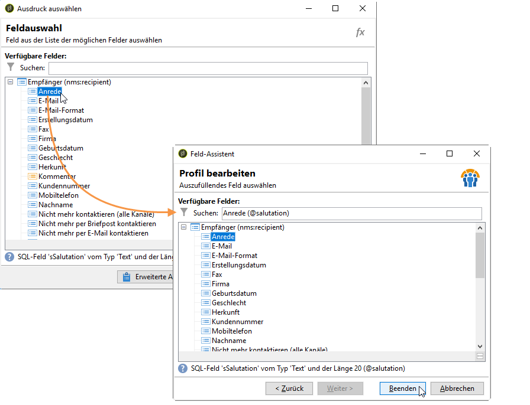</ph></source>
<target xml:lang="en-XX"><ph id="1" ctype="x-IMAGE"></ph></target>
</trans-unit>
<trans-unit id="tu30" xml:space="preserve">
<source xml:lang="en-US">Click <ph id="1" ctype="x-STRONG_EMPHASIS">**[!UICONTROL </ph>Finish<ph id="3" ctype="x-LINK_REF">]**</ph> to insert the selected field into the page.</source>
<target xml:lang="en-XX">Wählen Sie <ph id="1" ctype="x-STRONG_EMPHASIS">**[!UICONTROL </ph>Beenden<ph id="3" ctype="x-LINK_REF">]**</ph> aus, um das ausgewählte Feld in die Seite einzufügen.</target>
</trans-unit>
<trans-unit id="tu31" xml:space="preserve">
<source xml:lang="en-US"><ph id="1" ctype="x-IMAGE">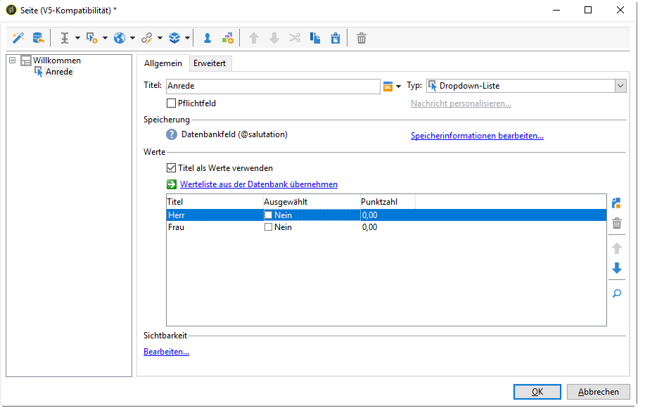</ph></source>
<target xml:lang="en-XX"><ph id="1" ctype="x-IMAGE"></ph></target>
</trans-unit>
<trans-unit id="tu32" xml:space="preserve">
<source xml:lang="en-US">Adding input fields</source>
<target xml:lang="en-XX">Eingabefelder hinzufügen</target>
</trans-unit>
<trans-unit id="tu33" xml:space="preserve">
<source xml:lang="en-US">To add an input field, click the <ph id="1" ctype="x-STRONG_EMPHASIS">**[!UICONTROL </ph>Input control<ph id="3" ctype="x-LINK_REF">]**</ph> button and choose the type of field you want to add.</source>
<target xml:lang="en-XX">Um ein Eingabefeld hinzuzufügen, wählen Sie die Schaltfläche <ph id="1" ctype="x-STRONG_EMPHASIS">**[!UICONTROL </ph>Eingabedialog<ph id="3" ctype="x-LINK_REF">]**</ph> und danach den hinzuzufügenden Feldtyp aus.</target>
</trans-unit>
<trans-unit id="tu34" xml:space="preserve">
<source xml:lang="en-US"><ph id="1" ctype="x-IMAGE">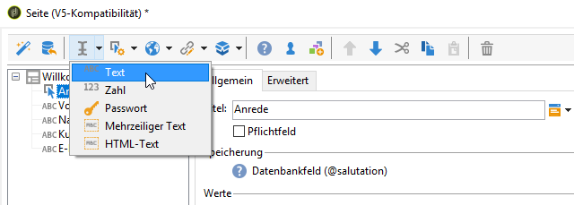</ph></source>
<target xml:lang="en-XX"><ph id="1" ctype="x-IMAGE"></ph></target>
</trans-unit>
<trans-unit id="tu35" xml:space="preserve">
<source xml:lang="en-US">Types of input fields</source>
<target xml:lang="en-XX">Typen von Eingabefeldern</target>
</trans-unit>
<trans-unit id="tu36" xml:space="preserve">
<source xml:lang="en-US">Five different types of text fields can be inserted into a form page:</source>
<target xml:lang="en-XX">Auf einer Formularseite können fünf Typen von Textfeldern eingefügt werden:</target>
</trans-unit>
<trans-unit id="tu37" xml:space="preserve">
<source xml:lang="en-US"><ph id="1" ctype="x-STRONG_EMPHASIS">**</ph>Text<ph id="2" ctype="x-STRONG_EMPHASIS">**</ph>: lets the user enter a text on one line.</source>
<target xml:lang="en-XX"><ph id="1" ctype="x-STRONG_EMPHASIS">**</ph>Text<ph id="2" ctype="x-STRONG_EMPHASIS">**</ph>: ermöglicht dem Benutzer die Texteingabe in einer einzigen Zeile.</target>
</trans-unit>
<trans-unit id="tu38" xml:space="preserve">
<source xml:lang="en-US"><ph id="1" ctype="x-IMAGE">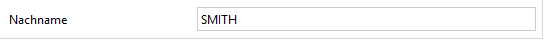</ph></source>
<target xml:lang="en-XX"><ph id="1" ctype="x-IMAGE"></ph></target>
</trans-unit>
<trans-unit id="tu39" xml:space="preserve">
<source xml:lang="en-US"><ph id="1" ctype="x-STRONG_EMPHASIS">**</ph>Number<ph id="2" ctype="x-STRONG_EMPHASIS">**</ph>: lets the user enter a number on one line. for more on this, refer to <ph id="3" ctype="x-LINK">[</ph>Adding numbers<ph id="4" ctype="x-LINK">](#adding-numbers)</ph>.</source>
<target xml:lang="en-XX"><ph id="1" ctype="x-STRONG_EMPHASIS">**</ph>Zahl<ph id="2" ctype="x-STRONG_EMPHASIS">**</ph>: ermöglicht dem Benutzer die Zahleneingabe in einer einzigen Zeile. Weitere Informationen hierzu finden Sie im Abschnitt <ph id="3" ctype="x-LINK">[</ph>Zahlen hinzufügen<ph id="4" ctype="x-LINK">](#adding-numbers)</ph>.</target>
</trans-unit>
<trans-unit id="tu40" xml:space="preserve">
<source xml:lang="en-US">When the page is approved, field content is checked to make sure the value entered is compatible with the field. For more on this, refer to <ph id="1" ctype="x-LINK">[</ph>Defining control settings<ph id="2" ctype="x-LINK">](form-rendering.md#defining-control-settings)</ph>.</source>
<target xml:lang="en-XX">Bei der Validierung der Seite wird der Feldinhalt geprüft, um sicherzugehen, dass der eingegebene Wert mit dem Feld kompatibel ist. Weiterführende Informationen finden Sie unter <ph id="1" ctype="x-LINK">[</ph>Kontrolleinstellungen definieren<ph id="2" ctype="x-LINK">](form-rendering.md#defining-control-settings)</ph>.</target>
</trans-unit>
<trans-unit id="tu41" xml:space="preserve">
<source xml:lang="en-US"><ph id="1" ctype="x-STRONG_EMPHASIS">**</ph>Password<ph id="2" ctype="x-STRONG_EMPHASIS">**</ph>: lets the user enter text on a single line. During text entry, the characters are replaced by periods:</source>
<target xml:lang="en-XX"><ph id="1" ctype="x-STRONG_EMPHASIS">**</ph>Passwort<ph id="2" ctype="x-STRONG_EMPHASIS">**</ph>: ermöglicht der Benutzerin bzw. dem Benutzer Text in einer einzigen Zeile einzugeben. Während der Texteingabe werden die Zeichen durch Punkte ersetzt:</target>
</trans-unit>
<trans-unit id="tu42" xml:space="preserve">
<source xml:lang="en-US"><ph id="1" ctype="x-IMAGE">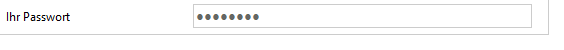</ph></source>
<target xml:lang="en-XX"><ph id="1" ctype="x-IMAGE"></ph></target>
</trans-unit>
<trans-unit id="tu43" xml:space="preserve">
<source xml:lang="en-US"><ph id="1" ctype="x-regxph" equiv-text="[!CAUTION">[!CAUTION]</ph></source>
<target xml:lang="en-XX"><ph id="1" ctype="x-regxph" equiv-text="[!CAUTION">[!CAUTION]</ph></target>
</trans-unit>
<trans-unit id="tu44" xml:space="preserve">
<source xml:lang="en-US">Passwords are stored unencrypted in the database.</source>
<target xml:lang="en-XX">Passwörter werden unverschlüsselt in der Datenbank gespeichert.</target>
</trans-unit>
<trans-unit id="tu45" xml:space="preserve">
<source xml:lang="en-US"><ph id="1" ctype="x-STRONG_EMPHASIS">**</ph>Multi-line text<ph id="2" ctype="x-STRONG_EMPHASIS">**</ph>: lets the user enter text on several lines.</source>
<target xml:lang="en-XX"><ph id="1" ctype="x-STRONG_EMPHASIS">**</ph>Mehrzeiliger Text<ph id="2" ctype="x-STRONG_EMPHASIS">**</ph>: ermöglicht dem Benutzer die Texteingabe in mehreren Zeilen.</target>
</trans-unit>
<trans-unit id="tu46" xml:space="preserve">
<source xml:lang="en-US"><ph id="1" ctype="x-IMAGE">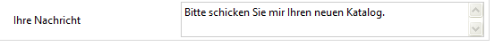</ph></source>
<target xml:lang="en-XX"><ph id="1" ctype="x-IMAGE"></ph></target>
</trans-unit>
<trans-unit id="tu47" xml:space="preserve">
<source xml:lang="en-US"><ph id="1" ctype="x-regxph" equiv-text="[!CAUTION">[!CAUTION]</ph></source>
<target xml:lang="en-XX"><ph id="1" ctype="x-regxph" equiv-text="[!CAUTION">[!CAUTION]</ph></target>
</trans-unit>
<trans-unit id="tu48" xml:space="preserve">
<source xml:lang="en-US">Multi-line text fields are specific fields that can contain carriage returns. Their storage space must be associated with a field mapped on an XML element, not an XML attribute.</source>
<target xml:lang="en-XX">Mehrzeilige Textfelder sind spezifische Felder, die Zeilenumbrüche enthalten können. Ihr Speicherplatz muss mit einem Feld verknüpft sein, das einem XML-Element, nicht einem XML-Attribut, zugeordnet ist.</target>
</trans-unit>
<trans-unit id="tu49" xml:space="preserve">
<source xml:lang="en-US"><ph id="1" ctype="x-STRONG_EMPHASIS">**</ph>Enriched multi-line text<ph id="2" ctype="x-STRONG_EMPHASIS">**</ph>: lets the user enter text with a layout which will be stored in HTML format.</source>
<target xml:lang="en-XX"><ph id="1" ctype="x-STRONG_EMPHASIS">**</ph>Angereicherter mehrzeiliger Text<ph id="2" ctype="x-STRONG_EMPHASIS">**</ph>: ermöglicht dem Benutzer die Eingabe von Text mit einem Layout, das im HTML-Format gespeichert wird.</target>
</trans-unit>
<trans-unit id="tu50" xml:space="preserve">
<source xml:lang="en-US"><ph id="1" ctype="x-IMAGE">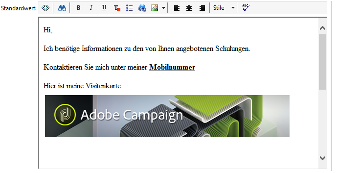</ph></source>
<target xml:lang="en-XX"><ph id="1" ctype="x-IMAGE"></ph></target>
</trans-unit>
<trans-unit id="tu51" xml:space="preserve">
<source xml:lang="en-US">You can select the type of editor offered to users. To do this, use the drop-down box of the <ph id="1" ctype="x-STRONG_EMPHASIS">**[!UICONTROL </ph>HTML editor<ph id="3" ctype="x-LINK_REF">]**</ph> field in the <ph id="5" ctype="x-STRONG_EMPHASIS">**[!UICONTROL </ph>Advanced<ph id="7" ctype="x-LINK_REF">]**</ph> tab.</source>
<target xml:lang="en-XX">Sie können den Typ des Editors auswählen, der den Benutzern bereitgestellt wird. Verwenden Sie dazu im Tab <ph id="5" ctype="x-STRONG_EMPHASIS">**[!UICONTROL </ph>Erweitert<ph id="7" ctype="x-LINK_REF">]**</ph> die Dropdown-Liste des Felds <ph id="1" ctype="x-STRONG_EMPHASIS">**[!UICONTROL </ph>HTML-Editor<ph id="3" ctype="x-LINK_REF">]**</ph>.</target>
</trans-unit>
<trans-unit id="tu52" xml:space="preserve">
<source xml:lang="en-US"><ph id="1" ctype="x-IMAGE">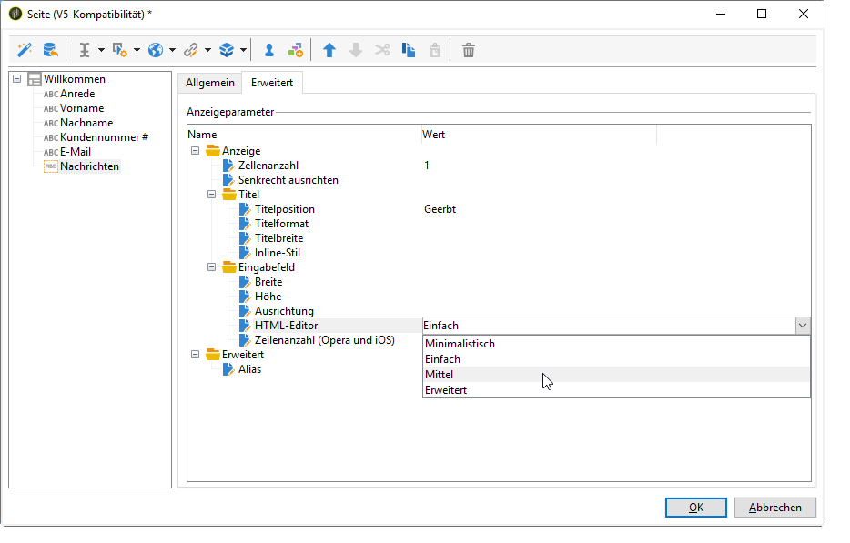</ph></source>
<target xml:lang="en-XX"><ph id="1" ctype="x-IMAGE"></ph></target>
</trans-unit>
<trans-unit id="tu53" xml:space="preserve">
<source xml:lang="en-US">The number of icons displayed varies depending on the type of editor. For an <ph id="1" ctype="x-STRONG_EMPHASIS">**[!UICONTROL </ph>Advanced<ph id="3" ctype="x-LINK_REF">]**</ph> editor, the rendering will be as follows:</source>
<target xml:lang="en-XX">Die Anzahl der angezeigten Symbole variiert je nach Editor-Typ. Bei einem Editor des Typs <ph id="1" ctype="x-STRONG_EMPHASIS">**[!UICONTROL </ph>Erweitert<ph id="3" ctype="x-LINK_REF">]**</ph> sieht das Rendering wie folgt aus:</target>
</trans-unit>
<trans-unit id="tu54" xml:space="preserve">
<source xml:lang="en-US"><ph id="1" ctype="x-IMAGE">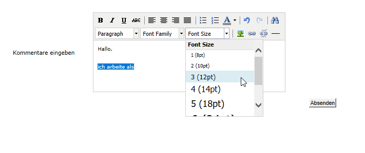</ph></source>
<target xml:lang="en-XX"><ph id="1" ctype="x-IMAGE"></ph></target>
</trans-unit>
<trans-unit id="tu55" xml:space="preserve">
<source xml:lang="en-US">Configure input fields</source>
<target xml:lang="en-XX">Eingabefelder konfigurieren</target>
</trans-unit>
<trans-unit id="tu56" xml:space="preserve">
<source xml:lang="en-US">Input fields are all configured based on the same mode, using the following options:</source>
<target xml:lang="en-XX">Eingabefelder werden auf der Basis desselben Modus unter Verwendung der folgenden Optionen konfiguriert:</target>
</trans-unit>
<trans-unit id="tu57" xml:space="preserve">
<source xml:lang="en-US"><ph id="1" ctype="x-IMAGE">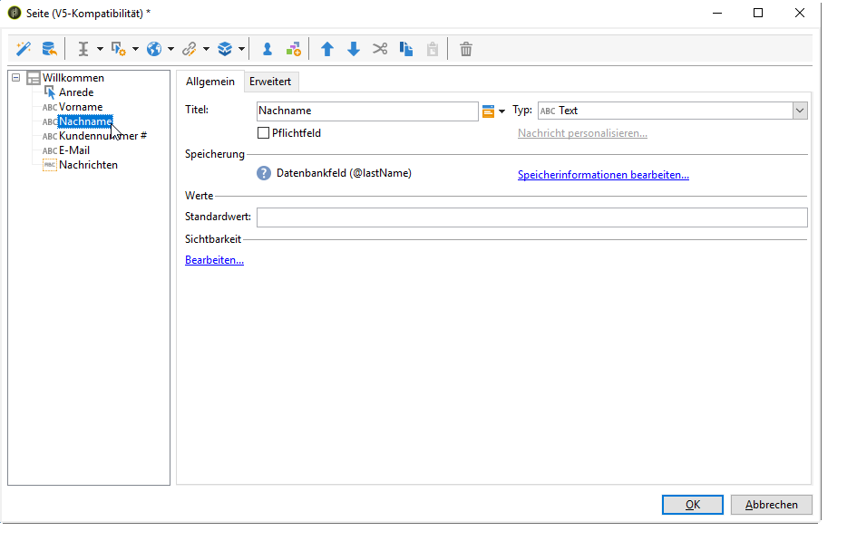</ph></source>
<target xml:lang="en-XX"><ph id="1" ctype="x-IMAGE"></ph></target>
</trans-unit>
<trans-unit id="tu58" xml:space="preserve">
<source xml:lang="en-US">The <ph id="1" ctype="x-STRONG_EMPHASIS">**[!UICONTROL </ph>General<ph id="3" ctype="x-LINK_REF">]**</ph> tab lets you enter the name of the field and attribute a default value to it if necessary.</source>
<target xml:lang="en-XX">Im Tab <ph id="1" ctype="x-STRONG_EMPHASIS">**[!UICONTROL </ph>Allgemein<ph id="3" ctype="x-LINK_REF">]**</ph> können Sie den Namen des Felds eingeben und bei Bedarf einen Standardwert zuweisen.</target>
</trans-unit>
<trans-unit id="tu59" xml:space="preserve">
<source xml:lang="en-US">The answer storage mode can be altered via the <ph id="1" ctype="x-STRONG_EMPHASIS">**[!UICONTROL </ph>Edit storage...<ph id="3" ctype="x-LINK_REF">]**</ph> link. Values can be stored in an existing field of the database; or you can choose not to save information in the database (use a local variable).</source>
<target xml:lang="en-XX">Der Speichermodus der Antwort kann über den Link <ph id="1" ctype="x-STRONG_EMPHASIS">**[!UICONTROL </ph>Speicherinformationen bearbeiten…<ph id="3" ctype="x-LINK_REF">]**</ph> geändert werden. Werte können in einem vorhandenen Feld der Datenbank gespeichert werden. Sie können sich jedoch auch dazu entscheiden, Informationen nicht in der Datenbank zu speichern (eine lokale Variable verwenden).</target>
</trans-unit>
<trans-unit id="tu60" xml:space="preserve">
<source xml:lang="en-US"><ph id="1" ctype="x-regxph" equiv-text="[!NOTE">[!NOTE]</ph></source>
<target xml:lang="en-XX"><ph id="1" ctype="x-regxph" equiv-text="[!NOTE">[!NOTE]</ph></target>
</trans-unit>
<trans-unit id="tu61" xml:space="preserve">
<source xml:lang="en-US">Storage modes are detailed in <ph id="1" ctype="x-LINK">[</ph>Response storage fields<ph id="2" ctype="x-LINK">](web-forms-answers.md#response-storage-fields)</ph></source>
<target xml:lang="en-XX">Speichermodi werden unter <ph id="1" ctype="x-LINK">[</ph>Speicherfelder für Antworten<ph id="2" ctype="x-LINK">](web-forms-answers.md#response-storage-fields)</ph> detailliert beschrieben.</target>
</trans-unit>
<trans-unit id="tu62" xml:space="preserve">
<source xml:lang="en-US">The <ph id="1" ctype="x-STRONG_EMPHASIS">**[!UICONTROL </ph>Advanced<ph id="3" ctype="x-LINK_REF">]**</ph> tab lets you define display parameters for the field (position of labels, alignment, etc.). See <ph id="5" ctype="x-LINK">[</ph>Defining web forms layout<ph id="6" ctype="x-LINK">](defining-web-forms-layout.md)</ph>.</source>
<target xml:lang="en-XX">Im Tab <ph id="1" ctype="x-STRONG_EMPHASIS">**[!UICONTROL </ph>Erweitert<ph id="3" ctype="x-LINK_REF">]**</ph> können Sie Anzeigeparameter für das Feld definieren (Position der Titel, Ausrichtung etc.). Siehe <ph id="5" ctype="x-LINK">[</ph>Layout eines Webformulars definieren<ph id="6" ctype="x-LINK">](defining-web-forms-layout.md)</ph>.</target>
</trans-unit>
<trans-unit id="tu63" xml:space="preserve">
<source xml:lang="en-US">Adding drop-down lists</source>
<target xml:lang="en-XX">Dropdown-Listen hinzufügen</target>
</trans-unit>
<trans-unit id="tu64" xml:space="preserve">
<source xml:lang="en-US">You can insert a drop-down list into a survey page. This lets the user select a value from those on offer in a drop-down menu.</source>
<target xml:lang="en-XX">Sie können eine Dropdown-Liste in eine Umfrageseite einfügen. So können Benutzende einen Wert einfügen, der in einem Dropdown-Menü verfügbar ist.</target>
</trans-unit>
<trans-unit id="tu65" xml:space="preserve">
<source xml:lang="en-US"><ph id="1" ctype="x-IMAGE">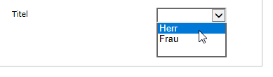</ph></source>
<target xml:lang="en-XX"><ph id="1" ctype="x-IMAGE"></ph></target>
</trans-unit>
<trans-unit id="tu66" xml:space="preserve">
<source xml:lang="en-US">To add a drop-down box to a form page, click the <ph id="1" ctype="x-STRONG_EMPHASIS">**[!UICONTROL </ph>Selection controls > Drop-down list<ph id="3" ctype="x-LINK_REF">]**</ph> button in the toolbar of the page editor.</source>
<target xml:lang="en-XX">Um eine Dropdown-Liste in eine Formularseite einzufügen, wählen Sie in der Symbolleiste des Seiteneditors die Schaltfläche <ph id="1" ctype="x-STRONG_EMPHASIS">**[!UICONTROL </ph>Auswahldialog > Dropdown-Liste<ph id="3" ctype="x-LINK_REF">]**</ph> aus.</target>
</trans-unit>
<trans-unit id="tu67" xml:space="preserve">
<source xml:lang="en-US"><ph id="1" ctype="x-IMAGE">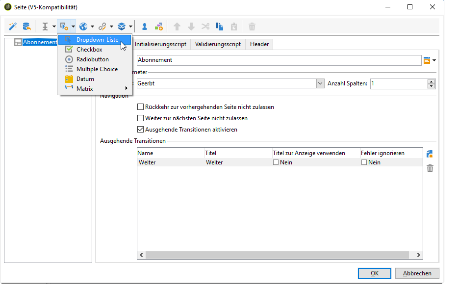</ph></source>
<target xml:lang="en-XX"><ph id="1" ctype="x-IMAGE"></ph></target>
</trans-unit>
<trans-unit id="tu68" xml:space="preserve">
<source xml:lang="en-US">Select the answer storage mode and confirm your choice.</source>
<target xml:lang="en-XX">Wählen Sie den Speichermodus für die Antworten aus und bestätigen Sie Ihre Auswahl.</target>
</trans-unit>
<trans-unit id="tu69" xml:space="preserve">
<source xml:lang="en-US">Define the labels and values of the list in the lower section of the <ph id="1" ctype="x-STRONG_EMPHASIS">**[!UICONTROL </ph>General<ph id="3" ctype="x-LINK_REF">]**</ph> tab. If the information is stored in an existing field of the database and it is an enumeration field, you can fill in the values automatically by clicking <ph id="5" ctype="x-STRONG_EMPHASIS">**[!UICONTROL </ph>Initialize the list of values from the database<ph id="7" ctype="x-LINK_REF">]**</ph> , as shown below:</source>
<target xml:lang="en-XX">Definieren Sie die Titel und Werte der Liste im unteren Bereich der Registerkarte <ph id="1" ctype="x-STRONG_EMPHASIS">**[!UICONTROL </ph>Allgemein<ph id="3" ctype="x-LINK_REF">]**</ph>. Wenn die Informationen in einem vorhandenen Feld der Datenbank gespeichert werden und es sich um ein Aufzählungsfeld handelt, können Sie die Werte automatisch ausfüllen lassen, indem Sie wie unten gezeigt <ph id="5" ctype="x-STRONG_EMPHASIS">**[!UICONTROL </ph>Werteliste aus der Datenbank übernehmen<ph id="7" ctype="x-LINK_REF">]**</ph> auswählen:</target>
</trans-unit>
<trans-unit id="tu70" xml:space="preserve">
<source xml:lang="en-US"><ph id="1" ctype="x-IMAGE">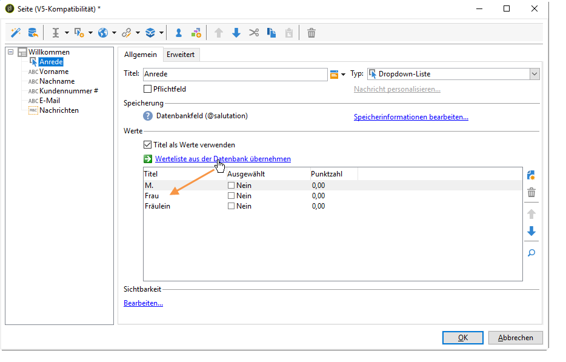</ph></source>
<target xml:lang="en-XX"><ph id="1" ctype="x-IMAGE"></ph></target>
</trans-unit>
<trans-unit id="tu71" xml:space="preserve">
<source xml:lang="en-US"><ph id="1" ctype="x-regxph" equiv-text="[!NOTE">[!NOTE]</ph></source>
<target xml:lang="en-XX"><ph id="1" ctype="x-regxph" equiv-text="[!NOTE">[!NOTE]</ph></target>
</trans-unit>
<trans-unit id="tu72" xml:space="preserve">
<source xml:lang="en-US">Use the arrows to the right of the list of values to change their sequence.</source>
<target xml:lang="en-XX">Die Reihenfolge der Werte können Sie mit den Pfeilen rechts neben der Liste ändern.</target>
</trans-unit>
<trans-unit id="tu73" xml:space="preserve">
<source xml:lang="en-US">If the data is stored in a linked table, you can select the field where the values to be suggested in the list are saved. For example, if you select the table of countries, click <ph id="1" ctype="x-STRONG_EMPHASIS">**[!UICONTROL </ph>Initialize the list of values from the database...<ph id="3" ctype="x-LINK_REF">]**</ph> and select the desired field.</source>
<target xml:lang="en-XX">Wenn die Daten in einer verknüpften Tabelle gespeichert sind, können Sie das Feld auswählen, in dem die in der Liste vorgeschlagenen Werte gespeichert werden. Wenn Sie beispielsweise die Tabelle der Länder auswählen, wählen Sie zuerst <ph id="1" ctype="x-STRONG_EMPHASIS">**[!UICONTROL </ph>Werteliste aus der Datenbank übernehmen…<ph id="3" ctype="x-LINK_REF">]**</ph> und danach das gewünschte Feld aus.</target>
</trans-unit>
<trans-unit id="tu74" xml:space="preserve">
<source xml:lang="en-US"><ph id="1" ctype="x-IMAGE">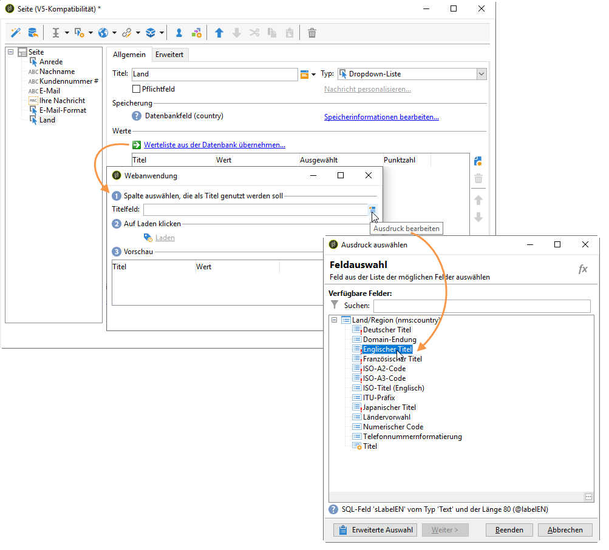</ph></source>
<target xml:lang="en-XX"><ph id="1" ctype="x-IMAGE"></ph></target>
</trans-unit>
<trans-unit id="tu75" xml:space="preserve">
<source xml:lang="en-US">Next, click the <ph id="1" ctype="x-STRONG_EMPHASIS">**[!UICONTROL </ph>Load<ph id="3" ctype="x-LINK_REF">]**</ph> link to retrieve the values:</source>
<target xml:lang="en-XX">Wählen Sie danach den Link <ph id="1" ctype="x-STRONG_EMPHASIS">**[!UICONTROL </ph>Laden<ph id="3" ctype="x-LINK_REF">]**</ph> aus, um die Werte abzurufen:</target>
</trans-unit>
<trans-unit id="tu76" xml:space="preserve">
<source xml:lang="en-US"><ph id="1" ctype="x-IMAGE">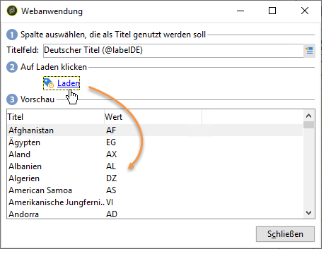</ph></source>
<target xml:lang="en-XX"><ph id="1" ctype="x-IMAGE"></ph></target>
</trans-unit>
<trans-unit id="tu77" xml:space="preserve">
<source xml:lang="en-US"><ph id="1" ctype="x-regxph" equiv-text="[!CAUTION">[!CAUTION]</ph></source>
<target xml:lang="en-XX"><ph id="1" ctype="x-regxph" equiv-text="[!CAUTION">[!CAUTION]</ph></target>
</trans-unit>
<trans-unit id="tu78" xml:space="preserve">
<source xml:lang="en-US">Repeat this operation whenever the list is updated to refresh the values on offer.</source>
<target xml:lang="en-XX">Wiederholen Sie diesen Vorgang bei jeder Änderung der Liste, um die angebotenen Werte zu aktualisieren.</target>
</trans-unit>
<trans-unit id="tu79" xml:space="preserve">
<source xml:lang="en-US">Adding checkboxes</source>
<target xml:lang="en-XX">Checkboxes hinzufügen</target>
</trans-unit>
<trans-unit id="tu80" xml:space="preserve">
<source xml:lang="en-US">In order for the user to select an option, you need to use a checkbox.</source>
<target xml:lang="en-XX">Mit Checkboxes stellen Sie Benutzern eine Auswahlmöglichkeit für Optionen zur Verfügung.</target>
</trans-unit>
<trans-unit id="tu81" xml:space="preserve">
<source xml:lang="en-US"><ph id="1" ctype="x-IMAGE">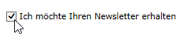</ph></source>
<target xml:lang="en-XX"><ph id="1" ctype="x-IMAGE"></ph></target>
</trans-unit>
<trans-unit id="tu82" xml:space="preserve">
<source xml:lang="en-US">To add a checkbox to a form, click the <ph id="1" ctype="x-STRONG_EMPHASIS">**[!UICONTROL </ph>Selection controls > Checkbox...<ph id="3" ctype="x-LINK_REF">]**</ph> icon in the toolbar of the page editor.</source>
<target xml:lang="en-XX">Um eine Checkbox in ein Formular einzufügen, wählen Sie in der Symbolleiste des Seiteneditors die Schaltfläche <ph id="1" ctype="x-STRONG_EMPHASIS">**[!UICONTROL </ph>Auswahldialog > Checkbox<ph id="3" ctype="x-LINK_REF">]**</ph> aus.</target>
</trans-unit>
<trans-unit id="tu83" xml:space="preserve">
<source xml:lang="en-US">Select the answer storage mode and confirm your choice.</source>
<target xml:lang="en-XX">Wählen Sie den Speichermodus für die Antworten aus und bestätigen Sie Ihre Auswahl.</target>
</trans-unit>
<trans-unit id="tu84" xml:space="preserve">
<source xml:lang="en-US">Enter the label of the box in the <ph id="1" ctype="x-STRONG_EMPHASIS">**[!UICONTROL </ph>Label<ph id="3" ctype="x-LINK_REF">]**</ph> field of the <ph id="5" ctype="x-STRONG_EMPHASIS">**[!UICONTROL </ph>General<ph id="7" ctype="x-LINK_REF">]**</ph> tab.</source>
<target xml:lang="en-XX">Geben Sie im Tab <ph id="5" ctype="x-STRONG_EMPHASIS">**[!UICONTROL </ph>Allgemein<ph id="7" ctype="x-LINK_REF">]**</ph> im Feld <ph id="1" ctype="x-STRONG_EMPHASIS">**[!UICONTROL </ph>Titel<ph id="3" ctype="x-LINK_REF">]**</ph> den Titel der Checkbox ein.</target>
</trans-unit>
<trans-unit id="tu85" xml:space="preserve">
<source xml:lang="en-US"><ph id="1" ctype="x-IMAGE">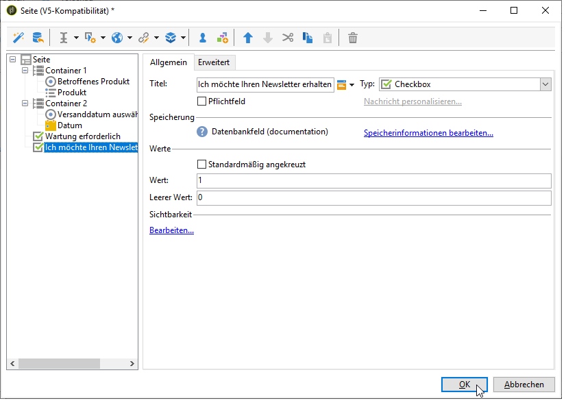</ph></source>
<target xml:lang="en-XX"><ph id="1" ctype="x-IMAGE"></ph></target>
</trans-unit>
<trans-unit id="tu86" xml:space="preserve">
<source xml:lang="en-US">A checkbox lets you assign a value to the storage field (or value) depending on whether or not the box is checked. The <ph id="1" ctype="x-STRONG_EMPHASIS">**[!UICONTROL </ph>Values<ph id="3" ctype="x-LINK_REF">]**</ph> section lets you enter the value to assign if the box is checked (in the <ph id="5" ctype="x-STRONG_EMPHASIS">**[!UICONTROL </ph>Value<ph id="7" ctype="x-LINK_REF">]**</ph> field), and the value to assign if it is not checked (in the <ph id="9" ctype="x-STRONG_EMPHASIS">**[!UICONTROL </ph>Empty value<ph id="11" ctype="x-LINK_REF">]**</ph> field). These values depend on the data storage format.</source>
<target xml:lang="en-XX">Mit einer Checkbox können Sie dem Speicherfeld (oder Wert) einen Wert zuweisen, je nachdem ob das Kästchen markiert ist oder nicht. Im Bereich <ph id="1" ctype="x-STRONG_EMPHASIS">**[!UICONTROL </ph>Werte<ph id="3" ctype="x-LINK_REF">]**</ph> können Sie einen Wert eingeben, der zugewiesen wird, wenn das Kästchen markiert wird (im Feld <ph id="5" ctype="x-STRONG_EMPHASIS">**[!UICONTROL </ph>Wert<ph id="7" ctype="x-LINK_REF">]**</ph>), und einen Wert, der zugewiesen wird, wenn das Kästchen nicht markiert wird (im Feld <ph id="9" ctype="x-STRONG_EMPHASIS">**[!UICONTROL </ph>Leerer Wert<ph id="11" ctype="x-LINK_REF">]**</ph>). Diese Werte hängen vom Datenspeicherungsformat ab.</target>
</trans-unit>
<trans-unit id="tu87" xml:space="preserve">
<source xml:lang="en-US">If the storage field (or variable) is boolean, the value to assign if the box is not checked will be deduced automatically. In this case, only the <ph id="1" ctype="x-STRONG_EMPHASIS">**[!UICONTROL </ph>Value if checked<ph id="3" ctype="x-LINK_REF">]**</ph> field is offered, as shown below:</source>
<target xml:lang="en-XX">Wenn das Speicherfeld (oder die Variable) boolesch ist, wird der zuzuweisende Wert automatisch abgezogen, wenn das Kästchen nicht markiert wird. In diesem Fall wird nur das Feld <ph id="1" ctype="x-STRONG_EMPHASIS">**[!UICONTROL </ph>Wert, wenn angekreuzt<ph id="3" ctype="x-LINK_REF">]**</ph> angeboten, wie unten gezeigt:</target>
</trans-unit>
<trans-unit id="tu88" xml:space="preserve">
<source xml:lang="en-US"><ph id="1" ctype="x-IMAGE">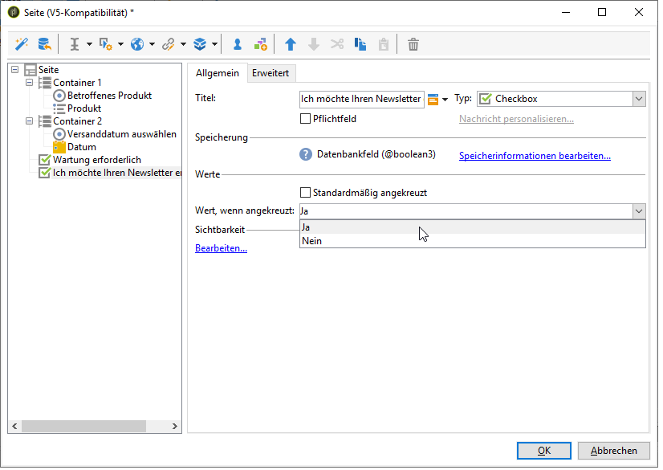</ph></source>
<target xml:lang="en-XX"><ph id="1" ctype="x-IMAGE"></ph></target>
</trans-unit>
<trans-unit id="tu89" xml:space="preserve">
<source xml:lang="en-US">Example: Assign a value to a field if a box is checked</source>
<target xml:lang="en-XX">Beispiel: Wert einem Feld zuweisen, wenn eine Checkbox markiert wird</target>
</trans-unit>
<trans-unit id="tu90" xml:space="preserve">
<source xml:lang="en-US">We want to insert a checkbox into a form to send a maintenance request, as shown below:</source>
<target xml:lang="en-XX">Eine Checkbox soll in ein Formular eingefügt werden, damit wie unten gezeigt ein Wartungsantrag gesendet wird.</target>
</trans-unit>
<trans-unit id="tu91" xml:space="preserve">
<source xml:lang="en-US"><ph id="1" ctype="x-IMAGE">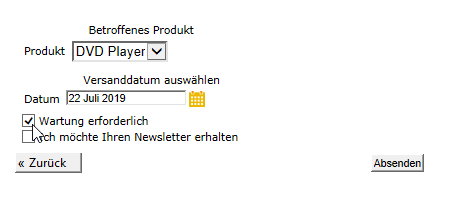</ph></source>
<target xml:lang="en-XX"><ph id="1" ctype="x-IMAGE"></ph></target>
</trans-unit>
<trans-unit id="tu92" xml:space="preserve">
<source xml:lang="en-US">The information will be uploaded to the database and into an existing field (in this case, the <ph id="1" ctype="x-STRONG_EMPHASIS">**[!UICONTROL </ph>Comment<ph id="3" ctype="x-LINK_REF">]**</ph> field):</source>
<target xml:lang="en-XX">Diese Informationen werden in die Datenbank und ein vorhandenes Feld hochgeladen (in diesem Fall das Feld <ph id="1" ctype="x-STRONG_EMPHASIS">**[!UICONTROL </ph>Kommentar<ph id="3" ctype="x-LINK_REF">]**</ph>):</target>
</trans-unit>
<trans-unit id="tu93" xml:space="preserve">
<source xml:lang="en-US"><ph id="1" ctype="x-IMAGE">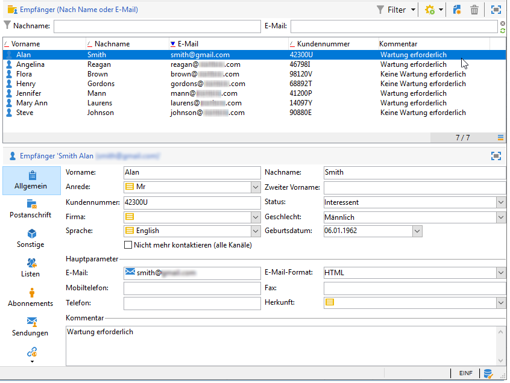</ph></source>
<target xml:lang="en-XX"><ph id="1" ctype="x-IMAGE"></ph></target>
</trans-unit>
<trans-unit id="tu94" xml:space="preserve">
<source xml:lang="en-US">If the "Maintenance required" box is checked, the <ph id="1" ctype="x-STRONG_EMPHASIS">**[!UICONTROL </ph>Comment<ph id="3" ctype="x-LINK_REF">]**</ph> column will contain "Maintenance required". If the box isn't checked, the column will show "Maintenance not required". To obtain this result, apply the following configuration to the checkbox on the form page:</source>
<target xml:lang="en-XX">Wenn das Kontrollkästchen „Wartung erforderlich“ aktiviert ist, wird in der Spalte <ph id="1" ctype="x-STRONG_EMPHASIS">**[!UICONTROL </ph>Kommentar<ph id="3" ctype="x-LINK_REF">]**</ph> der Text „Wartung erforderlich“ angezeigt. Wenn das Kontrollkästchen nicht aktiviert ist, wird in der Spalte „Wartung nicht erforderlich“ angezeigt. Um dieses Ergebnis zu erhalten, wenden Sie die folgende Konfiguration auf das Kontrollkästchen auf der Formularseite an:</target>
</trans-unit>
<trans-unit id="tu95" xml:space="preserve">
<source xml:lang="en-US"><ph id="1" ctype="x-IMAGE">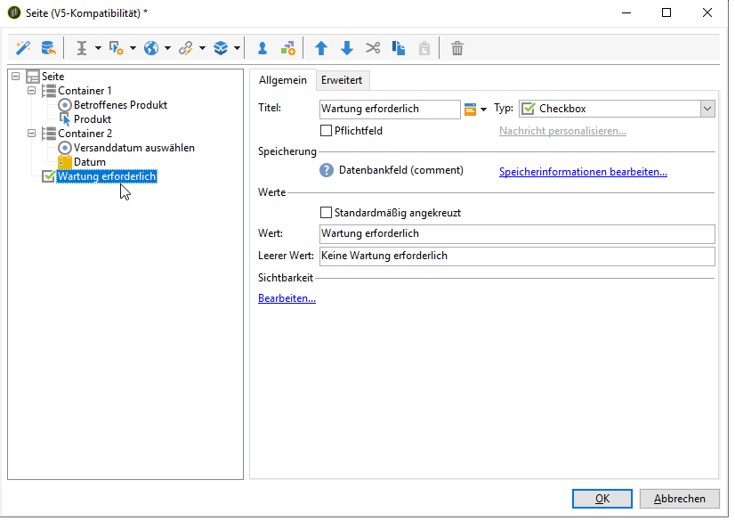</ph></source>
<target xml:lang="en-XX"><ph id="1" ctype="x-IMAGE"></ph></target>
</trans-unit>
<trans-unit id="tu96" xml:space="preserve">
<source xml:lang="en-US">Adding radio buttons</source>
<target xml:lang="en-XX">Radiobuttons hinzufügen</target>
</trans-unit>
<trans-unit id="tu97" xml:space="preserve">
<source xml:lang="en-US">Radio buttons let you offer the user a series of exclusive options to choose from. These are different values for the same field.</source>
<target xml:lang="en-XX">Mit Optionsfeldern können Sie Benutzenden eine Reihe von exklusiven Optionen zur Auswahl anbieten. Dies sind unterschiedliche Werte für dasselbe Feld.</target>
</trans-unit>
<trans-unit id="tu98" xml:space="preserve">
<source xml:lang="en-US"><ph id="1" ctype="x-IMAGE">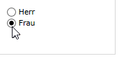</ph></source>
<target xml:lang="en-XX"><ph id="1" ctype="x-IMAGE"></ph></target>
</trans-unit>
<trans-unit id="tu99" xml:space="preserve">
<source xml:lang="en-US">You can create radio buttons individually (unitary buttons) or via a multiple-choice list, but since the point of the radio buttons is to select one option or another, we will always create at least a pair of radio buttons, never just a single button.</source>
<target xml:lang="en-XX">Sie können Radiobuttons einzeln erstellen (Einzel-Schaltflächen) oder über eine Multiple-Choice-Liste. Aber weil der Zweck von Radiobuttons die Auswahl einer Option ist, werden immer zumindest zwei Radiobuttons erstellt, und nie nur ein einzelner.</target>
</trans-unit>
<trans-unit id="tu100" xml:space="preserve">
<source xml:lang="en-US"><ph id="1" ctype="x-regxph" equiv-text="[!CAUTION">[!CAUTION]</ph></source>
<target xml:lang="en-XX"><ph id="1" ctype="x-regxph" equiv-text="[!CAUTION">[!CAUTION]</ph></target>
</trans-unit>
<trans-unit id="tu101" xml:space="preserve">
<source xml:lang="en-US">To make selection mandatory, you need to create a multiple choice list.</source>
<target xml:lang="en-XX">Um die Auswahl obligatorisch zu machen, müssen Sie eine Multiple-Choice-Liste erstellen.</target>
</trans-unit>
<trans-unit id="tu102" xml:space="preserve">
<source xml:lang="en-US">Add single buttons</source>
<target xml:lang="en-XX">Einzelne Schaltflächen hinzufügen</target>
</trans-unit>
<trans-unit id="tu103" xml:space="preserve">
<source xml:lang="en-US">To add a radio button to a form page, go to the <ph id="1" ctype="x-STRONG_EMPHASIS">**[!UICONTROL </ph>Selection controls > Radio button<ph id="3" ctype="x-LINK_REF">]**</ph> menu in the toolbar of the page editor and choose a storage mode.</source>
<target xml:lang="en-XX">Um einen Radiobutton zu einer Formularseite hinzuzufügen, gehen Sie in der Symbolleiste des Seiteneditors zum Menü <ph id="1" ctype="x-STRONG_EMPHASIS">**[!UICONTROL </ph>Auswahldialog > Radiobutton<ph id="3" ctype="x-LINK_REF">]**</ph> und wählen Sie einen Speichermodus aus.</target>
</trans-unit>
<trans-unit id="tu104" xml:space="preserve">
<source xml:lang="en-US"><ph id="1" ctype="x-IMAGE">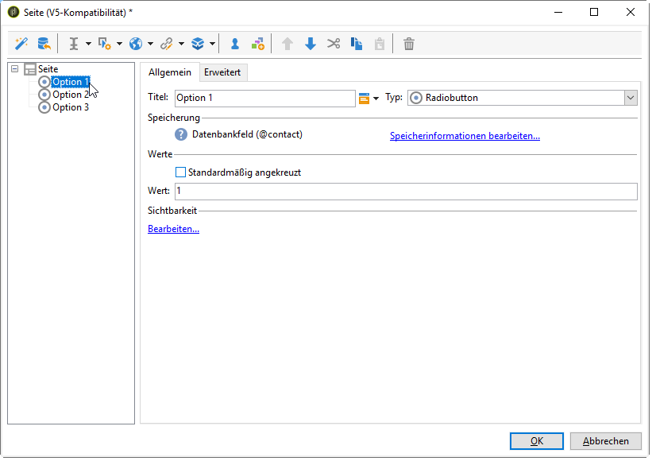</ph></source>
<target xml:lang="en-XX"><ph id="1" ctype="x-IMAGE"></ph></target>
</trans-unit>
<trans-unit id="tu105" xml:space="preserve">
<source xml:lang="en-US">Radio buttons are configured in a similar way to checkboxes (see <ph id="1" ctype="x-LINK">[</ph>Adding checkboxes<ph id="2" ctype="x-LINK">](#adding-checkboxes)</ph>). However, no value is assigned if the option is not selected. In order for several buttons to be interdependent, i.e. selecting one automatically deselects the others, they must be stored in the same field. If they are not stored in the database, the same local variable must be used for temporary storage. See <ph id="3" ctype="x-LINK">[</ph>Response storage fields<ph id="4" ctype="x-LINK">](web-forms-answers.md#response-storage-fields)</ph>.</source>
<target xml:lang="en-XX">Radiobuttons werden ähnlich konfiguriert wie Checkboxes (siehe <ph id="1" ctype="x-LINK">[</ph>Checkboxes hinzufügen<ph id="2" ctype="x-LINK">](#adding-checkboxes)</ph>). Wenn die Option nicht ausgewählt ist, wird jedoch kein Wert zugewiesen. Damit mehrere Schaltflächen voneinander abhängen, d. h. die Auswahl einer Schaltfläche automatisch die Auswahl der anderen deaktiviert, müssen sie im selben Feld gespeichert werden. Wenn sie nicht in der Datenbank gespeichert sind, muss dieselbe lokale Variable für die temporäre Speicherung verwendet werden. Siehe <ph id="3" ctype="x-LINK">[</ph>Speicherfelder für Antworten<ph id="4" ctype="x-LINK">](web-forms-answers.md#response-storage-fields)</ph>.</target>
</trans-unit>
<trans-unit id="tu106" xml:space="preserve">
<source xml:lang="en-US">Add a list of buttons</source>
<target xml:lang="en-XX">Liste mit Schaltflächen hinzufügen</target>
</trans-unit>
<trans-unit id="tu107" xml:space="preserve">
<source xml:lang="en-US">To add radio buttons via a list, go to the <ph id="1" ctype="x-STRONG_EMPHASIS">**[!UICONTROL </ph>Selection controls>Multiple choice<ph id="3" ctype="x-LINK_REF">]**</ph> menu in the toolbar of the page editor.</source>
<target xml:lang="en-XX">Um Radiobuttons über eine Liste hinzuzufügen, gehen Sie in der Symbolleiste des Seiteneditors zum Menü <ph id="1" ctype="x-STRONG_EMPHASIS">**[!UICONTROL </ph>Auswahldialog > Multiple Choice<ph id="3" ctype="x-LINK_REF">]**</ph>.</target>
</trans-unit>
<trans-unit id="tu108" xml:space="preserve">
<source xml:lang="en-US"><ph id="1" ctype="x-IMAGE">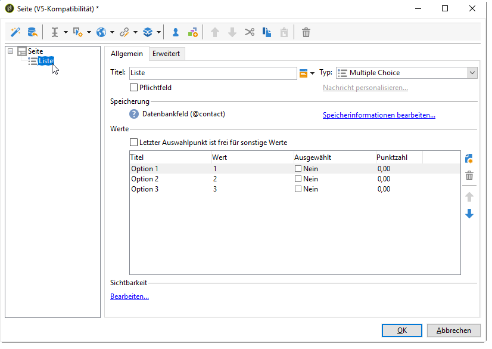</ph></source>
<target xml:lang="en-XX"><ph id="1" ctype="x-IMAGE"></ph></target>
</trans-unit>
<trans-unit id="tu109" xml:space="preserve">
<source xml:lang="en-US">Add as many radio buttons as there are labels. The advantage of this feature is that you can import values from an existing field (in case of an itemized field) and make it for the user to choose one option. However, the layout of buttons is less flexible.</source>
<target xml:lang="en-XX">Fügen Sie so viele Optionsfelder wie Titel hinzu. Der Vorteil dieser Funktion liegt darin, dass Sie Werte aus einem vorhandenen Feld importieren können (im Fall eines Auflistungsfelds) und Benutzende aus diesen eine Option auswählen können. Das Layout der Felder ist jedoch weniger flexibel.</target>
</trans-unit>
<trans-unit id="tu110" xml:space="preserve">
<source xml:lang="en-US"><ph id="1" ctype="x-regxph" equiv-text="[!NOTE">[!NOTE]</ph></source>
<target xml:lang="en-XX"><ph id="1" ctype="x-regxph" equiv-text="[!NOTE">[!NOTE]</ph></target>
</trans-unit>
<trans-unit id="tu111" xml:space="preserve">
<source xml:lang="en-US">You cannot enable multi-selection in a web application.
<ph id="1" ctype="x-BLOCK_QUOTE">></ph>It is possible, however, to insert a <ph id="2" ctype="x-STRONG_EMPHASIS">**[!UICONTROL </ph>Multiple choice<ph id="4" ctype="x-LINK_REF">]**</ph> type field into a Web application but this will not enable the user to select several values.</source>
<target xml:lang="en-XX">Sie können die Mehrfachauswahl in einer Web-Anwendung nicht aktivieren.
<ph id="1" ctype="x-BLOCK_QUOTE">></ph>Es ist jedoch möglich, ein Feld vom Typ <ph id="2" ctype="x-STRONG_EMPHASIS">**[!UICONTROL </ph>Multiple Choice<ph id="4" ctype="x-LINK_REF">]**</ph> in eine Web-Anwendung einzufügen. Dies ermöglicht dem Benutzer jedoch nicht, mehrere Werte auszuwählen.</target>
</trans-unit>
<trans-unit id="tu112" xml:space="preserve">
<source xml:lang="en-US">Adding grids</source>
<target xml:lang="en-XX">Tabellen hinzufügen</target>
</trans-unit>
<trans-unit id="tu113" xml:space="preserve">
<source xml:lang="en-US">Grids are used to design voting pages in Web applications. This lets you offer lists of radio buttons for answering survey or assessment type Web forms, as shown below:</source>
<target xml:lang="en-XX">Raster werden zum Entwerfen von Abstimmungsseiten in Web-Anwendungen verwendet. Dadurch können Sie wie unten gezeigt Listen mit Optionsfeldern zum Beantworten von Umfragen oder Web-Formulare zur Abgabe von Bewertungen anbieten.</target>
</trans-unit>
<trans-unit id="tu114" xml:space="preserve">
<source xml:lang="en-US"><ph id="1" ctype="x-IMAGE">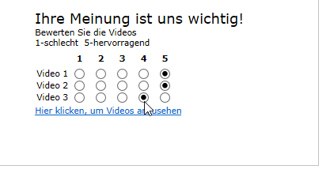</ph></source>
<target xml:lang="en-XX"><ph id="1" ctype="x-IMAGE"></ph></target>
</trans-unit>
<trans-unit id="tu115" xml:space="preserve">
<source xml:lang="en-US">To use this type of element in a form, create a simple grid and add a line for each element to be assessed.</source>
<target xml:lang="en-XX">Um diesen Elementtyp in einem Formular zu verwenden, erstellen Sie eine einfache Tabelle und fügen Sie für jedes zu bewertende Element eine Zeile hinzu.</target>
</trans-unit>
<trans-unit id="tu116" xml:space="preserve">
<source xml:lang="en-US"><ph id="1" ctype="x-IMAGE">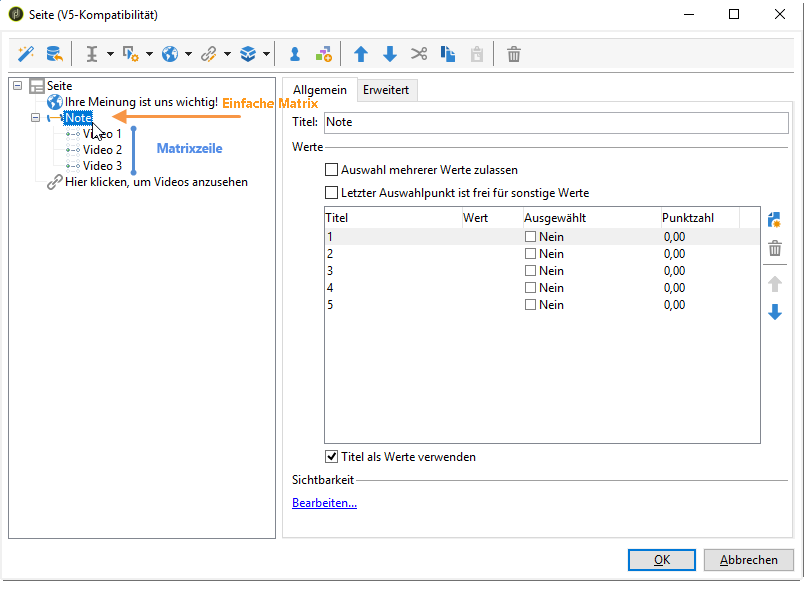</ph></source>
<target xml:lang="en-XX"><ph id="1" ctype="x-IMAGE"></ph></target>
</trans-unit>
<trans-unit id="tu117" xml:space="preserve">
<source xml:lang="en-US">The number of radio buttons in each line of the grid matches the number of values defined in the simple grid.</source>
<target xml:lang="en-XX">Die Anzahl der Radiobuttons in jeder Zeile der Tabelle entspricht der Anzahl der in der einfachen Tabelle definierten Werte.</target>
</trans-unit>
<trans-unit id="tu118" xml:space="preserve">
<source xml:lang="en-US"><ph id="1" ctype="x-IMAGE">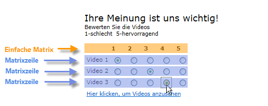</ph></source>
<target xml:lang="en-XX"><ph id="1" ctype="x-IMAGE"></ph></target>
</trans-unit>
<trans-unit id="tu119" xml:space="preserve">
<source xml:lang="en-US">Only one option can be selected per grid line.</source>
<target xml:lang="en-XX">Pro Tabellenzeile kann nur eine Option ausgewählt werden.</target>
</trans-unit>
<trans-unit id="tu120" xml:space="preserve">
<source xml:lang="en-US"><ph id="1" ctype="x-regxph" equiv-text="[!NOTE">[!NOTE]</ph></source>
<target xml:lang="en-XX"><ph id="1" ctype="x-regxph" equiv-text="[!NOTE">[!NOTE]</ph></target>
</trans-unit>
<trans-unit id="tu121" xml:space="preserve">
<source xml:lang="en-US">In our example, the label of the grid is hidden. To do this, go to the <ph id="1" ctype="x-STRONG_EMPHASIS">**[!UICONTROL </ph>Advanced<ph id="3" ctype="x-LINK_REF">]**</ph> tab, the <ph id="5" ctype="x-STRONG_EMPHASIS">**[!UICONTROL </ph>Label position<ph id="7" ctype="x-LINK_REF">]**</ph> display is defined as <ph id="9" ctype="x-STRONG_EMPHASIS">**[!UICONTROL </ph>Hidden<ph id="11" ctype="x-LINK_REF">]**</ph> . See <ph id="13" ctype="x-LINK">[</ph>Defining the position of labels<ph id="14" ctype="x-LINK">](defining-web-forms-layout.md#defining-the-position-of-labels)</ph>.</source>
<target xml:lang="en-XX">In unserem Beispiel ist der Titel der Tabelle ausgeblendet. Gehen Sie dazu zur Registerkarte <ph id="1" ctype="x-STRONG_EMPHASIS">**[!UICONTROL </ph>Erweitert<ph id="3" ctype="x-LINK_REF">]**</ph>. Die Anzeige <ph id="5" ctype="x-STRONG_EMPHASIS">**[!UICONTROL </ph>Titelposition<ph id="7" ctype="x-LINK_REF">]**</ph> ist als <ph id="9" ctype="x-STRONG_EMPHASIS">**[!UICONTROL </ph>Ausgeblendet<ph id="11" ctype="x-LINK_REF">]**</ph> definiert. Siehe <ph id="13" ctype="x-LINK">[</ph>Die Position von Titeln definieren<ph id="14" ctype="x-LINK">](defining-web-forms-layout.md#defining-the-position-of-labels)</ph>.</target>
</trans-unit>
<trans-unit id="tu122" xml:space="preserve">
<source xml:lang="en-US">Adding dates and numbers</source>
<target xml:lang="en-XX">Datum und Zahlen hinzufügen</target>
</trans-unit>
<trans-unit id="tu123" xml:space="preserve">
<source xml:lang="en-US">The content of the form fields can be formatted to match the data stored in the database or to satisfy a particular requirement. You can create suitable fields for the entry of numbers and dates.</source>
<target xml:lang="en-XX">Der Inhalt eines Formularfeldes kann entsprechend den in der Datenbank gespeicherten Daten oder einer bestimmten Anforderung formatiert werden. Sie können geeignete Felder für die Eingabe von Zahlen und Datumsangaben erstellen.</target>
</trans-unit>
<trans-unit id="tu124" xml:space="preserve">
<source xml:lang="en-US">Adding dates</source>
<target xml:lang="en-XX">Datum hinzufügen</target>
</trans-unit>
<trans-unit id="tu125" xml:space="preserve">
<source xml:lang="en-US"><ph id="1" ctype="x-IMAGE">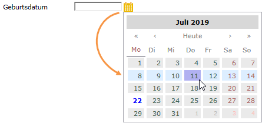</ph></source>
<target xml:lang="en-XX"><ph id="1" ctype="x-IMAGE"></ph></target>
</trans-unit>
<trans-unit id="tu126" xml:space="preserve">
<source xml:lang="en-US">To allow the user to enter a date in a form page, add an input field and select the type <ph id="1" ctype="x-STRONG_EMPHASIS">**[!UICONTROL </ph>Date...<ph id="3" ctype="x-LINK_REF">]**</ph>.</source>
<target xml:lang="en-XX">Um dem Benutzer die Eingabe eines Datums auf einer Formularseite zu ermöglichen, fügen Sie ein Eingabefeld hinzu und wählen Sie den Typ <ph id="1" ctype="x-STRONG_EMPHASIS">**[!UICONTROL </ph>Datum...<ph id="3" ctype="x-LINK_REF">]**</ph> aus.</target>
</trans-unit>
<trans-unit id="tu127" xml:space="preserve">
<source xml:lang="en-US">Enter a label for the field and configure the data storage mode.</source>
<target xml:lang="en-XX">Geben Sie einen Titel für das Feld ein und konfigurieren Sie den Datenspeichermodus.</target>
</trans-unit>
<trans-unit id="tu128" xml:space="preserve">
<source xml:lang="en-US"><ph id="1" ctype="x-IMAGE">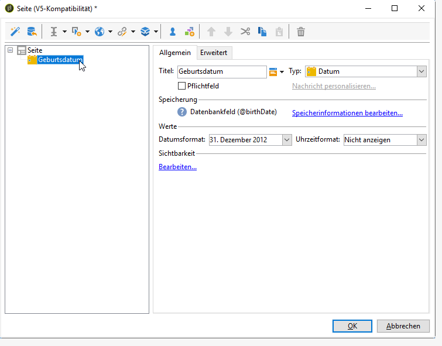</ph></source>
<target xml:lang="en-XX"><ph id="1" ctype="x-IMAGE"></ph></target>
</trans-unit>
<trans-unit id="tu129" xml:space="preserve">
<source xml:lang="en-US">The lower section of the window lets you select the date and time formats for the values stored in this field.</source>
<target xml:lang="en-XX">Im unteren Bereich des Fensters können Sie die Formate für Datum und Uhrzeit für die in diesem Feld gespeicherten Werte auswählen.</target>
</trans-unit>
<trans-unit id="tu130" xml:space="preserve">
<source xml:lang="en-US"><ph id="1" ctype="x-IMAGE">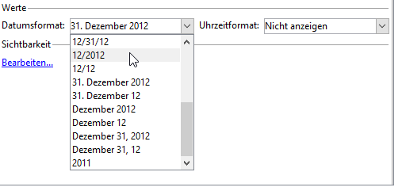</ph></source>
<target xml:lang="en-XX"><ph id="1" ctype="x-IMAGE"></ph></target>
</trans-unit>
<trans-unit id="tu131" xml:space="preserve">
<source xml:lang="en-US">You can also choose not to display the date (or time).</source>
<target xml:lang="en-XX">Das Datum (oder die Uhrzeit) kann angezeigt oder ausgeblendet werden.</target>
</trans-unit>
<trans-unit id="tu132" xml:space="preserve">
<source xml:lang="en-US">Dates can be selected via a calendar or drop-down boxes. You can also enter them directly in the field, but they need to match the format specified in the screen above.</source>
<target xml:lang="en-XX">Datumsangaben können über einen Kalender oder Dropdown-Felder ausgewählt werden. Sie können auch direkt in das Feld eingegeben werden, die Eingabe muss jedoch dem oben am Bildschirm angegebenen Format entsprechen.</target>
</trans-unit>
<trans-unit id="tu133" xml:space="preserve">
<source xml:lang="en-US"><ph id="1" ctype="x-regxph" equiv-text="[!NOTE">[!NOTE]</ph></source>
<target xml:lang="en-XX"><ph id="1" ctype="x-regxph" equiv-text="[!NOTE">[!NOTE]</ph></target>
</trans-unit>
<trans-unit id="tu134" xml:space="preserve">
<source xml:lang="en-US">By default, dates used in forms are entered via a calendar. For multilingual forms, please check that calendars are available in all the languages used. See <ph id="1" ctype="x-LINK">[</ph>Translating a web form<ph id="2" ctype="x-LINK">](translating-a-web-form.md)</ph>.</source>
<target xml:lang="en-XX">Standardmäßig werden in Formularen verwendete Datumsangaben über einen Kalender eingegeben. Achten Sie bei mehrsprachigen Formularen darauf, dass die Kalender in allen verwendeten Sprachen verfügbar sind. Siehe <ph id="1" ctype="x-LINK">[</ph>Webformular übersetzen<ph id="2" ctype="x-LINK">](translating-a-web-form.md)</ph>.</target>
</trans-unit>
<trans-unit id="tu135" xml:space="preserve">
<source xml:lang="en-US">However in some cases, (for entering dates of birth, for instance) it may be easier to use drop-down lists.</source>
<target xml:lang="en-XX">In manchen Fällen kann es aber einfacher sein, Dropdown-Listen zu verwenden, z. B. zur Eingabe des Geburtsdatums.</target>
</trans-unit>
<trans-unit id="tu136" xml:space="preserve">
<source xml:lang="en-US"><ph id="1" ctype="x-IMAGE">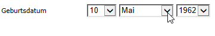</ph></source>
<target xml:lang="en-XX"><ph id="1" ctype="x-IMAGE"></ph></target>
</trans-unit>
<trans-unit id="tu137" xml:space="preserve">
<source xml:lang="en-US">To do this, click the <ph id="1" ctype="x-STRONG_EMPHASIS">**[!UICONTROL </ph>Advanced<ph id="3" ctype="x-LINK_REF">]**</ph> tab and choose the input mode using <ph id="5" ctype="x-STRONG_EMPHASIS">**[!UICONTROL </ph>Drop-down lists<ph id="7" ctype="x-LINK_REF">]**</ph>.</source>
<target xml:lang="en-XX">Wählen Sie dazu den Tab <ph id="1" ctype="x-STRONG_EMPHASIS">**[!UICONTROL </ph>Erweitert<ph id="3" ctype="x-LINK_REF">]**</ph> und danach den Eingabemodus <ph id="5" ctype="x-STRONG_EMPHASIS">**[!UICONTROL </ph>Dropdown-Liste<ph id="7" ctype="x-LINK_REF">]**</ph> aus.</target>
</trans-unit>
<trans-unit id="tu138" xml:space="preserve">
<source xml:lang="en-US"><ph id="1" ctype="x-IMAGE">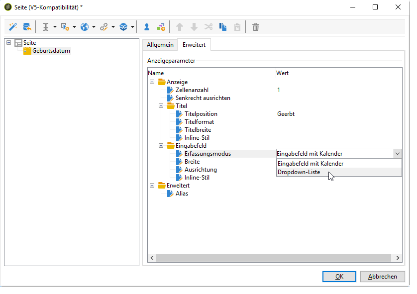</ph></source>
<target xml:lang="en-XX"><ph id="1" ctype="x-IMAGE"></ph></target>
</trans-unit>
<trans-unit id="tu139" xml:space="preserve">
<source xml:lang="en-US">You can then set limits to the values offered in the list.</source>
<target xml:lang="en-XX">Sie können dann die in der Liste angebotenen Werte einschränken.</target>
</trans-unit>
<trans-unit id="tu140" xml:space="preserve">
<source xml:lang="en-US"><ph id="1" ctype="x-IMAGE">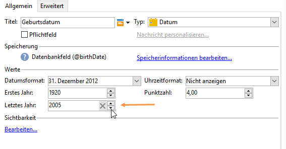</ph></source>
<target xml:lang="en-XX"><ph id="1" ctype="x-IMAGE"></ph></target>
</trans-unit>
<trans-unit id="tu141" xml:space="preserve">
<source xml:lang="en-US">Adding numbers</source>
<target xml:lang="en-XX">Zahlen hinzufügen</target>
</trans-unit>
<trans-unit id="tu142" xml:space="preserve">
<source xml:lang="en-US">You can create suitable fields for the entry of numbers.</source>
<target xml:lang="en-XX">Sie können Felder für die Eingabe von Zahlen erstellen.</target>
</trans-unit>
<trans-unit id="tu143" xml:space="preserve">
<source xml:lang="en-US"><ph id="1" ctype="x-IMAGE">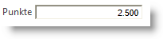</ph></source>
<target xml:lang="en-XX"><ph id="1" ctype="x-IMAGE"></ph></target>
</trans-unit>
<trans-unit id="tu144" xml:space="preserve">
<source xml:lang="en-US">In a numeric field, the user can enter numbers only. Entry control is applied automatically when the page is approved.</source>
<target xml:lang="en-XX">In einem numerischen Feld können Benutzende nur Zahlen eingeben. Die Eingabekontrolle erfolgt automatisch bei der Validierung der Seite.</target>
</trans-unit>
<trans-unit id="tu145" xml:space="preserve">
<source xml:lang="en-US">Depending on the field in which data is stored in the database, special formatting or certain restrictions may be applied. You can also specify maximum and minimum values. This type of field is configured as follows:</source>
<target xml:lang="en-XX">Abhängig vom Feld, in dem Daten in der Datenbank gespeichert werden, können spezielle Formatierungen oder bestimmte Einschränkungen angewendet werden. Sie können auch Mindest- und Höchstwerte angeben. Dieser Feldtyp wird wie folgt konfiguriert:</target>
</trans-unit>
<trans-unit id="tu146" xml:space="preserve">
<source xml:lang="en-US"><ph id="1" ctype="x-IMAGE">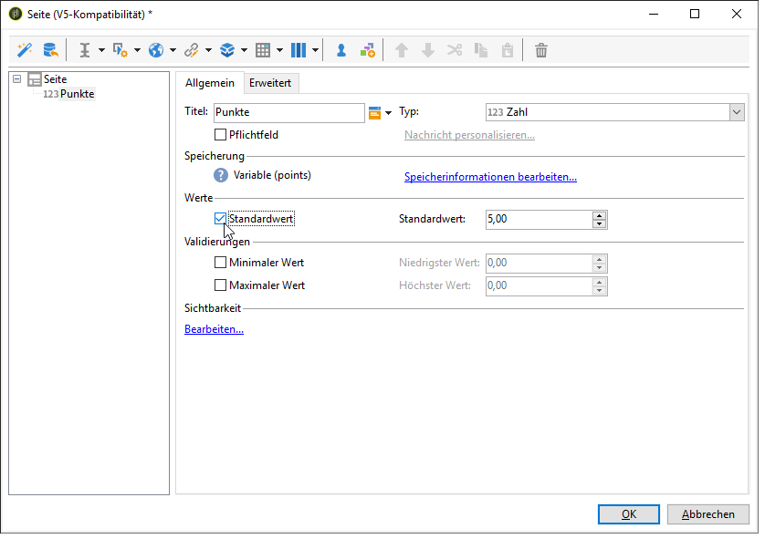</ph></source>
<target xml:lang="en-XX"><ph id="1" ctype="x-IMAGE"></ph></target>
</trans-unit>
<trans-unit id="tu147" xml:space="preserve">
<source xml:lang="en-US">The default value is the value displayed in the field when the form is published. It can be corrected by the user.</source>
<target xml:lang="en-XX">Der Standardwert ist der Wert, der bei der Veröffentlichung des Formulars im Feld angezeigt wird. Er kann von der Benutzerin bzw. dem Benutzer korrigiert werden.</target>
</trans-unit>
<trans-unit id="tu148" xml:space="preserve">
<source xml:lang="en-US">You can add a prefix and/or suffix to the numeric field via the <ph id="1" ctype="x-STRONG_EMPHASIS">**[!UICONTROL </ph>Advanced<ph id="3" ctype="x-LINK_REF">]**</ph> tab, as shown below:</source>
<target xml:lang="en-XX">Sie können zum numerischen Feld über den Tab <ph id="1" ctype="x-STRONG_EMPHASIS">**[!UICONTROL </ph>Erweitert<ph id="3" ctype="x-LINK_REF">]**</ph> wie unten gezeigt ein Präfix und/oder Suffix hinzufügen:</target>
</trans-unit>
<trans-unit id="tu149" xml:space="preserve">
<source xml:lang="en-US"><ph id="1" ctype="x-IMAGE">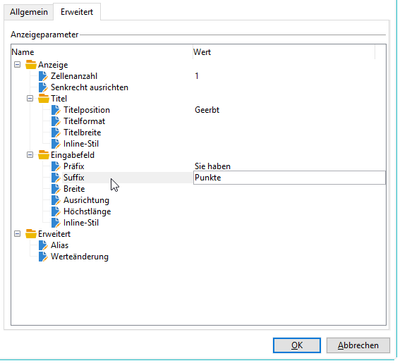</ph></source>
<target xml:lang="en-XX"><ph id="1" ctype="x-IMAGE"></ph></target>
</trans-unit>
<trans-unit id="tu150" xml:space="preserve">
<source xml:lang="en-US">In the form, the rendering will be as follows:</source>
<target xml:lang="en-XX">Im Formular sieht das Rendering folgendermaßen aus:</target>
</trans-unit>
<trans-unit id="tu151" xml:space="preserve">
<source xml:lang="en-US"><ph id="1" ctype="x-IMAGE">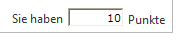</ph></source>
<target xml:lang="en-XX"><ph id="1" ctype="x-IMAGE"></ph></target>
</trans-unit>
<trans-unit id="tu152" xml:space="preserve">
<source xml:lang="en-US">Subscription checkboxes</source>
<target xml:lang="en-XX">Abonnement-Checkboxes</target>
</trans-unit>
<trans-unit id="tu153" xml:space="preserve">
<source xml:lang="en-US">You can add controls to allow users to subscribe to or unsubscribe from one or more information services (newsletters, warnings, real-time notifications, etc.). To subscribe, the user checks the corresponding service.</source>
<target xml:lang="en-XX">Sie können Steuerelemente hinzufügen, über die sich Benutzende für einen oder mehrere Informationsdienste anmelden oder von diesen abmelden können (Newsletter, Warnungen, Echtzeitbenachrichtigungen usw.). Um sich anzumelden, aktivieren Benutzende den entsprechenden Dienst.</target>
</trans-unit>
<trans-unit id="tu154" xml:space="preserve">
<source xml:lang="en-US">To create a subscription checkbox, click <ph id="1" ctype="x-STRONG_EMPHASIS">**[!UICONTROL </ph>Advanced controls>Subscription<ph id="3" ctype="x-LINK_REF">]**</ph>.</source>
<target xml:lang="en-XX">Wählen Sie zum Erstellen einer Abonnement-Checkbox <ph id="1" ctype="x-STRONG_EMPHASIS">**[!UICONTROL </ph>Erweiterte Steuerelemente > Abonnement<ph id="3" ctype="x-LINK_REF">]**</ph> aus.</target>
</trans-unit>
<trans-unit id="tu155" xml:space="preserve">
<source xml:lang="en-US"><ph id="1" ctype="x-IMAGE">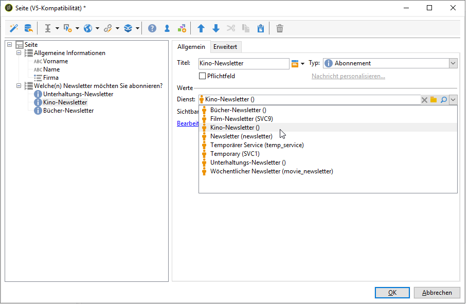</ph></source>
<target xml:lang="en-XX"><ph id="1" ctype="x-IMAGE"></ph></target>
</trans-unit>
<trans-unit id="tu156" xml:space="preserve">
<source xml:lang="en-US">Indicate the label for the checkbox and select the information service concerned using the <ph id="1" ctype="x-STRONG_EMPHASIS">**[!UICONTROL </ph>Service<ph id="3" ctype="x-LINK_REF">]**</ph> drop-down box.</source>
<target xml:lang="en-XX">Definieren Sie den Titel für die Checkbox und wählen Sie den entsprechenden Informationsdienst im Dropdown-Menü <ph id="1" ctype="x-STRONG_EMPHASIS">**[!UICONTROL </ph>Dienst<ph id="3" ctype="x-LINK_REF">]**</ph> aus.</target>
</trans-unit>
<trans-unit id="tu157" xml:space="preserve">
<source xml:lang="en-US"><ph id="1" ctype="x-regxph" equiv-text="[!NOTE">[!NOTE]</ph></source>
<target xml:lang="en-XX"><ph id="1" ctype="x-regxph" equiv-text="[!NOTE">[!NOTE]</ph></target>
</trans-unit>
<trans-unit id="tu158" xml:space="preserve">
<source xml:lang="en-US">Information services are detailed in <ph id="1" ctype="x-LINK">[</ph>this page<ph id="2" ctype="x-LINK">](../../delivery/using/managing-subscriptions.md)</ph>.</source>
<target xml:lang="en-XX">Informationsdienste werden auf <ph id="1" ctype="x-LINK">[</ph>dieser Seite<ph id="2" ctype="x-LINK">](../../delivery/using/managing-subscriptions.md)</ph> beschrieben.</target>
</trans-unit>
<trans-unit id="tu159" xml:space="preserve">
<source xml:lang="en-US">The user subscribes to the service by checking the relevant option.</source>
<target xml:lang="en-XX">Der Benutzer meldet sich zu diesem Dienst an, indem er die entsprechende Option markiert.</target>
</trans-unit>
<trans-unit id="tu160" xml:space="preserve">
<source xml:lang="en-US"><ph id="1" ctype="x-IMAGE">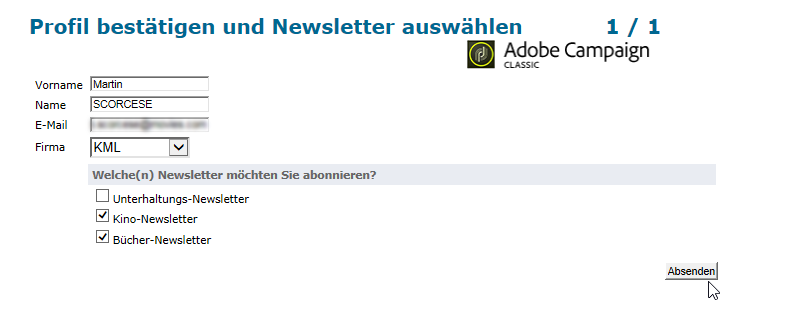</ph></source>
<target xml:lang="en-XX"><ph id="1" ctype="x-IMAGE"></ph></target>
</trans-unit>
<trans-unit id="tu161" xml:space="preserve">
<source xml:lang="en-US"><ph id="1" ctype="x-regxph" equiv-text="[!CAUTION">[!CAUTION]</ph></source>
<target xml:lang="en-XX"><ph id="1" ctype="x-regxph" equiv-text="[!CAUTION">[!CAUTION]</ph></target>
</trans-unit>
<trans-unit id="tu162" xml:space="preserve">
<source xml:lang="en-US">If the user is already subscribed to an information service and the box linked to this service isn't checked when they approve the form, they will be unsubscribed.</source>
<target xml:lang="en-XX">Wenn der Benutzer bereits zu einem Informationsdienst angemeldet ist und das mit diesem Dienst verknüpfte Kästchen bei der Validierung des Formulars nicht markiert ist, wird er abgemeldet.</target>
</trans-unit>
<trans-unit id="tu163" xml:space="preserve">
<source xml:lang="en-US">Inserting a captcha</source>
<target xml:lang="en-XX">Captcha einfügen</target>
</trans-unit>
<trans-unit id="tu164" xml:space="preserve">
<source xml:lang="en-US">The purpose of <ph id="1" ctype="x-STRONG_EMPHASIS">**</ph>captcha<ph id="2" ctype="x-STRONG_EMPHASIS">**</ph> tests is to prevent fraudulent use of your Web forms.</source>
<target xml:lang="en-XX">Mit <ph id="1" ctype="x-STRONG_EMPHASIS">**</ph>Captcha<ph id="2" ctype="x-STRONG_EMPHASIS">**</ph>-Tests können Sie verhindern, dass Ihre Webformulare missbräuchlich verwendet werden.</target>
</trans-unit>
<trans-unit id="tu165" xml:space="preserve">
<source xml:lang="en-US"><ph id="1" ctype="x-regxph" equiv-text="[!CAUTION">[!CAUTION]</ph></source>
<target xml:lang="en-XX"><ph id="1" ctype="x-regxph" equiv-text="[!CAUTION">[!CAUTION]</ph></target>
</trans-unit>
<trans-unit id="tu166" xml:space="preserve">
<source xml:lang="en-US">If your form contains several pages, the Captcha must always be placed on the last page, just before the storage box, to prevent any circumvention of the security measures.</source>
<target xml:lang="en-XX">Wenn Ihr Formular mehrere Seiten umfasst, muss das Captcha immer auf der letzten Seite unmittelbar vor der Komponente "Speicherung" platziert werden, um eine Umgehung der Sicherheitsmaßnahmen zu verhindern.</target>
</trans-unit>
<trans-unit id="tu167" xml:space="preserve">
<source xml:lang="en-US">To insert a Captcha into a form, click the first button on the toolbar and Select <ph id="1" ctype="x-STRONG_EMPHASIS">**[!UICONTROL </ph>Advanced controls>Captcha<ph id="3" ctype="x-LINK_REF">]**</ph>.</source>
<target xml:lang="en-XX">Um ein Captcha in ein Formular einzufügen, wählen Sie in der Symbolleiste die erste Schaltfläche und danach <ph id="1" ctype="x-STRONG_EMPHASIS">**[!UICONTROL </ph>Erweiterte Steuerelemente > Captcha<ph id="3" ctype="x-LINK_REF">]**</ph> aus.</target>
</trans-unit>
<trans-unit id="tu168" xml:space="preserve">
<source xml:lang="en-US"><ph id="1" ctype="x-IMAGE">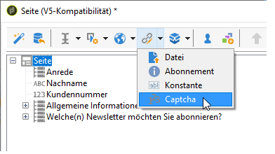</ph></source>
<target xml:lang="en-XX"><ph id="1" ctype="x-IMAGE"></ph></target>
</trans-unit>
<trans-unit id="tu169" xml:space="preserve">
<source xml:lang="en-US">Enter the label of the field. This label will be displayed in front of the Captcha display area. You can change the position of this label in the <ph id="1" ctype="x-STRONG_EMPHASIS">**[!UICONTROL </ph>Advanced<ph id="3" ctype="x-LINK_REF">]**</ph> tab.</source>
<target xml:lang="en-XX">Geben Sie den Titel des Felds ein. Dieser Titel wird vor dem Captcha-Anzeigebereich angezeigt. Sie können die Position dieses Titels im Tab <ph id="1" ctype="x-STRONG_EMPHASIS">**[!UICONTROL </ph>Erweitert<ph id="3" ctype="x-LINK_REF">]**</ph> ändern.</target>
</trans-unit>
<trans-unit id="tu170" xml:space="preserve">
<source xml:lang="en-US"><ph id="1" ctype="x-IMAGE">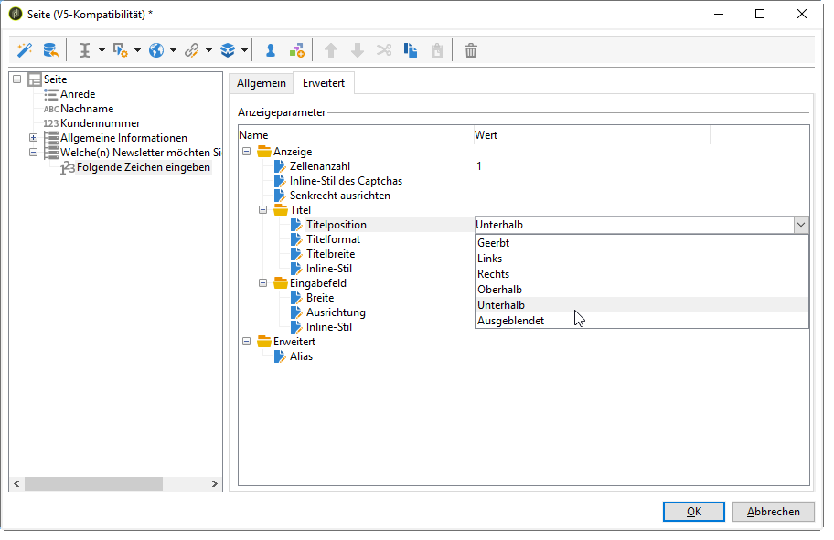</ph></source>
<target xml:lang="en-XX"><ph id="1" ctype="x-IMAGE"></ph></target>
</trans-unit>
<trans-unit id="tu171" xml:space="preserve">
<source xml:lang="en-US"><ph id="1" ctype="x-regxph" equiv-text="[!NOTE">[!NOTE]</ph></source>
<target xml:lang="en-XX"><ph id="1" ctype="x-regxph" equiv-text="[!NOTE">[!NOTE]</ph></target>
</trans-unit>
<trans-unit id="tu172" xml:space="preserve">
<source xml:lang="en-US">For <ph id="1" ctype="x-STRONG_EMPHASIS">**[!UICONTROL </ph>captcha<ph id="3" ctype="x-LINK_REF">]**</ph> type controls, there is no need to indicate a storage field or variable.</source>
<target xml:lang="en-XX">Für Steuerelemente vom Typ <ph id="1" ctype="x-STRONG_EMPHASIS">**[!UICONTROL </ph>Captcha<ph id="3" ctype="x-LINK_REF">]**</ph> muss weder ein Speicherfeld noch eine Variable angegeben werden.</target>
</trans-unit>
<trans-unit id="tu173" xml:space="preserve">
<source xml:lang="en-US">The Captcha is inserted into the page with an input field placed under the visual. These two elements are inseparable and are considered as a single item for the purpose of page layout (they occupy a single cell).</source>
<target xml:lang="en-XX">Das Captcha wird mit einem Eingabefeld unter dem visuellen Element in die Seite eingefügt. Diese beiden Elemente sind nicht trennbar und werden in Bezug auf das Seiten-Layout als ein einziges Objekt betrachtet (sie belegen eine einzige Zelle).</target>
</trans-unit>
<trans-unit id="tu174" xml:space="preserve">
<source xml:lang="en-US"><ph id="1" ctype="x-IMAGE">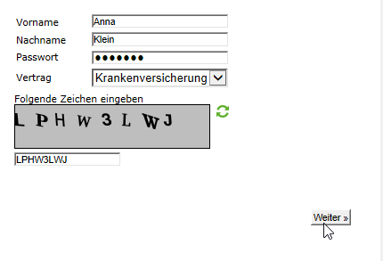</ph></source>
<target xml:lang="en-XX"><ph id="1" ctype="x-IMAGE"></ph></target>
</trans-unit>
<trans-unit id="tu175" xml:space="preserve">
<source xml:lang="en-US">When the page is confirmed, the input field is displayed in red if the content of the Captcha was not entered correctly.</source>
<target xml:lang="en-XX">Wenn der Inhalt des Captcha falsch eingegeben wurde, verfärbt sich das Eingabefeld bei der Validierung der Seite rot.</target>
</trans-unit>
<trans-unit id="tu176" xml:space="preserve">
<source xml:lang="en-US"><ph id="1" ctype="x-IMAGE">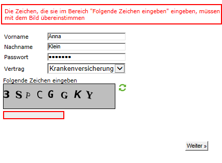</ph></source>
<target xml:lang="en-XX"><ph id="1" ctype="x-IMAGE"></ph></target>
</trans-unit>
<trans-unit id="tu177" xml:space="preserve">
<source xml:lang="en-US">You can create an error message to display. To do that, use the <ph id="1" ctype="x-STRONG_EMPHASIS">**[!UICONTROL </ph>Personalize the message<ph id="3" ctype="x-LINK_REF">]**</ph> link in the <ph id="5" ctype="x-STRONG_EMPHASIS">**[!UICONTROL </ph>General<ph id="7" ctype="x-LINK_REF">]**</ph> tab.</source>
<target xml:lang="en-XX">Sie können eine Fehlermeldung zur Anzeige erstellen. Verwenden Sie dazu den Link <ph id="1" ctype="x-STRONG_EMPHASIS">**[!UICONTROL </ph>Nachricht personalisieren<ph id="3" ctype="x-LINK_REF">]**</ph> auf der Registerkarte<ph id="5" ctype="x-STRONG_EMPHASIS">**[!UICONTROL </ph>Allgemein<ph id="7" ctype="x-LINK_REF">]**</ph>.</target>
</trans-unit>
<trans-unit id="tu178" xml:space="preserve">
<source xml:lang="en-US"><ph id="1" ctype="x-IMAGE">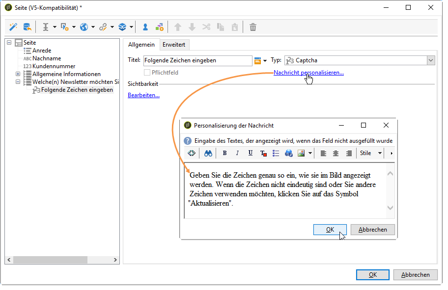</ph></source>
<target xml:lang="en-XX"><ph id="1" ctype="x-IMAGE"></ph></target>
</trans-unit>
<trans-unit id="tu179" xml:space="preserve">
<source xml:lang="en-US"><ph id="1" ctype="x-regxph" equiv-text="[!NOTE">[!NOTE]</ph></source>
<target xml:lang="en-XX"><ph id="1" ctype="x-regxph" equiv-text="[!NOTE">[!NOTE]</ph></target>
</trans-unit>
<trans-unit id="tu180" xml:space="preserve">
<source xml:lang="en-US">Captchas are always 8 characters long. You cannot modify this value.</source>
<target xml:lang="en-XX">Captchas sind immer 8 Zeichen lang. Dieser Wert kann nicht geändert werden.</target>
</trans-unit>
<trans-unit id="tu181" xml:space="preserve">
<source xml:lang="en-US">Uploading a file</source>
<target xml:lang="en-XX">Datei hochladen</target>
</trans-unit>
<trans-unit id="tu182" xml:space="preserve">
<source xml:lang="en-US">You can add an upload field to a page. This functionality can be useful for intranet file sharing, for instance.</source>
<target xml:lang="en-XX">Sie können einer Seite ein Feld zum Hochladen von Inhalten hinzufügen. Diese Funktion kann beispielsweise zur Dateifreigabe im Intranet nützlich sein.</target>
</trans-unit>
<trans-unit id="tu183" xml:space="preserve">
<source xml:lang="en-US"><ph id="1" ctype="x-IMAGE">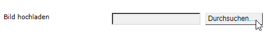</ph></source>
<target xml:lang="en-XX"><ph id="1" ctype="x-IMAGE"></ph></target>
</trans-unit>
<trans-unit id="tu184" xml:space="preserve">
<source xml:lang="en-US">To insert an upload field to a form page, select the <ph id="1" ctype="x-STRONG_EMPHASIS">**[!UICONTROL </ph>Advanced controls > File...<ph id="3" ctype="x-LINK_REF">]**</ph> menu in the toolbar of the page editor.</source>
<target xml:lang="en-XX">Um ein Upload-Feld in eine Formularseite einzufügen, wählen Sie in der Symbolleiste des Seiteneditors die Schaltfläche <ph id="1" ctype="x-STRONG_EMPHASIS">**[!UICONTROL </ph>Erweiterte Steuerelemente > Datei...<ph id="3" ctype="x-LINK_REF">]**</ph> aus.</target>
</trans-unit>
<trans-unit id="tu185" xml:space="preserve">
<source xml:lang="en-US">By default, the uploaded files are stored in resource files accessible via the <ph id="1" ctype="x-STRONG_EMPHASIS">**[!UICONTROL </ph>Resources > Online > Public resources<ph id="3" ctype="x-LINK_REF">]**</ph> menu. You can use a script to change this behavior. This script can use the functions defined in <ph id="5" ctype="x-LINK">[</ph>Campaign JSAPI documentation<ph id="6" ctype="x-LINK">[#$tu186]</ph>, including those that concern file manipulation.</source>
<target xml:lang="en-XX">Standardmäßig werden die hochgeladenen Dateien in Ressourcendateien gespeichert, auf die über das Menü <ph id="1" ctype="x-STRONG_EMPHASIS">**[!UICONTROL </ph>Ressourcen > Online > Öffentliche Ressourcen<ph id="3" ctype="x-LINK_REF">]**</ph> zugegriffen werden kann. Sie können ein Skript verwenden, um dieses Verhalten zu ändern. Dieses Script kann die in der <ph id="5" ctype="x-LINK">[</ph>Campaign JSAPI-Dokumentation<ph id="6" ctype="x-LINK">[#$tu186]</ph> definierten Funktionen verwenden, einschließlich derjenigen zur Dateibearbeitung.</target>
</trans-unit>
<trans-unit id="tu187" xml:space="preserve">
<source xml:lang="en-US">You can store the link to these files in a local variable or in a database field. For example, you can extend the recipient schema to add a link to file-based resources.</source>
<target xml:lang="en-XX">Sie können den Link zu diesen Dateien in einer lokalen Variable oder in einem Datenbankfeld speichern. Beispielsweise können Sie das Empfängerschema erweitern und einen Link zu dateibasierten Ressourcen hinzufügen.</target>
</trans-unit>
<trans-unit id="tu188" xml:space="preserve">
<source xml:lang="en-US"><ph id="1" ctype="x-regxph" equiv-text="[!CAUTION">[!CAUTION]</ph></source>
<target xml:lang="en-XX"><ph id="1" ctype="x-regxph" equiv-text="[!CAUTION">[!CAUTION]</ph></target>
</trans-unit>
<trans-unit id="tu189" xml:space="preserve">
<source xml:lang="en-US">This type of file must be reserved for forms with secure access (using credentials).</source>
<target xml:lang="en-XX">Dieser Dateityp muss für Formulare mit sicherem Zugriff (über Anmeldedaten) reserviert werden.</target>
</trans-unit>
<trans-unit id="tu190" xml:space="preserve">
<source xml:lang="en-US">Adobe Campaign does not control the size or the type of resource uploaded: we therefore highly recommend using upload fields for secure type intranet sites only.</source>
<target xml:lang="en-XX">Adobe Campaign kontrolliert nicht die Größe oder den Typ der hochgeladenen Ressource. Deshalb empfehlen wir dringend, Upload-Felder ausschließlich für sichere Intranet-Sites zu verwenden.</target>
</trans-unit>
<trans-unit id="tu191" xml:space="preserve">
<source xml:lang="en-US">If several servers are linked to the instance (load balancing architecture), you need to make sure calls to the Web form arrive on the same server.</source>
<target xml:lang="en-XX">Wenn mehrere Server mit der Instanz verbunden sind (Architektur mit Lastausgleich), müssen Sie darauf achten, dass Abfragen zum Webformular auf demselben Server erfolgen.</target>
</trans-unit>
<trans-unit id="tu192" xml:space="preserve">
<source xml:lang="en-US">These implementations require the assistance of the Adobe Campaign Consulting team.</source>
<target xml:lang="en-XX">Diese Implementierungen erfordern die Hilfe des Adobe Campaign-Teams.</target>
</trans-unit>
<trans-unit id="tu193" xml:space="preserve">
<source xml:lang="en-US">Inserting a hidden constant</source>
<target xml:lang="en-XX">Ausgeblendete Konstante einfügen</target>
</trans-unit>
<trans-unit id="tu194" xml:space="preserve">
<source xml:lang="en-US">When the user validates one of the pages of the form, you can set a specific value to a field of their profile or to a variable.</source>
<target xml:lang="en-XX">Wenn der Benutzer eine der Seiten des Formulars validiert, können Sie einen bestimmten Wert in einem Feld seines Profils oder in einer Variable setzen.</target>
</trans-unit>
<trans-unit id="tu195" xml:space="preserve">
<source xml:lang="en-US">This field is not visible to the user, but can be used to enrich the data in the user profile.</source>
<target xml:lang="en-XX">Dieses Feld ist nicht sichtbar für den Benutzer, kann aber für die Anreicherung der Daten im Benutzerprofil verwendet werden.</target>
</trans-unit>
<trans-unit id="tu196" xml:space="preserve">
<source xml:lang="en-US">To do this, place a <ph id="1" ctype="x-STRONG_EMPHASIS">**</ph>constant<ph id="2" ctype="x-STRONG_EMPHASIS">**</ph> in the page and specify the value and the storage location.</source>
<target xml:lang="en-XX">Fügen Sie dazu eine <ph id="1" ctype="x-STRONG_EMPHASIS">**</ph>Konstante<ph id="2" ctype="x-STRONG_EMPHASIS">**</ph> auf der Seite hinzu und geben Sie den Wert und den Speicherort an.</target>
</trans-unit>
<trans-unit id="tu197" xml:space="preserve">
<source xml:lang="en-US">In the following example, the <ph id="1" ctype="x-STRONG_EMPHASIS">**</ph>origin<ph id="2" ctype="x-STRONG_EMPHASIS">**</ph> field of the recipient profile is filled in automatically whenever a user approves this page. The constant is not displayed on the page.</source>
<target xml:lang="en-XX">Im folgenden Beispiel wird das Feld <ph id="1" ctype="x-STRONG_EMPHASIS">**</ph>Herkunft<ph id="2" ctype="x-STRONG_EMPHASIS">**</ph> des Empfängerprofils automatisch ausgefüllt, sobald ein Benutzer diese Seite genehmigt. Die Konstante wird auf der Seite nicht angezeigt.</target>
</trans-unit>
<trans-unit id="tu198" xml:space="preserve">
<source xml:lang="en-US"><ph id="1" ctype="x-IMAGE">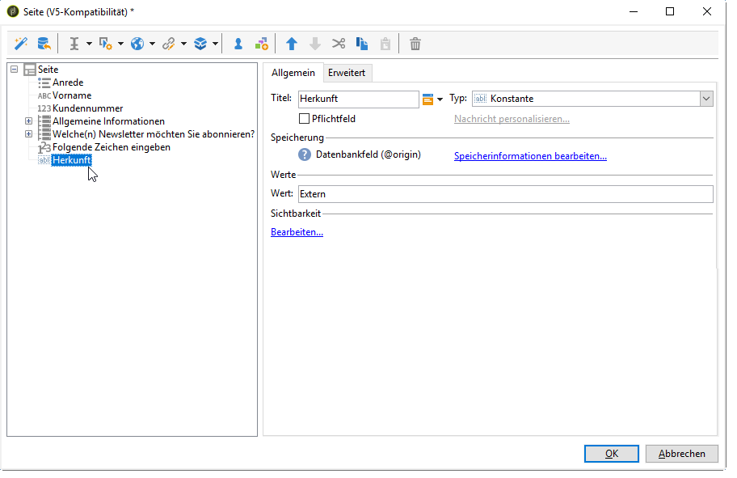</ph></source>
<target xml:lang="en-XX"><ph id="1" ctype="x-IMAGE"></ph></target>
</trans-unit>
</body>
</file>
</xliff>