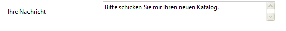
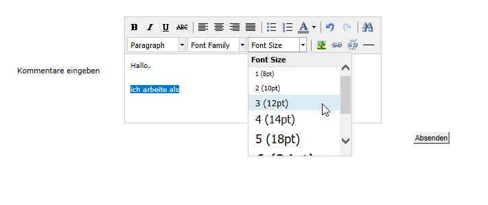

# Felder zu einem Webformular hinzufügen{#adding-fields-to-a-web-form}

Über Felder eines Webformulars können Benutzer Informationen eingeben und Optionen auswählen. Webformulare können Eingabefelder, Auswahlfelder sowie statische und erweiterte Inhalte (Captchas, Abonnements etc.) enthalten.

Wenn Sie über den Assistenten Felder hinzufügen, wird der Feldtyp automatisch auf der Basis des ausgewählten Felds oder der Speichervariablen erkannt. Den Feldtyp können Sie im Tab **[!UICONTROL Allgemein]** über das Dropdown-Feld **[!UICONTROL Typ]** bearbeiten.

Wenn Sie die Schaltflächen in der Symbolleiste verwenden, wählen Sie den Typ des Felds aus, das Sie hinzufügen möchten.

Folgende Feldtypen sind verfügbar:

* Text-/Zahleneingabe. Siehe [Eingabefelder hinzufügen](#adding-input-fields).
* Auswahl per Dropdown-Liste. Siehe [Dropdown-Listen hinzufügen](#adding-drop-down-lists).
* Multiple Choice über Checkboxes. Siehe [Checkboxes hinzufügen ](#adding-checkboxes).
* Auswahl über Radiobuttons. Siehe [Radiobuttons hinzufügen](#adding-radio-buttons).
* Abstimmungsoptionen in einer Tabelle. Siehe [Tabellen hinzufügen](#adding-grids).
* Zahlen und Daten. Siehe [Datum und Zahlen hinzufügen](#adding-dates-and-numbers).
* Anmeldung/Abmeldung für einen Informationsdienst. Siehe [Abonnement-Checkboxes](#subscription-checkboxes).
* Captcha-Prüfung. Siehe [Captcha einfügen](#inserting-a-captcha).
* Schaltfläche „Herunterladen“. [Datei hochladen](#uploading-a-file).
* Ausgeblendete Konstante. Siehe [Ausgeblendete Konstante einfügen](#inserting-a-hidden-constant).

Spezifizieren Sie den Speichermodus für Antworten: ein Feld in der Datenbank aktualisieren (nur der zuletzt gespeicherte Wert wird behalten) oder in einer Variablen speichern (die Antwort wird nicht aufbewahrt). Weiterführende Informationen finden Sie im Abschnitt [Speicherfelder für Antworten](../../web/using/web-forms-answers.md#response-storage-fields).

>[!NOTE]
>
>Standardmäßig wird das Feld am unteren Ende des aktuellen Baums eingefügt. Mit den Pfeilen in der Symbolleiste kann das Feld hinauf und hinunter bewegt werden.

## Feld-Assistent {#field-creation-wizard}

Über die erste Schaltfläche der Symbolleiste können Sie Felder in jede Formularseite einfügen. Gehen Sie dazu zum Menü **[!UICONTROL Mit Hilfe des Assistenten hinzufügen]**.

Wählen Sie den Typ des zu erstellenden Felds aus: Sie können ein Feld der Datenbank oder eine Variable hinzufügen oder eine Feldergruppe importieren, die in einem anderen Formular erstellt wurde und in einem Container zusammengefasst ist.

Wählen Sie **[!UICONTROL Weiter]** und danach das Speicherfeld, die Variable oder den zu importierenden Container aus.

Wählen Sie **[!UICONTROL Beenden]** aus, um das ausgewählte Feld in die Seite einzufügen.

## Eingabefelder hinzufügen {#adding-input-fields}

Um ein Eingabefeld hinzuzufügen, wählen Sie die Schaltfläche **[!UICONTROL Eingabedialog]** und danach den hinzuzufügenden Feldtyp aus.

### Typen von Eingabefeldern {#types-of-input-fields}

Auf einer Formularseite können fünf Typen von Textfeldern eingefügt werden:

* **Text**: ermöglicht dem Benutzer die Texteingabe in einer einzigen Zeile.

   

* **Zahl**: ermöglicht dem Benutzer die Zahleneingabe in einer einzigen Zeile. Weitere Informationen hierzu finden Sie im Abschnitt [Zahlen hinzufügen](#adding-numbers).

   Bei der Validierung der Seite wird der Feldinhalt geprüft, um sicherzugehen, dass der eingegebene Wert mit dem Feld kompatibel ist. Weiterführende Informationen finden Sie unter [Kontrolleinstellungen definieren](../../web/using/form-rendering.md#defining-control-settings).

* **Passwort**: ermöglicht dem Benutzer die Texteingabe in einer einzigen Zeile. Während der Texteingabe werden die Buchstaben durch Punkte ersetzt:

   

   >[!CAUTION]
   >
   >Passwörter werden unverschlüsselt in der Datenbank gespeichert.

* **Mehrzeiliger Text**: ermöglicht dem Benutzer die Texteingabe in mehreren Zeilen.

   

   >[!CAUTION]
   >
   >Mehrzeilige Textfelder sind spezielle Felder, die Zeilenumbrüche enthalten können. Ihr Speicherplatz muss mit einem Feld verknüpft sein, das mit einem XML-Element, und nicht einem XML-Attribut gemappt ist. Weiterführende Informationen zu Datentypen in Schemata finden Sie im Kapitel &quot;Schema reference&quot; in [diesem Abschnitt](../../configuration/using/about-schema-reference.md).
   >   
   >Wenn Sie das **Umfragemodul** verwenden, können Sie diesen Feldtyp in einem archivierten Feld speichern, das sich automatisch an das jeweilige Format anpasst. Weiterführende Informationen dazu finden Sie in [diesem Abschnitt](../../web/using/about-surveys.md).

* **Angereicherter mehrzeiliger Text**: ermöglicht dem Benutzer die Eingabe von Text mit einem Layout, das im HTML-Format gespeichert wird.

   

   Sie können den Typ des Editors auswählen, der den Benutzern bereitgestellt wird. Verwenden Sie dazu im Tab **[!UICONTROL Erweitert]** die Dropdown-Liste des Felds **[!UICONTROL HTML-Editor]**.

   

   Die Anzahl der angezeigten Symbole ändert sich entsprechend dem Editor-Typ. Für einen **[!UICONTROL erweiterten]** Editor sieht das Rendering folgendermaßen aus:

   

### Eingabefelder konfigurieren {#configure-input-fields}

Eingabefelder werden auf der Basis desselben Modus unter Verwendung der folgenden Optionen konfiguriert:

Im Tab **[!UICONTROL Allgemein]** können Sie den Namen des Felds eingeben und bei Bedarf einen Standardwert zuweisen.

Der Speichermodus für Antworten kann über den Link **[!UICONTROL Speicherinformationen bearbeiten...]** geändert werden. Werte können in einem vorhandenen Feld der Datenbank gespeichert werden. Sie haben auch die Möglichkeit, die Informationen nicht in der Datenbank zu speichern (sondern eine lokale Variable zu verwenden).

>[!NOTE]
>
>Speichermodi werden unter [Speicherfelder für Antworten](../../web/using/web-forms-answers.md#response-storage-fields) detailliert beschrieben.

Im Tab **[!UICONTROL Erweitert]** können Sie Anzeigeparameter für das Feld definieren (Position der Titel, Ausrichtung etc.). Siehe [Layout eines Webformulars definieren](../../web/using/defining-web-forms-layout.md).

## Dropdown-Listen hinzufügen {#adding-drop-down-lists}

Sie können in Umfrageseiten Dropdown-Listen einfügen, aus denen die Benutzer einen Wert auswählen können.

Um eine Dropdown-Liste in eine Formularseite einzufügen, wählen Sie in der Symbolleiste des Seiteneditors die Schaltfläche **[!UICONTROL Auswahldialog > Dropdown-Liste]** aus.

Wählen Sie den Speichermodus für die Antworten aus und bestätigen Sie Ihre Auswahl.

Definieren Sie die Titel und Werte der Liste im unteren Bereich des Tabs **[!UICONTROL Allgemein]**. Wenn die Informationen in einem vorhandenen Feld der Datenbank gespeichert werden und es sich um ein Auflistungsfeld handelt, können Sie die Werte automatisch ausfüllen lassen, indem Sie wie unten gezeigt **[!UICONTROL Werteliste aus der Datenbank übernehmen]** auswählen:

>[!NOTE]
>
>Die Reihenfolge der Werte können Sie mit den Pfeilen rechts neben der Liste ändern.

Wenn die Daten in einer verknüpften Tabelle gespeichert sind, können Sie das Feld auswählen, in dem die in der Liste aufgeführten Werte gespeichert sind. Wenn Sie beispielsweise die Tabelle der Länder auswählen, wählen Sie zuerst **[!UICONTROL Werteliste aus der Datenbank übernehmen...]** und danach das gewünschte Feld aus.

Wählen Sie danach den Link **[!UICONTROL Laden]** aus, um die Werte abzurufen:

>[!CAUTION]
>
>Wiederholen Sie diesen Vorgang bei jeder Änderung der Liste, um die angebotenen Werte zu aktualisieren.

## Checkboxes hinzufügen {#adding-checkboxes}

Mit Checkboxes stellen Sie Benutzern eine Auswahlmöglichkeit für Optionen zur Verfügung.

Um eine Checkbox in ein Formular einzufügen, wählen Sie in der Symbolleiste des Seiteneditors die Schaltfläche **[!UICONTROL Auswahldialog > Checkbox]** aus.

Wählen Sie den Speichermodus für die Antworten aus und bestätigen Sie Ihre Auswahl.

Geben Sie im Tab **[!UICONTROL Allgemein]** im Feld **[!UICONTROL Titel]** den Titel der Checkbox ein.

Mit einer Checkbox können Sie dem Speicherfeld (oder Wert) einen Wert zuweisen, je nachdem ob das Kästchen markiert ist oder nicht. Im Bereich **[!UICONTROL Werte]** können Sie einen Wert eingeben, der zugewiesen wird, wenn das Kästchen markiert wird (im Feld **[!UICONTROL Wert]**), und einen Wert, der zugewiesen wird, wenn das Kästchen nicht markiert wird (im Feld **[!UICONTROL Leerer Wert]**). Diese Werte hängen vom Datenspeicherungsformat ab.

Wenn das Speicherfeld (oder die Variable) boolesch ist, wird der zuzuweisende Wert automatisch abgezogen, wenn das Kästchen nicht markiert wird. In diesem Fall wird nur das Feld **[!UICONTROL Wert, wenn angekreuzt]** wie unten gezeigt angeboten:

## Beispiel: Wert einem Feld zuweisen, wenn ein Kästchen markiert wird {#example--assign-a-value-to-a-field-if-a-box-is-checked}

Eine Checkbox soll in ein Formular eingefügt werden, damit wie unten gezeigt ein Wartungsantrag gesendet wird.

Diese Informationen werden in die Datenbank und ein vorhandenes Feld hochgeladen (in diesem Fall das Feld **[!UICONTROL Kommentar]**):

Wenn das Kästchen &quot;Wartung erforderlich&quot; markiert wird, enthält die Spalte **[!UICONTROL Kommentar]** den Hinweis &quot;Wartung erforderlich&quot;. Wenn das Kästchen nicht markiert wird, wird in der Spalte &quot;Wartung nicht erforderlich&quot; angezeigt. Um dieses Ergebnis zu erhalten, konfigurieren Sie die Checkbox auf der Formularseite wie folgt:

## Radiobuttons hinzufügen {#adding-radio-buttons}

Mit Radiobuttons können Sie Benutzern eine Reihe von einzelnen Optionen zur Auswahl anbieten. Dabei handelt es sich um unterschiedliche Werte für dasselbe Feld.

Sie können Radiobuttons einzeln erstellen (Einzel-Schaltflächen) oder über eine Multiple-Choice-Liste. Aber weil der Zweck von Radiobuttons die Auswahl einer Option ist, werden immer zumindest zwei Radiobuttons erstellt, und nie nur ein einzelner.

>[!CAUTION]
>
>Um die Auswahl obligatorisch zu machen, müssen Sie eine Multiple-Choice-Liste erstellen.

### Einzelne Schaltflächen hinzufügen {#add-single-buttons}

Um einen Radiobutton zu einer Formularseite hinzuzufügen, gehen Sie in der Symbolleiste des Seiteneditors zum Menü **[!UICONTROL Auswahldialog > Radiobutton]** und wählen Sie einen Speichermodus aus.

Radiobuttons werden ähnlich konfiguriert wie Checkboxes (siehe [Checkboxes hinzufügen](#adding-checkboxes)). Wenn die Option nicht ausgewählt ist, wird jedoch kein Wert zugewiesen. Damit mehrere Schaltflächen voneinander abhängen, d. h. die Auswahl einer Schaltfläche automatisch die Auswahl der anderen deaktiviert, müssen sie im selben Feld gespeichert werden. Wenn sie nicht in der Datenbank gespeichert sind, muss dieselbe lokale Variable für die temporäre Speicherung verwendet werden. Siehe [Speicherfelder für Antworten](../../web/using/web-forms-answers.md#response-storage-fields).

### Liste mit Schaltflächen hinzufügen {#add-a-list-of-buttons}

Um Radiobuttons über eine Liste hinzuzufügen, gehen Sie in der Symbolleiste des Seiteneditors zum Menü **[!UICONTROL Auswahldialog > Multiple Choice]**.

Fügen Sie so viele Radiobuttons hinzu wie Titel vorhanden sind. Der Vorteil dieser Funktion liegt darin, dass Sie Werte aus einem vorhandenen Feld importieren können (im Fall eines Auflistungsfelds) und der Benutzer daraus eine Option auswählen kann. Das Layout der Schaltflächen ist jedoch weniger flexibel.

>[!NOTE]
>
>Webformulare ermöglichen nicht die Auswahl mehrerer Werte. Die Mehrfachauswahl kann nur für Formulare vom Typ **Umfrage** aktiviert werden. Weiterführende Informationen dazu finden Sie in [diesem Abschnitt](../../web/using/about-surveys.md).\
>Es ist jedoch möglich, ein Feld vom Typ **[!UICONTROL Multiple Choice]** in eine Webanwendung einzufügen, ohne die Auswahl mehrerer Werte zu ermöglichen: Die angebotenen Optionen können mithilfe von Radiobuttons ausgewählt werden.

## Tabellen hinzufügen {#adding-grids}

Mit Tabellen können Sie Abstimmungsseiten in Webanwendungen erstellen. Sie haben damit die Möglichkeit, wie unten gezeigt, Listen mit Radiobuttons zur Beantwortung von Umfragen oder Webformulare zur Abgabe einer Bewertung anzubieten.

Um diesen Elementtyp in einem Formular zu verwenden, erstellen Sie eine einfache Tabelle und fügen Sie für jedes zu bewertende Element eine Zeile hinzu.

Die Anzahl der Radiobuttons in jeder Zeile der Tabelle entspricht der Anzahl der in der einfachen Tabelle definierten Werte.

Pro Tabellenzeile kann nur eine Option ausgewählt werden.

>[!NOTE]
>
>In unserem Beispiel ist der Titel der Tabelle ausgeblendet. Gehen Sie dazu zum Tab **[!UICONTROL Erweitert]**. Die Anzeige **[!UICONTROL Titelposition]** ist als **[!UICONTROL Ausgeblendet]** definiert. Siehe [Die Position von Titeln definieren](../../web/using/defining-web-forms-layout.md#defining-the-position-of-labels).

## Datum und Zahlen hinzufügen {#adding-dates-and-numbers}

Der Inhalt eines Formularfeldes kann entsprechend den in der Datenbank gespeicherten Daten oder einer anderen Anforderung formatiert werden. Sie können für die Eingabe von Zahlen und Daten passende Felder erstellen.

### Datum hinzufügen {#adding-dates}

Um Benutzern die Eingabe eines Datums in eine Formularseite zu ermöglichen, wählen Sie in der Symbolleiste oder im Seiteneditor **[!UICONTROL Add input field > Datum...]** aus.

Geben Sie einen Titel für das Feld ein und konfigurieren Sie den Datenspeichermodus.

Im unteren Bereich des Fensters können Sie die Formate für Datum und Uhrzeit für die in diesem Feld gespeicherten Werte auswählen.

Das Datum (oder die Uhrzeit) kann angezeigt oder ausgeblendet werden.

Das Datum kann über einen Kalender oder ein Dropdown-Fenster ausgewählt werden. Es kann auch direkt in das Feld eingegeben werden, es muss aber dem im obigen Bildschirm spezifizierten Format entsprechen.

>[!NOTE]
>
>Standardmäßig wird ein in einem Formular verwendetes Datum über einen Kalender eingegeben. Achten Sie bei mehrsprachigen Formularen darauf, dass die Kalender in allen verwendeten Sprachen verfügbar sind. Siehe [Webformular übersetzen](../../web/using/translating-a-web-form.md).

In manchen Fällen kann es aber einfacher sein, Dropdown-Listen zu verwenden, z. B. zur Eingabe des Geburtsdatums.

Wählen Sie dazu den Tab **[!UICONTROL Erweitert]** und danach den Eingabemodus **[!UICONTROL Dropdown-Liste]** aus.

Sie können dann die in der Liste angebotenen Werte einschränken.

### Zahlen hinzufügen {#adding-numbers}

Sie können Felder für die Eingabe von Zahlen erstellen.

In einem numerischen Feld kann der Benutzer nur Zahlen eingeben. Die Eingabekontrolle erfolgt automatisch bei der Validierung der Seite.

Abhängig vom Feld, in dem Daten in der Datenbank gespeichert werden, kann eine spezielle Formatierung oder bestimmte Beschränkungen angewendet werden. Sie können auch Mindest- und Höchstwerte spezifizieren. Dieser Feldtyp wird folgendermaßen konfiguriert:

Der Standardwert ist der in dem Feld angezeigte Wert, wenn das Formular publiziert wird. Er kann vom Benutzer geändert werden.

Sie können zum numerischen Feld über den Tab **[!UICONTROL Erweitert]** wie unten gezeigt ein Präfix und/oder Suffix hinzufügen:

Im Formular sieht das Rendering folgendermaßen aus:

## Abonnement-Checkboxes {#subscription-checkboxes}

Sie können Steuerelemente hinzufügen, über die sich Benutzer für eines oder mehrere Informationsdienste anmelden oder abmelden können (Newsletter, Warnhinweise, Echtzeit-Benachrichtigungen etc.). Der Benutzer muss die entsprechende Option markieren, um sich anzumelden.

Wählen Sie zum Erstellen einer Abonnement-Checkbox **[!UICONTROL Erweiterte Steuerelemente > Abonnement]** aus.

Definieren Sie den Titel für die Checkbox und wählen Sie den entsprechenden Informationsdienst im Dropdown-Menü **[!UICONTROL Dienst]** aus.

>[!NOTE]
>
>Informationsdienste werden auf [dieser Seite](../../delivery/using/managing-subscriptions.md) beschrieben.

Der Benutzer meldet sich zu diesem Dienst an, indem er die entsprechende Option markiert.

>[!CAUTION]
>
>Wenn der Benutzer bereits zu einem Informationsdienst angemeldet ist und das mit diesem Dienst verknüpfte Kästchen bei der Validierung des Formulars nicht markiert ist, wird er abgemeldet.

Beispiele für Abonnements und Anwerbungen finden Sie in [diesem Abschnitt](../../web/using/about-surveys.md).

## Captcha einfügen {#inserting-a-captcha}

Mit **Captcha**-Tests können Sie verhindern, dass Ihre Webformulare missbräuchlich verwendet werden.

>[!CAUTION]
>
>Wenn Ihr Formular mehrere Seiten umfasst, muss das Captcha immer auf der letzten Seite unmittelbar vor der Komponente &quot;Speicherung&quot; platziert werden, um eine Umgehung der Sicherheitsmaßnahmen zu verhindern.

Um ein Captcha in ein Formular einzufügen, wählen Sie in der Symbolleiste die erste Schaltfläche und danach **[!UICONTROL Erweiterte Steuerelemente > Captcha]** aus.

Geben Sie den Titel des Feldes ein. Dieser Titel wird vor dem Captcha zu sehen sein. Sie können die Position dieses Titels im Tab **[!UICONTROL Erweitert]** ändern.

>[!NOTE]
>
>Für Steuerelemente vom Typ **[!UICONTROL Captcha]** muss weder ein Speicherfeld noch eine Variable angegeben werden.

Das Captcha wird in eine Seite eingefügt, sodass unter der Darstellung ein Eingabefeld bereitgestellt wird. Diese beiden Elemente sind nicht trennbar und werden in Bezug auf das Seitenlayout als ein einziges Objekt erachtet (sie sind in einer einzigen Zelle untergebracht).

Wenn der Inhalt des Captcha falsch eingegeben wurde, verfärbt sich das Eingabefeld bei der Validierung der Seite rot.

Sie können auch eine Fehlernachricht erstellen, die angezeigt wird. Verwenden Sie dazu den Link **[!UICONTROL Nachricht personalisieren...]** im Tab **[!UICONTROL Allgemein]**.

>[!NOTE]
>
>Captchas sind immer acht Zeichen lang. Dieser Wert kann nicht geändert werden.

## Datei hochladen {#uploading-a-file}

Sie können ein Upload-Feld zu einer Seite hinzufügen. Diese Funktion kann z. B. zur Dateifreigabe im Intranet nützlich sein.

Um ein Upload-Feld in eine Formularseite einzufügen, wählen Sie in der Symbolleiste des Seiteneditors die Schaltfläche **[!UICONTROL Erweiterte Steuerelemente > Datei...]** aus.

Standardmäßig werden die hochgeladenen Dateien in Ressourcendateien gespeichert, die über das Menü **[!UICONTROL Ressourcen > Online > Öffentliche Ressourcen]** zugänglich sind. Sie können ein Skript verwenden, um dieses Verhalten zu ändern. Dieses Skript kann die in der [Campaign JSAPI-Dokumentation](https://docs.adobe.com/content/help/en/campaign-classic/technicalresources/api/index.html) definierten Funktionen verwenden, einschließlich derjenigen zur Dateibearbeitung.

Sie können den Link zu diesen Dateien in einer lokalen Variablen oder in einem Datenbankfeld speichern. Beispielsweise können Sie das Empfängerschema erweitern und einen Link zu dateibasierten Ressourcen hinzufügen.

>[!CAUTION]
>
>* Dieser Dateityp muss für Formulare mit sicherem Zugriff (über Zugangsdaten) reserviert werden.
>* Adobe Campaign kontrolliert nicht die Größe oder den Typ der hochgeladenen Ressource. Deshalb empfehlen wir dringend, Upload-Felder ausschließlich für sichere Intranet-Sites zu verwenden.
>* Wenn mehrere Server mit der Instanz verbunden sind (Architektur mit Lastausgleich), müssen Sie darauf achten, dass Abfragen zum Webformular auf demselben Server erfolgen.
>* Diese Implementierungen erfordern die Hilfe des Adobe Campaign-Teams.

>

## Ausgeblendete Konstante einfügen {#inserting-a-hidden-constant}

Sie können einem Feld einen Wert zuweisen, wenn ein Benutzer eine Seite besucht. Platzieren Sie dazu eine Konstante auf die Seite und spezifizieren Sie den Wert und den Speicherort.

Dieses Feld ist nicht sichtbar für den Benutzer, kann aber für die Anreicherung der Daten im Benutzerprofil verwendet werden.

Im folgenden Beispiel wird die Datei **Herkunft** des Empfängerprofils automatisch ausgefüllt, wenn ein Benutzer diese Seite bestätigt. Die Konstante wird nicht auf der Seite angezeigt.

