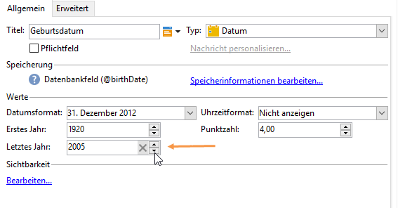

# Felder zu einem Webformular hinzufügen{#adding-fields-to-a-web-form}

Über Felder eines Webformulars können Benutzer Informationen eingeben und Optionen auswählen. Webformulare können Eingabefelder, Auswahlfelder sowie statische und erweiterte Inhalte (Captchas, Abonnements etc.) enthalten.

Wenn Sie den Assistenten zum Hinzufügen von Feldern verwenden, wird der Feldtyp automatisch anhand des ausgewählten Felds oder der ausgewählten Speichervariable erkannt. Sie können sie über das **[!UICONTROL Type]** Dropdown-Feld auf der **[!UICONTROL General]** Registerkarte bearbeiten.

Wenn Sie die Schaltflächen in der Symbolleiste verwenden, wählen Sie den Typ des Felds aus, das Sie hinzufügen möchten.

Folgende Feldtypen sind verfügbar:

* Text-/Zahleneingabe. Siehe [Hinzufügen von Eingabefeldern](#adding-input-fields).
* Auswahl der Dropdown-Liste. Siehe [Hinzufügen von Dropdownlisten](#adding-drop-down-lists).
* Mehrfachauswahl über Kontrollkästchen. Siehe [Hinzufügen von Kontrollkästchen](#adding-checkboxes).
* Exklusive Auswahl über Optionsfelder. Siehe [Hinzufügen von Optionsfeldern](#adding-radio-buttons).
* Wählen Sie in einem Optionsraster. Siehe [Hinzufügen von Rastern](#adding-grids).
* Zahlen und Daten. See [Adding dates and numbers](#adding-dates-and-numbers).
* Abonnement/Rücknahme des Abonnements für einen Informationsdienst. Siehe [Kontrollkästchen](#subscription-checkboxes)für Abonnements.
* Captcha-Überprüfung. See [Inserting a captcha](#inserting-a-captcha).
* Schaltfläche Herunterladen. [Datei hochladen](#uploading-a-file).
* Verborgene Konstante. Siehe [Einfügen einer ausgeblendeten Konstante](#inserting-a-hidden-constant).

Bitte wählen Sie den Antwortspeichermodus aus: ein Feld in der Datenbank aktualisieren (speichert nur den zuletzt gespeicherten Wert) oder in einer Variablen speichern (die Antwort wird nicht gespeichert). Weitere Informationen finden Sie in den [Antwortspeicherfeldern](../../web/using/web-forms-answers.md#response-storage-fields).

>[!NOTE]
>
>Standardmäßig wird das Feld am unteren Ende des aktuellen Baums eingefügt. Mit den Pfeilen in der Symbolleiste kann das Feld hinauf und hinunter bewegt werden.

## Feld-Assistent {#field-creation-wizard}

Für jede Seite des Formulars können Sie über die erste Schaltfläche in der Symbolleiste ein Feld hinzufügen. Gehen Sie dazu zum **[!UICONTROL Add using the wizard]** Menü.

Wählen Sie den Typ des zu erstellenden Felds aus: Sie können ein Feld der Datenbank oder eine Variable hinzufügen oder eine Feldergruppe importieren, die in einem anderen Formular erstellt wurde und in einem Container zusammengefasst ist.

Click **[!UICONTROL Next]** and select the storage field or variable, or the container you want to import.

Click **[!UICONTROL Finish]** to insert the selected field into the page.

## Eingabefelder hinzufügen {#adding-input-fields}

To add an input field, click the **[!UICONTROL Input control]** button and choose the type of field you want to add.

### Typen von Eingabefeldern {#types-of-input-fields}

Auf einer Formularseite können fünf Typen von Textfeldern eingefügt werden:

* **Text**: ermöglicht dem Benutzer die Texteingabe in einer einzigen Zeile.

   

* **Nummer**: ermöglicht dem Benutzer die Eingabe einer Zahl in einer Zeile. for more on this, refer to [Adding numbers](#adding-numbers).

   Wenn die Seite genehmigt wird, wird der Feldinhalt überprüft, um sicherzustellen, dass der eingegebene Wert mit dem Feld kompatibel ist. For more on this, refer to [Defining control settings](../../web/using/form-rendering.md#defining-control-settings).

* **Passwort**: ermöglicht dem Benutzer die Texteingabe in einer einzigen Zeile. Während der Texteingabe werden die Buchstaben durch Punkte ersetzt:

   

   >[!CAUTION]
   >
   >Passwörter werden unverschlüsselt in der Datenbank gespeichert.

* **Mehrzeiliger Text**: ermöglicht dem Benutzer die Texteingabe in mehreren Zeilen.

   

   >[!CAUTION]
   >
   >Mehrzeilige Textfelder sind spezielle Felder, die Zeilenumbrüche enthalten können. Ihr Speicherplatz muss mit einem Feld verknüpft sein, das mit einem XML-Element, und nicht einem XML-Attribut gemappt ist. Weiterführende Informationen zu Datentypen in Schemata finden Sie im Kapitel &quot;Schema reference&quot; in [diesem Abschnitt](../../configuration/using/about-schema-reference.md).
   >   
   >Wenn Sie das **Umfragemodul** verwenden, können Sie diesen Feldtyp in einem archivierten Feld speichern, das sich automatisch an das jeweilige Format anpasst. Weiterführende Informationen dazu finden Sie in [diesem Abschnitt](../../web/using/about-surveys.md).

* **Angereicherter mehrzeiliger Text**: ermöglicht dem Benutzer die Eingabe von Text mit einem Layout, das im HTML-Format gespeichert wird.

   

   Sie können den Typ des Editors auswählen, der Benutzern angeboten wird. Verwenden Sie dazu das Dropdown-Feld des **[!UICONTROL HTML editor]** Felds auf der **[!UICONTROL Advanced]** Registerkarte.

   

   Die Anzahl der angezeigten Symbole hängt vom Typ des Editors ab. Für einen **[!UICONTROL Advanced]** Editor lautet die Wiedergabe wie folgt:

   

### Eingabefelder konfigurieren {#configure-input-fields}

Eingabefelder werden auf der Basis desselben Modus unter Verwendung der folgenden Optionen konfiguriert:

The **[!UICONTROL General]** tab lets you enter the name of the field and attribute a default value to it if necessary.

Der Antwortspeichermodus kann über den **[!UICONTROL Edit storage...]** Link geändert werden. Werte können in einem vorhandenen Feld der Datenbank gespeichert werden; oder Sie können festlegen, dass keine Informationen in der Datenbank gespeichert werden (verwenden Sie eine lokale Variable).

>[!NOTE]
>
>Speichermodi werden in den Speicherfeldern für [Antwort detailliert beschrieben.](../../web/using/web-forms-answers.md#response-storage-fields)

The **[!UICONTROL Advanced]** tab lets you define display parameters for the field (position of labels, alignment, etc.). See [Defining web forms layout](../../web/using/defining-web-forms-layout.md).

## Dropdown-Listen hinzufügen {#adding-drop-down-lists}

Sie können in Umfrageseiten Dropdown-Listen einfügen, aus denen die Benutzer einen Wert auswählen können.

To add a drop-down box to a form page, click the **[!UICONTROL Selection controls > Drop-down list]** button in the toolbar of the page editor.

Wählen Sie den Speichermodus für die Antworten aus und bestätigen Sie Ihre Auswahl.

Definieren Sie die Beschriftungen und Werte der Liste im unteren Bereich der **[!UICONTROL General]** Registerkarte. Wenn die Informationen in einem vorhandenen Feld der Datenbank gespeichert werden und es sich um ein Aufzählungsfeld handelt, können Sie die Werte automatisch ausfüllen, indem Sie auf **[!UICONTROL Initialize the list of values from the database]** klicken, wie unten dargestellt:

>[!NOTE]
>
>Die Reihenfolge der Werte können Sie mit den Pfeilen rechts neben der Liste ändern.

Wenn die Daten in einer verknüpften Tabelle gespeichert werden, können Sie das Feld auswählen, in dem die in der Liste vorgeschlagenen Werte gespeichert werden. Wenn Sie z. B. die Ländertabelle auswählen, klicken Sie auf **[!UICONTROL Initialize the list of values from the database...]** und wählen Sie das gewünschte Feld aus.

Next, click the **[!UICONTROL Load]** link to retrieve the values:

>[!CAUTION]
>
>Wiederholen Sie diesen Vorgang bei jeder Änderung der Liste, um die angebotenen Werte zu aktualisieren.

## Checkboxes hinzufügen {#adding-checkboxes}

Mit Checkboxes stellen Sie Benutzern eine Auswahlmöglichkeit für Optionen zur Verfügung.

To add a checkbox to a form, click the **[!UICONTROL Selection controls > Checkbox...]** icon in the toolbar of the page editor.

Wählen Sie den Speichermodus für die Antworten aus und bestätigen Sie Ihre Auswahl.

Enter the label of the box in the **[!UICONTROL Label]** field of the **[!UICONTROL General]** tab.

Mit einem Kontrollkästchen können Sie dem Speicherfeld (oder dem Wert) je nachdem, ob das Kontrollkästchen aktiviert ist oder nicht, einen Wert zuweisen. Im **[!UICONTROL Values]** Abschnitt können Sie den Wert eingeben, der zugewiesen werden soll, wenn das Feld markiert ist (im **[!UICONTROL Value]** Feld), und den Wert, der zugewiesen werden soll, wenn er nicht markiert ist (im **[!UICONTROL Empty value]** Feld). Diese Werte hängen vom Datenspeicherformat ab.

Wenn das Speicherfeld (oder die Variable) boolesch ist, wird der Wert, der zugewiesen wird, wenn das Feld nicht markiert ist, automatisch abgezogen. In diesem Fall wird nur das **[!UICONTROL Value if checked]** Feld angeboten, wie unten dargestellt:

## Example: Assign a value to a field if a box is checked {#example--assign-a-value-to-a-field-if-a-box-is-checked}

Eine Checkbox soll in ein Formular eingefügt werden, damit wie unten gezeigt ein Wartungsantrag gesendet wird.

The information will be uploaded to the database and into an existing field (in this case, the **[!UICONTROL Comment]** field):

Wenn das Feld &quot;Wartung erforderlich&quot;markiert ist, enthält die **[!UICONTROL Comment]** Spalte &quot;Wartung erforderlich&quot;. Wenn das Kästchen nicht markiert ist, wird in der Spalte &quot;Wartung nicht erforderlich&quot;angezeigt. Um dieses Ergebnis zu erhalten, wenden Sie die folgende Konfiguration auf das Kontrollkästchen auf der Formularseite an:

## Radiobuttons hinzufügen {#adding-radio-buttons}

Mit Radiobuttons können Sie Benutzern eine Reihe von einzelnen Optionen zur Auswahl anbieten. Dabei handelt es sich um unterschiedliche Werte für dasselbe Feld.

Sie können Radiobuttons einzeln erstellen (Einzel-Schaltflächen) oder über eine Multiple-Choice-Liste. Aber weil der Zweck von Radiobuttons die Auswahl einer Option ist, werden immer zumindest zwei Radiobuttons erstellt, und nie nur ein einzelner.

>[!CAUTION]
>
>Um die Auswahl obligatorisch zu machen, müssen Sie eine Multiple-Choice-Liste erstellen.

### Hinzufügen einzelner Schaltflächen {#add-single-buttons}

To add a radio button to a form page, go to the **[!UICONTROL Selection controls > Radio button]** menu in the toolbar of the page editor and choose a storage mode.

Optionsfelder werden ähnlich wie Kontrollkästchen konfiguriert (siehe [Kontrollkästchen](#adding-checkboxes)hinzufügen). Wenn die Option nicht ausgewählt ist, wird jedoch kein Wert zugewiesen. Damit mehrere Schaltflächen voneinander abhängig sind, d. h. die Auswahl einer Schaltfläche deaktiviert die Auswahl der anderen automatisch, müssen sie im selben Feld gespeichert werden. Wenn sie nicht in der Datenbank gespeichert sind, muss dieselbe lokale Variable für die temporäre Speicherung verwendet werden. Siehe [Antwortspeicherfelder](../../web/using/web-forms-answers.md#response-storage-fields).

### Add a list of buttons {#add-a-list-of-buttons}

To add radio buttons via a list, go to the **[!UICONTROL Selection controls>Multiple choice]** menu in the toolbar of the page editor.

Fügen Sie so viele Radiobuttons hinzu wie Titel vorhanden sind. Der Vorteil dieser Funktion liegt darin, dass Sie Werte aus einem vorhandenen Feld importieren können (im Fall eines Auflistungsfelds) und der Benutzer daraus eine Option auswählen kann. Das Layout der Schaltflächen ist jedoch weniger flexibel.

>[!NOTE]
>
>Webformulare ermöglichen nicht die Auswahl mehrerer Werte. Die Mehrfachauswahl kann nur für Formulare vom Typ **Umfrage** aktiviert werden. Weiterführende Informationen dazu finden Sie in [diesem Abschnitt](../../web/using/about-surveys.md).\
>Es ist jedoch möglich, ein Feld vom Typ **[!UICONTROL Multiple choice]** in eine Webanwendung einzufügen, ohne die Auswahl mehrerer Werte zu ermöglichen: Die angebotenen Optionen können mithilfe von Radiobuttons ausgewählt werden.

## Tabellen hinzufügen {#adding-grids}

Mit Tabellen können Sie Abstimmungsseiten in Webanwendungen erstellen. Sie haben damit die Möglichkeit, wie unten gezeigt, Listen mit Radiobuttons zur Beantwortung von Umfragen oder Webformulare zur Abgabe einer Bewertung anzubieten.

Um diesen Elementtyp in einem Formular zu verwenden, erstellen Sie eine einfache Tabelle und fügen Sie für jedes zu bewertende Element eine Zeile hinzu.

Die Anzahl der Radiobuttons in jeder Zeile der Tabelle entspricht der Anzahl der in der einfachen Tabelle definierten Werte.

Pro Tabellenzeile kann nur eine Option ausgewählt werden.

>[!NOTE]
>
>In unserem Beispiel wird die Beschriftung des Rasters ausgeblendet. Gehen Sie dazu zur **[!UICONTROL Advanced]** Registerkarte, die **[!UICONTROL Label position]** Anzeige wird als **[!UICONTROL Hidden]** definiert. See [Defining the position of labels](../../web/using/defining-web-forms-layout.md#defining-the-position-of-labels).

## Datum und Zahlen hinzufügen {#adding-dates-and-numbers}

Der Inhalt eines Formularfeldes kann entsprechend den in der Datenbank gespeicherten Daten oder einer anderen Anforderung formatiert werden. Sie können für die Eingabe von Zahlen und Daten passende Felder erstellen.

### Datum hinzufügen {#adding-dates}

To allow the user to enter a date in a form page, select **[!UICONTROL Add input field > Date...]** in the toolbar or page editor.

Geben Sie einen Titel für das Feld ein und konfigurieren Sie den Datenspeichermodus.

Im unteren Bereich des Fensters können Sie die Formate für Datum und Uhrzeit für die in diesem Feld gespeicherten Werte auswählen.

Das Datum (oder die Uhrzeit) kann angezeigt oder ausgeblendet werden.

Das Datum kann über einen Kalender oder ein Dropdown-Fenster ausgewählt werden. Es kann auch direkt in das Feld eingegeben werden, es muss aber dem im obigen Bildschirm spezifizierten Format entsprechen.

>[!NOTE]
>
>Standardmäßig werden in Formularen verwendete Datumsangaben über einen Kalender eingegeben. Bei mehrsprachigen Formularen überprüfen Sie bitte, ob die Kalender in allen verwendeten Sprachen verfügbar sind. See [Translating a web form](../../web/using/translating-a-web-form.md).

In manchen Fällen kann es aber einfacher sein, Dropdown-Listen zu verwenden, z. B. zur Eingabe des Geburtsdatums.

To do this, click the **[!UICONTROL Advanced]** tab and choose the input mode using **[!UICONTROL Drop-down lists]**.

Sie können dann die in der Liste angebotenen Werte einschränken.

### Zahlen hinzufügen {#adding-numbers}

Sie können Felder für die Eingabe von Zahlen erstellen.

In einem numerischen Feld kann der Benutzer nur Zahlen eingeben. Die Eingabekontrolle erfolgt automatisch bei der Validierung der Seite.

Abhängig vom Feld, in dem Daten in der Datenbank gespeichert werden, kann eine spezielle Formatierung oder bestimmte Beschränkungen angewendet werden. Sie können auch Mindest- und Höchstwerte spezifizieren. Dieser Feldtyp wird folgendermaßen konfiguriert:

Der Standardwert ist der in dem Feld angezeigte Wert, wenn das Formular publiziert wird. Er kann vom Benutzer geändert werden.

You can add a prefix and/or suffix to the numeric field via the **[!UICONTROL Advanced]** tab, as shown below:

Im Formular sieht das Rendering folgendermaßen aus:

## Abonnement-Checkboxes {#subscription-checkboxes}

Sie können Steuerelemente hinzufügen, über die sich Benutzer für eines oder mehrere Informationsdienste anmelden oder abmelden können (Newsletter, Warnhinweise, Echtzeit-Benachrichtigungen etc.). Der Benutzer muss die entsprechende Option markieren, um sich anzumelden.

Um ein Abonnement-Kontrollkästchen zu erstellen, klicken Sie auf **[!UICONTROL Advanced controls>Subscription]**.

Indicate the label for the checkbox and select the information service concerned using the **[!UICONTROL Service]** drop-down box.

>[!NOTE]
>
>Informationsdienste werden auf [dieser Seite](../../delivery/using/managing-subscriptions.md) beschrieben.

Der Benutzer meldet sich zu diesem Dienst an, indem er die entsprechende Option markiert.

>[!CAUTION]
>
>Wenn der Benutzer bereits zu einem Informationsdienst angemeldet ist und das mit diesem Dienst verknüpfte Kästchen bei der Validierung des Formulars nicht markiert ist, wird er abgemeldet.

Beispiele für Abonnements und Anwerbungen finden Sie in [diesem Abschnitt](../../web/using/about-surveys.md).

## Captcha einfügen {#inserting-a-captcha}

Mit **Captcha**-Tests können Sie verhindern, dass Ihre Webformulare missbräuchlich verwendet werden.

>[!CAUTION]
>
>Wenn Ihr Formular mehrere Seiten umfasst, muss das Captcha immer auf der letzten Seite unmittelbar vor der Komponente &quot;Speicherung&quot; platziert werden, um eine Umgehung der Sicherheitsmaßnahmen zu verhindern.

To insert a Captcha into a form, click the first button on the toolbar and Select **[!UICONTROL Advanced controls>Captcha]**.

Geben Sie die Beschriftung des Felds ein. Diese Bezeichnung wird vor dem Captcha-Anzeigebereich angezeigt. Sie können die Position dieser Beschriftung auf der **[!UICONTROL Advanced]** Registerkarte ändern.

>[!NOTE]
>
>Für Steuerelemente vom Typ **[!UICONTROL captcha]** muss weder ein Speicherfeld noch eine Variable angegeben werden.

Das Captcha wird in eine Seite eingefügt, sodass unter der Darstellung ein Eingabefeld bereitgestellt wird. Diese beiden Elemente sind nicht trennbar und werden in Bezug auf das Seitenlayout als ein einziges Objekt erachtet (sie sind in einer einzigen Zelle untergebracht).

Wenn der Inhalt des Captcha falsch eingegeben wurde, verfärbt sich das Eingabefeld bei der Validierung der Seite rot.

Sie können eine anzuzeigende Fehlermeldung erstellen. Verwenden Sie dazu den **[!UICONTROL Personalize the message]** Link auf der **[!UICONTROL General]** Registerkarte.

>[!NOTE]
>
>Captchas sind immer acht Zeichen lang. Dieser Wert kann nicht geändert werden.

## Datei hochladen {#uploading-a-file}

Sie können ein Upload-Feld zu einer Seite hinzufügen. Diese Funktion kann z. B. zur Dateifreigabe im Intranet nützlich sein.

To insert an upload field to a form page, select the **[!UICONTROL Advanced controls > File...]** menu in the toolbar of the page editor.

Standardmäßig werden die hochgeladenen Dateien in Ressourcendateien gespeichert, auf die über das **[!UICONTROL Resources > Online > Public resources]** Menü zugegriffen werden kann. Sie können ein Skript verwenden, um dieses Verhalten zu ändern. Dieses Skript kann die in der JSAPI-Dokumentation[von ](http://docs.campaign.adobe.com/doc/AC/en/jsapi/index.html)Campaign definierten Funktionen verwenden, einschließlich der Funktionen, die die Dateibearbeitung betreffen.

Sie können den Link zu diesen Dateien in einer lokalen Variablen oder in einem Datenbankfeld speichern. Beispielsweise können Sie das Empfängerschema erweitern und einen Link zu dateibasierten Ressourcen hinzufügen.

>[!CAUTION]
>
>* Dieser Dateityp muss für Formulare mit sicherem Zugriff (über Zugangsdaten) reserviert werden.
>* Adobe Campaign kontrolliert nicht die Größe oder den Typ der hochgeladenen Ressource. Deshalb empfehlen wir dringend, Upload-Felder ausschließlich für sichere Intranet-Sites zu verwenden.
>* Wenn mehrere Server mit der Instanz verknüpft sind (Lastenausgleichsarchitektur), müssen Sie sicherstellen, dass Aufrufe des Webformulars auf demselben Server eingehen.
>* Diese Implementierungen erfordern die Hilfe des Adobe Campaign-Teams.
>

## Einfügen einer verborgenen Konstante {#inserting-a-hidden-constant}

Sie können einem Feld einen Wert zuweisen, wenn ein Benutzer eine Seite besucht. Platzieren Sie dazu eine Konstante auf die Seite und spezifizieren Sie den Wert und den Speicherort.

Dieses Feld ist nicht sichtbar für den Benutzer, kann aber für die Anreicherung der Daten im Benutzerprofil verwendet werden.

Im folgenden Beispiel wird die Datei **Herkunft** des Empfängerprofils automatisch ausgefüllt, wenn ein Benutzer diese Seite bestätigt. Die Konstante wird nicht auf der Seite angezeigt.

