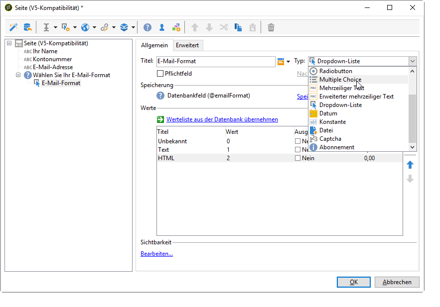
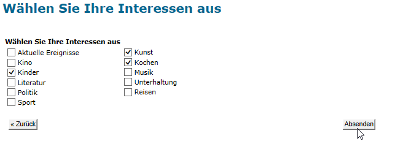
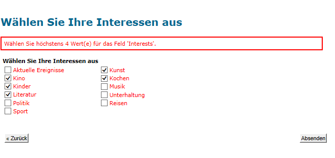
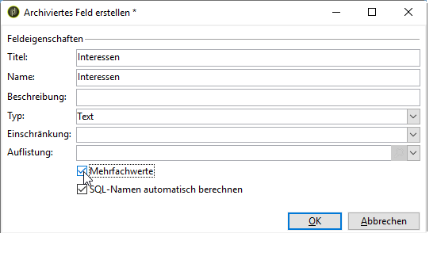
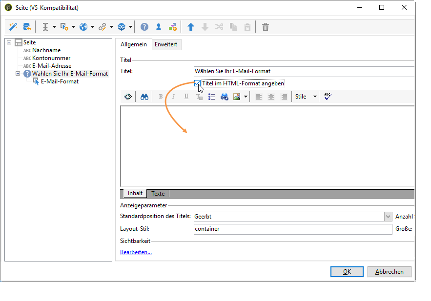
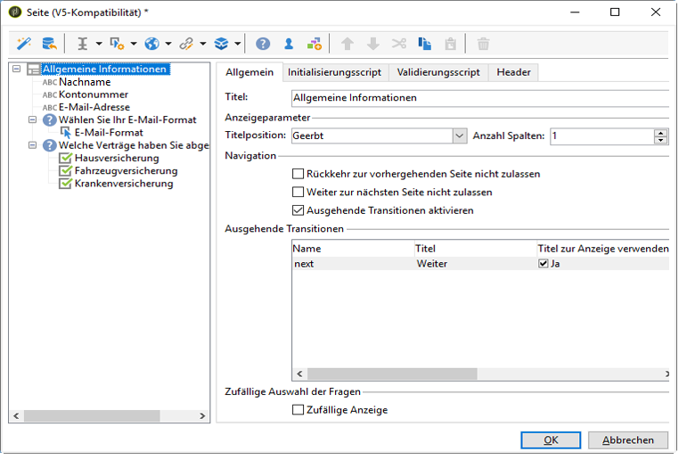
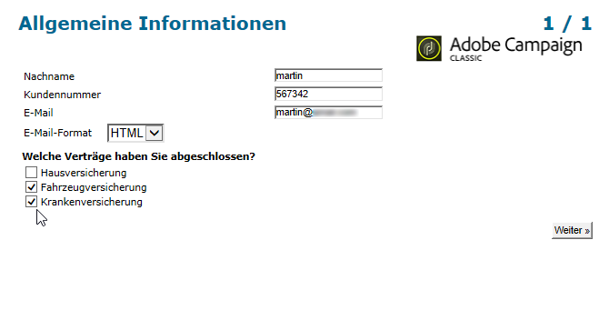
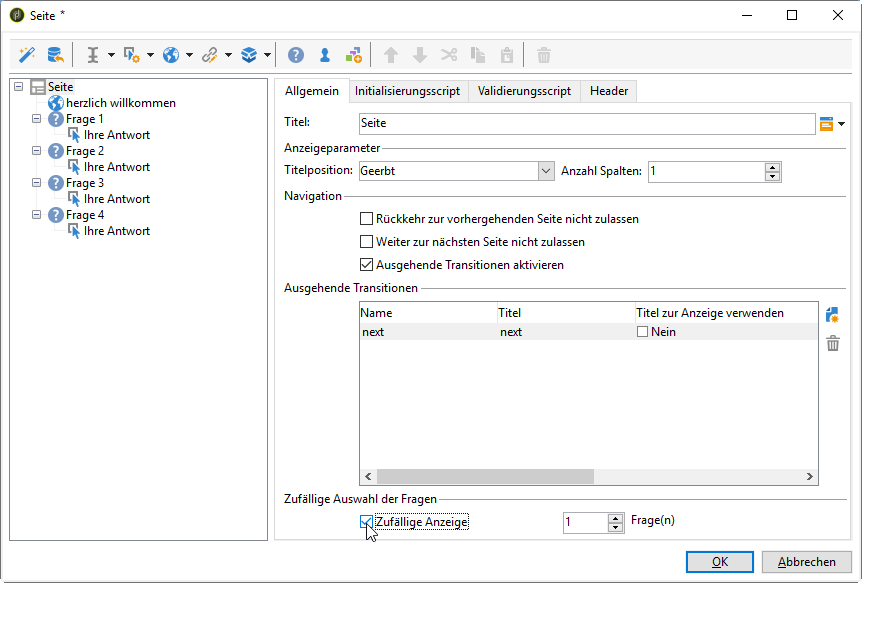
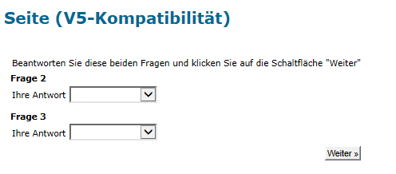

# Umfrage zusammenstellen{#building-a-survey}

## Neue Umfrage erstellen {#creating-a-new-survey}

In diesem Abschnitt werden die Erstellung eines Formulars vom Typ **Umfrage** in Adobe Campaign sowie die verfügbaren Optionen und Konfigurationen beschrieben. Mit Adobe Campaign können Sie diese Umfrage Benutzern zur Verfügung stellen sowie Antworten erfassen und in der Datenbank archivieren.

Der Zugriff auf Webformulare erfolgt über den Knoten **[!UICONTROL Ressourcen > Online > Webanwendungen]** des Baums. Wählen Sie zur Erstellung einer neuen Umfrage oberhalb der Liste der Anwendungen die Schaltfläche **[!UICONTROL Neu]** aus oder rechtsklicken Sie auf die Liste und wählen Sie **[!UICONTROL Neu]** aus.

Wählen Sie die Umfragenvorlage (standardmäßig **[!UICONTROL newSurvey]**) aus.

Die Seiten des Formulars werden mit einem speziellen Editor erstellt, mit dem Sie Eingabefelder (Text), Auswahlfelder (Listen, Checkboxes usw.) und statische Elemente (Bilder, HTML-Inhalte usw.) definieren und konfigurieren können. Sie können in „Behältern“ gesammelt und entsprechend den Anforderungen angeordnet werden (siehe [Fragen hinzufügen](#adding-questions)).

>[!NOTE]
>
>Weiterführende Informationen zur Definition von Inhalten und zur Erstellung von Bildschirmlayouts für ein Webformular finden Sie in [diesem Abschnitt](../../web/using/about-web-forms.md).

## Felder hinzufügen {#adding-fields}

Über Formularfelder können Benutzer Informationen eingeben und Optionen auswählen. Diese Felder werden für jede Formularseite mit der ersten Schaltfläche der Symbolleiste im Menü **[!UICONTROL Mit Hilfe des Assistenten hinzufügen]** erstellt.

>[!NOTE]
>
>Sie können ein Eingabefeld auch mit einem Rechtsklick einfügen. Standardmäßig wird das Eingabefeld am Ende des ausgewählten Baums eingefügt. Sie können es dann mit den Pfeilen in der Symbolleiste verschieben.

### Typen von Feldern {#types-of-fields}

Beim Hinzufügen eines Felds zu einer Umfrage müssen Sie den Typ des Felds auswählen. Die folgenden Optionen sind verfügbar:

1. **[!UICONTROL Frage beantworten]**: Mit dieser Option können Sie ein neues Feld zum Speichern von Antworten festlegen („Archiviertes Feld“ genannt). In diesem Fall werden alle erfassten Werte gespeichert, auch wenn ein Besucher ein Formular mehr als einmal ausfüllt. Dieser Speichermodus ist nur in **Fragebögen** verfügbar. Weitere Informationen finden Sie unter [Erfasste Antworten speichern](../../web/using/managing-answers.md#storing-collected-answers).
1. **[!UICONTROL Empfänger bearbeiten]**: Mit dieser Option können Sie ein Feld in der Datenbank auswählen. In diesem Fall werden die Antworten des Besuchers in diesem Feld gespeichert. Für jeden Besucher wird nur der jeweils letzte Wert gespeichert und zu den Profildaten hinzugefügt.
1. **[!UICONTROL Variable hinzufügen]**: Mit dieser Option können Sie die Umfrage so einrichten, dass die Informationen nicht in der Datenbank gespeichert werden. Die lokalen Variablen können entweder in vorgelagerten Schritten festgelegt oder direkt bei der Erstellung des Felds hinzugefügt werden.
1. **[!UICONTROL Existierende Frage importieren]**: Mit dieser Option können Sie bereits vorhandene, in anderen Umfragen erstellte Fragen importieren.

   >[!NOTE]
   >
   >Speichermodi und Feldimporte werden unter [Erfasste Antworten speichern](../../web/using/managing-answers.md#storing-collected-answers) ausführlich beschrieben.

Der Typ des Felds, das hinzugefügt werden kann (Dropdown-Liste, Textfeld, Checkboxes etc.), hängt vom ausgewählten Speichermodus ab. Der Feldtyp kann im Feld **[!UICONTROL Typ]** im Tab **[!UICONTROL Allgemein]** geändert werden. Achten Sie dabei aber darauf, dass der Feldtyp zum Datentyp passt.

Die unterschiedlichen Typen verfügbarer Felder werden in [diesem Abschnitt](../../web/using/about-web-forms.md) beschrieben.

## Elemente einer Umfrage {#survey-specific-elements}

Online-Umfragen verwenden die Funktionen von Webanwendungen. Die spezifischen Funktionen in Verbindung mit Umfragefeldern werden unten beschrieben.

### Multiple Choice {#multiple-choice}

Für Steuerelemente vom Typ **[!UICONTROL Multiple Choice]** können Sie eine Mindest- und Höchstanzahl von Auswahlmöglichkeiten definieren. Beispielsweise ermöglicht Ihnen diese Option, die Auswahl von mindestens **zwei** und höchstens **vier** Werten aus den verfügbaren Optionen zu erzwingen:

Wenn die Anzahl der ausgewählten Optionen zu groß oder zu klein ist, wird eine entsprechende Nachricht angezeigt.

>[!NOTE]
>
>In diesem Fall werden die Optionen mithilfe von Checkboxes ausgewählt. Wenn nur eine Option möglich ist, wird ein Radiobutton verwendet.

Die entsprechende Konfiguration sieht folgendermaßen aus:

Zusätzlich muss der Speicherort für dieses Eingabefeld ein **archiviertes Feld** vom Typ **[!UICONTROL Mehrfachwerte]** sein:

>[!CAUTION]
>
>* Diese Funktion ist nur für Formulare vom Typ **Umfrage** verfügbar.
>* Diese Option ist nicht mit der Anzeige zufälliger Fragen kompatibel. Weitere Informationen hierzu finden Sie unter [Fragen hinzufügen ](#adding-questions).

### Fragen hinzufügen {#adding-questions}

Es gibt zwei Typen von Containern: Standard und Frage. Standard-Container werden zur Konfiguration des Seitenlayouts und zur bedingten Anzeige auf einer Seite verwendet. Weiterführende Informationen dazu finden Sie in [diesem Abschnitt](../../web/using/about-web-forms.md).

Mit einem **Frage**-Container können Sie eine Frage zur Seite hinzufügen und die möglichen Antworten darunter in der Hierarchie einfügen. Benutzerantworten zu Fragen, die in diesem Containertyp abgelegt werden, können in Berichten analysiert werden.

>[!CAUTION]
>
>Fügen Sie niemals einen **Frage-** Container unterhalb eines anderen **Frage**-Containers in der Hierarchie ein.

Der Titel der Frage wird im Titelfeld eingetragen. In diesem Fall wird der Stil des Formular-Stylesheets übernommen. Wählen Sie die Option **[!UICONTROL Titel im HTML-Format angeben]** aus, um die Frage zu personalisieren. Dadurch erhalten Sie Zugriff auf den HTML-Editor.

>[!NOTE]
>
>Weiterführende Informationen zur Verwendung des HTML-Editors finden Sie in [diesem Abschnitt](../../web/using/about-web-forms.md).

Beispiel:

Im obigen Beispiel wird das Rendering wie folgt ausgeführt:

>[!NOTE]
>
>Jede Frage hat einen Container vom Typ **Frage**.

Sie können die zufällige Anzeige von Fragen durch Adobe Campaign aktivieren. Danach können Sie im Feld am unteren Rand des Konfigurationsfensters angeben, wie viele Fragen auf der Seite angezeigt werden sollen.

Die Grafik stellt sich folgendermaßen dar:

Wenn die Seite aktualisiert wird, ändert sich die Anzeige der Fragen.

>[!CAUTION]
>
>Achten Sie bei der zufälligen Anzeige von Fragen darauf (die Option **[!UICONTROL Zufällige Anzeige]** ist auf der Seite aktiviert), dass Sie keine Multiple-Choice-Fragen verwenden, für die mindestens eine Auswahl zwingend erforderlich ist.

