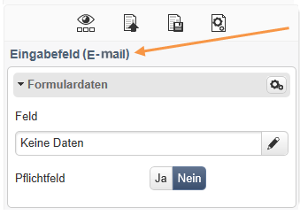
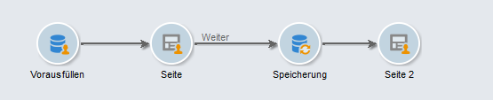

# Best Practices bei der Inhaltsbearbeitung{#content-editing-best-practices}

Bitte beachten Sie folgende Hinweise, um eine optimale Funktionsweise des Editors zu gewährleisten:

* Bevor Sie in Adobe Campaign eine **HTML-Vorlage importieren**, ist sicherzustellen, dass die Vorlage korrekt geöffnet und in den verschiedenen Browsern angezeigt werden kann.
* Wenn die HTML-Seite **JavaScript**-Elemente enthält, müssen diese außerhalb des Editors **fehlerfrei** ausführbar sein.
* Bei der Erstellung einer Vorlage wird empfohlen, den Tags ein **&#39;type&#39;**-Attribut beizufügen. `<input>` Beim Konfigurieren von Webanwendungen hilft die Interpretation dieser Information durch den Editor dem Benutzer bei der Zuordnung von einem Feld der Datenbank zu dem Feld des Formulars.

   Beispiel eines HTML-Codes in einer Vorlage:

   ```
   <input id="email" type="email" name="email"/>
   ```

   Das Attribut **type** ist in der Benutzeroberfläche in der folgenden Form sichtbar:

   

   Die offizielle Liste der „type“-Attribute ist [auf dieser Website](https://www.w3schools.com/tags/att_input_type.asp) verfügbar.

* Schritte zur Simulation einer Endseite mit dem DCE:

   

* Achten Sie darauf, dass `<body> </body>` auf der Seite nur einmal vorkommt.
* Beim Hochladen einer CSS- oder JS-Datei werden die in der ZIP-Datei enthaltenen Bilder nicht hochgeladen. Die in der CSS-Datei vorhandenen Referenzen auf diese Bilder werden deshalb nicht aktualisiert.

## Vom Content Editor unterstützte Formate {#content-editor-supported-formats}

Der Digital Content Editor unterstützt das HTML-Format: Sie können jederzeit in den **Quellmodus** wechseln.

Die Importfunktion des Digital Content Editors funktioniert mit diesen unterstützten Formaten folgendermaßen:

* CSS: Die in der ZIP-Datei vorhandenen Bilder werden nicht importiert. Die Referenzen auf diese Bilder in der CSS-Datei werden nicht aktualisiert.
* JS: Die in der ZIP-Datei vorhandenen Bilder werden nicht importiert. Die Referenzen auf diese Bilder in der JS-Datei werden nicht aktualisiert.
* Iframe: Die verknüpften Seiten werden nicht importiert.
* Landingpages und Webanwendungen: Wenn ein **form**-Tag fehlt, wird eine Warnung angezeigt. Im Nachrichtentext muss immer ein `<form> </form>` vorhanden sein.

Der Digital Content Editor unterstützt auch die folgenden Code-Seiten:

* ISO-8859-1
* ISO-8859-2
* UTF-7
* UTF-8 (empfohlen bei der Verwendung eines BOM)
* ISO-8859-15
* US-ASCII
* Shift-JIS
* ISO-2022-JP
* BIG-5
* EUC-KR
* UTF-16

>[!NOTE]
>
>Die HTML-Code-Seite muss in einem Meta-Tag (HTML 4 oder HTML 5) oder im BOM definiert sein. Wenn keine Code-Seite verfügbar ist, öffnen Sie die Datei in latin1.

## HTML-Inhaltsstatus {#html-content-statuses}

Im oberen Bereich des Editors werden Nachrichten zum Status des Inhalts angezeigt. Die Farbcodes der Nachrichten sind wie folgt:

* **Graue Nachricht:** Informationsnachricht, keine Aktionen sind im Editor erforderlich.
* **Blaue Nachricht:** Informationsnachricht im Zusammenhang mit dem bearbeiteten Inhalt.
* **Gelbe Nachricht**: Warnhinweis oder Fehlermeldung erfordert eine Aktion vonseiten des Benutzers.

### Liste der Nachrichten beim Bearbeiten einer Webanwendung {#list-of-messages-when-editing-a-web-application}

* Der HTML-Inhalt ist funktionsfähig.
* Webanwendung wurde nicht publiziert. Es besteht kein Online-Zugriff.
* Die Webanwendung ist online. Änderungen werden nur durch eine erneute Publikation übernommen.
* Der Seiteninhalt ist nicht funktionsfähig. Er muss ein HTML-Formular enthalten (`<form>`)
* Noch n Eingabefelder oder Schaltflächen zu konfigurieren.
* Um das Weiterblättern zu ermöglichen, ist die Verbindung der Aktion &quot;Folgende Seite&quot; mit einer Schaltfläche oder einem Link der aktuellen Seite erforderlich.

### Liste der Nachrichten beim Bearbeiten eines Versands {#list-of-messages-when-editing-a-delivery}

* Versandinhalt ist einsatzbereit.
* Noch n Personalisierungsfelder oder Gestaltungsbausteine zu konfigurieren.
* Versandinhalt wurde vorbereitet. Änderungen erfordern eine erneute Analyse.
* Der Versand ist startbereit.

