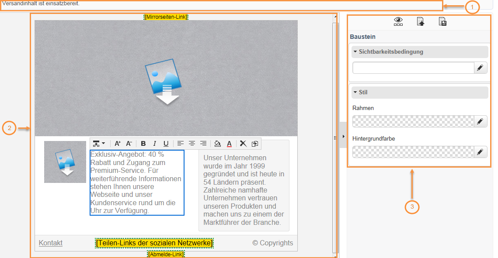
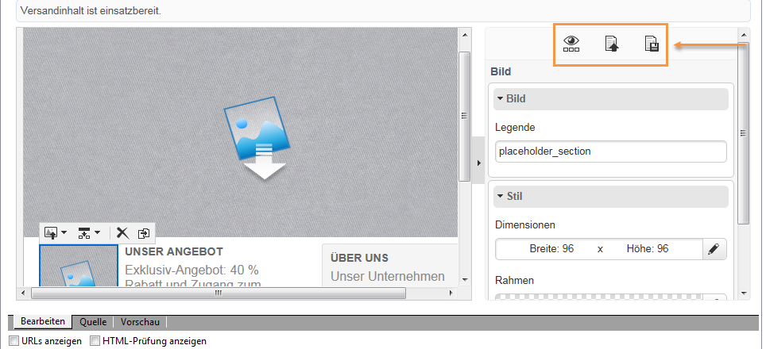
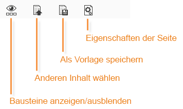
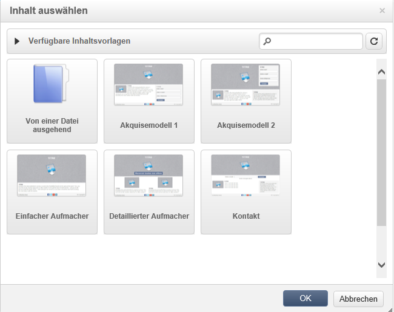
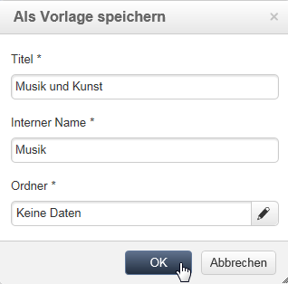
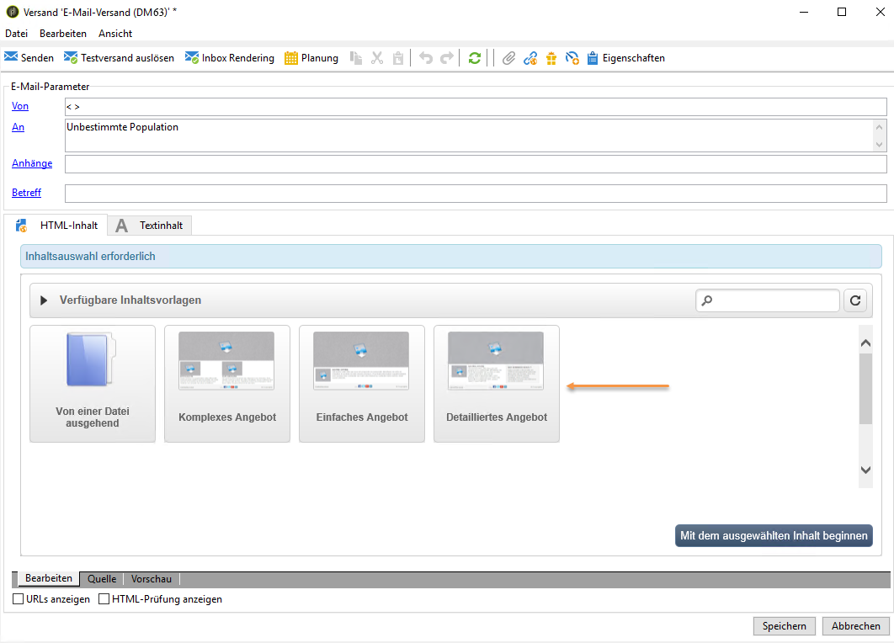
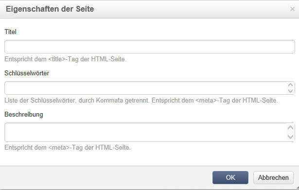
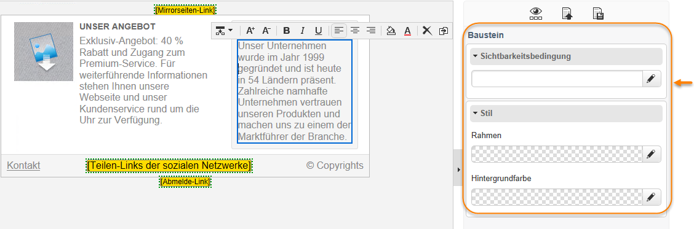

# Benutzeroberfläche des Inhaltseditors{#content-editor-interface}

## Bearbeitungsfenster {#editing-window}

Das DCE-Bearbeitungsfenster ist in drei verschiedene Abschnitte unterteilt. Dort können Sie den Inhalt anzeigen, ändern und seinen Status prüfen.

1. Der **obere** Abschnitt ist ein Anzeigebereich für Nachrichten an die benutzende Person. Dies sind Hinweise zum Status der Web-Anwendung oder zum gerade erstellten Versand sowie Warnhinweise und Fehlermeldungen in Verbindung mit dem Inhalt. Weitere Informationen hierzu finden Sie unter [HTML-Inhaltsstatus](content-editing-best-practices.md#html-content-statuses).
1. Der Abschnitt **links** im Fenster ist der Bereich für die Bearbeitung von Inhalten. Hier kann die benutzende Person direkt über die Popup-Symbolleiste einen Link in ein Bild einfügen, die Schriftart ändern, ein Feld löschen etc. Weitere Informationen finden Sie unter [Bearbeiten von Formularen](editing-content.md#editing-forms).
1. Der Abschnitt **rechts** im Fenster ist der Control Panel-Bereich. Hier werden die Optionen des Editors gruppiert dargestellt, vor allem jene zur Konfiguration der Seitenüberschrift und allgemeine Optionen für Bausteine. Sie können einen Rand hinzufügen, ein Datenbankfeld mit einem Eingabefeld verknüpfen, auf die Eigenschaften einer Web-Seite zugreifen etc. Weitere Informationen finden Sie in den Abschnitten [Globale Optionen](#global-options) und [Bearbeiten von Inhalten](editing-content.md).

## Globale Optionen {#global-options}

Über den rechten oberen Bereich des Editors können Sie auf die globalen Optionen für den aktuell erstellten Inhalt zugreifen.

Dort finden Sie vier Symbole:

* Mit dem Symbol **Bausteine anzeigen/ausblenden** können Sie Inhaltsbausteine mit blauen Rahmen versehen (entspricht dem HTML-Tag `
`).

* Über das Symbol **Anderen Inhalt wählen** können Sie neuen Inhalt aus einer (bereits erstellten oder nativen) Vorlage laden.

  

  >[!CAUTION]
  >
  >Bei der Auswahl eines neuen Inhalts wird der aktuelle Inhalt automatisch ersetzt.

* Mit dem Symbol **Als Vorlage speichern** können Sie den aktuellen Inhalt als Vorlage speichern. Geben Sie den Titel und den internen Namen der Vorlage ein. Vorlagen werden im Knoten **[!UICONTROL Ressourcen > Vorlagen > Inhaltsvorlagen]** gespeichert.

  

  Nach dem Speichern ist die Vorlage verfügbar und kann für neuen Inhalt wieder ausgewählt werden.

  

* Mit dem Symbol **Seiteneigenschaften** können Sie Informationen zum Inhalt am oberen Rand der HTML-Seite auswählen.

  

  >[!NOTE]
  >
  >Diese Informationen entsprechen den HTML-Tags **`<title>`** und **`<meta>`** auf der Seite.
  >
  >Die Schlüsselwörter müssen durch Kommata getrennt sein.

## Optionen für Bausteine {#block-options}

Im rechten Bereich des Editors befinden sich die wichtigsten Optionen zum Bearbeiten des Inhalts. Diese Optionen werden nur angezeigt, wenn ein Baustein ausgewählt wird. Die Art der Optionen hängt vom ausgewählten Baustein ab.

Sie haben folgende Möglichkeiten:

* Anzeige für einen oder mehrere Blöcke festlegen, siehe [Sichtbarkeitsbedingung definieren](editing-content.md#defining-a-visibility-condition),
* Ränder und Rahmen angeben, siehe [Rahmen und Hintergründe hinzufügen ](editing-content.md#adding-a-border-and-background),
* Bildattribute (Größe, Beschriftung) festlegen, siehe [Bildeigenschaften bearbeiten](editing-content.md#editing-image-properties),
* Datenbank mit einem Formularelement (Eingabefeld, Checkbox) verknüpfen, siehe [Dateneigenschaften für ein Formular ändern](editing-content.md#changing-the-data-properties-for-a-form),
* Einen Teil eines Formulars obligatorisch machen, siehe [Dateneigenschaften für ein Formular ändern](editing-content.md#changing-the-data-properties-for-a-form),
* Eine Aktion für eine Schaltfläche hinzufügen , siehe [Eine Aktion zu einer Schaltfläche hinzufügen](editing-content.md#adding-an-action-to-a-button).

## Symbolleiste für die Inhaltsbearbeitung {#content-toolbar}

Diese Symbolleiste ist ein **Pop-up-Element** in der Benutzeroberfläche des DCE, das je nach ausgewähltem Baustein unterschiedliche Funktionen aufweist.

>[!CAUTION]
>
>Gewisse Funktionen der Schaltfläche betreffen die Formatierung des HTML-Inhalts. Wenn die betroffene Seite jedoch ein CSS-Stylesheet enthält, können sich die **Anweisungen** des Stylesheets als **vorrangig** erweisen.
