# Landingpage erstellen{#creating-a-landing-page}

## Über die Erstellung von Landingpages {#about-landing-pages-creation}

In diesem Anwendungsbeispiel erfahren Sie, wie Sie mit dem Digital Editor in der Adobe Campaign-Konsole eine Landingpage erstellen.

Bevor Sie mit der Konfiguration der Landingpage in Adobe Campaign beginnen, stellen Sie sicher, dass Sie **zumindest eine Vorlage** für die HTML-Seite(n) haben.

In diesem Anwendungsbeispiel soll gezeigt werden, wie mithilfe der Funktionen von DCE die Formularfelder der Landingpage an die internen Feldern von Adobe Campaign angepasst werden.

## Landingpage erstellen {#creating-the-landing-page}

Um eine neue Webanwendung vom Typ &quot;Landingpage&quot; zu erstellen, gehen Sie wie folgt vor:

1. Wechseln Sie zur **[!UICONTROL Campaigns]** Registerkarte und klicken Sie auf den **[!UICONTROL Web application]** Link. Klicken Sie dann auf die **[!UICONTROL Create]** Schaltfläche.
1. Wählen Sie die **[!UICONTROL New landing page]** Vorlage aus und geben Sie eine Bezeichnung ein. Klicken Sie anschließend auf **[!UICONTROL Save]**.

   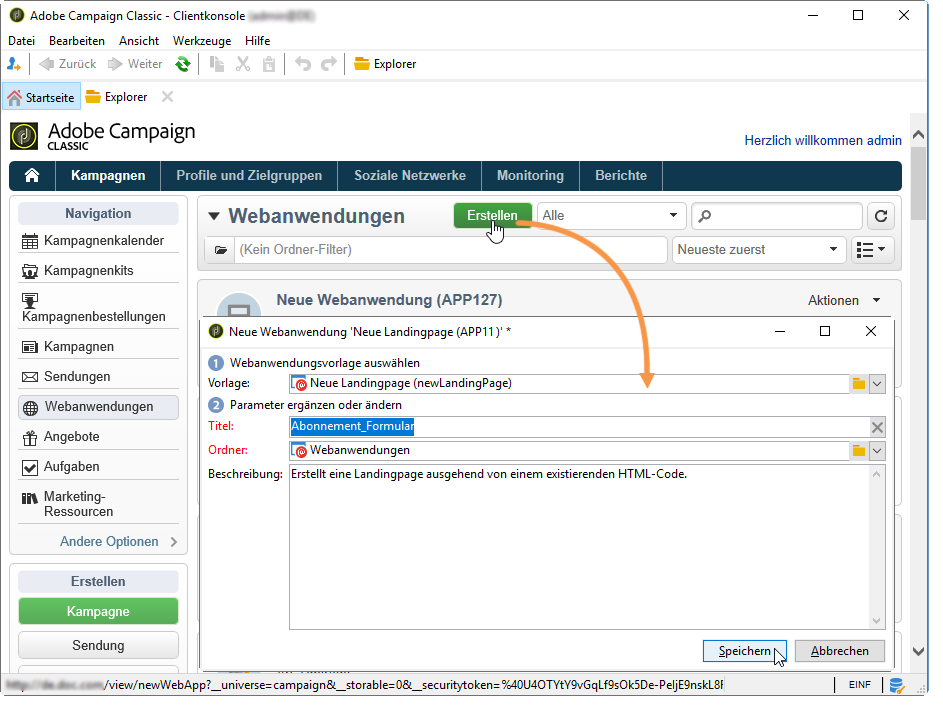

1.  Klicken Sie auf die **[!UICONTROL Edit]** Registerkarte.
1. Löschen Sie die **Ende**-Aktivität.
1. Fügen Sie eine **[!UICONTROL Page]** Aktivität nach der **[!UICONTROL Storage]** Aktivität hinzu.
1. Bearbeiten Sie die Aktivität **Seite 2** und deaktivieren Sie dann die **[!UICONTROL Activate outbound transitions]** Option auf der **[!UICONTROL Properties]** Registerkarte.

   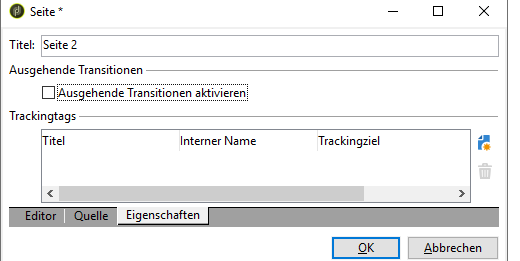

1. Speichern Sie Ihre Änderungen.

Anschließend erhalten Sie die folgende Sequenzierung:

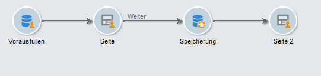

>[!NOTE]
>
>Weiterführende Informationen zur Erstellung einer Webanwendung finden Sie in [diesem Abschnitt](../../web/using/creating-a-new-web-application.md).

## Schritt 1: Auswählen und Laden von Vorlagen {#step-1---selecting-and-loading-templates}

In diesem Abschnitt erfahren Sie, wie **HTML-Inhalt** für jede Seite der Webanwendung importiert wird.

Eine Vorlage muss Folgendes enthalten:

* Eine **HTML-Datei** (zwingend erforderlich)
* Mindestens eine **CSS-Datei** (optional)
* Mindestens ein **Bild** (optional)

Gehen Sie wie folgt vor, um die Vorlage auf die erste Seite zu laden:

1. Open the first **[!UICONTROL Page]** activity of the Web application.
1. Wählen Sie **[!UICONTROL From a file]** die Inhaltsvorlage aus.

   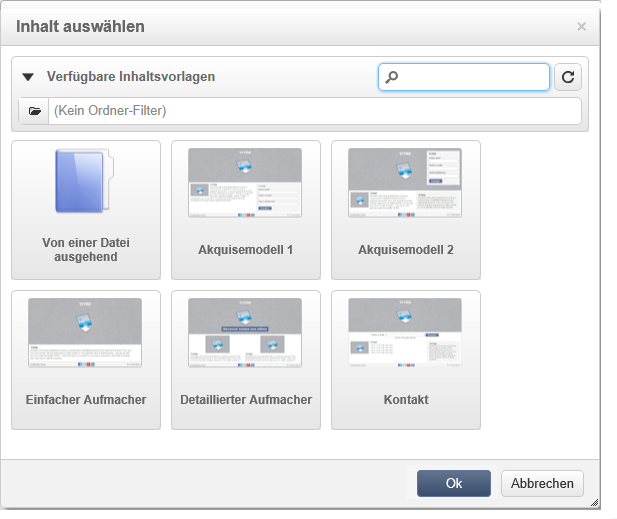

1. Wählen Sie die gewünschte HTML-Datei aus.
1. Wählen Sie **Öffnen**, um den Import zu starten.

   Während des Ladevorgangs wird die Liste aller freigegebener Dateien angezeigt. Im Importsystem wird geprüft, ob alle mit der ausgewählten HTML-Datei verknüpften Dateien vorhanden sind (CSS, Bilder etc.).

   Click the **[!UICONTROL Close]** button once the import has finished.

   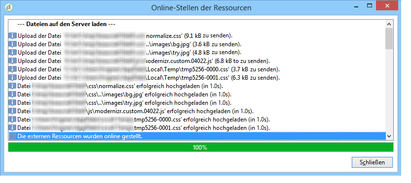

   >[!CAUTION]
   >
   >Sie müssen warten, bis Sie die folgende Meldung erhalten, bevor Sie den Vorgang schließen: **[!UICONTROL The external resources have been successfully published]** .

1.  Klicken Sie auf die **[!UICONTROL Properties]** Registerkarte.
1. Enter a **label** for each page (for example: Page 1= Collect, Page 2=Thank you).

   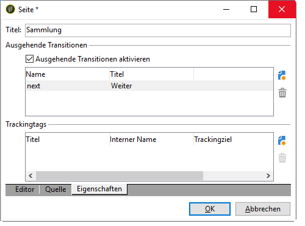

Wiederholen Sie diese Schritte für jede Seite der Webanwendung.

>[!CAUTION]
>
>**Der DCE führt für jede geladene HTML-Seite den JavaScript-Code aus.** In der Adobe Campaign-Benutzeroberfläche können JavaScript-Fehler in der HTML-Vorlage angezeigt werden. Diese Fehler haben nichts mit dem Editor zu tun. Um sicherzugehen, dass in den importierten Dateien keine Fehler vorhanden sind, wird empfohlen, sie in einem Browser zu testen (Internet Explorer/Firefox/Chrome), bevor die Dateien in den DCE importiert werden.

## Schritt 2: Konfigurieren des Inhalts {#step-2---configuring-the-content}

In diesem Abschnitt wird beschrieben, wie importierter Inhalt angepasst und die Felder der Datenbank dem Webseitenformular zugeordnet werden. Die zuvor erstellte Webanwendung ist:

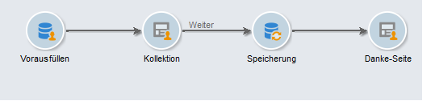

### Inhalt ändern {#modifying-content}

Zunächst sollen die Farben der Seite geändert werden. Gehen Sie dazu wie folgt vor:

1. Öffnen Sie die **[!UICONTROL Collection]** Seite.
1. Klicken Sie auf den Hintergrund.
1. Klicken Sie auf der rechten Seite auf **Hintergrundfarbe**.
1. Wählen Sie eine neue Hintergrundfarbe aus.
1. Klicken Sie zur Bestätigung auf **OK**.

   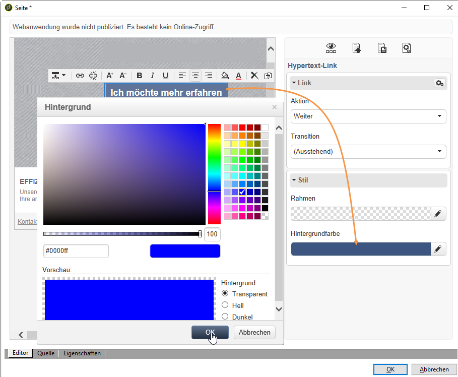

1. Gehen Sie zur Änderung der Schaltflächenfarbe analog vor.

   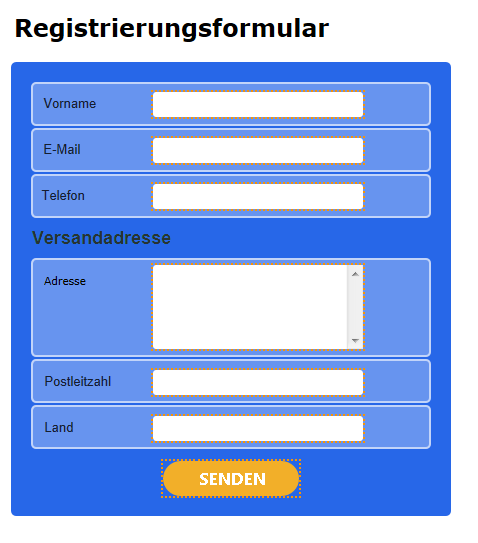

### Formularfelder verknüpfen {#linking-form-fields}

Die Felder auf der Seite sollen mit jenen der Datenbank verknüpft werden, damit die bereitgestellten Informationen gespeichert werden.

1. Wählen Sie ein Feld im Formular aus.
1. Edit the **[!UICONTROL Field]** section on right-hand side of the editor.
1. Wählen Sie das Datenbankfeld aus, das mit dem ausgewählten Feld verknüpft werden soll.

   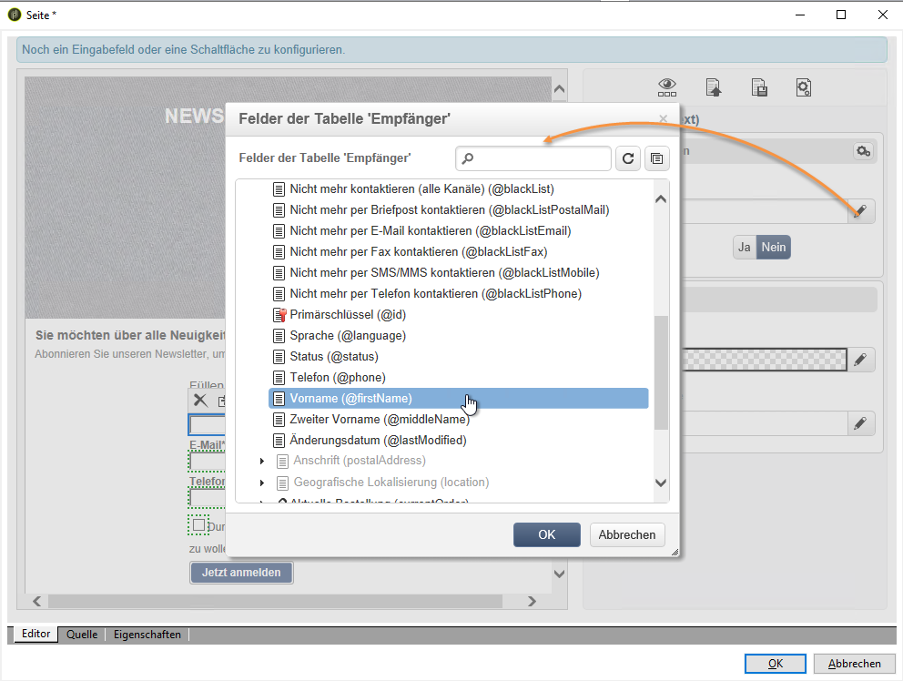

1. Wiederholen Sie diesen Vorgang für jedes Feld der Seite.

Sie können Felder nach Bedarf zu Pflichtfeldern machen: Beispielsweise können Sie auf das Feld **[!UICONTROL Email]** klicken und danach die Option **Obligatorisch** aktivieren.

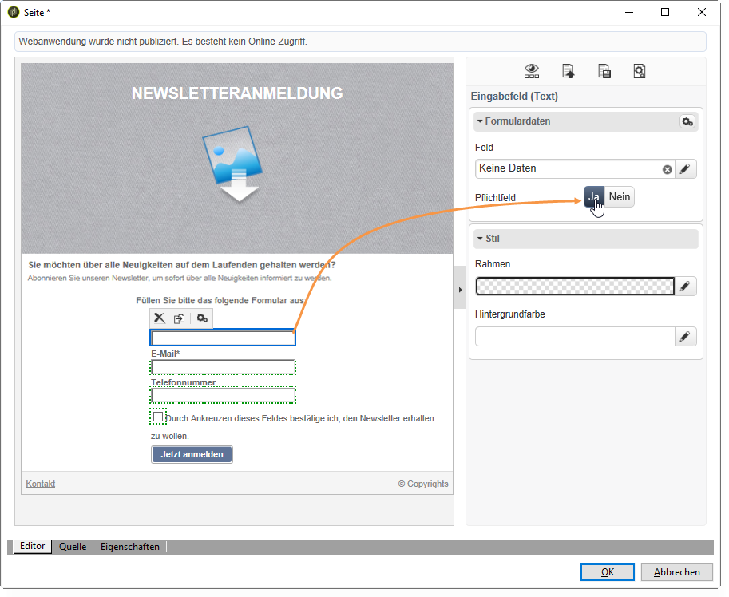

### Link zur nächsten Seite erstellen {#creating-a-link-to-the-next-page}

This step is mandatory because it will allow the Web application to determine the sequence of the next steps: Saving the collected data in the database then displaying the next page (**Thank you** page).

1. Select the **[!UICONTROL Send it!]** button of the **[!UICONTROL Collection]** page.
1. Click the **[!UICONTROL Action]** drop-down menu.
1. Wählen Sie die **[!UICONTROL Next page]** Aktion aus.

   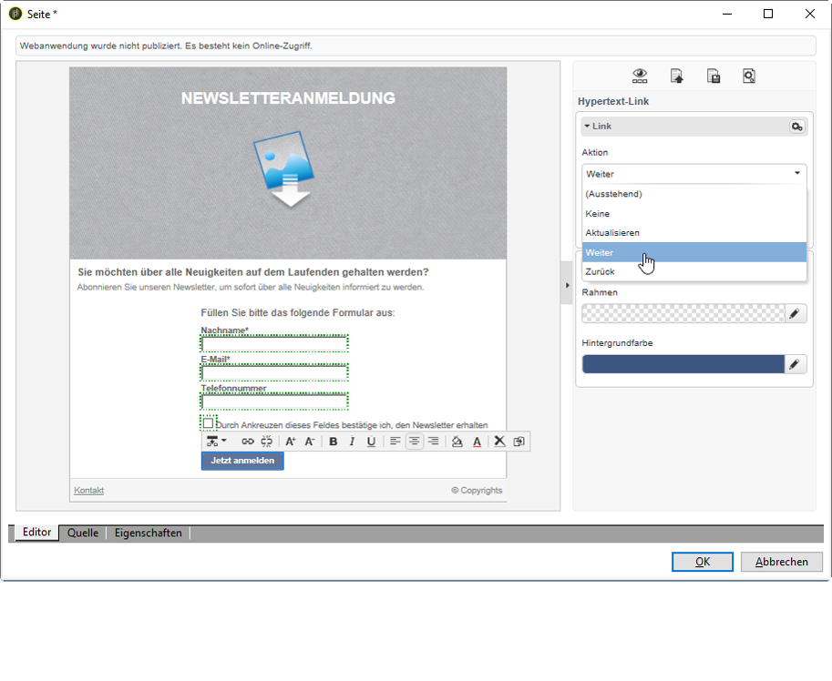

### Personalisierungsfeld einfügen {#inserting-a-personalization-field}

Mit diesem Schritt kann die Dankeseite personalisiert werden. Gehen Sie dazu wie folgt vor:

1. Öffnen Sie die **[!UICONTROL Thank you]** Seite.
1. Platzieren Sie den Cursor in den Textbereich, wo der Vorname des Empfängers eingefügt werden soll.
1. Wählen Sie **[!UICONTROL Personalization field]** im **[!UICONTROL Insert]** Menü der Symbolleiste aus.
1. Wählen Sie den Vornamen aus.

   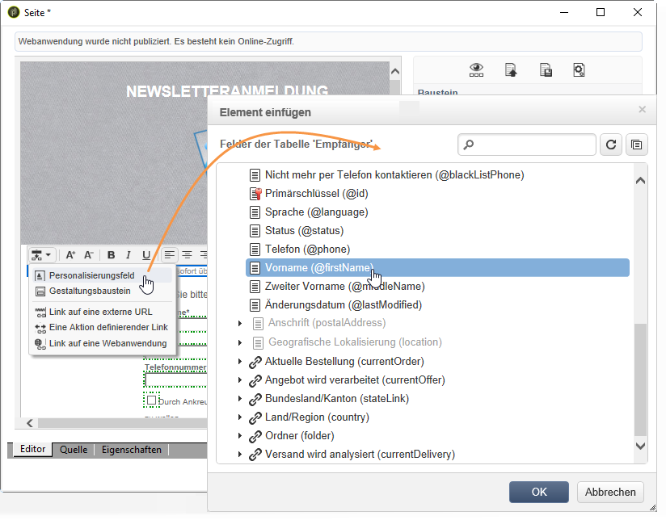

Das Personalisierungsfeld ist im Editor durch einen gelben Hintergrund gekennzeichnet.

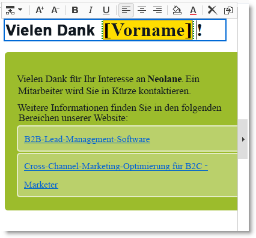

## Schritt 3: Publizieren des Inhalts {#step-3---publishing-content}

Inhalte werden über das Dashboard der Webanwendung veröffentlicht. Klicken Sie auf die **[!UICONTROL Publish]** Schaltfläche, um sie auszuführen.

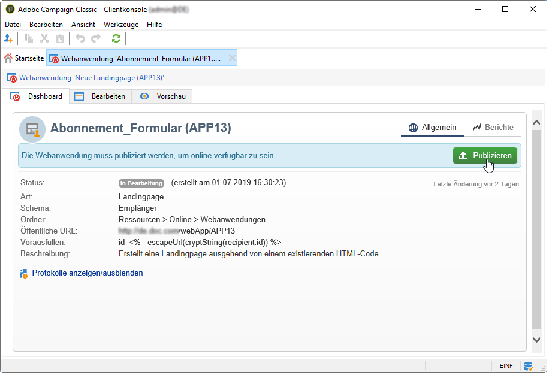

Während der Publikation wird ein Protokoll angezeigt. Das Publikationssystem analysiert den gesamten Inhalt in der Webanwendung.

>[!NOTE]
>
>Im Publikationsprotokoll sind Warnhinweise und Fehler nach der jeweiligen Aktivität sortiert.

Das Formular ist jetzt verfügbar: Seine URL kann im Dashboard der Anwendung geöffnet und an Empfänger gesendet werden.
