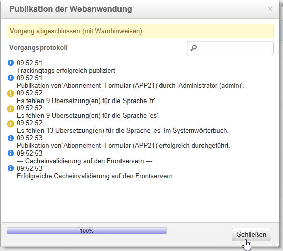

# Landingpage erstellen{#creating-a-landing-page}

## Über die Erstellung von Landingpages {#about-landing-pages-creation}

In diesem Anwendungsbeispiel erfahren Sie, wie Sie mit dem Digital Editor in der Adobe Campaign-Konsole eine Landingpage erstellen.

Bevor Sie mit der Konfiguration der Landingpage in Adobe Campaign beginnen, stellen Sie sicher, dass Sie **zumindest eine Vorlage** für die HTML-Seite(n) haben.

In diesem Anwendungsbeispiel soll gezeigt werden, wie mithilfe der Funktionen von DCE die Formularfelder der Landingpage an die internen Feldern von Adobe Campaign angepasst werden.

## Landingpage erstellen {#creating-the-landing-page}

Um eine neue Webanwendung vom Typ &quot;Landingpage&quot; zu erstellen, gehen Sie wie folgt vor:

1. Gehen Sie zum Tab **[!UICONTROL Kampagnen]** und wählen Sie den Link **[!UICONTROL Webanwendung]** und danach die Schaltfläche **[!UICONTROL Erstellen]** aus.
1. Wählen Sie die Vorlage **[!UICONTROL Neue Landingpage]** aus, geben Sie einen Titel ein und wählen Sie danach **[!UICONTROL Speichern]** aus.

   

1. Wählen Sie den Tab **[!UICONTROL Bearbeiten]** aus.
1. Löschen Sie die **Ende**-Aktivität.
1. Fügen Sie im Anschluss an die Aktivität **[!UICONTROL Speicherung]** die Aktivität **[!UICONTROL Seite]** hinzu.
1. Bearbeiten Sie die Aktivität **Seite 2** und deaktivieren Sie dann die Option **[!UICONTROL Ausgehende Transitionen aktivieren]** im Tab **[!UICONTROL Eigenschaften]**.

   

1. Speichern Sie Ihre Änderungen.

Sie erhalten dann die folgende Sequenzierung:

>[!NOTE]
>
>Weiterführende Informationen zur Erstellung einer Webanwendung finden Sie in [diesem Abschnitt](../../web/using/creating-a-new-web-application.md).

## Schritt 1: Auswählen und Laden von Vorlagen {#step-1---selecting-and-loading-templates}

In diesem Abschnitt erfahren Sie, wie **HTML-Inhalt** für jede Seite der Webanwendung importiert wird.

Eine Vorlage muss Folgendes enthalten:

* Eine **HTML-Datei** (zwingend erforderlich)
* Mindestens eine **CSS-Datei** (optional)
* Mindestens ein **Bild** (optional)

Gehen Sie wie folgt vor, um die Vorlage auf die erste Seite zu laden:

1. Öffnen Sie die Aktivität **[!UICONTROL Erste Seite]** der Webanwendung.
1. Wählen Sie **[!UICONTROL Von einer Datei ausgehend]** aus, um Ihre Inhaltsvorlage zu laden.

   

1. Wählen Sie die gewünschte HTML-Datei aus.
1. Wählen Sie **Öffnen**, um den Import zu starten.

   Während des Ladevorgangs wird die Liste aller freigegebener Dateien angezeigt. Im Importsystem wird geprüft, ob alle mit der ausgewählten HTML-Datei verknüpften Dateien vorhanden sind (CSS, Bilder etc.).

   Wählen Sie die Schaltfläche **[!UICONTROL Schließen]** aus, wenn der Import abgeschlossen ist.

   

   >[!CAUTION]
   >
   >Sie müssen warten, bis Sie die folgende Meldung erhalten, bevor Sie den Vorgang schließen: **[!UICONTROL Die externen Ressourcen wurden online gestellt]**.

1. Gehen Sie in den Tab **[!UICONTROL Eigenschaften]**.
1. Geben Sie für jede Seite einen **Titel** ein (z. B.: Seite 1=Datenerfassung, Seite 2=Dankeseite).

   

Wiederholen Sie diese Schritte für jede Seite der Webanwendung.

>[!CAUTION]
>
>**Der DCE führt für jede geladene HTML-Seite den JavaScript-Code aus.** In der Adobe Campaign-Benutzeroberfläche können JavaScript-Fehler in der HTML-Vorlage angezeigt werden. Diese Fehler haben nichts mit dem Editor zu tun. Um sicherzugehen, dass in den importierten Dateien keine Fehler vorhanden sind, wird empfohlen, sie in einem Browser zu testen (Internet Explorer/Firefox/Chrome), bevor die Dateien in den DCE importiert werden.

## Schritt 2: Konfigurieren des Inhalts {#step-2---configuring-the-content}

In diesem Abschnitt wird beschrieben, wie importierter Inhalt angepasst und die Felder der Datenbank dem Webseitenformular zugeordnet werden. Die zuvor erstellte Webanwendung ist:

### Inhalt ändern {#modifying-content}

Zunächst sollen die Farben der Seite geändert werden. Gehen Sie dazu wie folgt vor:

1. Öffnen Sie die Seite **[!UICONTROL Kollektion]**.
1. Klicken Sie auf den Hintergrund.
1. Klicken Sie auf der rechten Seite auf **Hintergrundfarbe**.
1. Wählen Sie eine neue Hintergrundfarbe aus.
1. Klicken Sie zur Bestätigung auf **OK**.

   

1. Gehen Sie zur Änderung der Schaltflächenfarbe analog vor.

   

### Formularfelder verknüpfen {#linking-form-fields}

Die Felder auf der Seite sollen mit jenen der Datenbank verknüpft werden, damit die bereitgestellten Informationen gespeichert werden.

1. Wählen Sie ein Feld im Formular aus.
1. Bearbeiten Sie auf der rechten Seite des Editors den Bereich **[!UICONTROL Feld]**.
1. Wählen Sie das Datenbankfeld aus, das mit dem ausgewählten Feld verknüpft werden soll.

   

1. Wiederholen Sie diesen Vorgang für jedes Feld der Seite.

Sie können Felder nach Bedarf zu Pflichtfeldern machen: Beispielsweise können Sie auf das Feld **[!UICONTROL E-Mail]** klicken und danach die Option **Obligatorisch** aktivieren.

### Link zur nächsten Seite erstellen {#creating-a-link-to-the-next-page}

Dieser Schritt ist unbedingt erforderlich, da die Webanwendung damit die Reihenfolge der nächsten Schritte feststellen kann: Speichern der erfassten Daten in der Datenbank und die Anzeige der nächsten Seite (**Dankeseite**).

1. Wählen Sie die **[!UICONTROL Senden]**-Schaltfläche der Seite **[!UICONTROL Kollektion]** aus.
1. Öffnen Sie die Dropdown-Liste **[!UICONTROL Aktion]**.
1. Wählen Sie die Aktion **[!UICONTROL Nächste Seite]** aus.

   

### Personalisierungsfeld einfügen {#inserting-a-personalization-field}

Mit diesem Schritt kann die Dankeseite personalisiert werden. Gehen Sie dazu wie folgt vor:

1. Öffnen Sie die **[!UICONTROL Dankeseite]**.
1. Platzieren Sie den Cursor in den Textbereich, wo der Vorname des Empfängers eingefügt werden soll.
1. Wählen Sie in der Symbolleiste im Menü **[!UICONTROL Einfügen]** die Option **[!UICONTROL Personalisierungsfeld]** aus.
1. Wählen Sie den Vornamen aus.

   

Das Personalisierungsfeld ist im Editor durch einen gelben Hintergrund gekennzeichnet.

## Schritt 3: Publizieren des Inhalts {#step-3---publishing-content}

Inhalte werden über das Dashboard der Webanwendung publiziert. Klicken Sie auf die Schaltfläche **[!UICONTROL Publizieren]**, um sie auszuführen.

Während der Publikation wird ein Protokoll angezeigt. Das Publikationssystem analysiert den gesamten Inhalt in der Webanwendung.

>[!NOTE]
>
>Im Publikationsprotokoll sind Warnhinweise und Fehler nach der jeweiligen Aktivität sortiert.

Das Formular ist jetzt verfügbar: Seine URL kann im Dashboard der Anwendung geöffnet und an Empfänger gesendet werden.
