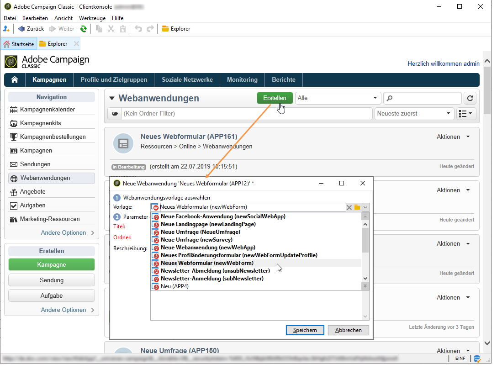

# Neue Webanwendung erstellen{#creating-a-new-web-application}

Die Auswahl des Typs der Webanwendung erfolgt während der Erstellung.

Gehen Sie zum Tab **Kampagnen** und wählen Sie das Menü **[!UICONTROL Webanwendungen]** aus. Wählen Sie die **[!UICONTROL Erstellen]**-Schaltfläche aus. Wählen Sie die gewünschte Webanwendungsvorlage aus:

>[!NOTE]
>
>Schützen Sie stets die Seiten, die möglicherweise personenbezogene Daten enthalten. Konsultieren Sie diesbezüglich die [Checkliste für Sicherheit und Datenschutz](https://helpx.adobe.com/de/campaign/kb/acc-security.html#privacy).

Diese Vorlage bestimmt den Typ der Webanwendung. Sie können Folgendes erstellen:

1. Webformulare (+ Profiländerung)

   Mithilfe von Webformularen können Sie Webseiten mit Eingabe- oder Auswahlfeldern bereitstellen. Die von den Benutzern eingegebenen Informationen werden in der Adobe Campaign-Datenbank gespeichert. Weiterführende Informationen dazu finden Sie im Abschnitt [Webformulare](../../web/using/about-web-forms.md).

1. Webanwendungen

   Mit Adobe Campaign können Sie Webanwendungen erstellen und z. B. auf einer Webplattform oder im Extranet veröffentlichen. Dadurch haben Sie die Möglichkeit, Daten in Adobe Campaign zu bearbeiten und zu speichern. Den Datenzugriff können Sie beschränken, sodass nur authentifizierte Benutzer (über eine Zugriffskontrolle) darauf Zugriff haben. Zusätzlich können Sie das Vorausfüllen von Daten entsprechend verschiedener Kriterien einrichten. Weiterführende Informationen dazu finden Sie in [diesem Abschnitt](../../web/using/about-web-applications.md).

1. Landingpages 

   Eine Landingpage ist eine HTML-Seite, deren Inhalt auf einer Website bereitsteht und über die Benutzer Informationen eingeben können, die im Datenbankprofil von Adobe Campaign gespeichert werden. Der Inhalt einer solchen Seite wird normalerweise von einer spezialisierten Webagentur erstellt und danach in Adobe Campaign zur Publikation, Verwaltung und Nachverfolgung importiert. Weiterführende Informationen dazu finden Sie auf [dieser Seite](../../web/using/creating-a-landing-page.md).

1. Umfragen

   Adobe Campaign ermöglicht Ihnen über die Option **Survey Manager**, Online-Umfragen zusammenzustellen und zu verwalten sowie deren Ergebnisse zu verarbeiten. Die verfügbaren Funktionen sind dynamische Felderstellung, Punktzahl-Verwaltung, der Export von Antworten und spezielle Berichte. Weiterführende Informationen dazu finden Sie in [diesem Abschnitt](../../web/using/about-surveys.md).

   >[!CAUTION]
   >
   >**Survey Manager** ist ein optionales Modul von Adobe Campaign. Nähere Informationen dazu entnehmen Sie bitte Ihrem Lizenzvertrag.

1. Facebook-Anwendungen

   Dank der Option **Social Marketing** können Sie mit Adobe Campaign personalisierte Inhalte in einer Facebook-Anwendung publizieren. Weiterführende Informationen dazu finden Sie in [diesem Abschnitt](../../social/using/about-social-marketing.md).

   >[!CAUTION]
   >
   >**Social Marketing** ist ein optionales Modul von Adobe Campaign. Nähere Informationen dazu entnehmen Sie bitte Ihrem Lizenzvertrag.

Der Seitenkonfigurationsmodus und verfügbare Konfigurationen können für mehrere Typen von Webanwendungen identisch sein. Weiterführende Informationen dazu finden Sie in [diesem Abschnitt](../../web/using/about-web-forms.md).
