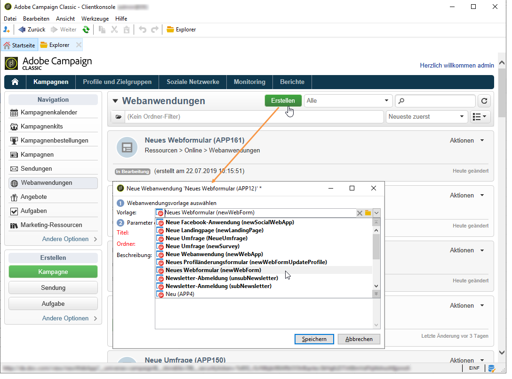

# Neue Web-Anwendung erstellen{#creating-a-new-web-application}

Die Auswahl des Typs der Webanwendung erfolgt während der Erstellung.

Gehen Sie zum Tab **Kampagnen** und wählen Sie das Menü **[!UICONTROL Webanwendungen]** aus. Wählen Sie die **[!UICONTROL Erstellen]**-Schaltfläche aus. Wählen Sie die gewünschte Webanwendungsvorlage aus:

>[!NOTE]
>
>Schützen Sie stets die Seiten, die möglicherweise personenbezogene Daten enthalten. Konsultieren Sie diesbezüglich die [Checkliste für Sicherheit und Datenschutz](https://helpx.adobe.com/de/campaign/kb/acc-security.html#privacy).

Diese Vorlage bestimmt den Typ der Web-Anwendung. Sie können Folgendes erstellen:

1. Webformulare (+ Profiländerung)

   Mithilfe von Web-Formularen können Sie Web-Seiten mit Eingabe- oder Auswahlfeldern bereitstellen. Die von den Benutzern eingegebenen Informationen werden in der Adobe Campaign-Datenbank gespeichert. Weiterführende Informationen dazu finden Sie im Abschnitt [Web-Formulare](about-web-forms.md).

1. Web-Anwendungen

   Mit Adobe Campaign können Sie Web-Anwendungen erstellen, die beispielsweise auf einer Web-Plattform oder einem Extranet bereitgestellt werden. Auf diese Weise können Sie Daten bearbeiten und Informationen in Adobe Campaign aufzeichnen. In diesem Fall können Sie den Zugriff der Benutzer auf authentifizierte Benutzer (über die Zugriffssteuerung) beschränken und das Vorabladen von Daten auf der Grundlage verschiedener Kriterien einrichten. Weiterführende Informationen hierzu finden Sie in [diesem Abschnitt](about-web-applications.md).

1. Landingpages

   Eine Landingpage ist eine HTML-Seite, deren Inhalt auf einer Website verfügbar ist und auf der Benutzer Informationen eingeben können, die in der Adobe Campaign-Datenbank gespeichert werden sollen. Der Inhalt dieser Art von Seite wird in der Regel von einer spezialisierten Web-Agentur erstellt, bevor er zur Veröffentlichung, Verwaltung und Nachverfolgung in Adobe Campaign importiert wird. Weitere Informationen hierzu finden Sie auf [dieser Seite](creating-a-landing-page.md).

1. Umfragen

   Adobe Campaign ermöglicht es Ihnen über die Option **Survey Manager**, Online-Umfragen zusammenzustellen und zu verwalten sowie deren Ergebnisse zu verarbeiten. Die verfügbaren Funktionen sind dynamische Felderstellung, Punktzahl-Verwaltung, der Export von Antworten und spezielle Berichte. Weiterführende Informationen hierzu finden Sie in [diesem Abschnitt](../../surveys/using/about-surveys.md).

   >[!CAUTION]
   >
   >**Survey Manager** ist ein optionales Adobe Campaign-Modul. Prüfen Sie diesbezüglich Ihren Lizenzvertrag.

1. Facebook-Anwendungen

   Dank der Option **Social Marketing** können Sie mit Adobe Campaign personalisierte Inhalte in einer Facebook-Anwendung veröffentlichen. Weiterführende Informationen hierzu finden Sie in [diesem Abschnitt](../../social/using/about-social-marketing.md).

   >[!CAUTION]
   >
   >**Social Marketing** ist ein optionales Adobe Campaign-Modul. Prüfen Sie diesbezüglich Ihren Lizenzvertrag.

Der Seitenkonfigurationsmodus und verfügbare Konfigurationen können für mehrere Typen von Webanwendungen identisch sein. Weiterführende Informationen hierzu finden Sie in [diesem Abschnitt](about-web-forms.md).
