# Layout eines Webformulars definieren{#defining-web-forms-layout}

## Container erstellen {#creating-containers}

Mit Containern können Sie die Felder einer Seite zusammenfassen und ihr Layout konfigurieren, um die Elemente der Seite anzuordnen.

For each page of the form, containers are created via the **[!UICONTROL Containers]** button of the toolbar.

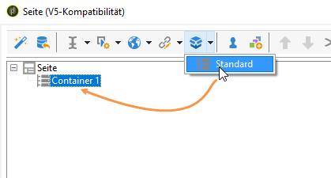

Verwenden Sie einen Behälter, um Elemente der Seite zu gruppieren, ohne eine Bezeichnung zum endgültigen Rendering hinzuzufügen. Elemente werden in der Unterstruktur des Containers gruppiert. Mit Standardbehältern können Sie das Layout verwalten.

Beispiel:

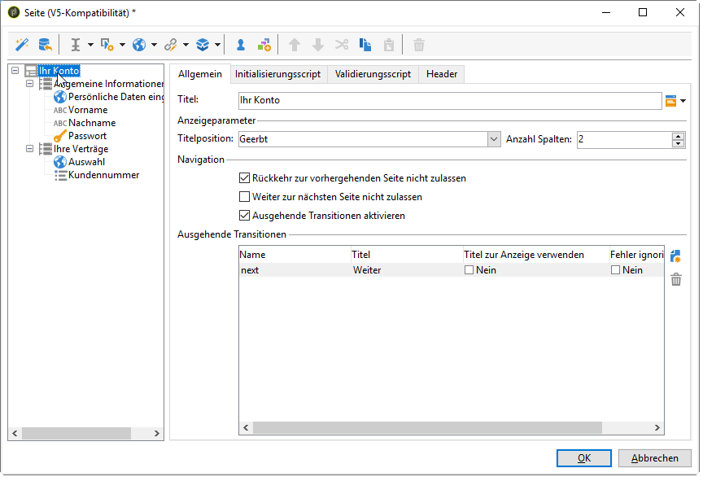

Die Position der Beschriftungen wird auf Elemente angewendet, die unterhalb des Containers in der Hierarchie platziert werden. Sie kann bei Bedarf für jedes Element überladen werden. Fügen Sie Spalten hinzu oder entfernen Sie sie, um das Layout zu ändern. See [Positioning the fields on the page](#positioning-the-fields-on-the-page).

Im obigen Beispiel wird das Rendering wie folgt ausgeführt:

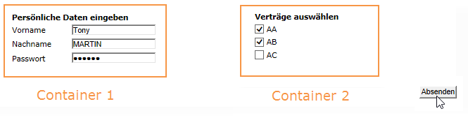

## Die Felder auf der Seite positionieren {#positioning-the-fields-on-the-page}

Das Layout jeder Seite des Webformulars ist in jedem Container definiert und kann für jedes Steuerelement überschrieben werden.

Seiten sind in Spalten unterteilt: Jede Seite enthält eine bestimmte Anzahl von Spalten. Jedes Feld der Seite hat **n** Zellen. Container umfassen auch eine gewisse Anzahl von Spalten und die in ihnen enthaltenen Felder haben eine bestimmte Anzahl von Zellen.

Standardmäßig werden Seiten auf einer einzigen Spalte erstellt und jedes Element hat eine einzige Zelle. Das bedeutet, dass Felder untereinander angezeigt werden, wobei jedes wie unten dargestellt eine ganze Zeile umfasst:

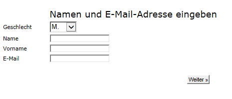

Im folgenden Beispiel wurde die Standardkonfiguration beibehalten. Die Seite umfasst eine einzige Spalte mit vier Containern.

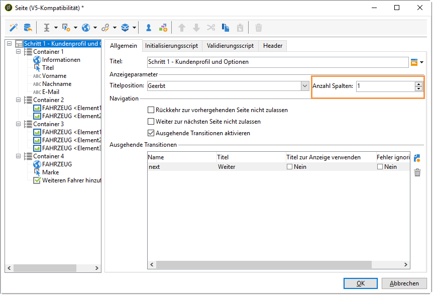

Jeder Container belegt eine Spalte und jedes Element belegt eine Zelle:

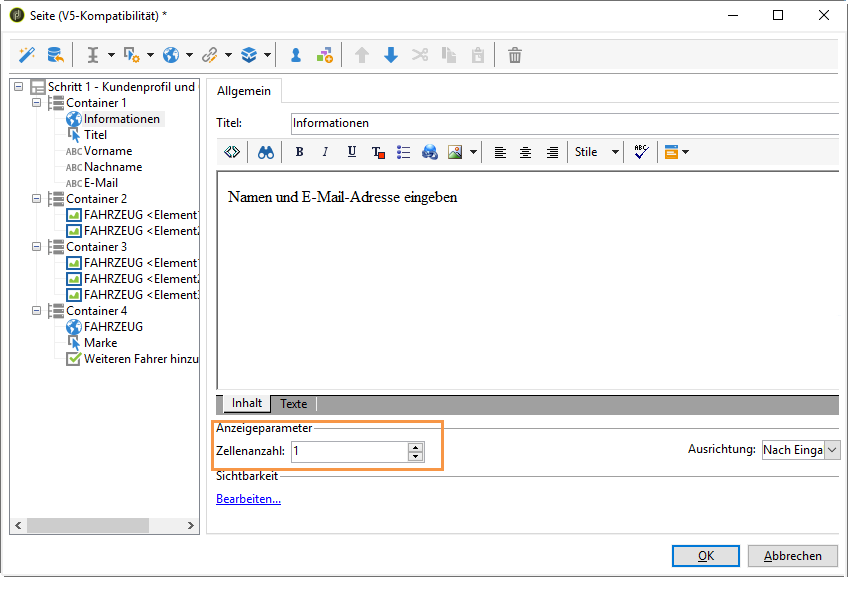

Das Rendering sieht folgendermaßen aus:

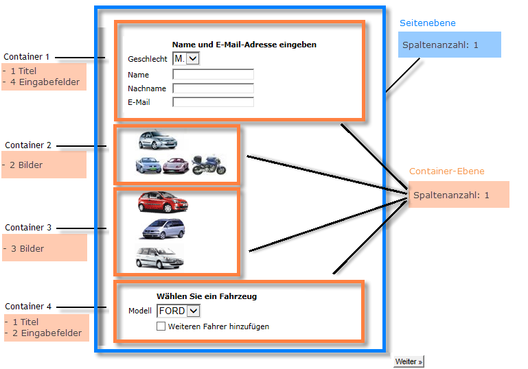

Sie können die Anzeigeparameter anpassen, um das folgende Rendering zu erhalten:

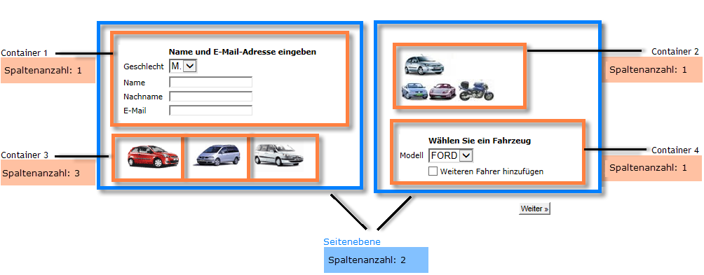

Im obigen Rendering-Beispiel belegt jedes Eingabefeld, jeder Titel und jedes Bild eine einzige Zelle in den Spalten der Container.

Sie können die Formatierung in jedem Container ändern. In unserem Beispiel können Sie den Inhalt von Container 4 auf zwei Spalten aufteilen und die Elemente verteilen.

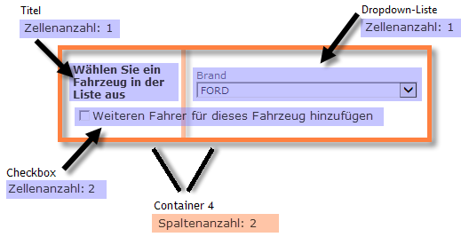

Der Titel und die Liste belegen jeweils eine Zelle (und damit eine ganze Zeile des Containers), und das Kontrollkästchen erstreckt sich über zwei Zellen. Die Anzahl der dem Eingabefeld zugeschriebenen Zellen wird auf der **[!UICONTROL General]** Registerkarte oder auf der **[!UICONTROL Advanced]** Registerkarte je nach Feldtyp definiert:

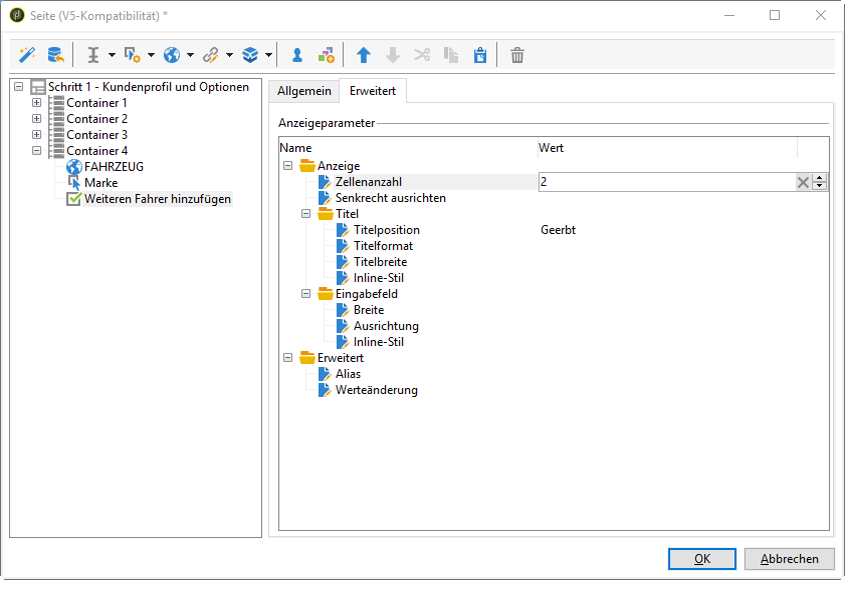

## Die Position von Titeln definieren {#defining-the-position-of-labels}

Sie können die Ausrichtung von Feldern und Titeln im Formular definieren.

Standardmäßig übernehmen die Anzeigeparameter für Felder und andere Inhalte der Seite die allgemeine Konfiguration des Formulars, die Konfiguration der Seite oder die Konfiguration des übergeordneten Containers, sofern einer vorhanden ist.

Die globalen Anzeigeparameter für das gesamte Formular werden im Feld &quot;Formulareigenschaften&quot;angegeben. Auf der **[!UICONTROL Rendering]** Registerkarte können Sie die Position der Beschriftungen auswählen.

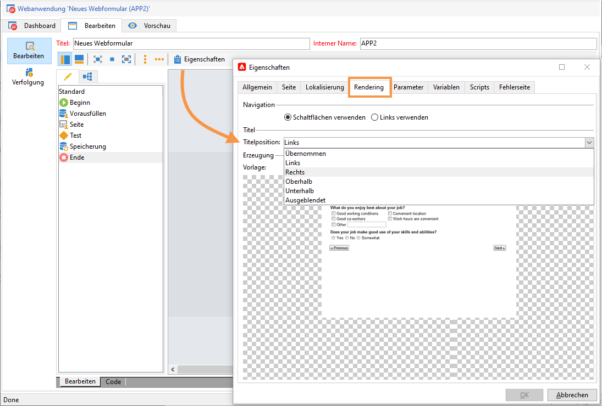

This position can be overloaded for each page, each container, and each field, via the **[!UICONTROL Advanced]** tab.

Folgende Ausrichtungen werden unterstützt:

* Geerbt: Die Ausrichtung wird vom übergeordneten Element (Standardwert) übernommen, d. h. vom übergeordneten Container, sofern vorhanden, oder ansonsten von der Seite.
* Links/rechts: Der Titel wird rechts oder links neben dem Feld positioniert.
* Oberhalb/unterhalb: Der Titel wird ober- oder unterhalb des Felds positioniert.
* Ausgeblendet: Der Titel wird nicht angezeigt.

