# Definieren des Layouts eines Web-Formulars{#defining-web-forms-layout}

## Container erstellen {#creating-containers}

Mit Containern können Sie die Felder einer Seite zusammenfassen und ihr Layout konfigurieren, um die Elemente der Seite anzuordnen.

Sie können für jede Seite des Formulars Container mit der Schaltfläche **[!UICONTROL Container]** in der Symbolleiste erstellen.

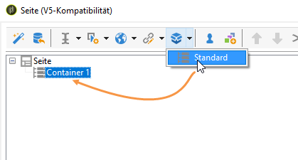

Verwenden Sie einen Container zum Gruppieren von Elementen auf der Seite, ohne dass ein Titel zum endgültigen Rendering hinzugefügt wird. Elemente werden in der Container-Unterstruktur gruppiert. Mit Standard-Containern können Sie das Layout verwalten.

Beispiel:

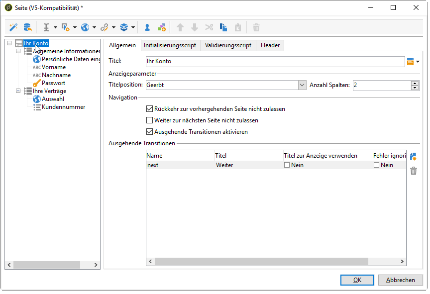

Die Position von Titeln wird auf Elemente angewendet, die in der Hierarchie unter dem Container platziert werden. Bei Bedarf kann dies für jedes Element überladen werden. Fügen Sie Spalten hinzu oder entfernen Sie sie, um das Layout zu ändern. Siehe [Die Felder auf der Seite positionieren](#positioning-the-fields-on-the-page).

Im obigen Beispiel wird das Rendering wie folgt ausgeführt:

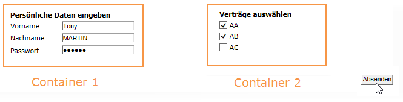

## Die Felder auf der Seite positionieren {#positioning-the-fields-on-the-page}

Das Layout des Web-Formulars wird in jedem Container Seite für Seite definiert und kann bei Bedarf überschrieben werden.

Seiten sind in Spalten unterteilt: Jede Seite enthält eine bestimmte Anzahl von Spalten. Jedes Feld der Seite belegt **n** Zellen. Container umfassen auch eine gewisse Anzahl von Spalten und die in ihnen enthaltenen Felder haben eine bestimmte Anzahl von Zellen.

Standardmäßig werden Seiten in einer einzelnen Spalte erstellt und jedes Element belegt eine Zelle. Das bedeutet, dass Felder untereinander angezeigt werden, wobei jedes wie unten dargestellt eine ganze Zeile umfasst:

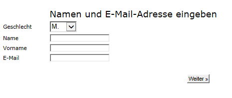

Im folgenden Beispiel wurde die Standardkonfiguration beibehalten. Die Seite belegt eine einzige Spalte, die vier Container enthält.

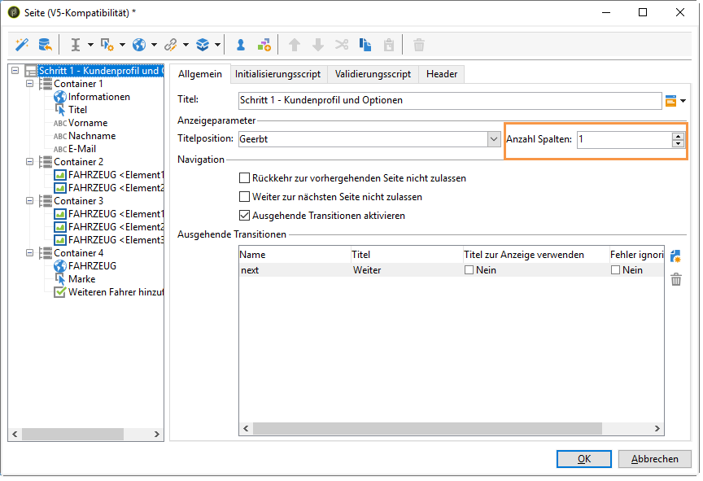

Jeder Container belegt eine Spalte und jedes Element belegt eine Zelle:

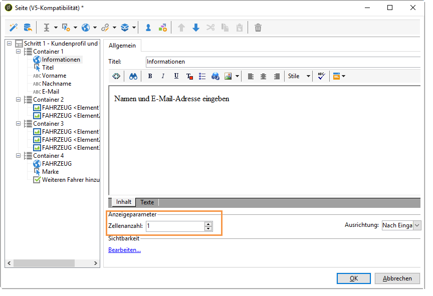

Das Rendering sieht folgendermaßen aus:

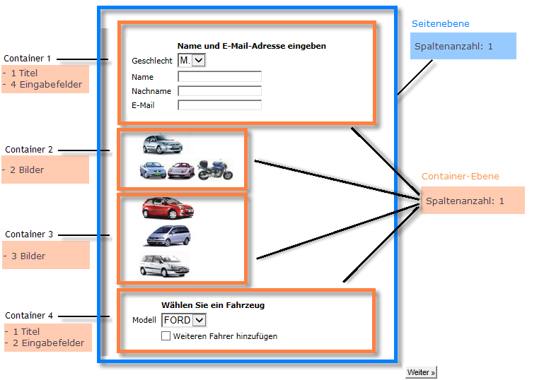

Sie können die Anzeigeparameter anpassen, um das folgende Rendering zu erhalten:

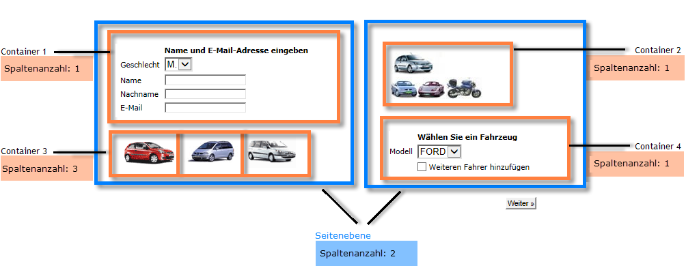

Im obigen Rendering-Beispiel belegt jedes Eingabefeld, jeder Titel und jedes Bild eine einzige Zelle in den Spalten der Container.

Sie können die Formatierung in jedem Container ändern. In unserem Beispiel können Sie den Inhalt von Container 4 auf zwei Spalten aufteilen und die Elemente verteilen.

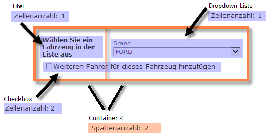

Der Titel und die Liste belegen jeweils eine Zelle (und daher eine ganze Zeile des Containers) und das Kontrollkästchen erstreckt sich über zwei Zellen. Die Anzahl der dem Eingabefeld zugeordneten Zellen ist auf der Registerkarte **[!UICONTROL Allgemein]** oder auf der Registerkarte **[!UICONTROL Erweitert]** entsprechend dem Feldtyp definiert:

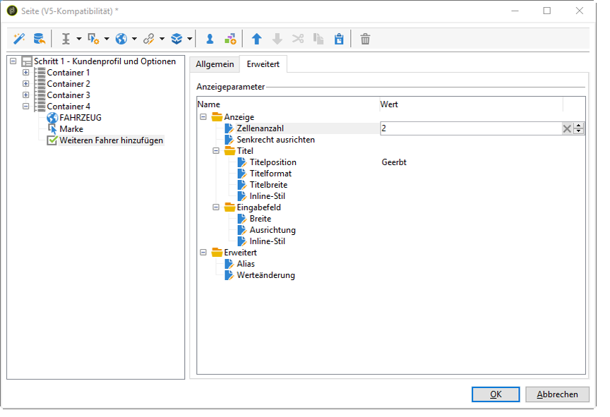

## Die Position von Titeln definieren {#defining-the-position-of-labels}

Sie können die Ausrichtung von Feldern und Titeln im Formular definieren.

Standardmäßig übernehmen die Anzeigeparameter für Felder und andere Inhalte der Seite die allgemeine Konfiguration des Formulars, die Konfiguration der Seite oder die Konfiguration des übergeordneten Containers, sofern einer vorhanden ist.

Die globalen Anzeigeparameter für das gesamte Formular werden im Eigenschaftsfeld des Formulars festgelegt. Im Tab **[!UICONTROL Rendering]** kann die Position der Titel ausgewählt werden.

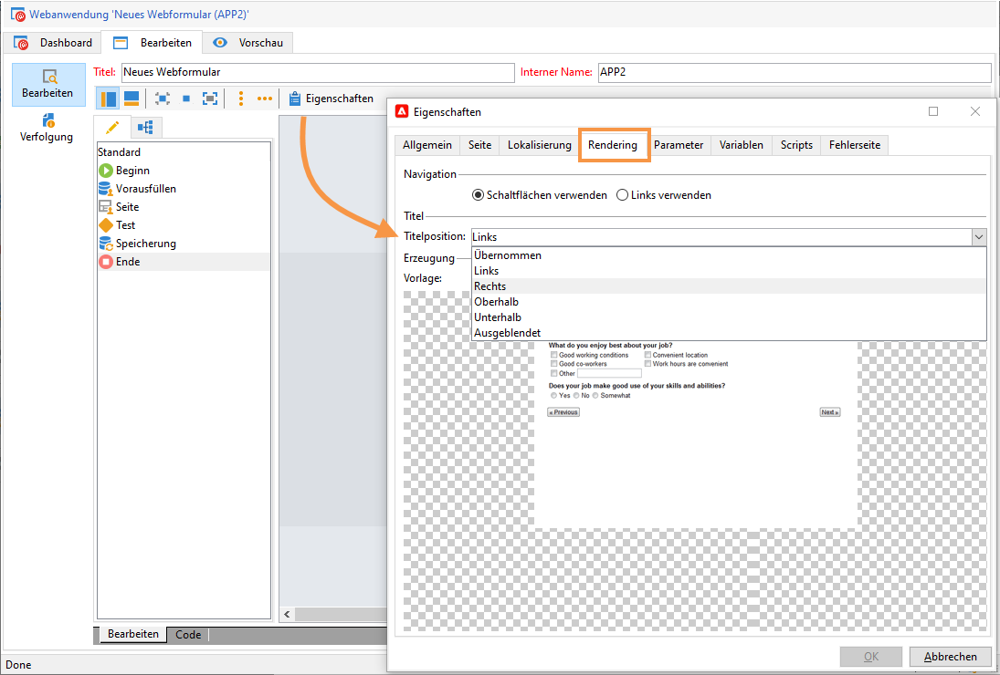

Diese Position kann für jede Seite, jeden Container und jedes Feld über den Tab **[!UICONTROL Erweitert]** überschrieben werden.

Folgende Ausrichtungen werden unterstützt:

* Geerbt: Die Ausrichtung wird vom übergeordneten Element (Standardwert) übernommen, d. h. vom übergeordneten Container, sofern vorhanden, oder ansonsten von der Seite.
* Links/rechts: Der Titel wird rechts oder links neben dem Feld positioniert.
* Oberhalb/unterhalb: Der Titel wird ober- oder unterhalb des Felds positioniert.
* Ausgeblendet: Der Titel wird nicht angezeigt.
