# Seitenreihenfolge eines Webformulars definieren{#defining-web-forms-page-sequencing}

Ein Formular kann eine oder mehrere Seiten enthalten. Es wird mithilfe eines Diagramms erstellt, in dem Sie die Möglichkeit haben, Seiten und Etappen wie Tests, Skriptausführungen, Speicherung und Sprünge aneinanderzureihen. Der Diagrammerstellungsmodus entspricht dem eines Workflows.

## Die Schaltflächen &quot;Weiter&quot; und &quot;Zurück&quot;{#about-previous-page-and-next-page}

Sie können für jede Seite die Schaltflächen **[!UICONTROL Weiter]** oder **[!UICONTROL Zurück]** löschen. Wählen Sie dazu die entsprechende Seite und danach die Option **[!UICONTROL Weiter zur nächsten Seite nicht zulassen]** oder **[!UICONTROL Rückkehr zur vorhergehenden Seite nicht zulassen]** aus .

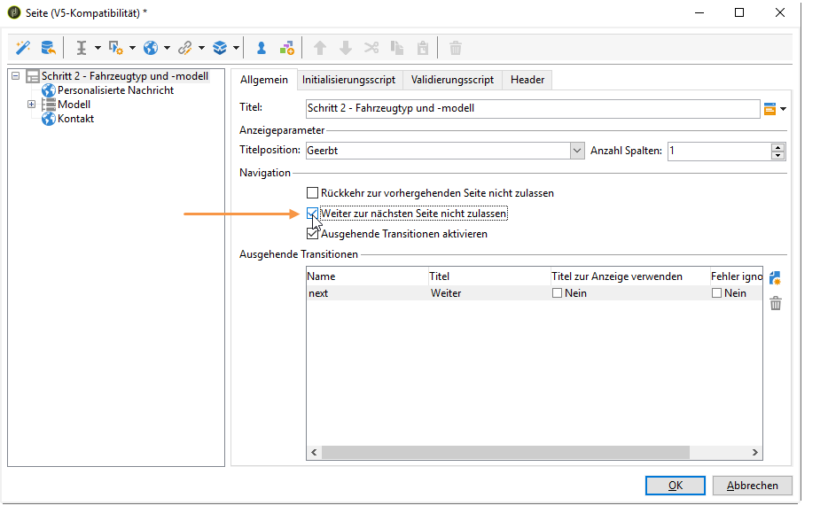

Sie können diese Schaltflächen auch durch Links ersetzen. Siehe [HTML-Inhalt einfügen](../../web/using/static-elements-in-a-web-form.md#inserting-html-content).

## Sprung einfügen {#inserting-a-jump}

Mit dem Objekt **[!UICONTROL Sprung]** gelangt der Benutzer bei der Auswahl von **[!UICONTROL Weiter]** zu einer weiteren Seite oder einem weiteren Formular.

Folgende Zielorte sind möglich:

* Eine andere Seite des Formulars. Wählen Sie dazu **[!UICONTROL Interne Aktivität]** aus und spezifizieren Sie dann die gewünschte Seite wie unten dargestellt:

   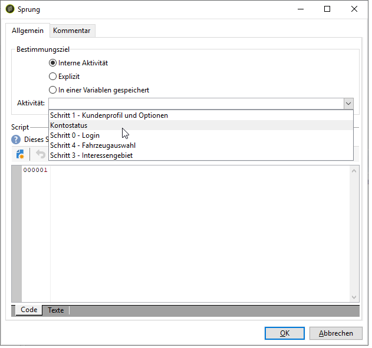

* Ein anderes Formular. Wählen Sie dazu die Option **[!UICONTROL Explizit]** aus und spezifizieren Sie das Zielformular.

   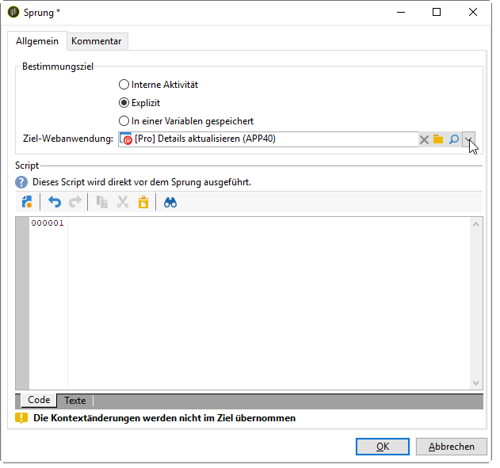

* Der Zielort kann in einer Variablen gespeichert sein. Wählen Sie ihn in diesem Fall aus der Dropdown-Liste wie unten gezeigt aus.

   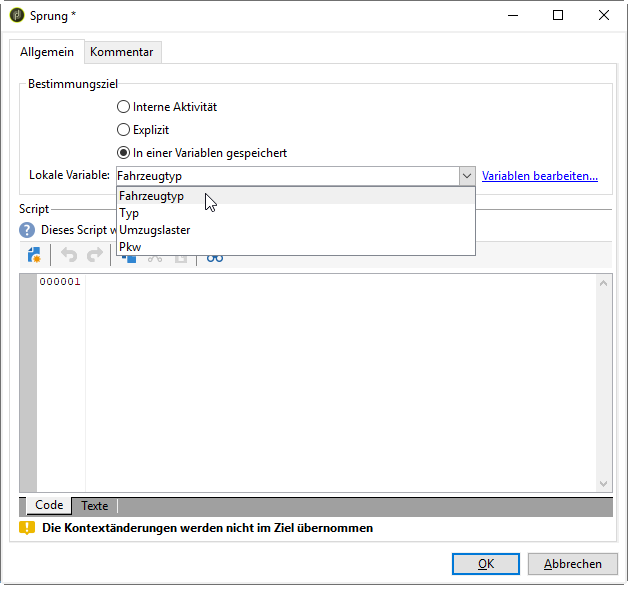

* Im Tab **[!UICONTROL Kommentar]** können Sie Informationen eingeben, die für den Operator sichtbar sind, wenn er das Objekt im Diagramm auswählt.

   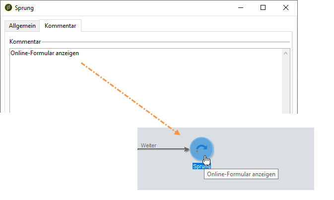

## Beispiel: Zugriff auf ein anderes Formular entsprechend einem URL-Parameter {#example--accessing-another-form-according-to-a-parameter-of-the-url}

Im folgenden Beispiel soll ein Webformular konfiguriert werden, das nach der Validierung abhängig vom Parameter der URL ein anderes Formular anzeigt. Gehen Sie dazu folgendermaßen vor:

1. Fügen Sie am Ende eines Formulars einen Sprung ein. Dieser ersetzt die **[!UICONTROL Ende]**-Komponente.

   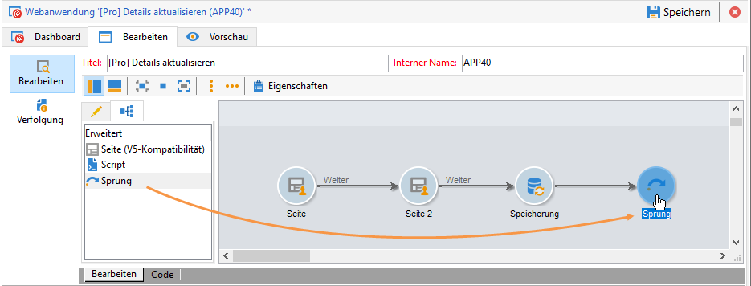

1. Fügen Sie in den Formulareigenschaften einen Parameter (**next**) hinzu, der in einer lokalen Variablen (**next**) gespeichert ist. Lokale Variablen werden unter [Daten in einer lokalen Variablen speichern](../../web/using/web-forms-answers.md#storing-data-in-a-local-variable) beschrieben.

   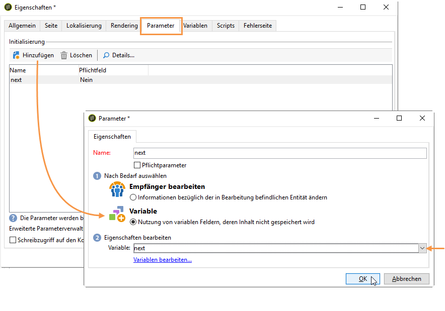

1. Bearbeiten Sie das Objekt **[!UICONTROL Sprung]**, wählen Sie die Option **[!UICONTROL In einer Variablen gespeichert]** und danach die Variable **Weiter** in der Dropdown-Liste aus.

   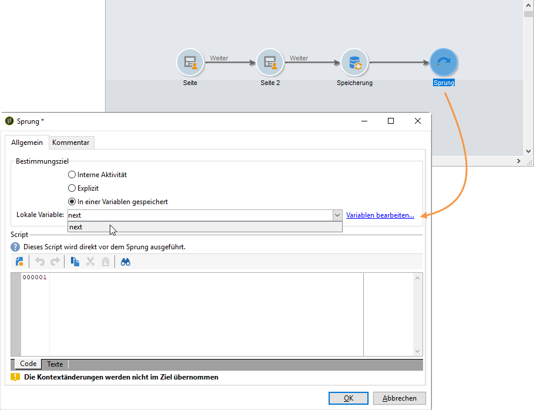

1. Die Versand-URL muss den internen Namen des Zielformulars enthalten, z. B.:

   ```
   https://[myserver]/webForm/APP62?&next=APP22
   ```

   Wenn der Benutzer die Schaltfläche **[!UICONTROL Validieren]** auswählt, wird das Formular **APP22** angezeigt.

## Link zu einer anderen Seite des Formulars einfügen {#inserting-a-link-to-another-page-of-the-form}

Sie können Links zu anderen Formularseiten einfügen. Fügen Sie dazu ein statisches Element vom Typ **[!UICONTROL Link]** zur Seite hinzu. Weitere Informationen hierzu finden Sie unter [Link einfügen](../../web/using/static-elements-in-a-web-form.md#inserting-a-link).

## Bedingte Anzeige von Seiten {#conditional-page-display}

### Anzeige anhand von Antworten {#display-based-on-responses}

Mit der Komponente **[!UICONTROL Test]** können Sie die Reihenfolge der Formularseiten entsprechend bestimmter Bedingungen ändern. Sie können mehrere Verzweigungen definieren, die je nach Testergebnis aktiviert werden. Dadurch werden abhängig von den Benutzerantworten unterschiedliche Seiten angezeigt.

Beispielsweise können Sie Kunden, die zuvor eine Online-Bestellung aufgegeben haben, eine andere Seite anzeigen wie jenen, die über zehn Bestellungen aufgegeben haben. Fügen Sie dazu auf der ersten Formularseite ein Eingabefeld vom Typ **[!UICONTROL Zahl]** ein, in dem der Benutzer angeben kann, wie viele Bestellungen er bereits aufgegeben hat.

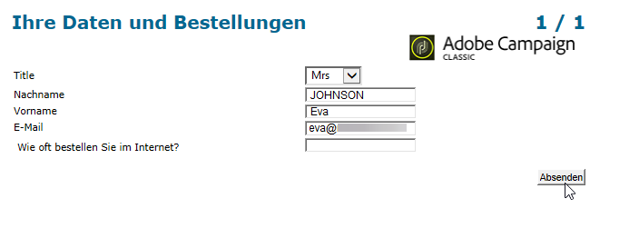

Diese Informationen können entweder in einem Datenbankfeld oder einer lokalen Variablen gespeichert werden.

>[!NOTE]
>
>Die Speichermodi werden in [Speicherfelder für Antworten](../../web/using/web-forms-answers.md#response-storage-fields) beschrieben.

In unserem Beispiel soll eine Variable verwendet werden:

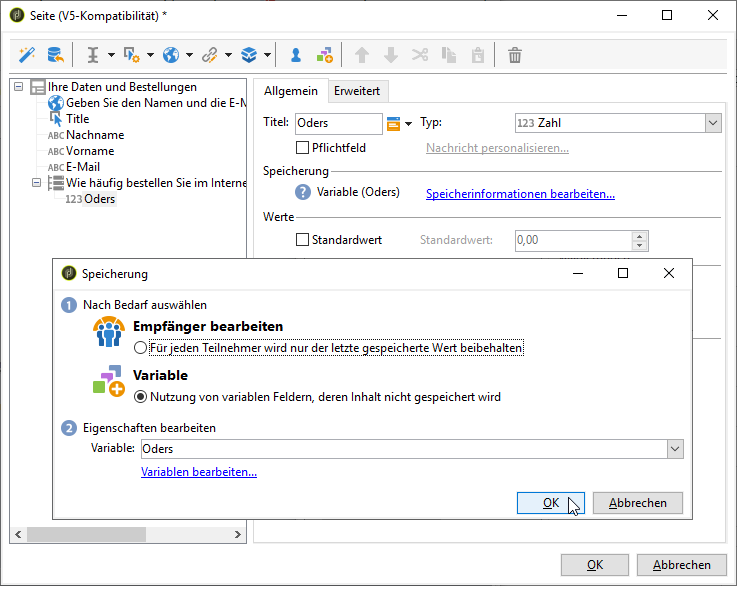

Fügen Sie im Diagramm des Formulars eine Test-Komponente ein, um die Bedingungen zu definieren. Für jede Bedingung wird am Ausgang der Test-Komponente eine neue Abzweigung hinzugefügt.

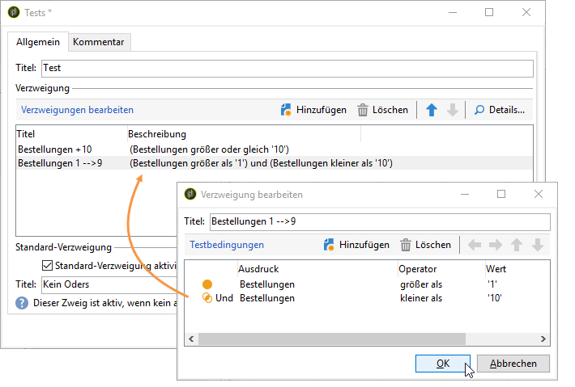

Wählen Sie die Option **[!UICONTROL Standard-Verzweigung aktivieren]** aus, um eine Transition für Fälle hinzuzufügen, bei denen keine der Bedingungen wahr ist. Diese Option ist nicht nötig, wenn alle möglichen Fälle in den definierten Bedingungen berücksichtigt werden.

Definieren Sie dann die Seitenreihenfolge, wenn eine der Bedingungen wahr ist, zum Beispiel:

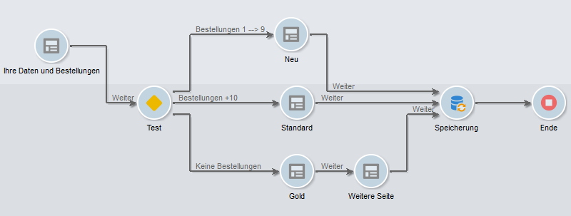

### Anzeige anhand von Parametern {#display-based-on-parameters}

Sie können die Seitenreihenfolge auch gemäß den Initialisierungsparametern des Webformulars oder den in der Datenbank gespeicherten Werten festlegen. Siehe [Parameter der Formular-URL](../../web/using/defining-web-forms-properties.md#form-url-parameters).

## Skripts hinzufügen {#adding-scripts}

Mit dem Objekt **[!UICONTROL Script]** können Sie ein JavaScript-Element direkt einfügen, z. B. um den Wert eines Felds zu ändern, um Daten aus der Datenbank abzurufen oder um eine Adobe Campaign-API aufzurufen.

## Endseite anpassen {#personalizing-the-end-page}

Am Ende des Diagramms muss eine Endseite platziert werden. Diese wird angezeigt, wenn der Benutzer im Webformular die Schaltfläche **[!UICONTROL Validieren]** auswählt.

Um diese Seite anzupassen, führen Sie einen Doppelklick auf die **[!UICONTROL Ende]**-Komponente aus und geben Sie in den mittig angeordneten Editor den Seiteninhalt ein.

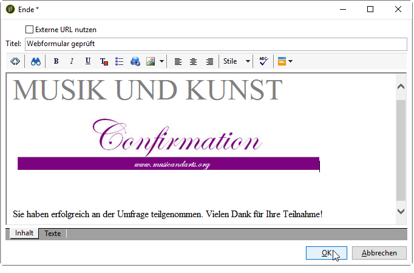

* Sie können vorhandenen HTML-Inhalt kopieren und einfügen. Wählen Sie dazu **[!UICONTROL Quellcode anzeigen]** aus und geben Sie den HTML-Code ein.
* Sie können eine externe URL verwenden. Wählen Sie dazu die entsprechende Option aus und geben Sie die URL der anzuzeigenden Seite ein.

