# Eigenschaften eines Webformulars definieren{#defining-web-forms-properties}

Webformulare können vollständig konfiguriert und entsprechend Ihren Anforderungen angepasst werden. Geben Sie dazu im Eigenschaftenfenster die entsprechenden Parameter ein.

Auf das Eigenschaftenfenster können Sie über die Schaltfläche **[!UICONTROL Eigenschaften]** in der Symbolleiste des Webformulars zugreifen. Über dieses Fenster haben Sie Zugriff auf die Eigenschaften des Webformulars. Einige Einstellungen stammen möglicherweise aus der Konfiguration der Vorlage.

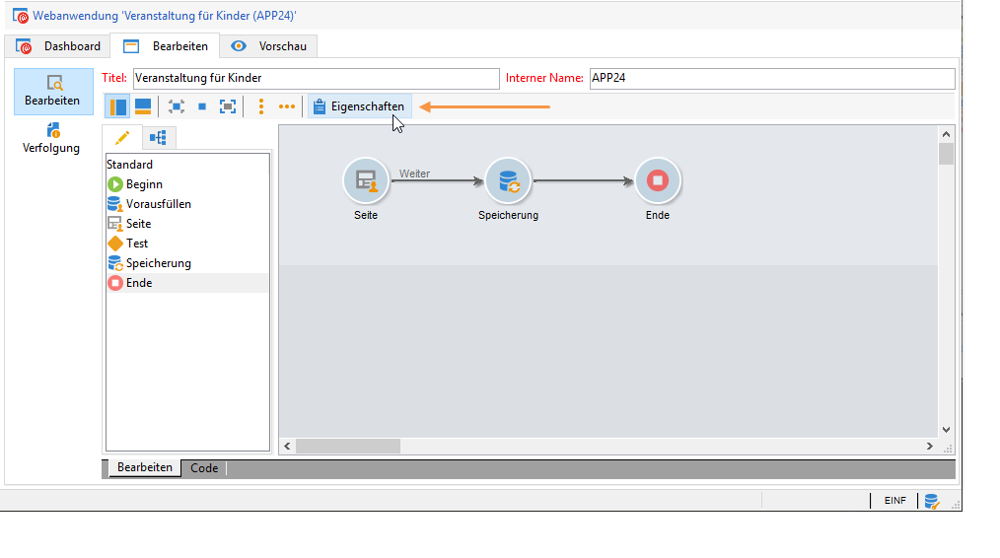

## Allgemeine Formulareigenschaften {#overall-form-properties}

Im Tab **[!UICONTROL Allgemein]** des Eigenschaftenfensters können Sie den **Titel** des Formulars ändern. Es wird dringend davon abgeraten, den **internen Namen** zu ändern.

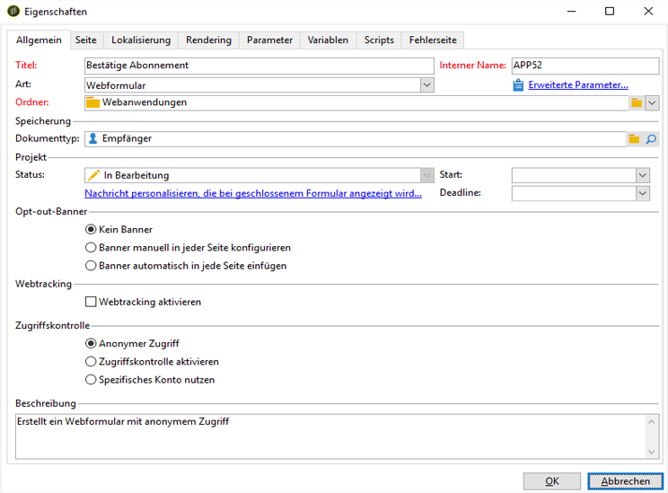

Die Formularvorlage wird bei der Formularerstellung ausgewählt. Sie kann später nicht mehr geändert werden. Weitere Informationen zum Erstellen und Verwalten von Formularvorlagen finden Sie unter [Webformularvorlage verwenden](../../web/using/using-a-web-form-template.md).

## Formulardaten speichern {#form-data-storage}

Standardmäßig werden die Felder des Webformulars in der Empfängertabelle gespeichert. Um eine andere Tabelle zu verwenden, wählen Sie im Feld **[!UICONTROL Dokumenttyp]** eine neue Tabelle aus. Mit dem **[!UICONTROL Zoom]**-Symbol können Sie den Inhalt der ausgewählten Tabelle anzeigen.

Standardmäßig werden die Antworten in der Tabelle **[!UICONTROL Antworten auf ein Formular]** gespeichert.

## Fehlerseite einrichten {#setting-up-an-error-page}

Sie können eine Fehlerseite konfigurieren, die im Fall von Fehlern bei der Verwendung eines Formulars angezeigt wird.

Eine Fehlerseite wird im entsprechenden Tab des Fensters mit den Formulareigenschaften definiert.

Standardmäßig enthält sie die folgenden Informationen:

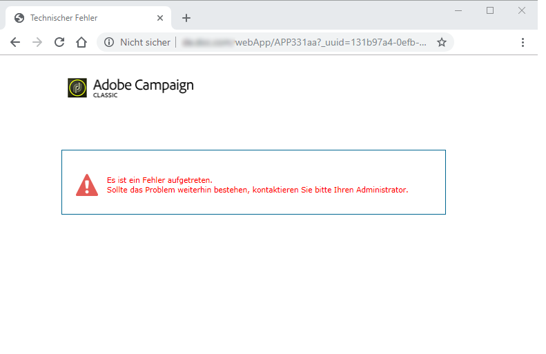

Der Inhalt der dargestellten Strings wird im Tab **[!UICONTROL Fehlerseite]** des Eigenschaftenfensters definiert. Im Tab **[!UICONTROL HTML]** wird das Rendering dargestellt und im Tab **[!UICONTROL Texte]** können Sie die Textstrings ändern und Text nach Bedarf hinzufügen:

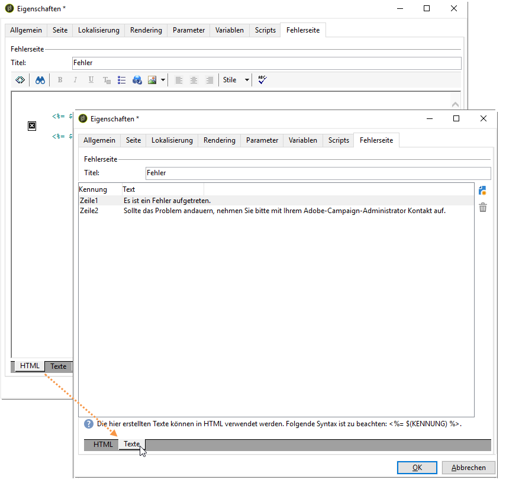

## Lokalisierung eines Formulars {#form-localization}

Im Tab **[!UICONTROL Lokalisierung]** können Sie das Design und die Anzeigesprachen für das Webformular auswählen.

Siehe [Webformular übersetzen](../../web/using/translating-a-web-form.md).

## Navigation und Rendering im Formular {#form-browsing-and-rendering}

Im Tab **[!UICONTROL Rendering]** können Sie definieren, wie die Navigation zwischen den Seiten des Webformulars erfolgen und welche Rendering-Vorlage verwendet werden soll.

Sie können zwischen der Navigation per Link oder Schaltfläche wählen.

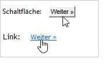

Standardmäßig sind Schaltflächen als Navigationselemente ausgewählt. Sie können damit folgende Aktionen ausführen:

* Die aktuelle Seite validieren und durch Auswahl von **[!UICONTROL Weiter]** die nächste Seite anzeigen. Diese Schaltfläche wird auf allen Seiten außer der letzten angezeigt.
* Durch Auswahl von **[!UICONTROL Zurück]** die vorherige Seite anzeigen. Diese Schaltfläche wird auf allen Seiten außer der ersten angezeigt.
* Die Formularantworten durch Auswahl der Schaltfläche **[!UICONTROL Validieren]** speichern. Diese Schaltfläche wird nur auf der letzten Seite angezeigt.

Diese Elemente befinden sich am unteren Rand einer jeden Seite. Ihre Position kann durch die Bearbeitung des Stylesheets geändert werden.

>[!NOTE]
>
>Auf manchen Seiten kann die Schaltfläche **[!UICONTROL Zurück]** ausblendet werden. Gehen Sie dazu auf die entsprechende Seite und aktivieren Sie die Option **[!UICONTROL Rückkehr zur vorhergehenden Seite nicht zulassen]**. Diese Option ist verfügbar, wenn die Wurzel des Seitenbaums ausgewählt wird.

Das Feld **[!UICONTROL Vorlage]** des Tabs **[!UICONTROL Rendering]** ermöglicht die Auswahl eines Themas.

Themen werden im Knoten **[!UICONTROL Administration > Konfiguration > Formular-Rendering]** des Baums gespeichert. Siehe [Vorlage zum Formular-Rendering auswählen](../../web/using/form-rendering.md#selecting-the-form-rendering-template).

Das jeweilige Rendering wird im unteren Teil des Eigenschaftenfensters angezeigt. Über das Symbol **[!UICONTROL Link bearbeiten]** kann die Konfiguration für das ausgewählte Thema aufgerufen werden.

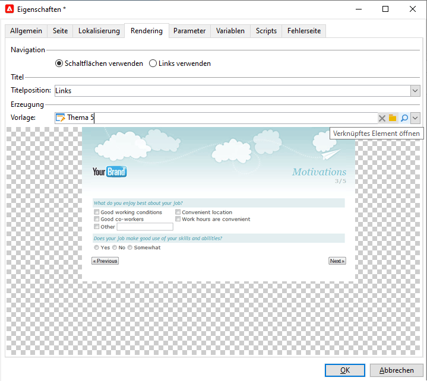

## Texte im Formular {#texts-in-the-form}

Im Tab **[!UICONTROL Seite]** können Sie den Inhalt des Formularkopfs und -fußes definieren. Siehe [Header und Footer definieren](../../web/using/form-rendering.md#defining-headers-and-footers).

Dort können Sie auch Übersetzungen verwalten. Siehe [Webformular übersetzen](../../web/using/translating-a-web-form.md).

## Zugriff auf das Formular {#accessibility-of-the-form}

Ein Webformular ist für Benutzer verfügbar, wenn es **[!UICONTROL online]** ist und das aktuelle Datum innerhalb der Gültigkeitsdauer liegt. Der Status des Formulars ändert sich in der Publikationsphase (siehe [Formular publizieren](../../web/using/publishing-a-web-form.md#publishing-a-form)). Der Status wird im Bereich **Projekt** im Tab **[!UICONTROL Allgemein]** des Eigenschaftenfensters angezeigt.

Der Gültigkeitszeitraum erstreckt sich vom **[!UICONTROL Startdatum]** bis zum **[!UICONTROL Enddatum]**. Wenn keine Daten in diesen Feldern eingetragen sind, hat das Formular permanente Gültigkeit.

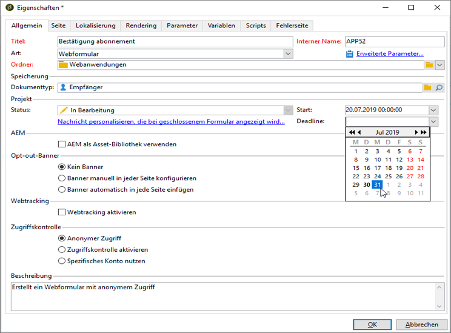

>[!NOTE]
>
>Wenn das Formular geschlossen wird, ohne dass sein Gültigkeitszeitraum abgelaufen ist oder dieser bereits abgelaufen ist, oder wenn es vom Adobe Campaign-Operator geschlossen wurde, wird Besuchern eine entsprechende Mitteilung angezeigt, wenn diese versuchen, darauf zuzugreifen. Sie können diese Mitteilung anpassen, indem Sie **[!UICONTROL Nachricht personalisieren, die bei geschlossenem Formular angezeigt wird...]** auswählen.

## Zugriffskontrolle auf Formulare {#form-access-control}

Standardmäßig kann der Zugriff auf Webformulare anonym erfolgen: Allen Operatoren, die auf das Formular zugreifen, werden WEBAPP-Operatorrechte erteilt.

Sie können die Zugriffskontrolle für die Anzeige des Formulars aktivieren, um Besucher zu authentifizieren, wenn Sie beispielsweise ein Formular auf einer Intranet-Seite bereitstellen. Rufen Sie dazu für das entsprechende Formular das Fenster **[!UICONTROL Eigenschaften]** auf und wählen Sie die Option **[!UICONTROL Zugriffskontrolle aktivieren]** wie unten gezeigt aus:

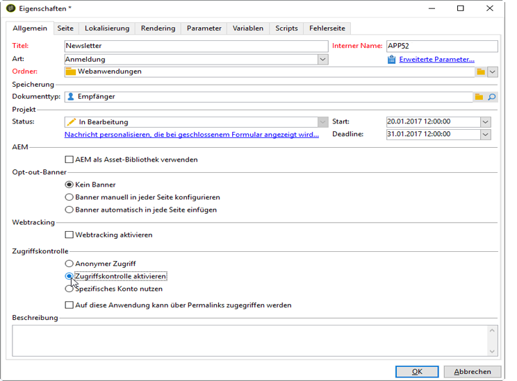

Beim Zugriff auf die Seite erscheint das folgende Authentifizierungsformular:

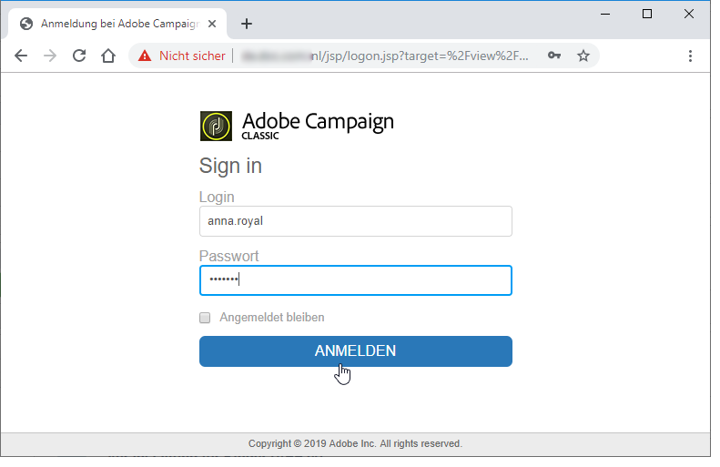

Der Benutzername und das Passwort entspricht denen der Adobe Campaign-Operatoren. Weiterführende Informationen dazu finden Sie in [diesem Abschnitt ](../../platform/using/access-management.md).

Mit der Option **[!UICONTROL Spezifisches Konto nutzen]** können Sie die Lese- oder Schreibrechte eines Operators einschränken, der auf das Formular zugreift. Wählen Sie in der Dropdown-Liste einen Operator oder eine Operatorgruppe aus, die für die Vergabe dieser Rechte zuständig sein sollen.

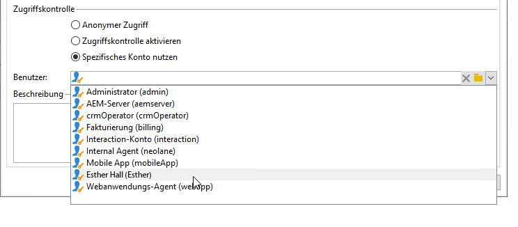

## Parameter der Formular-URL {#form-url-parameters}

Sie können zur URL eines Formulars zusätzliche Parameter hinzufügen, um seinen Inhalt anzupassen und einen Kontext zu initialisieren (Sprache, verschlüsselte Empfänger-ID, Unternehmen, berechnete, in einer Variablen gespeicherte Formel etc.). Dadurch können Sie über mehrere URLs Zugriff auf ein Formular gewähren und den Seiteninhalt auf der Basis des in der URL angegebenen Parameterwerts anpassen.

Standardmäßig bietet Adobe Campaign Parameter für die Vorschau des Formulars und die Fehlerprüfung. Sie können neue, mit dem Formular verknüpfte Einstellungen definieren, die die Werte eines Datenbankfelds oder einer lokalen Variablen verwenden können.

## Standardparameter {#standard-parameters}

Standardmäßig sind die folgenden Parameter verfügbar:

* **id** zur Darstellung der verschlüsselten Kennung
* **lang** zur Änderung der Anzeigesprache
* **origin** zur Spezifizierung der Herkunft des reagierenden Kontakts
* **_uuid** ermöglicht die Ansicht des Formulars vor der Publikation sowie die Fehlerprüfung. Dieser Parameter ist nur für die interne Nutzung vorgesehen (Erstellung und Fehlerkorrektur): Wenn Sie ein Webformular über diese URL aufrufen, werden beim Tracking (Berichte) die erzeugten Datensätze nicht berücksichtigt. Der Wert für die Herkunft lautet stets **[!UICONTROL Adobe Campaign]**.

   Dieser Parameter wird gemeinsam mit den Parametern **_preview** und/oder **_debug** verwendet:

   **_preview** zur Anzeige der zuletzt gespeicherten Version. Dieser Parameter darf nur in der Testphase verwendet werden.

   **_debug** zur Anzeige der Spur der eingegebenen oder auf den Formularseiten berechneten Daten. Damit können zusätzliche Informationen zu Fehlern erfasst werden, einschließlich jenen nach der Publikation des Formulars.

   >[!CAUTION]
   >
   >Wenn das Formular über eine URL mit dem Parameter **_uuid** aufgerufen wird, wird im Parameterwert **[!UICONTROL Herkunft]** immer **Adobe Campaign** angezeigt.

## Parameter hinzufügen {#adding-parameters}

Parameter können im Eigenschaftenfenster des Formulars über den Tab **[!UICONTROL Parameter...]** hinzugefügt werden. Sie können wie unten gezeigt als obligatorisch festgelegt werden:

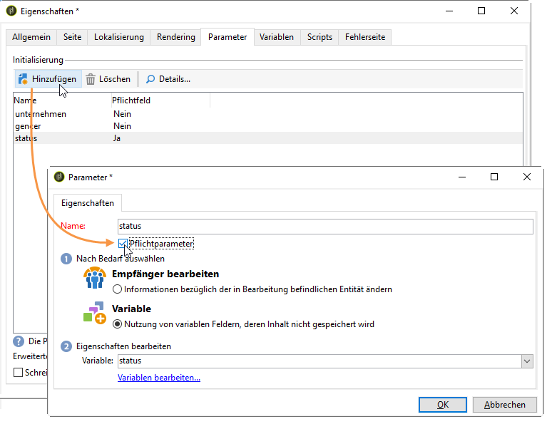

Spezifizieren Sie einen Speicherort, von dem der Parameterwert abgerufen wird. Wählen Sie dazu eine der Speicheroptionen aus und öffnen Sie danach den Tab **[!UICONTROL Speicherung]**, um das entsprechende Feld oder die entsprechende Variable auszuwählen. Die Speicheroptionen werden in den [Speicherfeldern für Antworten](../../web/using/web-forms-answers.md#response-storage-fields) ausführlich beschrieben.

Der Status des reagierenden Kontakts (0, 1 oder ein beliebiger anderer Wert) kann dann entsprechend dem Formularzugriff zur URL hinzugefügt werden. Diese Information kann auf den Formularseiten oder in einer Text-Box wiederverwendet werden. Die Anzeige von Seiten kann wie unten gezeigt von einem kontextuellen Wert abhängig gemacht werden:

1. Startseite für Kunden (**Status = 1**):

   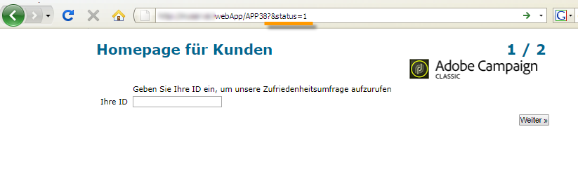

1. Startseite für Interessenten (**Status = 0**):

   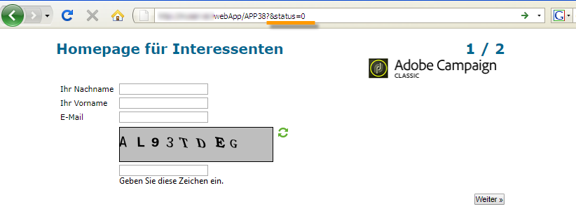

1. Startseite für andere Profile (z. B. **Status = 12**):

   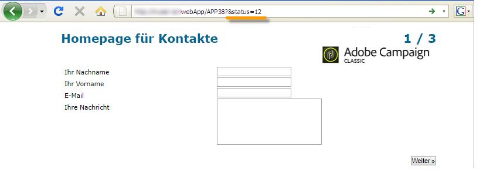

Erstellen Sie zur Konfiguration dieses Formulars eine Test-Komponente und platzieren Sie sie wie unten gezeigt an den Anfang des Diagramms:

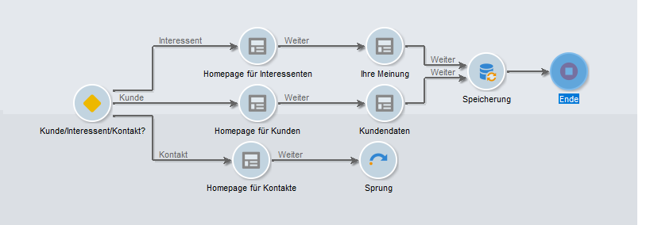

Über die Test-Komponente können Sie die Bedingungen der Seitenreihenfolge konfigurieren:

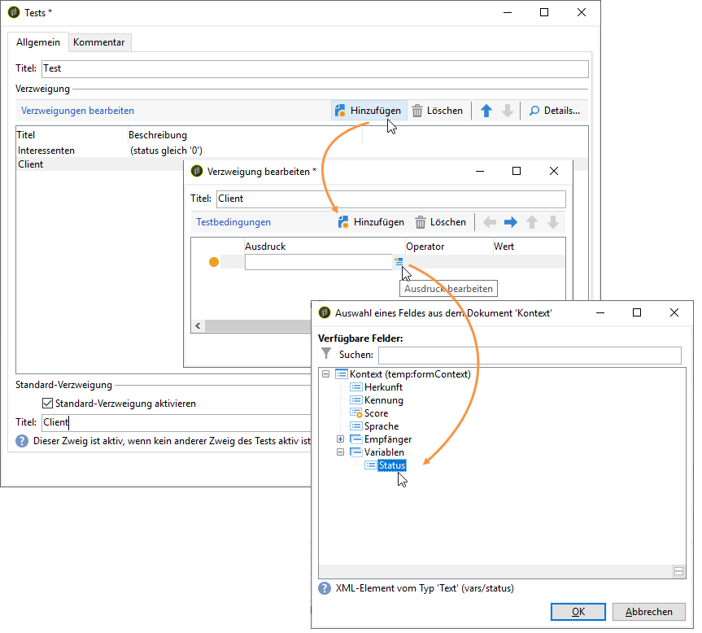

