# Definieren der Eigenschaften von Web-Formularen{#defining-web-forms-properties}

Sie können Web-Formulare vollständig Ihren Anforderungen entsprechend konfigurieren und personalisieren. Die Parameter müssen im Eigenschaftenfenster eingegeben werden.

Auf das Eigenschaftenfenster kann über die Schaltfläche **[!UICONTROL Eigenschaften]** in der Symbolleiste des Web-Formulars zugegriffen werden. In diesem Fenster können Sie auf eine Reihe von Einstellungen zugreifen, die für das Web-Formular spezifisch sind. Einige Einstellungen stammen möglicherweise aus der Vorlagenkonfiguration.

## Allgemeine Formulareigenschaften {#overall-form-properties}

Im Tab **[!UICONTROL Allgemein]** des Eigenschaftenfensters können Sie den **Titel** des Formulars ändern. Es wird dringend davon abgeraten, den **internen Namen** zu ändern.

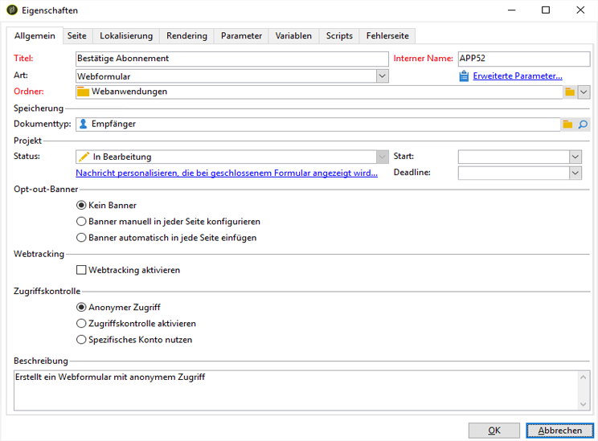

Die Formularvorlage wird bei der Formularerstellung ausgewählt. Sie kann später nicht mehr geändert werden. Weitere Informationen zum Erstellen und Verwalten von Formularvorlagen finden Sie unter [Webformularvorlage verwenden](using-a-web-form-template.md).

## Formulardaten speichern {#form-data-storage}

Standardmäßig werden die Felder des Webformulars in der Empfängertabelle gespeichert. Um eine andere Tabelle zu verwenden, wählen Sie im Feld **[!UICONTROL Dokumenttyp]** eine neue Tabelle aus. Mit dem **[!UICONTROL Zoom]**-Symbol können Sie den Inhalt der ausgewählten Tabelle anzeigen.

Standardmäßig werden die Antworten in der Tabelle **Antworten auf ein Formular** gespeichert.

## Fehlerseite einrichten {#setting-up-an-error-page}

Sie können eine Fehlerseite konfigurieren, die im Fall von Fehlern bei der Verwendung eines Formulars angezeigt wird.

Eine Fehlerseite wird im entsprechenden Tab des Fensters mit den Formulareigenschaften definiert.

Standardmäßig enthält sie die folgenden Informationen:

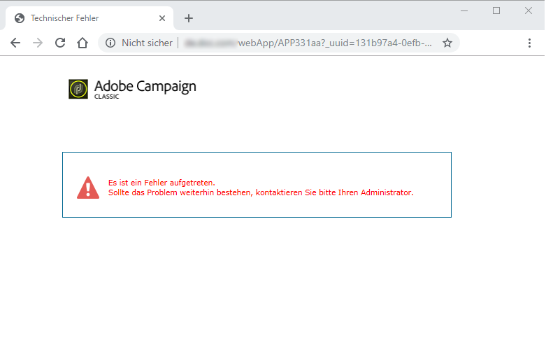

Der Inhalt der angezeigten Strings wird auf der Registerkarte **[!UICONTROL Fehlerseite]** des Eigenschaftenfensters definiert. Auf der Registerkarte **[!UICONTROL HTML]** wird das Rendering dargestellt und auf der Registerkarte **[!UICONTROL Texte]** können Sie die Text-Strings ändern und Text nach Bedarf hinzufügen:

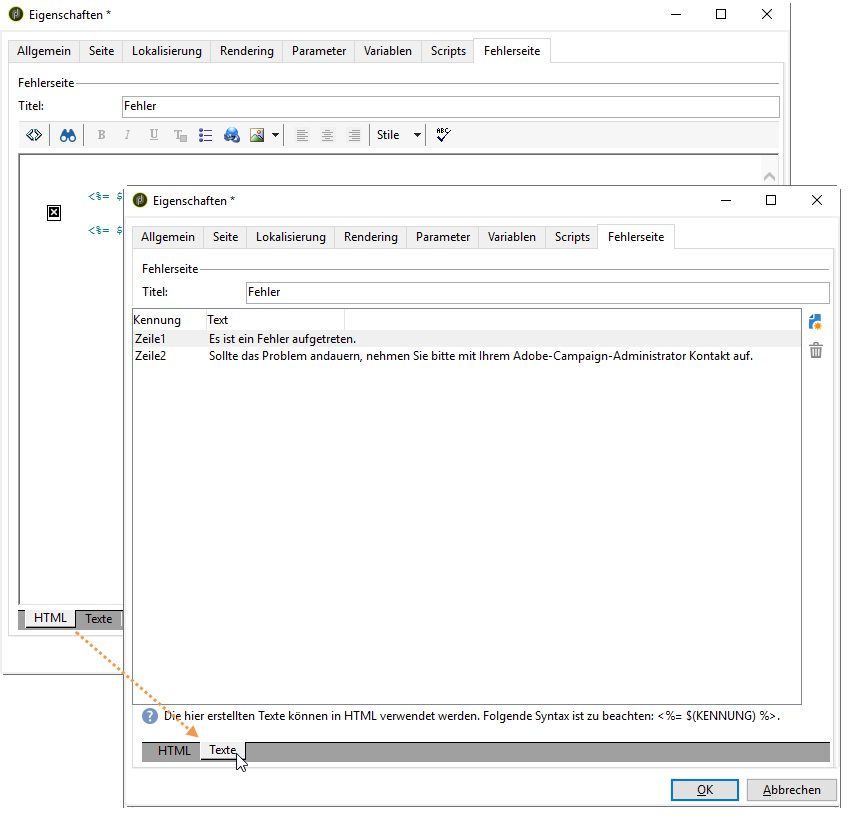

## Lokalisierung eines Formulars {#form-localization}

Im Tab **[!UICONTROL Lokalisierung]** können Sie das Design und die Anzeigesprachen für das Webformular auswählen.

Siehe [Webformular übersetzen](translating-a-web-form.md).

## Navigation und Rendering im Formular {#form-browsing-and-rendering}

Im Tab **[!UICONTROL Rendering]** können Sie definieren, wie die Navigation zwischen den Seiten des Webformulars erfolgen und welche Rendering-Vorlage verwendet werden soll.

Sie können zwischen der Navigation per Link oder Schaltfläche wählen.

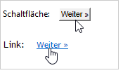

Schaltflächen sind standardmäßig die Navigationselemente. Sie ermöglichen Ihnen die folgenden Aktionen:

* Genehmigen Sie die aktuelle Seite und zeigen Sie die nächste Seite an, indem Sie auf **[!UICONTROL Weiter]** klicken. Diese Schaltfläche wird auf allen Seiten mit Ausnahme der letzten angezeigt.
* Zeigen Sie die vorherige Seite an, indem Sie auf **[!UICONTROL Zurück]** klicken. Diese Schaltfläche wird mit Ausnahme der ersten auf allen Seiten angezeigt.
* Speichern Sie die Formularantworten, indem Sie auf die Schaltfläche **[!UICONTROL Genehmigen]** klicken. Diese Schaltfläche wird nur auf der letzten Seite angezeigt.

Diese Elemente werden unten auf jeder Seite angezeigt. Ihre Positionen können geändert werden. Dazu müssen Sie das Stylesheet ändern.

>[!NOTE]
>
>Auf manchen Seiten kann die Schaltfläche **[!UICONTROL Zurück]** ausblendet werden. Gehen Sie dazu auf die entsprechende Seite und aktivieren Sie die Option **[!UICONTROL Rückkehr zur vorhergehenden Seite nicht zulassen]**. Diese Option ist verfügbar, wenn die Wurzel des Seitenbaums ausgewählt wird.

Das Feld **[!UICONTROL Vorlage]** des Tabs **[!UICONTROL Rendering]** ermöglicht die Auswahl eines Themas.

Themen werden im Knoten **[!UICONTROL Administration > Konfiguration > Formular-Rendering]** des Baums gespeichert. Siehe [Vorlage zum Formular-Rendering auswählen](form-rendering.md#selecting-the-form-rendering-template).

Das jeweilige Rendering wird im unteren Teil des Eigenschaftenfensters angezeigt. Über das Symbol **[!UICONTROL Link bearbeiten]** kann die Konfiguration für das ausgewählte Thema aufgerufen werden.

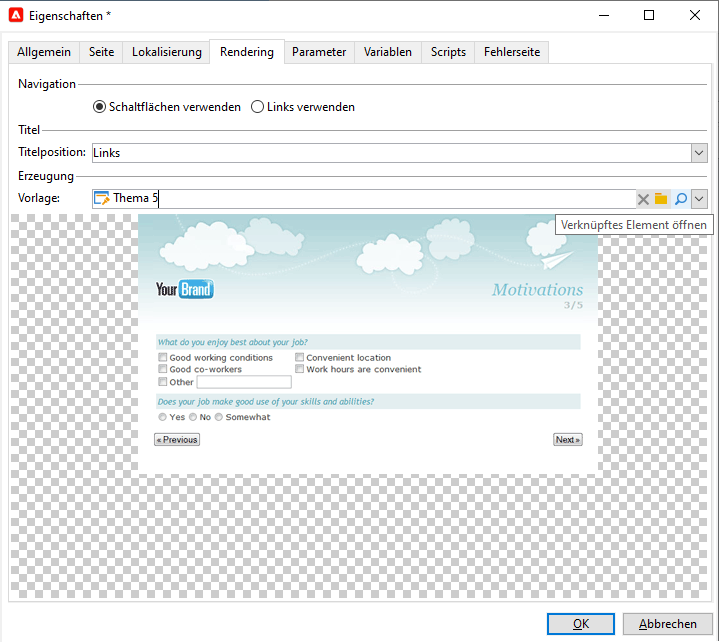

## Logos im Formular {#logo-in-the-form}

Sie können das im Formular verwendete Logo durch Ihr eigenes Logo ersetzen.

Klicken Sie in Ihrer Web-App unter **[!UICONTROL Eigenschaften]** auf der Registerkarte **[!UICONTROL Rendering]** auf das Lupensymbol für Ihre Vorlage:

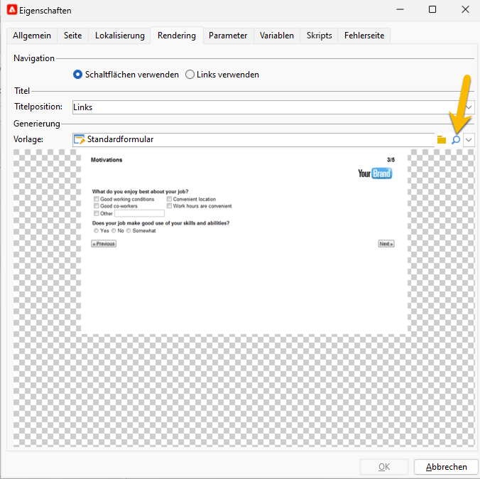

Klicken Sie im neuen Fenster auf den Link **[!UICONTROL Seitenlayout]**:

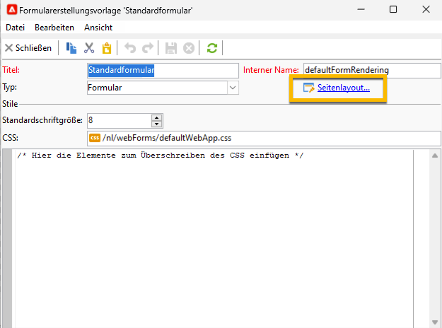

Sie können den Pfad des Logobilds hier ändern:

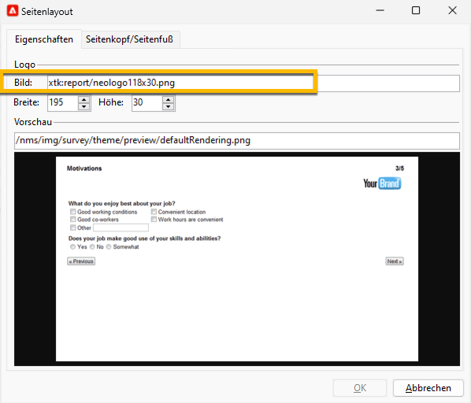

Die verfügbaren Bilder finden Sie unter **[!UICONTROL Administration]** > **[!UICONTROL Konfiguration]** > **[!UICONTROL Bilder]**. Sie können Ihr Logo hier hinzufügen.

Diese Bilder werden im Backend-Verzeichnis der Instanz *datakit\nms\fra\img\activities* oder *datakit\nms\eng\img\activities* abgelegt (eng oder fra, je nach Sprache der Instanz).

Um ein neues Bild in diesem Verzeichnis (und in Bildern) verfügbar zu machen, wenden Sie sich an den Adobe-Support, um Änderungen an den Backend-Verzeichnissen vorzunehmen.

Bei On-Premise-Instanzen können Sie dem Datakit selbst Bilder hinzufügen.

Das hochgeladene Bild muss nicht vom Campaign-Client aus sichtbar sein. Der richtige Pfad reicht aus, damit es als neues Logo verwendet wird.

## Texte im Formular {#texts-in-the-form}

Im Tab **[!UICONTROL Seite]** können Sie den Inhalt des Formular-Headers und -Footers definieren. Siehe [Header und Footer definieren](form-rendering.md#defining-headers-and-footers).

Dort können Sie auch Übersetzungen verwalten. Siehe [Webformular übersetzen](translating-a-web-form.md).

## Zugriff auf das Formular {#accessibility-of-the-form}

Ein Webformular ist für Benutzer verfügbar, wenn es **[!UICONTROL online]** ist und das aktuelle Datum innerhalb der Gültigkeitsdauer liegt. Der Status des Formulars ändert sich in der Veröffentlichungsphase (siehe [Formular veröffentlichen](publishing-a-web-form.md#publishing-a-form)). Der Status wird im Bereich **Projekt** im Tab **[!UICONTROL Allgemein]** des Eigenschaftenfensters angezeigt.

Der Gültigkeitszeitraum reicht vom **[!UICONTROL Start]** Datum bis zum **[!UICONTROL Enddatum]**. Wenn in diesen Feldern keine Daten angegeben sind, hat das Formular eine permanente Gültigkeit.

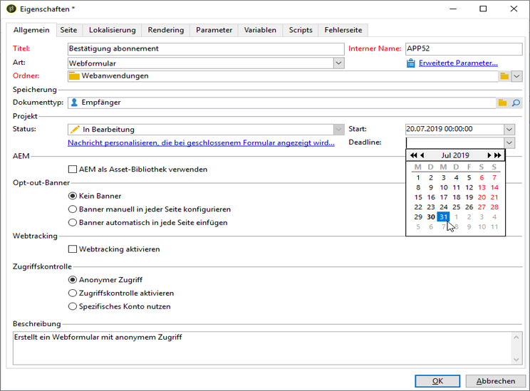

>[!NOTE]
>
>Wenn das Formular geschlossen wird, ohne dass sein Gültigkeitszeitraum abgelaufen ist oder dieser bereits abgelaufen ist, oder wenn es vom Adobe Campaign-Operator geschlossen wurde, wird Besuchern eine entsprechende Meldung angezeigt, wenn diese versuchen, darauf zuzugreifen. Sie können diese Mitteilung anpassen, indem Sie **[!UICONTROL Nachricht personalisieren, die bei geschlossenem Formular angezeigt wird...]** auswählen.

## Zugriffskontrolle auf Formulare {#form-access-control}

Standardmäßig kann der Zugriff auf Webformulare anonym erfolgen: Allen Operatoren, die auf das Formular zugreifen, werden WEBAPP-Operatorrechte erteilt.

Sie können die Zugriffskontrolle für die Anzeige des Formulars aktivieren, um Besucher zu authentifizieren, wenn Sie beispielsweise ein Formular auf einer Intranet-Seite bereitstellen. Rufen Sie dazu für das entsprechende Formular das Fenster **[!UICONTROL Eigenschaften]** auf und wählen Sie die Option **[!UICONTROL Zugriffskontrolle aktivieren]** wie unten gezeigt aus:

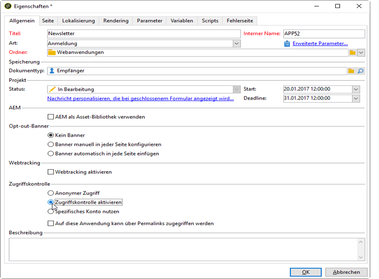

Beim Zugriff auf die Seite erscheint das folgende Authentifizierungsformular:

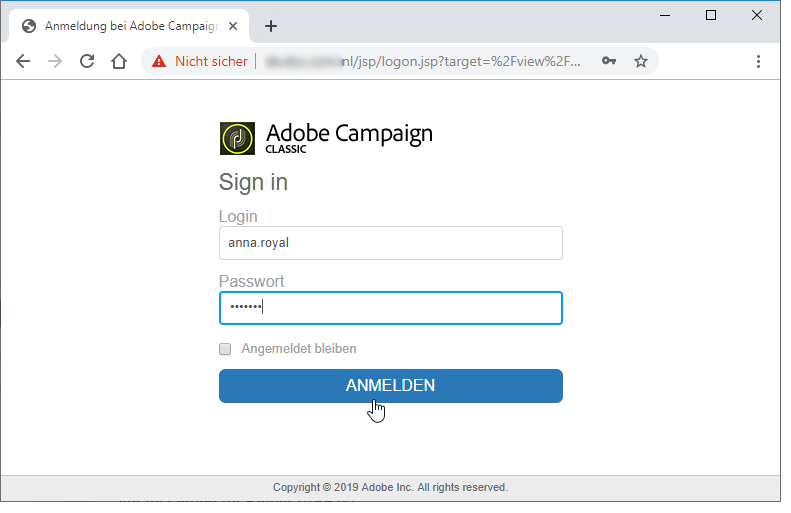

Der Benutzername und das Passwort entspricht denen der Adobe Campaign-Operatoren. Weiterführende Informationen hierzu finden Sie in [diesem Abschnitt](../../platform/using/access-management.md).

Mit **[!UICONTROL Option „Spezifisches Konto verwenden]** können Sie die Lese- oder Schreibberechtigung des Benutzers einschränken, der auf das Formular zugreift. Verwenden Sie das Dropdown-Feld, um einen Benutzer oder eine Benutzergruppe auszuwählen, der bzw. die für die Erteilung dieser Berechtigungen zuständig sein soll.

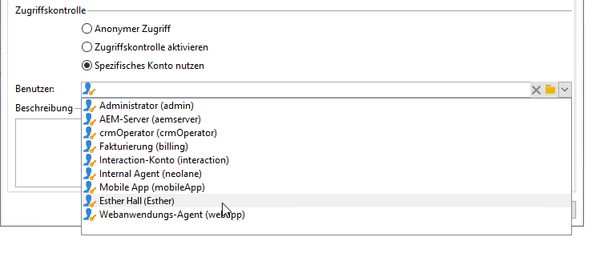

## Parameter der Formular-URL {#form-url-parameters}

Sie können der URL eines Formulars zusätzliche Parameter hinzufügen, um dessen Inhalt zu personalisieren und einen Kontext zu initialisieren (Sprache, verschlüsselte Empfänger-ID, Unternehmen, in einer Variablen gespeicherte berechnete Formel usw.). Auf diese Weise können Sie über mehrere verschiedene URLs Zugriff auf ein Formular gewähren und den Seiteninhalt basierend auf dem Wert der in der URL angegebenen Parameter personalisieren.

Standardmäßig bietet Adobe Campaign Parameter zur Vorschau des Formulars und zur Fehlerüberprüfung. Sie können neue mit dem Formular verknüpfte Einstellungen erstellen, die die Werte eines Felds in der Datenbank oder einer lokalen Variablen verwenden können.

## Standardparameter {#standard-parameters}

Standardmäßig sind die folgenden Parameter verfügbar:

* **id** zur Darstellung der verschlüsselten Kennung
* **lang** zur Änderung der Anzeigesprache
* **origin** zur Spezifizierung der Herkunft des reagierenden Kontakts
* **_uuid** Aktiviert die Anzeige von Formularen vor der Veröffentlichung und die Fehlerverfolgung. Dieser Parameter ist für den internen Gebrauch bestimmt (Erstellung und Debugging): Wenn Sie über diese URL auf das Web-Formular zugreifen, werden die erstellten Datensätze bei der Verfolgung nicht berücksichtigt (Berichte). Der Wert für die Herkunft lautet stets **[!UICONTROL Adobe Campaign]**.

  Dieser Parameter wird gemeinsam mit den Parametern **_preview** und/oder **_debug** verwendet:

  **_preview** um die zuletzt gespeicherte Version anzuzeigen. Dieser Parameter darf nur in der Testphase verwendet werden.

  **_debug**, um die Spur der eingegebenen Daten anzuzeigen oder auf den Seiten des Formulars zu berechnen. Damit können Sie weitere Informationen zu Fehlern abrufen, u. a. nach der Veröffentlichung des Formulars.

  >[!CAUTION]
  >
  >Wenn das Formular über eine URL mit dem Parameter **_uuid** aufgerufen wird, wird im Parameterwert **[!UICONTROL Herkunft]** immer **Adobe Campaign** angezeigt.

## Parameter hinzufügen {#adding-parameters}

Parameter können über die Registerkarte **[!UICONTROL Parameter…]** im Fenster Eigenschaften des Formulars hinzugefügt werden. Sie können wie unten dargestellt obligatorisch gemacht werden:

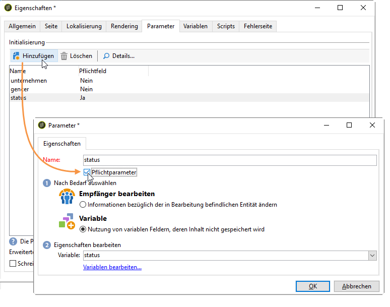

Spezifizieren Sie einen Speicherort, von dem der Parameterwert abgerufen wird. Wählen Sie dazu eine der Speicheroptionen aus und öffnen Sie danach den Tab **[!UICONTROL Speicherung]**, um das entsprechende Feld oder die entsprechende Variable auszuwählen. Die Speicheroptionen werden in den [Speicherfeldern für Antworten](web-forms-answers.md#response-storage-fields) ausführlich beschrieben.

Der Status der Auskunftsperson (0, 1 oder ein beliebiger anderer Wert) kann dann der URL für den Zugriff auf das Formular hinzugefügt werden. Diese Informationen können auf den Seiten des Formulars oder in einem Testfeld wiederverwendet werden. Die angezeigten Seiten können entsprechend dem Wert des Kontexts konditioniert werden, wie unten dargestellt:

1. Startseite für Kunden (**Status = 1**):

   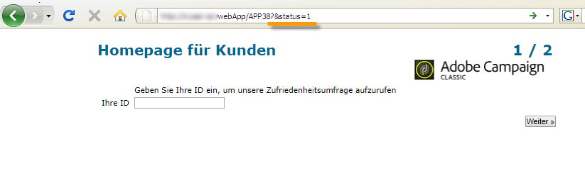

1. Startseite für Interessenten (**Status = 0**):

   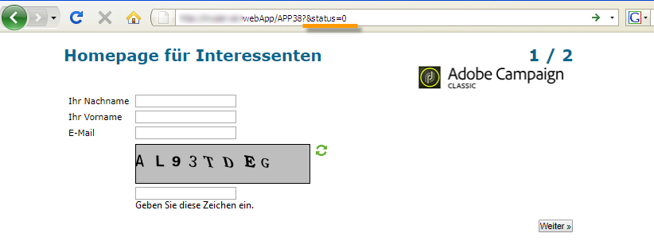

1. Startseite für andere Profile (z. B. **Status = 12**):

   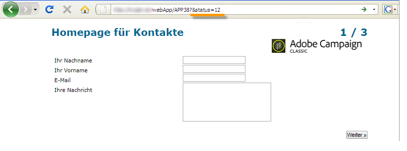

Erstellen Sie zur Konfiguration dieses Formulars eine Test-Komponente und platzieren Sie sie wie unten gezeigt an den Anfang des Diagramms:

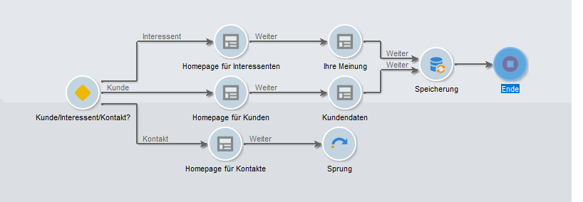

Über die Test-Komponente können Sie die Bedingungen der Seitenreihenfolge konfigurieren:

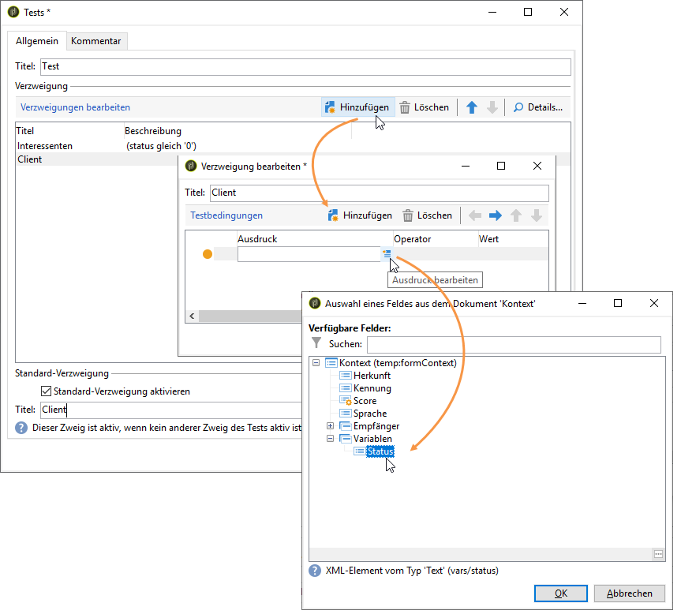
