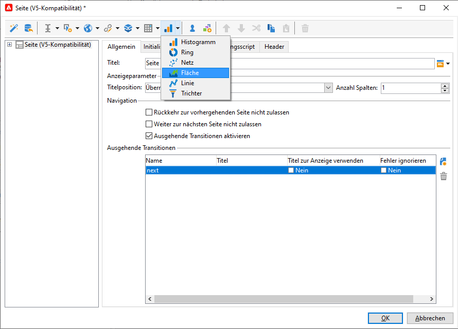
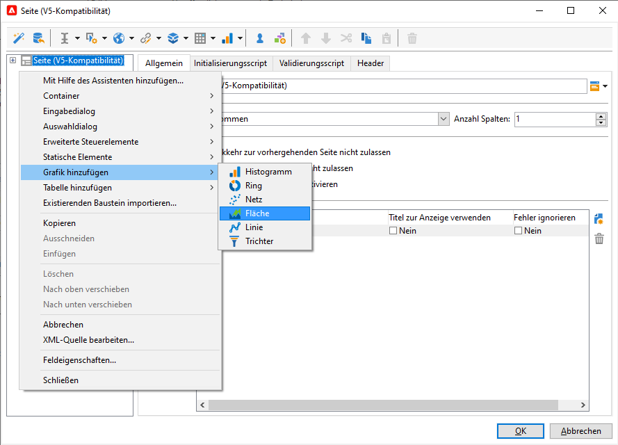
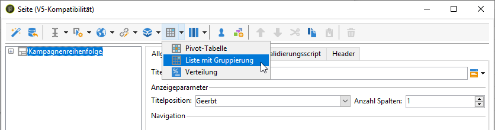
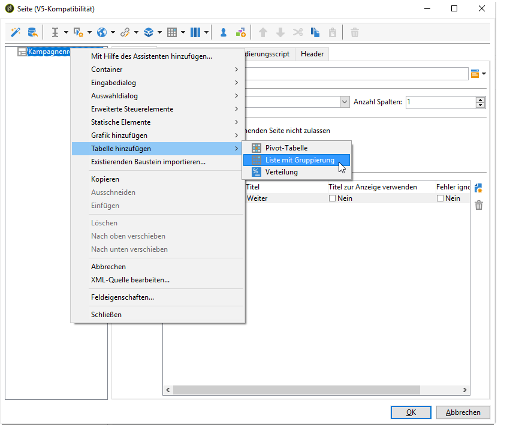

# Web-Anwendung konzipieren{#designing-a-web-application}

Web-Anwendungen werden nach dem gleichen Prinzip wie [Web-Formulare](about-web-forms.md) erstellt und verwaltet.

>[!CAUTION]
>
>Verwenden Sie die Unterregisterkarte **[!UICONTROL Vorschau]**, um Fehler beim Design von Web-Anwendungen zu überprüfen. Beachten Sie, dass der Profiltest, der für die Vorschau Ihrer Web-Anwendung verwendet wird, in einem Ordner abgelegt sein muss, auf den Benutzer vom Typ **[!UICONTROL Web-Anwendungsagent]** **[!UICONTROL Zugriffsrechte]** haben.  Bis zur Veröffentlichung der Web-Anwendung werden die Änderungen den Endbenutzern nicht angezeigt.

## Grafiken in eine Web-Anwendung einfügen {#inserting-charts-in-a-web-application}

Sie können Diagramme in Web-Anwendungen einbeziehen. Verwenden Sie dazu die Dropdown-Liste der Diagramme in der Taskleiste, um den Typ des einzufügenden Diagramms auszuwählen.

Sie können auch das Menü **[!UICONTROL Grafik hinzufügen]** verwenden.

## Tabellen in eine Web-Anwendung einfügen {#inserting-tables-in-a-web-application}

Wenn Sie eine Tabelle hinzufügen möchten, verwenden Sie die Tabellen-Dropdown-Liste in der Symbolleiste und wählen Sie den Typ der einzufügenden Tabelle aus.

Sie können den Tabellentyp auch im Dropdown-Menü auswählen.

## Web-Anwendungen vom Typ &quot;Übersicht&quot; {#overview-type-web-applications}

In der Benutzeroberfläche von Adobe Campaign werden zahlreiche Webanwendungen bereitgestellt, die es Ihnen ermöglichen, auf Empfänger, Sendungen, Kampagnen, gespeicherte Assets etc. zuzugreifen, sie zu verwalten und mit ihnen zu interagieren.

In der Benutzeroberfläche erscheinen sie in Form von Dashboards, die aus einer einzigen Seite bestehen.

Die nativen Webanwendungen sind im Knoten **[!UICONTROL Administration > Konfiguration > Webanwendungen]** gespeichert.

## Web-Anwendungen mit Bearbeitungsformularen bearbeiten {#edit-forms-type-web-applications}

Webanwendungen mit Bearbeitungsformularen für ein Extranet besitzen folgende Merkmale:

* Eine Option zum Vorausfüllen

  In den meisten Fällen müssen die anzuzeigenden Daten vorgeladen werden. Da die Benutzer, die auf diese Formulare zugreifen, (über eine Zugriffssteuerung) identifiziert werden, ist das Vorabladen nicht unbedingt verschlüsselt.

* Eine Option zum Speichern
* Eine Option zum Hinzufügen von Seiten

  Während Webanwendungen vom Typ &quot;Übersicht&quot; eine einzige Seite besitzen, bieten Bearbeitungsformulare mehrere Seiten basierend auf bestimmten Kriterien (Tests, Auswahl, Profil des verbundenen Benutzers etc.).

