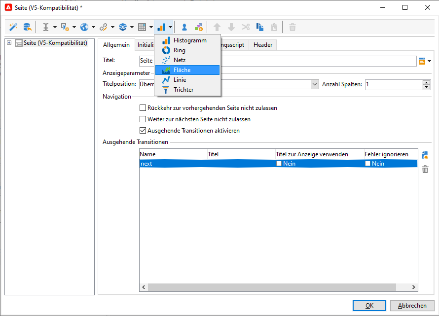

# Webanwendung konzipieren{#designing-a-web-application}

Webanwendungen werden nach demselben Prinzip erstellt und verwaltet wie [Online-Umfragen](../../web/using/about-surveys.md).

Es gibt jedoch folgende funktionelle Unterschiede:

* Für Webanwendungen werden keine archivierten Felder verwendet. Daten können daher nur in Datenbankfeldern oder lokalen Variablen gespeichert werden.
* Zu Webanwendungen sind keine nativen Berichte verfügbar.
* Zusätzliche Felder sind verfügbar, die hauptsächlich zur Erstellung von Tabellen und Grafiken dienen.

>[!CAUTION]
>
>Es wird dringend empfohlen, die angewendeten Konfigurationen laufend zu überprüfen, um etwaige Fehler in einer frühen Phase des Erstellungsprozesses einer Webanwendung zu erkennen. Um das Rendering einer Änderung zu überprüfen, speichern Sie die Anwendung und wählen Sie dann den Untertab **[!UICONTROL Vorschau]** aus.
>
>Die Änderungen sind erst dann für den Endbenutzer sichtbar, wenn die Webanwendung publiziert wurde.

## Grafiken in eine Webanwendung einfügen {#inserting-charts-in-a-web-application}

Sie können Grafiken in Webanwendungen einfügen. Verwenden Sie dazu die Grafiken-Dropdown-Liste in der Symbolleiste und wählen Sie die Art der einzufügenden Grafik aus.

Sie können auch das Menü **[!UICONTROL Grafik hinzufügen]** verwenden.

## Tabellen in eine Webanwendung einfügen {#inserting-tables-in-a-web-application}

Wenn Sie eine Tabelle hinzufügen möchten, verwenden Sie die Tabellen-Dropdown-Liste in der Symbolleiste und wählen Sie den Typ der einzufügenden Tabelle aus.

Sie können den Tabellentyp auch im Dropdown-Menü auswählen.

## Webanwendungen vom Typ &quot;Übersicht&quot;{#overview-type-web-applications}

In der Benutzeroberfläche von Adobe Campaign werden zahlreiche Webanwendungen bereitgestellt, die es Ihnen ermöglichen, auf Empfänger, Sendungen, Kampagnen, gespeicherte Assets etc. zuzugreifen, sie zu verwalten und mit ihnen zu interagieren.

In der Benutzeroberfläche erscheinen sie in Form von Dashboards, die aus einer einzigen Seite bestehen.

Die nativen Webanwendungen sind im Knoten **[!UICONTROL Administration > Konfiguration > Webanwendungen]** gespeichert.

## Webanwendungen mit Bearbeitungsformularen bearbeiten {#edit-forms-type-web-applications}

Webanwendungen mit Bearbeitungsformularen für ein Extranet besitzen folgende Merkmale:

* Eine Option zum Vorausfüllen

   In den meisten Fällen müssen die Daten, die angezeigt werden sollen, vorausgefüllt werden. Da sich die Benutzer, die auf diese Formulare zugreifen, über eine Zugriffskontrolle identifizieren müssen, muss das Vorausfüllen nicht unbedingt verschlüsselt erfolgen.

* Eine Option zum Speichern
* Eine Option zum Hinzufügen von Seiten

   Während Webanwendungen vom Typ &quot;Übersicht&quot; eine einzige Seite besitzen, bieten Bearbeitungsformulare mehrere Seiten basierend auf bestimmten Kriterien (Tests, Auswahl, Profil des verbundenen Benutzers etc.).

Die Nutzung dieser Art von Webanwendung ist ähnlich den **Umfragen**, jedoch ohne Verlaufsverwaltung und Feldarchivierung. Der Zugriff durch Benutzer erfolgt normalerweise über eine Anmeldeseite, auf der sie sich identifizieren müssen.
