# Bearbeiten von Inhalten{#editing-content}

## Sichtbarkeitsbedingung definieren {#defining-a-visibility-condition}

Sie können für ein Webseitenelement eine Sichtbarkeitsbedingung festlegen. Dieses Element wird dann nur angezeigt, wenn die Bedingung erfüllt ist.

To add a visibility condition, select a block and enter the condition in the **[!UICONTROL Visibility condition]** field using the expression editor.

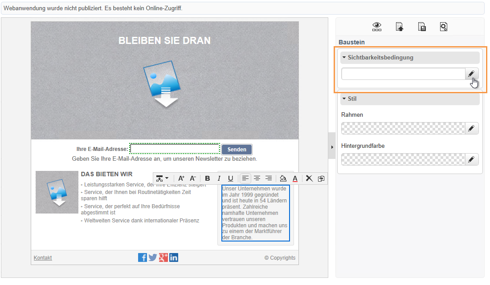

>[!NOTE]
>
>Optionen zur erweiterten Bearbeitung finden Sie auf [dieser Seite](../../platform/using/defining-filter-conditions.md#list-of-functions).

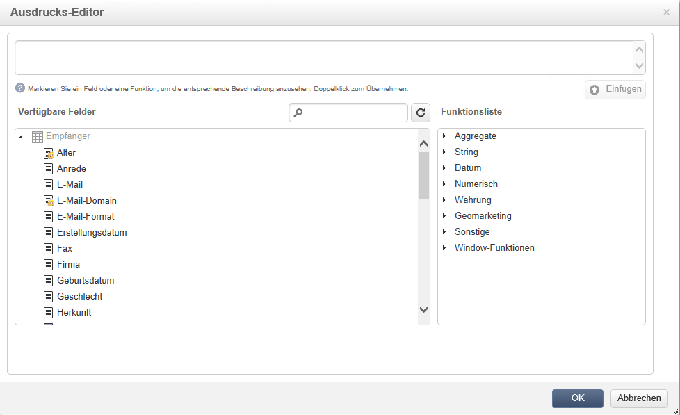

Diese Bedingungen übernehmen die XTK-Ausdruckssyntax (z. B. **ctx.empfänger).@email != &quot;&quot;** oder **ctx.empfänger.@status==&quot;0&quot;**). Standardmäßig werden alle Felder angezeigt.

>[!NOTE]
>
>Unsichtbare dynamische Bausteine, wie beispielsweise Dropdown-Menüs, können nicht bearbeitet werden.

## Rahmen und Hintergründe hinzufügen {#adding-a-border-and-background}

Sie können zum ausgewählten Baustein einen **Rahmen** hinzufügen. Rahmen werden durch drei Optionen definiert: Stil, Größe und Farbe.

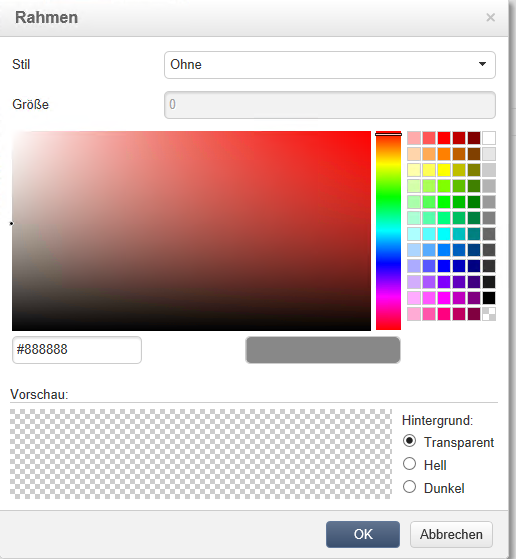

Es besteht auch die Möglichkeit, verschiedene **Hintergrundfarben** aus der Farbpalette für die einzelnen Bausteine auszuwählen.

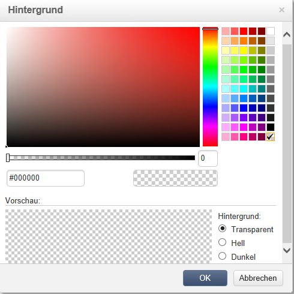

## Formulare bearbeiten {#editing-forms}

### Dateneigenschaften für ein Formular ändern {#changing-the-data-properties-for-a-form}

Es besteht die Möglichkeit, Bausteinen wie Eingabe- oder Auswahlfeldern Datenbankfelder zuzuordnen.

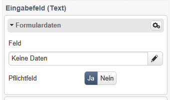

>[!NOTE]
>
>Standardmäßig werden die im Speicherschema der Webanwendung definierten Felder angezeigt.

Im Eingabefeld **Feld** können Sie das Datenbankfeld auswählen, das dem Formularfeld zugeordnet werden soll.

Standardmäßig werden die in der Tabelle **nms:recipient** verfügbaren Felder zur Auswahl angeboten.

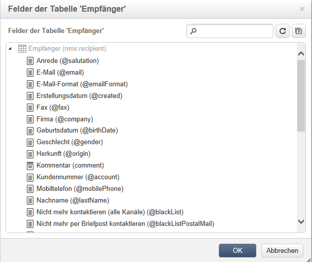

Mit der Option **Pflichtfeld** können Sie festlegen, dass die Seite nur dann validiert wird, wenn das Feld ausgefüllt wurde. Fehlt ein Pflichtfeld, wird eine Fehlermeldung angezeigt.

Für Radiobuttons und Checkboxes ist eine **zusätzliche Konfiguration erforderlich**.

Wenn die verwendete Vorlage keinen Standardwert enthält, müssen Sie ihn im Editor eingeben.

Gehen Sie dazu wie folgt vor:

* Click the **[!UICONTROL Edit]** icon.

   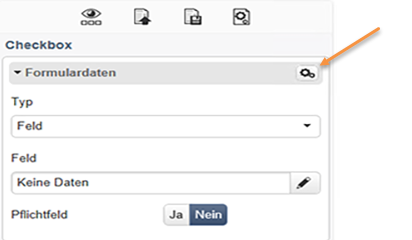

* Enter the itemized list value (defined by the selected field) into the **[!UICONTROL Value]** field.

   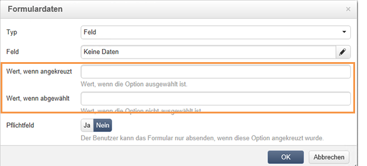

### Formularfelder ändern {#modifying-form-fields}

Formularfelder wie Radiobuttons, Eingabefelder und Dropdown-Listen können über ihre Symbolleisten geändert werden.

Folgende Optionen stehen zur Auswahl:

* Delete the block containing the form fields using the **[!UICONTROL Delete]** icon.
* Duplicate the selected field by creating a new block using the **[!UICONTROL Duplicate]** icon.
* Edit the **[!UICONTROL Form data]** window to link a database field to the form zone, using the **[!UICONTROL Edit]** icon.

   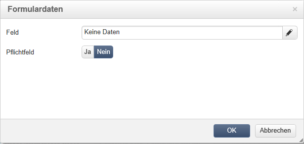

## Eine Aktion zu einer Schaltfläche hinzufügen {#adding-an-action-to-a-button}

Sie können für eine angeklickte Schaltfläche eine Aktion festlegen. Wählen Sie dazu die auszuführende Aktion aus der Dropdown-Liste aus.

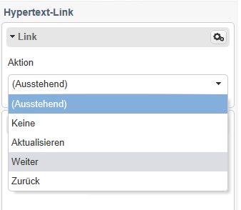

Folgende Aktionen sind möglich:

* **[!UICONTROL Refresh]** : aktualisiert die aktuelle Seite.
* **[!UICONTROL Next page]** : erstellt einen Link zur nächsten Seite in der Webanwendung.
* **[!UICONTROL Previous page]** : erstellt einen Link zur vorherigen Seite der Webanwendung.

>[!NOTE]
>
>The **[!UICONTROL None]** value allows you to not activate the button.

Sie können den mit der Schaltfläche verknüpften Titel im entsprechenden Feld ändern.

## Link hinzufügen {#adding-a-link}

Alle Elemente einer Seite können mit Links belegt werden: Bilder, Wörter, Wortgruppen, Textblöcke etc.

Markieren Sie zum Einfügen eines Links das gewünschte Element und verwenden Sie das erste Symbol im Pop-up-Menü.

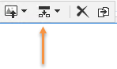

Über dieses Symbol können Sie auf alle verfügbaren Arten von Links zugreifen.

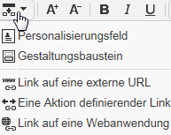

Gestaltungsbausteine und Felder können nur in Bausteine vom Typ &quot;Text&quot; eingefügt werden.

>[!NOTE]
>
>Für jeden Linktyp können Sie den Öffnungsmodus konfigurieren: Wählen Sie das Zielfenster in der Dropdownliste **Target** aus. Dieser Wert entspricht dem **`<target>`** HTML-Tag.
>
>Diese **Ziele** stehen zur Verfügung:

>* Sonstige (IFrame)
>* Vorderstes Fenster (_top)
* Elternfenster (_parent)
* Neues Fenster (_blank)
* Aktuelles Fenster (_self)
* Standard-Navigationseinstellungen


### Link auf eine URL {#link-to-a-url}

Mit der Option **Link auf eine externe URL** können Sie festlegen, dass eine URL am Ursprung des Inhalts geöffnet wird.

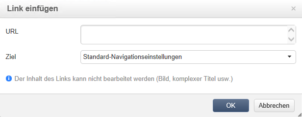

Geben Sie die Link-Adresse in das Feld **URL** in diesem Format ein: **https://www.myURL.com**.

### Link auf eine Webanwendung {#link-to-a-web-application}

Mit der Option **Link auf eine Webanwendung** können Sie auf eine Webanwendung in Adobe Campaign zugreifen.

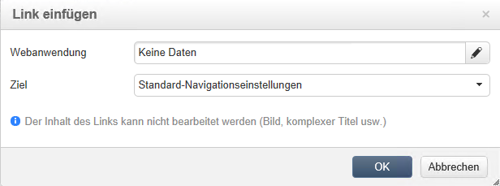

Wählen Sie im entsprechenden Feld die Webanwendung aus.

The list of suggested Web applications corresponds to the available applications in the **[!UICONTROL Resources > Online > Web Applications]** node.

### Link zu einer Aktion {#link-to-an-action}

Mit der Option **Eine Aktion definierender Link** können Sie eine Aktion konfigurieren, die ausgeführt wird, wenn auf ein Quellelement geklickt wird.

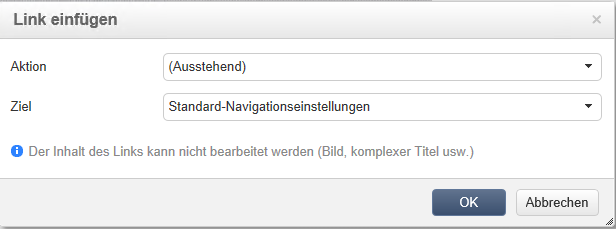

>[!NOTE]
Die verfügbaren Aktionen werden im Abschnitt [Hinzufügen einer Aktion zu einer Schaltfläche](#adding-an-action-to-a-button) beschrieben.

### Link löschen {#delete-a-link}

Nachdem ein Link eingefügt wurde, bietet die Symbolleiste zwei neue Symbole zur Auswahl: **Link bearbeiten** und **Link unterbrechen**, mit denen Sie den erstellten Link verändern können.

* **[!UICONTROL Edit link]** können Sie ein Fenster mit allen Parametern des Links anzeigen.
* **[!UICONTROL Break the link]** können Sie den Link und alle zugehörigen Parameter nach der Bestätigung löschen.

>[!NOTE]
Auch wenn der Link gelöscht wird, bleibt der Inhalt bestehen.

## Schriftartattribute ändern {#changing-font-attributes}

Bei der Auswahl eines Textelements können Sie die Attribute der Schriftart ändern (Stil, Format).

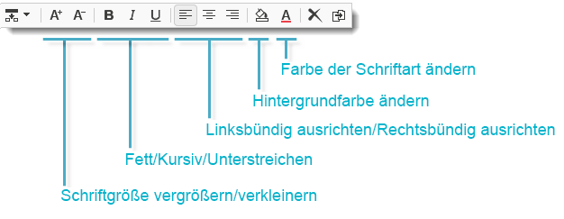

Folgende Optionen sind verfügbar:

* **Symbol für Schriftart** vergrößern: erhöht die Größe des ausgewählten Textes (Hinzufügen `<span style="font size:">`)
* **Schriftsymbol** reduzieren: verringert die Größe des ausgewählten Textes (Hinzufügen `<span style="font size:">`)
* **Fett** -Symbol: macht ausgewählten Text fett (Umbruch mit dem `<strong> </strong>` Tag)
* **Kursivsymbol** : macht ausgewählten Text kursiv (Umbruch mit dem `<em> </em>` Tag)
* **Symbol &quot;Unterstreichen** &quot;: markiert den ausgewählten Text unterstrichen (Umbruch mit dem `<span style="text-decoration: underline;">` Tag)
* **Symbol links** ausrichten: Richtet den Text links neben dem ausgewählten Block aus (add style=&quot;text-align: left;&quot;)
* **Symbol Mitte** : zentriert den Text für den ausgewählten Block (add style=&quot;text-align: center;&quot;)
* **Symbol rechts** ausrichten: Richtet den Text rechts vom ausgewählten Block aus (add style=&quot;text-align: right;&quot;)
* **Ändern Sie das Symbol für die Hintergrundfarbe** : können Sie die Hintergrundfarbe für den ausgewählten Block ändern (add style=&quot;background-color: rgba(170, 86, 255, 0.87))
* Symbol **Textfarbe ändern**: Ändert die Textfarbe des ausgewählten Bausteins oder nur den ausgewählten Text (`<span style="color: #CODE">`)

>[!NOTE]
* Symbol **Löschen**: Löscht den Baustein und seinen Inhalt.

* Symbol **Duplizieren**: Dupliziert den Baustein sowie alle mit dem Baustein verknüpften Stile.


## Bilder und Animationen verwalten {#managing-images-and-animations}

Mit dem Digital Content Editor können Sie **alle Arten von Bilder** bearbeiten, die mit Browsern kompatibel sind.

Um mit dem DCE kompatibel zu sein, sind **Flash-Animationen** wie folgt in HTML-Seiten einzufügen:

```
<object type="application/x-shockwave-flash" data="https://www.mydomain.com/flash/your_animation.swf" width="200" height="400">
 <param name="movie" value="https://www.mydomain.com/flash/your_animation.swf" />
 <param name="quality" value="high" />
 <param name="play" value="true"/>
 <param name="loop" value="true"/> 
</object>
```

>[!CAUTION]
You must not call up external files in a **script** tag of the HTML page. These files will not be imported onto the Adobe Campaign server.

### Bild hinzufügen/löschen/duplizieren {#adding---deleting---duplicating-an-image}

Um ein Bild einzufügen, wählen Sie einen Baustein vom Typ &quot;Bild&quot; aus und danach das Symbol **Bild**.

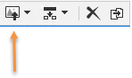

Wählen Sie eine lokal gespeicherte Bilddatei aus.

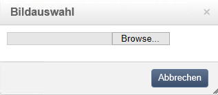

The **Delete** icon deletes the  tag containing the image.

The **Duplicate** icon duplicates the  tag and its content.

>[!CAUTION]
Beim Duplizieren eines Bildes werden die Identifikatoren für das neue Bild gelöscht.

### Bildeigenschaften bearbeiten {#editing-image-properties}

Wenn Sie einen Baustein auswählen, der ein Bild enthält, greifen Sie auf die folgenden Eigenschaften zu:

* **Alternativtext** fügt dem Bild einen Text hinzu, der z. B. dann angezeigt wird, wenn das Bild nicht geladen werden kann (entspricht dem **alt**-Tag im HTML-Code).
* **Abmessungen** ermöglicht die Angabe der Bildgröße in Pixel.

   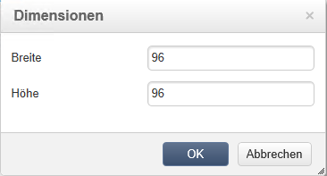

## Personalisierungsinhalte hinzufügen {#adding-personalization-content}

### Personalisierungsfeld einfügen {#inserting-a-personalization-field}

Die Option **Personalisierungsfeld** des Einfügesymbols ermöglicht das Hinzufügen eines Datenbankfelds in den Inhalt, wie etwa den Namen des Empfängers. Diese Option ist nur für Bausteine vom Typ &quot;Text&quot; verfügbar.

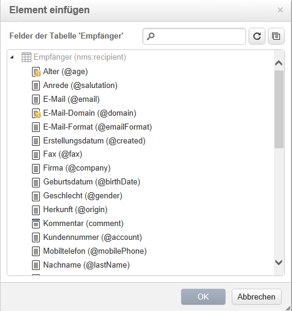

Standardmäßig werden die angebotenen Felder aus der **[!UICONTROL Recipient]** Tabelle übernommen. Bearbeiten Sie bei Bedarf die Webanwendungseigenschaften, um eine andere Tabelle auszuwählen.

Der Name des Feldes erscheint daraufhin gelb unterlegt im Editor. Er wird zum Zeitpunkt der Personalisierung (z. B. bei der Ansicht einer Landingpage in der Vorschau) durch das für den jeweiligen Empfänger gespeicherte Profil ersetzt.

Ein Beispiel wird im Abschnitt zum [Einfügen eines Personalisierungsfelds](../../web/using/creating-a-landing-page.md#inserting-a-personalization-field) dargestellt.

### Gestaltungsbaustein einfügen {#inserting-a-personalization-block}

Mit der Option **Gestaltungsbaustein** können Sie dynamische und personalisierte Bausteine in den Inhalt einfügen. So können Sie beispielsweise ein Logo oder eine Grußnachricht hinzufügen. Diese Option ist nicht für Bausteine vom Typ &quot;Text&quot; verfügbar.

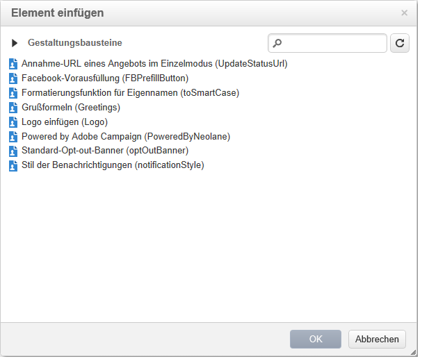

Nach dem Einfügen erscheint der Name des Gestaltungsbausteins gelb hinterlegt im Editor. Er wird während der Personalisierung automatisch an das Empfängerprofil angepasst.

For more on built-in personalization blocks and how to define custom personalization blocks, refer to [this page](../../delivery/using/personalization-blocks.md).
