# Formular-Rendering{#form-rendering}

## Vorlage zum Formular-Rendering auswählen {#selecting-the-form-rendering-template}

In den Formulareinstellungen können Sie eine Vorlage zum Erstellen der Seiten auswählen. Wählen Sie dazu in der Formular-Detail-Symbolleiste die Schaltfläche **[!UICONTROL Einstellungen]** und danach den Tab **[!UICONTROL Rendering]** aus. Standardmäßig stehen mehrere Vorlagen (Stylesheets) zur Verfügung.

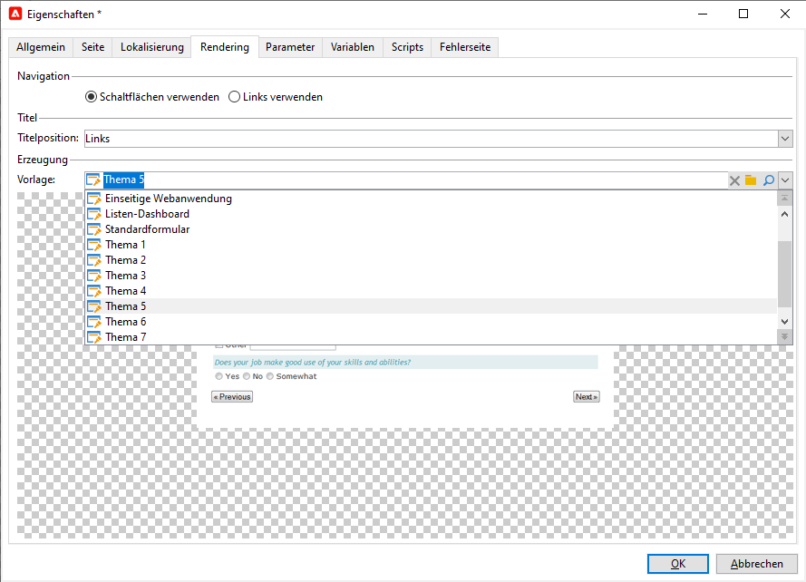

Im unteren Bereich des Editors können Sie sich das Rendering der ausgewählten Vorlage ansehen.

Mit der Zoom-Funktion können Sie die ausgewählte Vorlage bearbeiten.

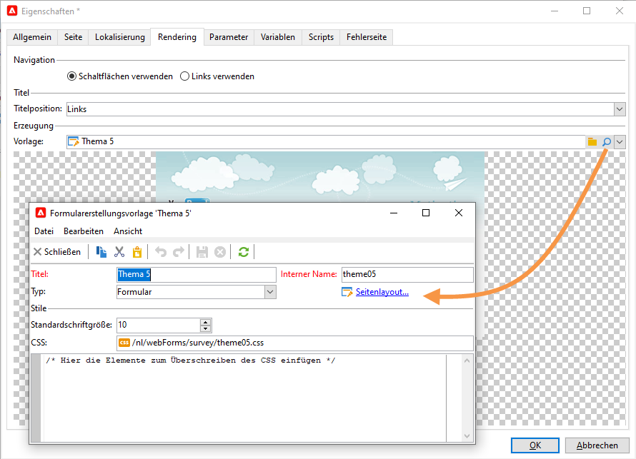

Sie können diese Vorlagen ändern oder überschreiben. Wählen Sie dazu den Link **[!UICONTROL Seitenlayout...]** aus und passen Sie die Einstellungen an.

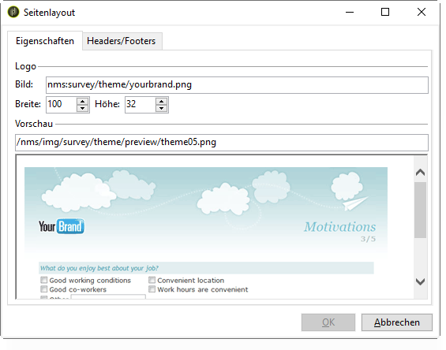

Sie haben folgende Möglichkeiten:

* Das als Logo verwendete Bild und dessen Größe ändern
* Den Pfad für den Zugriff auf das Vorschaubild für Benutzer festlegen, die diese Rendering-Vorlage auswählen.

Mit dem Tab **[!UICONTROL Headers/Footers]** können Sie die Informationen ändern, die in der Kopf- und Fußzeile jeder Formularseite steht, die auf dieser Vorlage basiert.

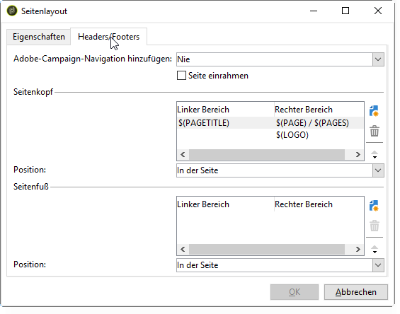

Jede Zeile des Bereichs **[!UICONTROL Seitenkopf]** und **[!UICONTROL Seitenfuß]** entspricht einer Zeile auf der HTML-Seite. Wählen Sie **[!UICONTROL Hinzufügen]**, um eine neue Zeile zu erstellen.

Wählen Sie eine vorhandene Zeile und danach die Schaltfläche **[!UICONTROL Detail]** aus, um sie zu bearbeiten.

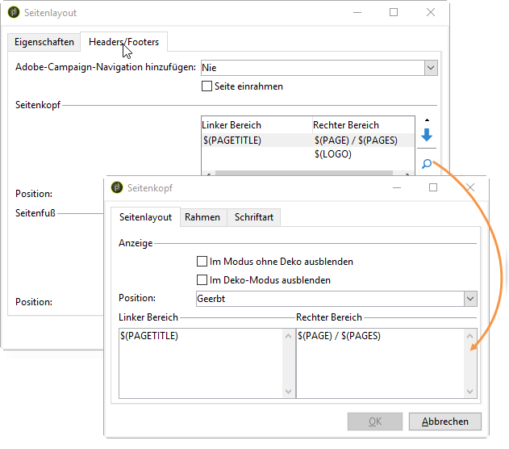

Verwenden Sie die jeweiligen Tabs, um den Inhalt der Zeile zu ändern, Rahmen hinzuzufügen und die Schriftart-Attribute anzupassen. Bestätigen Sie diese Änderungen mit **[!UICONTROL OK]**.

Mit den Feldern **[!UICONTROL Position]** können Sie die Position der Elemente im Seitenkopf und -fuß definieren.

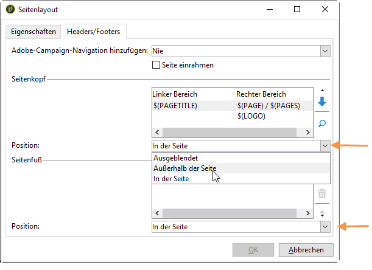

>[!NOTE]
>
>Rendering-Vorlagen befinden sich im Knoten **[!UICONTROL Administration > Konfiguration > Formular-Rendering]**.\
>Weitere Informationen hierzu finden Sie unter [Formular-Rendering anpassen](#customizing-form-rendering).

## Formular-Rendering anpassen {#customizing-form-rendering}

### Layout von Elementen ändern {#changing-the-layout-of-elements}

Sie können das Stylesheet für jedes Element des Formulars überschreiben (Eingabefelder, Bilder, Radiobuttons etc.).

Verwenden Sie dazu den Tab **[!UICONTROL Erweitert]**.

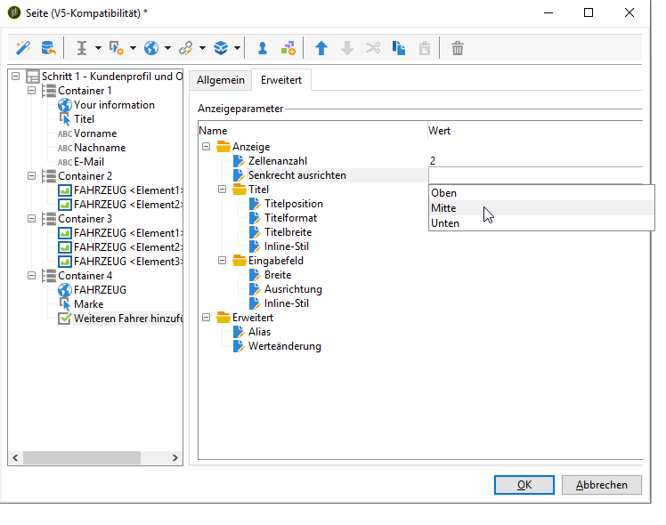

Damit können Sie die folgenden Eigenschaften definieren:

* **[!UICONTROL Titelposition]**: siehe [Die Position von Titeln definieren](../../web/using/defining-web-forms-layout.md#defining-the-position-of-labels),
* **[!UICONTROL Titelformat]**: mit oder ohne Zeilenumbruch,
* **[!UICONTROL Zellenanzahl]** : siehe [Die Felder auf der Seite positionieren](../../web/using/defining-web-forms-layout.md#positioning-the-fields-on-the-page),
* **[!UICONTROL Horizontale Ausrichtung]** (links, rechts, zentriert) und **[!UICONTROL vertikale Ausrichtung]** (hoch, niedrig, Mitte),
* **[!UICONTROL Breite]** des Bereichs: Diese kann als Prozentsatz oder in em, Punkten oder Pixeln (Standardwert) ausgedrückt werden,
* Maximale **[!UICONTROL Länge]**: Maximale Anzahl erlaubter Zeichen (für Steuerelemente vom Typ Text, Zahl und Passwort),
* **[!UICONTROL Zeilen]**: Anzahl der Zeilen für einen Bereich vom Typ **[!UICONTROL Mehrzeiliger Text]**,
* **[!UICONTROL Inline-Stil]**: ermöglicht das Überschreiben des CSS-Stylesheets mit zusätzlichen Einstellungen. Diese sind wie unten gezeigt durch das Zeichen **;** voneinander getrennt:

   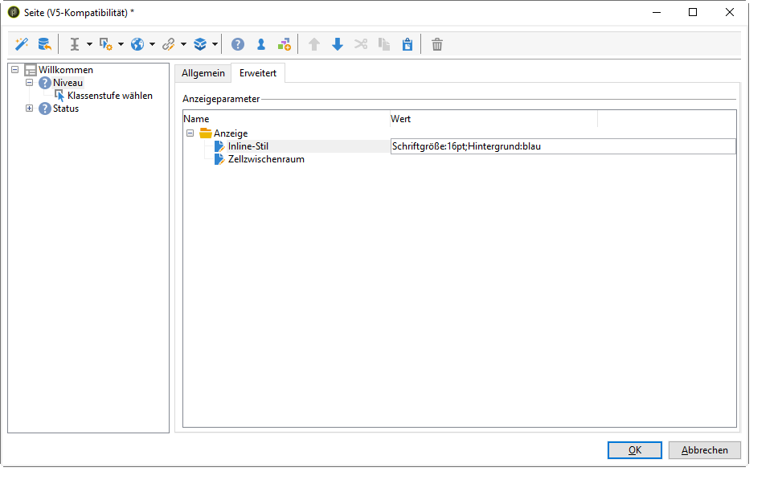

### Header und Footer definieren {#defining-headers-and-footers}

Die Felder sind in einer Baumstruktur angeordnet, deren Wurzel denselben Namen hat wie die Seite. Wählen Sie die Wurzel aus, um den Namen zu ändern.

Geben Sie im Formulareigenschaften-Fenster im Tab **[!UICONTROL Seite]** den Titel des Fensters ein. Sie können zum Seiten-Header und Footer einen vordefinierten Inhalt hinzufügen (diese Information wird dann auf jeder Seite gezeigt). Dieser Inhalt wird wie unten gezeigt in den jeweiligen Bereich des Tabs **[!UICONTROL Texte]** eingegeben:

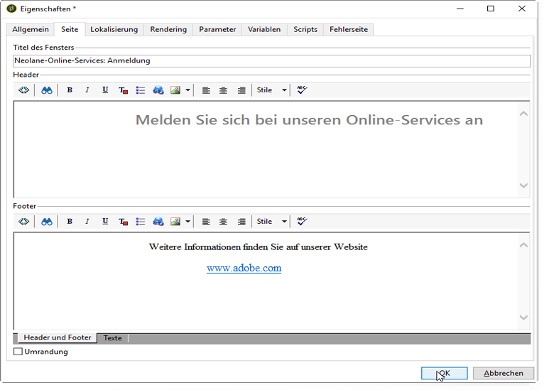

### Elemente zum HTML-Header hinzufügen {#adding-elements-to-html-header}

Sie können zusätzliche Elemente zum HTML-Header einer Formularseite hinzufügen. Geben Sie dazu die Elemente auf der entsprechenden Seite im Tab **[!UICONTROL Header]** ein.

Damit können Sie beispielsweise ein Symbol referenzieren, das in der Symbolleiste der Seite angezeigt werden soll.

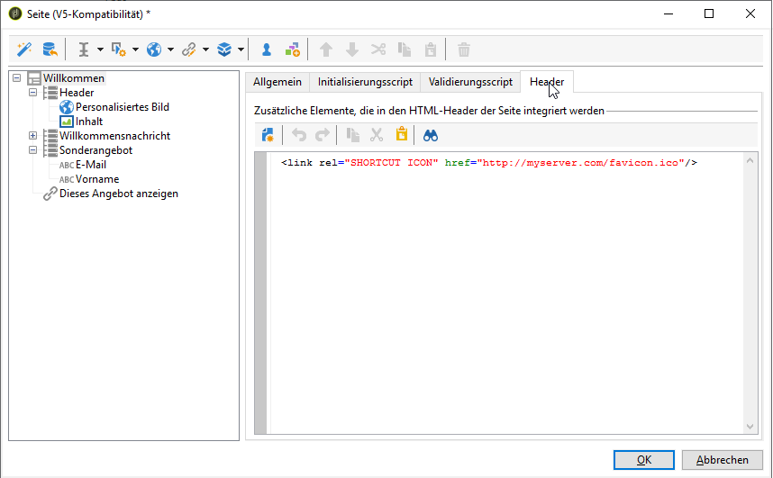

## Kontrolleinstellungen definieren {#defining-control-settings}

Wenn der Benutzer das Formular ausfüllt, wird in bestimmten Feldern je nach Format oder Konfiguration automatisch eine Überprüfung durchgeführt. Auf diese Weise können Sie bestimmte Felder obligatorisch machen (siehe [Pflichtfelder definieren](#defining-mandatory-fields)) oder das Format der eingegebenen Daten überprüfen (siehe [Datenformat überprüfen](#checking-data-format)). Prüfungen werden während der Seitengenehmigung durchgeführt (durch Klicken auf einen Link oder eine Schaltfläche, der/die eine ausgehende Transition ermöglicht).

### Pflichtfelder definieren {#defining-mandatory-fields}

Wenn Sie bestimmte Felder als Pflichtfelder festlegen möchten, wählen Sie bei der Erstellung des Felds diese Option aus.

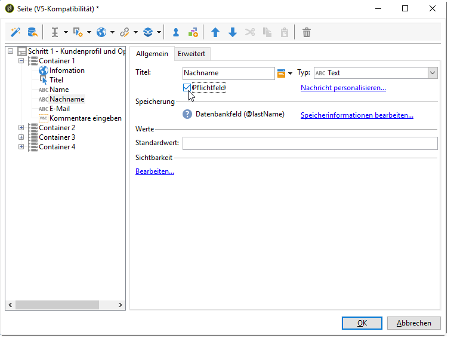

Sollte ein Benutzer diese Seite validieren, ohne das Feld ausgefüllt zu haben, wird ihm die folgende Mitteilung angezeigt:

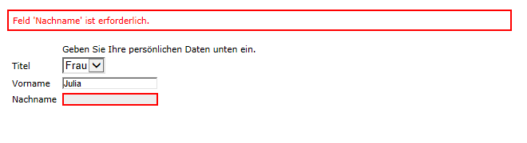

Sie können diese Mitteilung anpassen, indem Sie den Link **[!UICONTROL Nachricht personalisieren, die bei geschlossenem Formular angezeigt wird...]** auswählen.

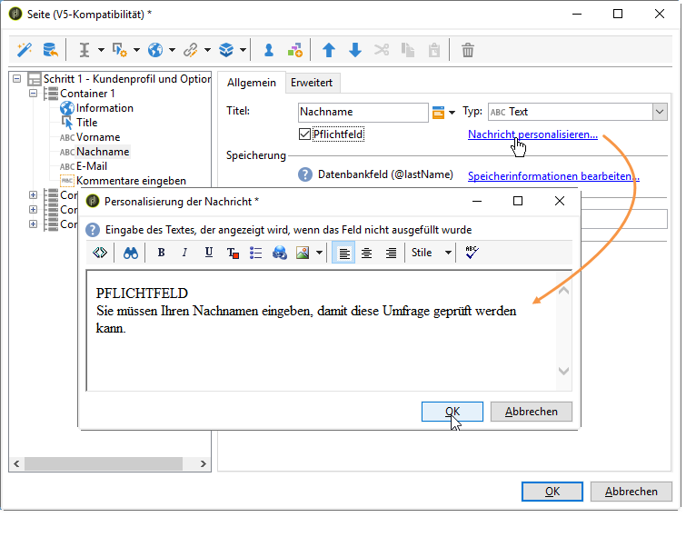

Sollte ein Benutzer diese Seite validieren, ohne das Feld ausgefüllt zu haben, wird ihm die folgende Mitteilung angezeigt:

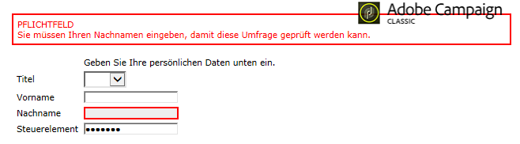

### Datenformat überprüfen {#checking-data-format}

Für Formularprüfungen, bei denen die Werte in einem vorhandenen Datenbankfeld gespeichert sind, werden die Regeln für das Speicherfeld angewendet.

Für Formularprüfungen, bei denen die Werte in einer Variablen gespeichert sind, hängen die Validierungsregeln vom Format der Variablen ab.

Sie können beispielsweise die Prüfung einer **[!UICONTROL Zahl]** einrichten, um wie unten gezeigt die Kundennummer zu speichern:

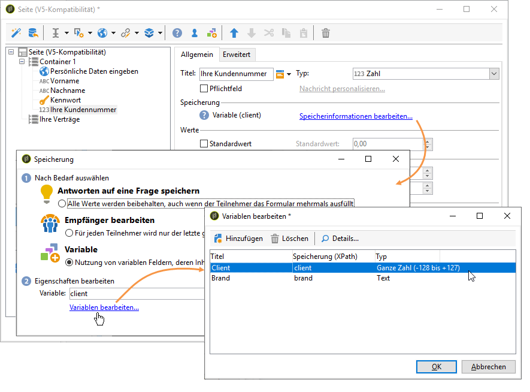

Der Benutzer muss in diesem Fall eine ganze Zahl im Formularfeld eingeben.

## Bedingte Anzeige von Feldern definieren {#defining-fields-conditional-display}

Sie können festlegen, dass die Felder auf einer Seite auf der Basis der Werte angezeigt werden, die der Benutzer auswählt. Dies gilt für ein einziges Feld oder eine Feldergruppe (wenn die Felder in einem Container zusammengefasst sind).

Sie können für jedes Element der Seite die Anzeigebedingungen im Bereich **[!UICONTROL Sichtbarkeit]** definieren.

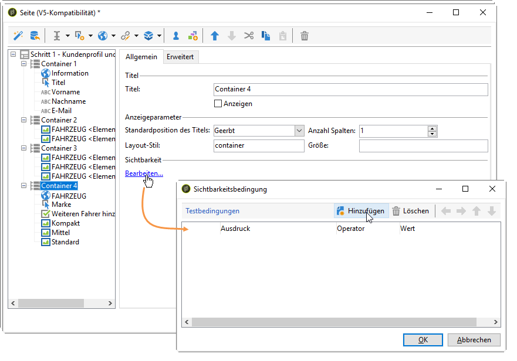

Bedingungen können für die Werte in Datenbankfeldern oder Variablen festgelegt werden.

Im Feldauswahl-Fenster können Sie aus folgenden Daten auswählen:

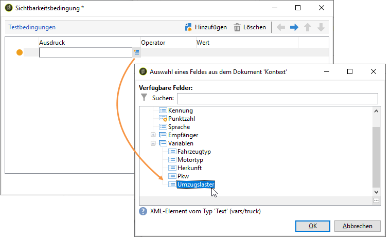

* Der Hauptbaum enthält die Parameter des Formulars. Die Standardparameter sind Kennung (entspricht der verschlüsselten Kennung des Empfängers), Sprache und Ursprung.

   Weiterführende Informationen hierzu finden Sie auf dieser [Seite](../../web/using/defining-web-forms-properties.md#form-url-parameters).

* Im Unterbaum **[!UICONTROL Empfänger]** befinden sich die Eingabefelder, die in das Formular eingefügt wurden und in der Datenbank gespeichert sind.

   Weitere Informationen finden Sie unter [Speichern von Daten in der Datenbank](../../web/using/web-forms-answers.md#storing-data-in-the-database).

* Die Unterstruktur **[!UICONTROL Variablen]** enthält die verfügbaren Variablen für dieses Formular. Weitere Informationen finden Sie unter [Daten in einer lokalen Variablen speichern](../../web/using/web-forms-answers.md#storing-data-in-a-local-variable).

Weitere Informationen hierzu finden Sie in diesem Anwendungsbeispiel: [Je nach den ausgewählten Werten unterschiedliche Optionen anzeigen](../../web/using/use-cases--web-forms.md#displaying-different-options-depending-on-the-selected-values).

Sie können auch mit dem Objekt **[!UICONTROL Test]** eine Bedingung für die Anzeige von Formularseiten festlegen. Weiterführende Informationen dazu finden Sie auf dieser [Seite](../../web/using/defining-web-forms-page-sequencing.md#conditional-page-display).

## Elemente aus einem vorhandenen Formular importieren {#importing-elements-from-an-existing-form}

Sie haben die Möglichkeit, Felder oder Container aus anderen Webformularen zu importieren. Damit können Sie eine Bibliothek aus wiederverwendbaren Bausteinen erstellen, die in Formulare eingefügt werden können, z. B. Adressbaustein, Newsletter-Abonnement-Bereich etc.

Gehen Sie wie folgt vor, um ein Element in ein Formular zu importieren:

1. Bearbeiten Sie die Seite, in die Sie ein oder mehrere Elemente einfügen möchten und wählen Sie dann in der Symbolleiste **[!UICONTROL Existierenden Baustein importieren]** aus.

   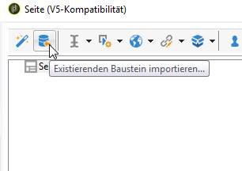

1. Wählen Sie das Webformular aus, das die zu importierenden Felder enthält, und wählen Sie die Container und Felder aus, die importiert werden sollen.

   

   >[!NOTE]
   >
   >Über das Symbol **[!UICONTROL Link bearbeiten]** rechts neben dem Quell-Formularnamen können Sie das ausgewählte Webformular anzeigen.

1. Wählen Sie **[!UICONTROL OK]** aus, um das Einfügen des Elements zu bestätigen.

   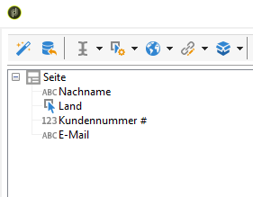

