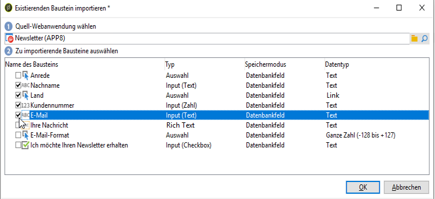

# Formular-Rendering{#form-rendering}

## Vorlage zum Formular-Rendering auswählen {#selecting-the-form-rendering-template}

Mit den Formulareinstellungen können Sie die Vorlage auswählen, die zum Generieren der Seiten verwendet wird. Klicken Sie zum Zugreifen auf die **[!UICONTROL Settings]** Schaltfläche in der Symbolleiste mit den Formulardetails und wählen Sie die **[!UICONTROL Rendering]** Registerkarte aus. Standardmäßig sind mehrere Vorlagen (Stylesheets) verfügbar.

Im unteren Bereich des Editors können Sie sich das Rendering der ausgewählten Vorlage ansehen.

Mit der Zoom-Funktion können Sie die ausgewählte Vorlage bearbeiten.

Sie können diese Vorlagen ändern oder überschreiben. Klicken Sie dazu auf den **[!UICONTROL Page layout...]** Link und personalisieren Sie die Informationen.

Sie haben folgende Möglichkeiten:

* Das als Logo verwendete Bild und dessen Größe ändern
* Den Pfad für den Zugriff auf das Vorschaubild für Benutzer festlegen, die diese Rendering-Vorlage auswählen.

Mit dem Tab **[!UICONTROL Headers/Footers]** können Sie die Informationen ändern, die in der Kopf- und Fußzeile jeder Formularseite steht, die auf dieser Vorlage basiert.

Jede Zeile des **[!UICONTROL Page headers]** **[!UICONTROL Page footers]** Abschnitts und des Abschnitts entspricht einer Zeile auf der HTML-Seite. Klicken Sie auf **[!UICONTROL Add]** , um eine neue Zeile zu erstellen.

Wählen Sie eine vorhandene Zeile und danach die Schaltfläche **[!UICONTROL Detail]** aus, um sie zu bearbeiten.

Sie können den Inhalt der Zeile ändern, Ränder hinzufügen und die Schriftattribute über die entsprechenden Registerkarten ändern. Klicken Sie auf **[!UICONTROL OK]** , um diese Änderungen zu bestätigen.

Mit den Feldern **[!UICONTROL Position]** können Sie die Position der Elemente im Seitenkopf und -fuß definieren.

>[!NOTE]
>
>Rendervorlagen werden im **[!UICONTROL Administration > Configuration > Form rendering]** Knoten gespeichert.\
>Weitere Informationen finden Sie unter [Anpassen der Formularwiedergabe.](#customizing-form-rendering)

## Formular-Rendering anpassen {#customizing-form-rendering}

### Layout von Elementen ändern {#changing-the-layout-of-elements}

Sie können das Stylesheet für jedes Element des Formulars überschreiben (Eingabefelder, Bilder, Radiobuttons etc.).

To do this, use the **[!UICONTROL Advanced]** tab.

Damit können Sie die folgenden Eigenschaften definieren:

* **[!UICONTROL Label position]**: siehe [Festlegung der Position der Beschriftungen](../../web/using/defining-web-forms-layout.md#defining-the-position-of-labels),
* **[!UICONTROL Label format]**: Wortumbruch oder Kein Wortumbruch,
* **[!UICONTROL Number of cells]** : siehe [Positionieren der Felder auf der Seite](../../web/using/defining-web-forms-layout.md#positioning-the-fields-on-the-page),
* **[!UICONTROL Horizontal alignment]** (Links, Rechts, Zentriert) und **[!UICONTROL Vertical alignment]** (Hoch, Niedrig, Mittel),
* **[!UICONTROL Width]** des Gebiets: dies kann als Prozentsatz oder in ems, points oder pixel (Standardwert) ausgedrückt werden,
* Maximum **[!UICONTROL Length]**: Maximum number of characters allowed (for Text, Number and Password type controls),
* **[!UICONTROL Lines]**: Anzahl der Zeilen für eine **[!UICONTROL Multi-line text]** Typzone,
* **[!UICONTROL Style inline]**: ermöglicht Ihnen, das CSS-Stylesheet mit zusätzlichen Einstellungen zu überladen. **Diese werden durch** die Zeichen wie im folgenden Beispiel gezeigt:

   

### Header und Footer definieren {#defining-headers-and-footers}

Die Felder sind in einer Baumstruktur angeordnet, deren Wurzel denselben Namen hat wie die Seite. Wählen Sie die Wurzel aus, um den Namen zu ändern.

Der Titel des Fensters muss auf der **[!UICONTROL Page]** Registerkarte des Fensters der Formulareigenschaft eingegeben werden. Sie können auch einen bestimmten Inhalt zur Kopf- und Fußzeile der Seite hinzufügen (diese Informationen werden auf jeder Seite angezeigt). Dieser Inhalt wird wie unten gezeigt in die entsprechenden Abschnitte der **[!UICONTROL Texts]** Registerkarte eingefügt:

### Elemente zum HTML-Header hinzufügen {#adding-elements-to-html-header}

Sie können zusätzliche Elemente eingeben, die in die HTML-Kopfzeile einer Formularseite eingefügt werden sollen. Geben Sie dazu die Elemente auf der **[!UICONTROL Header]** Registerkarte der entsprechenden Seite ein.

Damit können Sie beispielsweise ein Symbol referenzieren, das in der Symbolleiste der Seite angezeigt werden soll.

## Kontrolleinstellungen definieren {#defining-control-settings}

Wenn der Benutzer das Formular ausfüllt, wird in bestimmten Feldern je nach Format oder Konfiguration automatisch eine Überprüfung durchgeführt. Auf diese Weise können Sie bestimmte Felder obligatorisch machen (siehe [Definieren von Pflichtfeldern](#defining-mandatory-fields)) oder das Format der eingegebenen Daten überprüfen (siehe Datenformat [überprüfen](#checking-data-format)). Prüfungen werden während der Seitengenehmigung durchgeführt (durch Klicken auf einen Link oder eine Schaltfläche, die einen Ausgabenübergang ermöglicht).

### Pflichtfelder definieren {#defining-mandatory-fields}

Wenn Sie bestimmte Felder als Pflichtfelder festlegen möchten, wählen Sie bei der Erstellung des Felds diese Option aus.

Sollte ein Benutzer diese Seite validieren, ohne das Feld ausgefüllt zu haben, wird ihm die folgende Mitteilung angezeigt:

Sie können diese Nachricht personalisieren, indem Sie auf den **[!UICONTROL Personalize this message]** Link klicken.

Sollte ein Benutzer diese Seite validieren, ohne das Feld ausgefüllt zu haben, wird ihm die folgende Mitteilung angezeigt:

### Datenformat überprüfen {#checking-data-format}

Für Formularprüfungen, bei denen die Werte in einem vorhandenen Datenbankfeld gespeichert sind, werden die Regeln für das Speicherfeld angewendet.

Für Formularprüfungen, bei denen die Werte in einer Variablen gespeichert sind, hängen die Validierungsregeln vom Format der Variablen ab.

For example, if you create a **[!UICONTROL Number]** check to store the client number, as shown below:

Der Benutzer muss in diesem Fall eine ganze Zahl im Formularfeld eingeben.

## Bedingte Anzeige von Feldern definieren {#defining-fields-conditional-display}

Sie können festlegen, dass die Felder auf einer Seite auf der Basis der Werte angezeigt werden, die der Benutzer auswählt. Dies gilt für ein einziges Feld oder eine Feldergruppe (wenn die Felder in einem Container zusammengefasst sind).

For each element of the page, the **[!UICONTROL Visibility]** section lets you define the display conditions.

Bedingungen können für die Werte in Datenbankfeldern oder Variablen festgelegt werden.

Im Feldauswahl-Fenster können Sie aus folgenden Daten auswählen:

* Der Hauptbaum enthält die Parameter des Formulars. Die Standardparameter sind Kennung (entspricht der verschlüsselten Kennung des Empfängers), Sprache und Ursprung.

   Weiterführende Informationen hierzu finden Sie auf dieser [Seite](../../web/using/defining-web-forms-properties.md#form-url-parameters).

* The **[!UICONTROL Recipients]** sub-tree contains the input fields inserted into the form and stored in the database.

   Weitere Informationen finden Sie unter [Speichern von Daten in der Datenbank](../../web/using/web-forms-answers.md#storing-data-in-the-database).

* Die **[!UICONTROL Variables]** Unterstruktur enthält die verfügbaren Variablen für dieses Formular. Weitere Informationen finden Sie unter Daten in einer lokalen Variablen [speichern](../../web/using/web-forms-answers.md#storing-data-in-a-local-variable).

Weitere Informationen finden Sie im Verwendungsfall unter: Die [Anzeige verschiedener Optionen hängt von den ausgewählten Werten](../../web/using/use-cases--web-forms.md#displaying-different-options-depending-on-the-selected-values)ab.

Sie können die Anzeige von Formularseiten auch mithilfe des **[!UICONTROL Test]** Objekts festlegen. Weiterführende Informationen hierzu finden Sie auf dieser [Seite](../../web/using/defining-web-forms-page-sequencing.md#conditional-page-display).

## Elemente aus einem vorhandenen Formular importieren {#importing-elements-from-an-existing-form}

Sie haben die Möglichkeit, Felder oder Container aus anderen Webformularen zu importieren. Damit können Sie eine Bibliothek aus wiederverwendbaren Bausteinen erstellen, die in Formulare eingefügt werden können, z. B. Adressbaustein, Newsletter-Abonnement-Bereich etc.

Gehen Sie wie folgt vor, um ein Element in ein Formular zu importieren:

1. Edit the page which you want to insert one or more elements into, then click **[!UICONTROL Import an existing block]** in the toolbar.

   

1. Wählen Sie das Webformular aus, das die zu importierenden Felder enthält, und wählen Sie die Container und Felder aus, die importiert werden sollen.

   

   >[!NOTE]
   >
   >The **[!UICONTROL Edit link]** icon to the right of the source form name lets you view the selected Web form.

1. Click **[!UICONTROL Ok]** to confirm insertion.

   

