# Umfragen – Erste Schritte{#getting-started-with-surveys}

Hier finden Sie einen kurzen Überblick über die wichtigsten Schritte zur Erstellung einer einfachen Umfrage unter Verwendung der folgenden Vorlage:

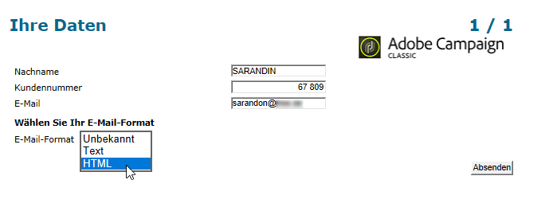

Die einzelnen Schritte sind:

1. [Schritt 1: Erstellen einer Umfrage](#step-1---creating-a-survey),
1. [Schritt 2: Auswählen einer Vorlage](#step-2---selecting-the-template),
1. [Schritt 3: Zusammenstellen der Umfrage](#step-3---building-the-survey),
1. [Schritt 4: Erstellen des Seiteninhalts](#step-4---creating-the-page-content),
1. [Schritt 5: Speichern der Umfragedaten](#step-5---storing-the-survey-data-),
1. [Schritt 6: Publizieren der Seiten](#step-6---publishing-the-pages),
1. [Schritt 7: Freigeben Ihrer Online-Umfrage](#step-7---sharing-your-online-survey).

## Schritt 1: Erstellen einer Umfrage {#step-1---creating-a-survey}

Um eine neue Umfrage zu erstellen, rufen Sie die Registerkarte **[!UICONTROL Kampagnen]** oder **[!UICONTROL Profile und Zielgruppen]** auf und klicken Sie auf das Menü **[!UICONTROL Webanwendungen]**. Klicken Sie auf die Schaltfläche **[!UICONTROL Erstellen]** oberhalb der Formularliste.

## Schritt 2: Auswählen einer Vorlage {#step-2---selecting-the-template}

Wählen Sie eine Umfragevorlage aus und benennen Sie die Vorlage. Dieser Name ist für die Endbenutzer unsichtbar, er dient lediglich zur Identifikation der Umfrage innerhalb von Adobe Campaign. Wählen Sie **[!UICONTROL Speichern]**, um die Umfrage zur Liste der Webanwendungen hinzuzufügen.

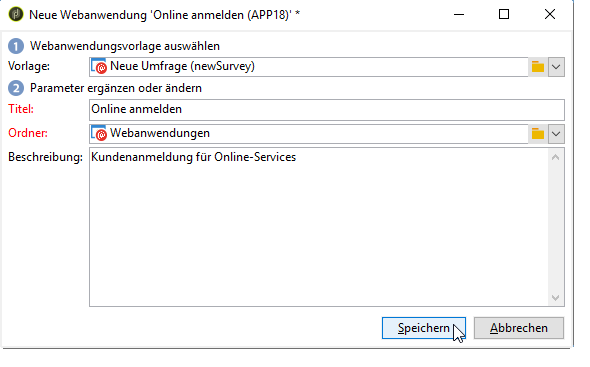

## Schritt 3: Zusammenstellen der Umfrage {#step-3---building-the-survey}

Umfragen werden in einer Grafik durch Platzierung der folgenden Elemente erstellt: die Seite(n), wo der Inhalt erstellt wird, die Schritte zum Vorausfüllen der Daten und zum Speichern sowie die Testphasen. Zusätzlich können Skripts und Abfragen eingefügt werden.

Um die Grafik zu erstellen, wählen Sie das **[!UICONTROL Bearbeitungsformular]** der Umfrage aus.

Eine Umfrage muss **zumindest** die folgenden drei Komponenten enthalten: eine Seite, eine Speicherungsbox und eine Endseite.

* Um eine Seite zu erstellen, wählen Sie im linken Bereich des Editors das Objekt **[!UICONTROL Seite]** aus und legen Sie es wie unten gezeigt in der Mitte ab:

   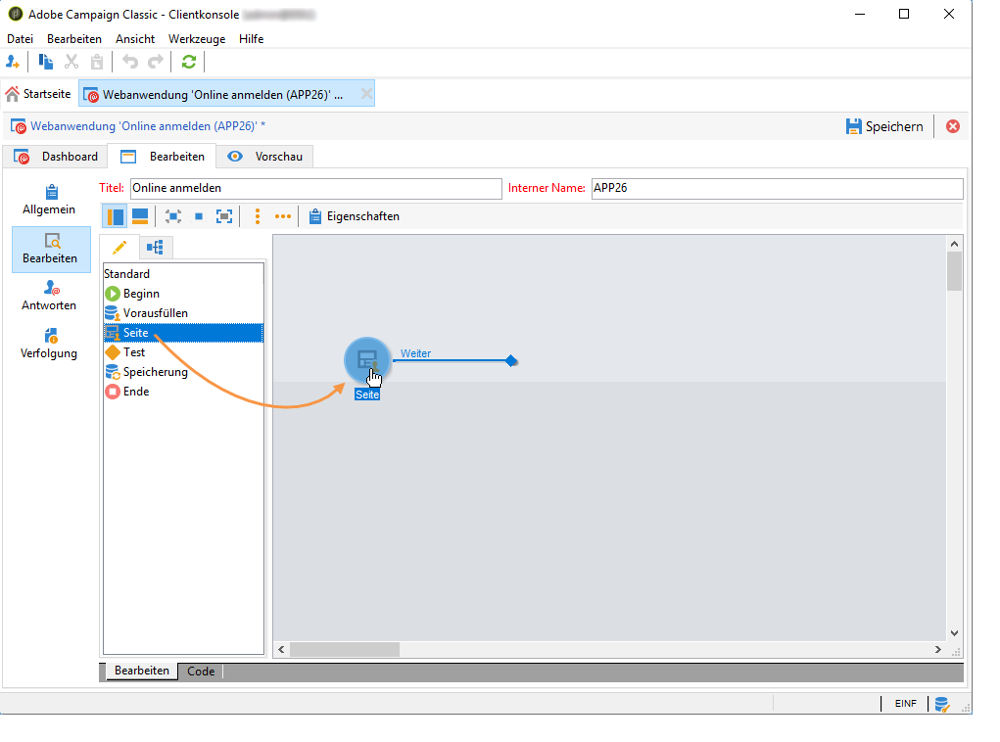

* Wählen Sie danach das Objekt **[!UICONTROL Speicherung]** aus und platzieren Sie es auf der ausgehenden Transition der Seite.
* Wählen Sie abschließend das Objekt **[!UICONTROL Ende]** aus und platzieren Sie es am Ende der ausgehenden Transition der Speicherungsbox. Sie erhalten somit die folgende Grafik:

   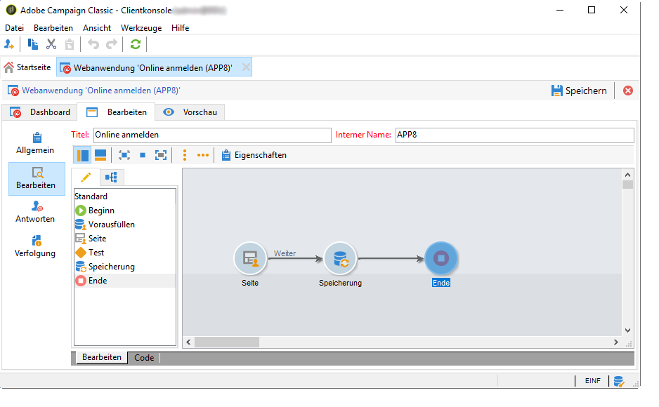

## Schritt 4: Erstellen des Seiteninhalts {#step-4---creating-the-page-content}

Im folgenden Beispiel wird die Seite vom Typ **[!UICONTROL Seite (V5-Kompatibilität)]** verwendet. Der Zugriff auf diesen Seitentyp erfolgt über das erweiterte Menü im Tab **[!UICONTROL Bearbeiten]**.

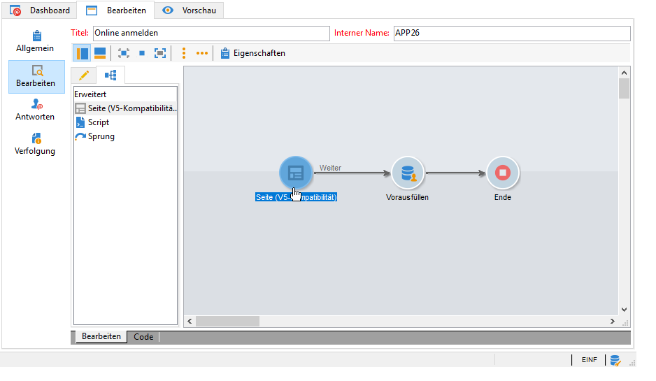

* Eingabefelder hinzufügen

   Um den Inhalt der Seite zu erstellen, müssen Sie sie bearbeiten: Doppelklicken Sie dazu auf das Objekt **[!UICONTROL Seite]**. Wählen Sie das erste Symbol in der Symbolleiste aus, um den Feld-Assistenten zu öffnen. Wählen Sie **[!UICONTROL Edit a recipient]** aus, um ein Eingabefeld für den Benutzernamen zu erstellen, der im entsprechenden Feld des Empfängerprofils gespeichert werden soll.

   

   Wählen Sie die Schaltfläche **[!UICONTROL Weiter]** aus, um das Feld für die Datenspeicherung in der Datenbank festzulegen, in diesem Fall das Feld &quot;Nachname&quot;.

   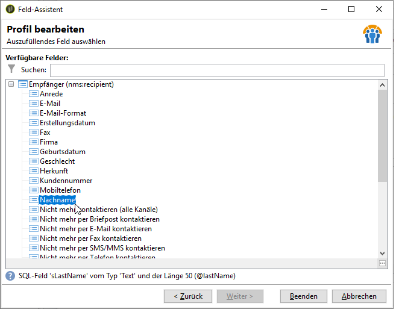

   Wählen Sie zur Bestätigung der Felderstellung die Option **[!UICONTROL Beenden]**.

   Wenn die Informationen in einem bereits in der Datenbank vorhandenen Feld gespeichert werden, nimmt das Feld standardmäßig den Namen des ausgewählten Felds an, d. h. in diesem Beispiel &quot;Nachname&quot;. Sie können diese Bezeichnung folgendermaßen ändern:

   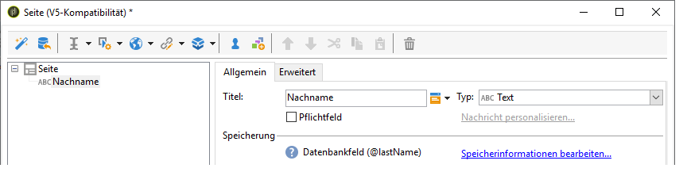

   Erstellen Sie jetzt ein Eingabefeld für die Kundennummer. Wiederholen Sie den Vorgang und wählen Sie das Feld &quot;Kundennummer&quot; aus.

   Wiederholen Sie dieselben Schritte, um ein Feld für die E-Mail-Adresse des Benutzers hinzuzufügen.

* Um eine Frage zu erstellen, rechtsklicken Sie auf das letzte Element im Baum und wählen Sie **[!UICONTROL Container > Frage]** aus oder klicken Sie auf das Symbol **[!UICONTROL Container]** und wählen Sie danach **[!UICONTROL Frage]** aus.

   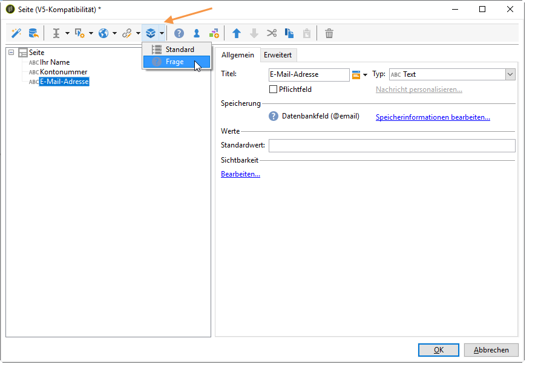

   Geben Sie den Titel der Frage ein und fügen Sie die Antwortfelder als Unterzweig der Frage ein. Bei der Erstellung der Antwortfelder muss der mit der Frage verknüpfte Knoten ausgewählt sein. Fügen Sie eine **[!UICONTROL Dropdown-Liste]** mithilfe des Symbols **[!UICONTROL Auswahldialog]** oder durch Rechtsklicken wie unten gezeigt hinzu:

   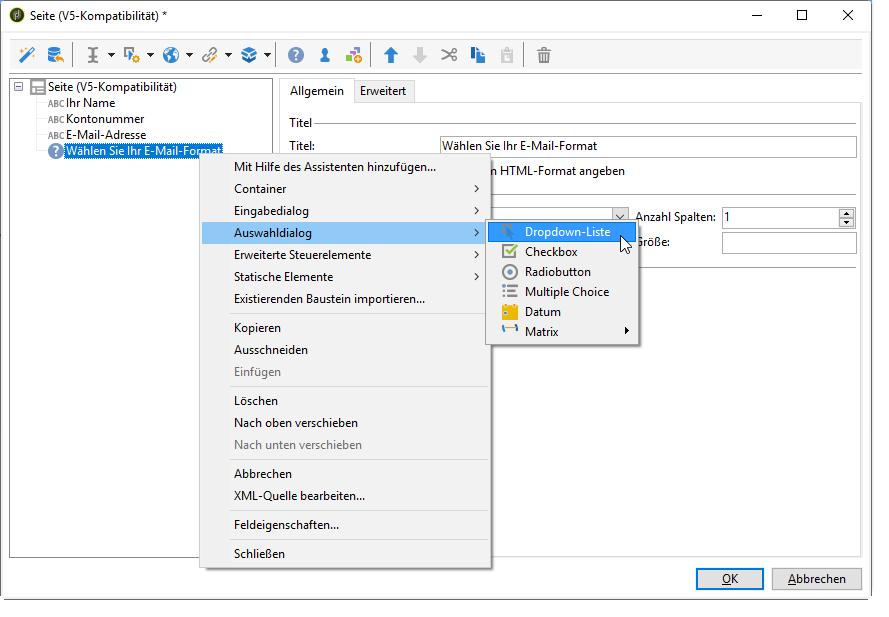

   Wählen Sie einen Speicherort aus: Wählen Sie ein Auflistungsfeld aus, um die Werte automatisch abzurufen (in diesem Fall das E-Mail-Format).

   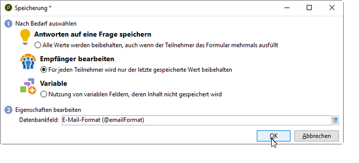

   Wählen Sie im Tab **[!UICONTROL Allgemein]** den Link **[!UICONTROL Werteliste aus der Datenbank übernehmen]** aus. Die Wertetabelle wird daraufhin automatisch eingetragen.

   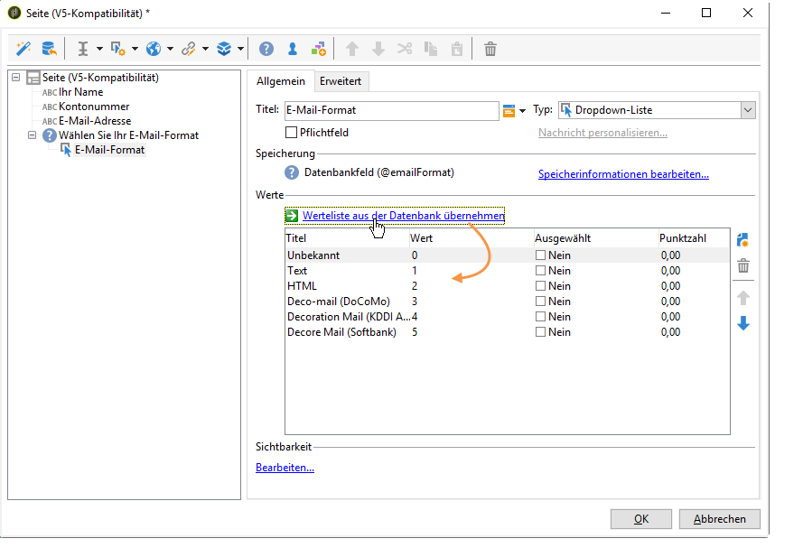

   Wählen Sie **[!UICONTROL OK]** aus, um den Editor zu schließen, und **[!UICONTROL Speichern]**, um die Änderungen zu speichern.

   >[!NOTE]
   >
   >Mit den Optionen im Tab **[!UICONTROL Erweitert]** können Sie für jedes Feld oder jede Frage das Seitenlayout nach Bedarf anpassen. Das Layout der Umfragefenster wird in [diesem Abschnitt](../../web/using/about-web-forms.md) näher beschrieben.

   Wählen Sie im Detailfenster den Tab **[!UICONTROL Vorschau]** aus, um sich die Darstellung der soeben erstellten Umfrage anzusehen.

   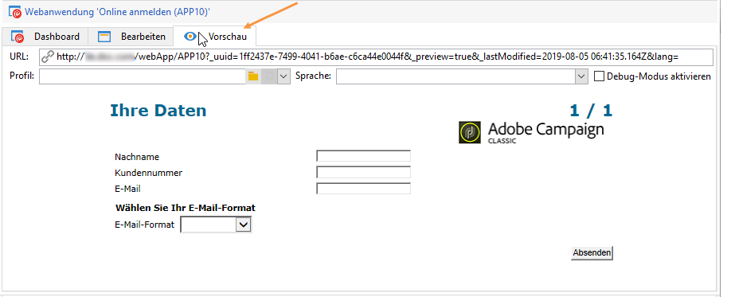

## Schritt 5: Speichern der Umfragedaten {#step-5---storing-the-survey-data-}

Mit der Speicherungsbox können Sie die Antworten der Benutzer in der Datenbank speichern. Wählen Sie dazu einen Abstimmschlüssel aus, um die bereits in der Datenbank vorhandenen Profile zu identifizieren.

Bearbeiten Sie dazu die Box und wählen Sie das Feld aus, das bei der Datenspeicherung als Abstimmschlüssel verwendet wird.

Im unten stehenden Beispiel passiert Folgendes bei der Speicherung (Bestätigung): Wenn ein Profil in der Datenbank gespeichert wird, dessen Kundennummer der im Formular eingegebenen Kundenummer entspricht, wird das Profil aktualisiert. Wenn das Profil noch nicht existiert, wird es erstellt.

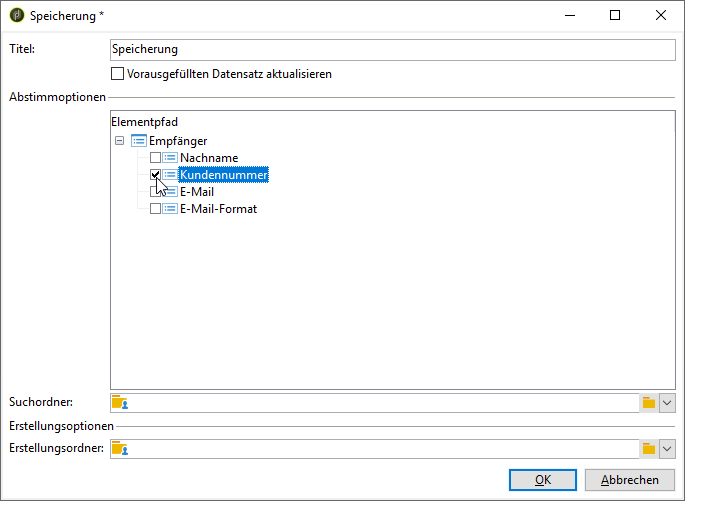

Wählen Sie zum Bestätigen **[!UICONTROL OK]** und danach **[!UICONTROL Speichern]** aus, um die Umfrage zu speichern.

## Schritt 6: Publizieren der Seiten {#step-6---publishing-the-pages}

Damit die Benutzer auf die HTML-Seiten zugreifen können, muss die Anwendung verfügbar gemacht werden. Dazu müssen Sie vom Bearbeitungsstatus in den Produktionsstatus wechseln, d. h. die Umfrage publizieren. Gehen Sie dazu wie folgt vor:

* Klicken Sie auf die Schaltfläche **[!UICONTROL Publizieren]** oberhalb des Umfrage-Dashboards.
* Wählen Sie **[!UICONTROL Start]** aus, um die Publikation zu starten und den Assistenten zu schließen.

   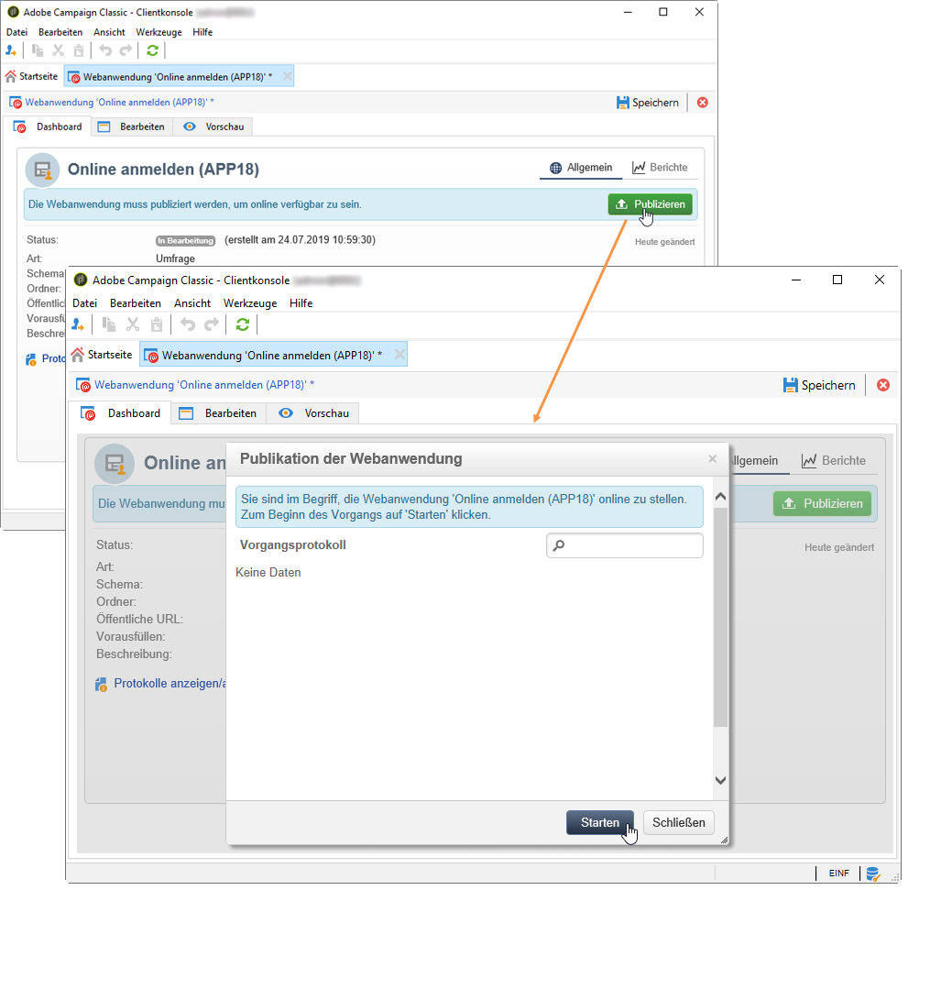

   Der Status der Umfrage wechselt zu: **Online**.

   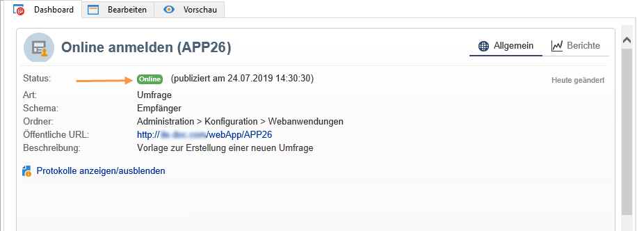

## Schritt 7: Freigeben Ihrer Online-Umfrage {#step-7---sharing-your-online-survey}

Sobald sich die Umfrage im Produktionsstatus befindet, kann sie am Server aufgerufen und von Ihnen bereitgestellt werden. Die URL für den Zugriff auf die Umfrage wird im Dashboard angezeigt.

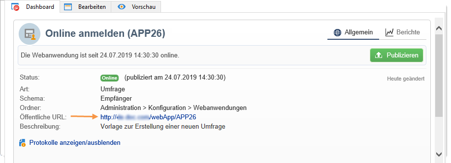

Um die Umfrage bereitzustellen, können Sie beispielsweise eine Nachricht mit einem Zugangslink an die Zielpopulation senden oder die Zugriffs-URL auf eine Webseite stellen.

Sie können die Antworten der Benutzer dann mit Berichten und Logs überwachen. Siehe [Antworten tracken](../../web/using/publish--track-and-use-collected-data.md#response-tracking).

>[!CAUTION]
>
>Die öffentliche URL beinhaltet den internen Namen der Umfrage. Wenn dieser geändert wird, wird die URL automatisch aktualisiert. Auch alle Links zur Umfrage müssen dann aktualisiert werden.
>
>Wenn Nachrichten mit dem Link zur Umfrage bereits versendet wurden, funktioniert dieser Link nicht mehr.

