# Antworten verwalten{#managing-answers}

## Erfasste Antworten speichern {#storing-collected-answers}

Zusätzlich zu den Standard-Speichermodi, die für alle Webformulare in Adobe Campaign bereitstehen (Datenbankfeld und lokale Variable), ist bei Umfragen auch die dynamische Erweiterung des Datenmodells mithilfe archivierter Felder möglich.

>[!CAUTION]
>
>Diese Option ist nur für Webanwendungen vom Typ **Umfrage** verfügbar, nicht aber für andere Typen von Webformularen.

### In einem archivierten Feld speichern {#storing-in-an-archived-field}

Die Datenvorlage kann einfach erweitert werden, indem neue Speicherorte hinzugefügt werden, um die Umfrageantworten zu speichern. Wählen Sie dazu bei der Erstellung des Eingabefelds die Option **[!UICONTROL Antworten auf eine Frage speichern]** aus. Wählen Sie den Link **[!UICONTROL Neues Feld...]** aus und geben Sie dessen Eigenschaften ein:

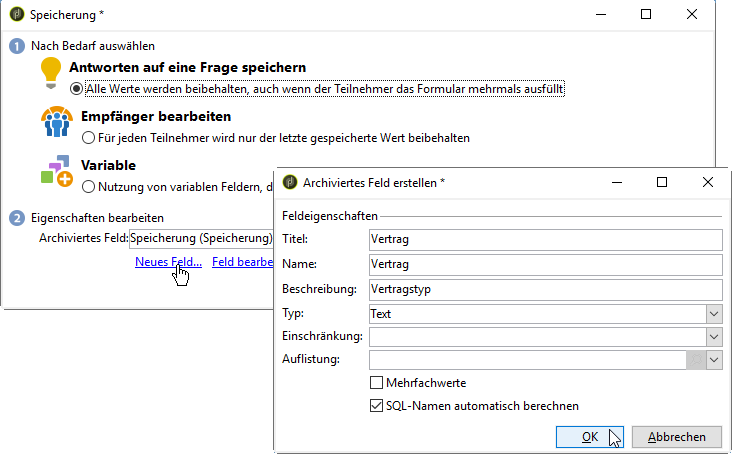

Geben Sie den Titel und den Namen des Felds ein und wählen Sie den Typ des Felds aus: Text, boolesch, ganze Zahl oder Dezimalzahl, Datum etc.

Über den ausgewählten Feldtyp lassen sich auch die von den Benutzern eingegebenen Daten definieren. Bei **Text**-Feldern können Sie eine Einschränkung (Groß-/Kleinschreibung, Format) oder einen Link zu einer vorhandenen Auflistung hinzufügen, um eine Auswahl zu erzwingen.

Um eine Einschränkung hinzuzufügen, wählen Sie sie aus der Dropdown-Liste aus. Es gibt zwei Arten von Einschränkungen:

1. Groß- und Kleinschreibung von Buchstaben

   Die eingegebenen Informationen können im Feld in den folgenden Formaten gespeichert werden: durchgehend Großbuchstaben, durchgehend Kleinbuchstaben oder erster Buchstabe groß geschrieben. Durch diese Einschränkung ist der Benutzer nicht gezwungen, die Daten im ausgewählten Format einzugeben, sondern der im Feld eingegebene Inhalt wird bei der Speicherung entsprechend umgewandelt.

1. Datenformat

Wenn dieses Feld in einer Liste verwendet wird, können die Werte der Aufzählung automatisch in der Wertetabelle über den Link **[!UICONTROL Datenbankverbindung über der Liste der Werte]** oberhalb der Werteliste abgerufen werden.

Beispielsweise können Sie eine Dropdown-Liste erstellen, aus der der Benutzer seine Muttersprache auswählen kann. Das entsprechende archivierte Feld kann mit der Auflistung **Sprache** verknüpft werden, die eine Liste von Sprachen enthält:

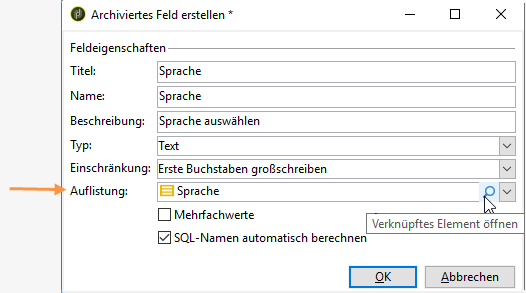

Mit dem Symbol **[!UICONTROL Link bearbeiten]** rechts neben dem Feld können Sie den Inhalt dieser Auflistung bearbeiten:

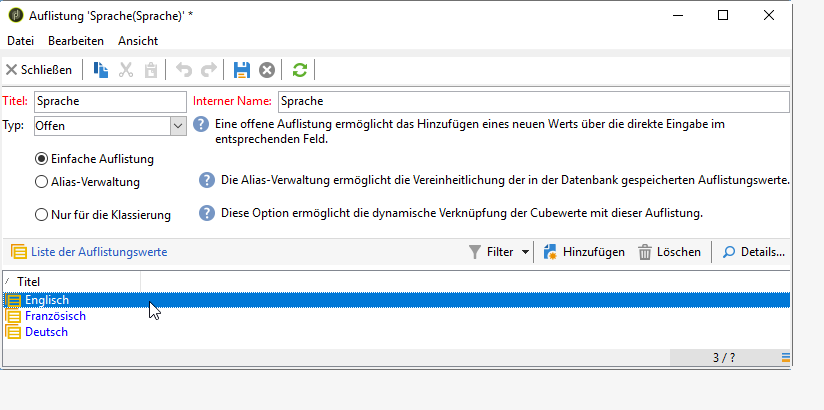

Im Tab **[!UICONTROL Allgemein]** des Felds können Sie über den Link **[!UICONTROL Werteliste aus der Datenbank übernehmen]** automatisch die angebotene Liste der Titel eingeben.

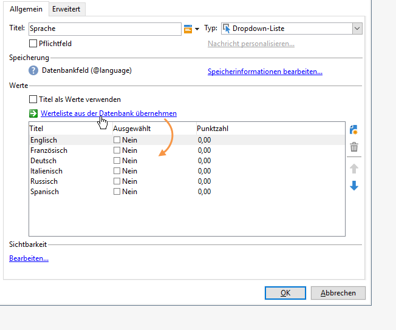

**Beispiel**: Die Verträge eines Empfängers sollen gemeinsam in einem Feld gespeichert werden.

Um verschiedene Arten von Verträgen gemeinsam in einem Feld zu speichern, erstellen Sie ein Eingabefeld vom Typ **[!UICONTROL Text]** und wählen Sie die Option **[!UICONTROL Antworten auf eine Frage speichern]** aus.

Wählen Sie den Link **[!UICONTROL Neues Feld...]** aus und geben Sie die Feldeigenschaften ein. Wählen Sie die Option **[!UICONTROL Mehrfachwerte]** aus, um die Speicherung mehrerer Werte zu ermöglichen.

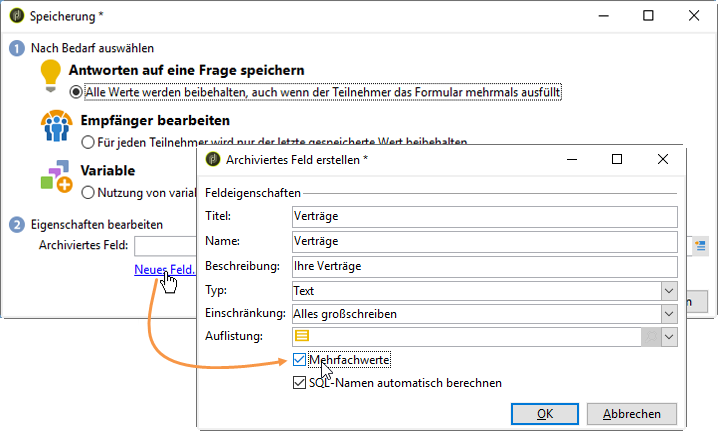

Erstellen Sie für die anderen Verträge Eingabefelder und speichern Sie die Daten im selben archivierten Feld.

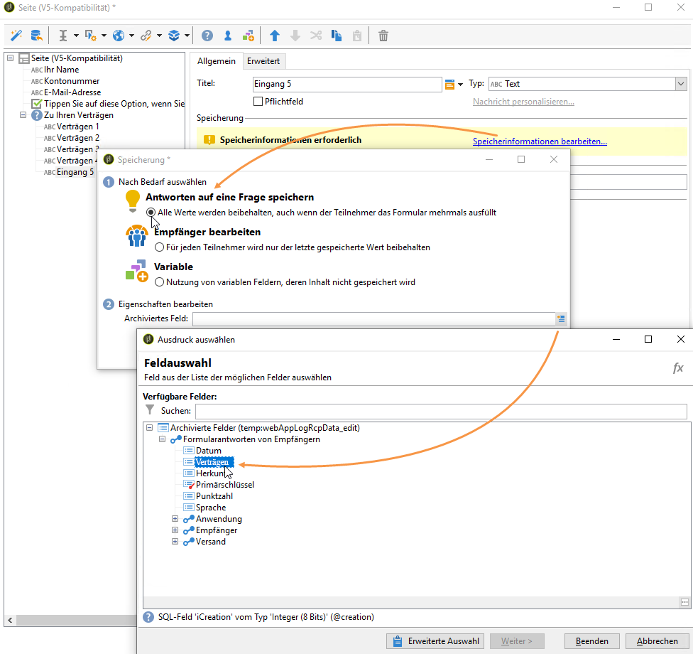

Wenn Benutzer die Umfrage validieren, werden ihre Antworten im Feld **[!UICONTROL Verträge]** gespeichert.

In unserem Beispiel betrifft das die folgenden Antworten:

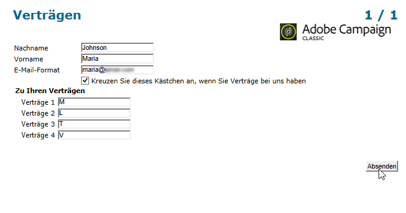

Die vier eingegebenen Verträge werden im Profil des Benutzers gespeichert.

Die Verträge können im Tab **[!UICONTROL Antworten]** der Umfrage aufgerufen werden, indem die entsprechenden Spalten angezeigt werden.

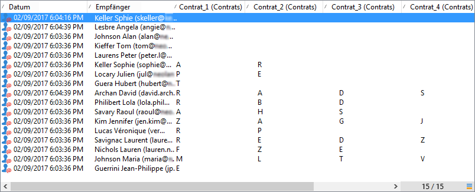

Sie können Empfänger auch auf der Basis ihrer Antworten filtern, sodass nur die für Sie interessanten Benutzer angezeigt werden. Erstellen Sie dazu einen Zielgruppen-Workflow unter Verwendung der Box **[!UICONTROL Umfrageantworten]**.

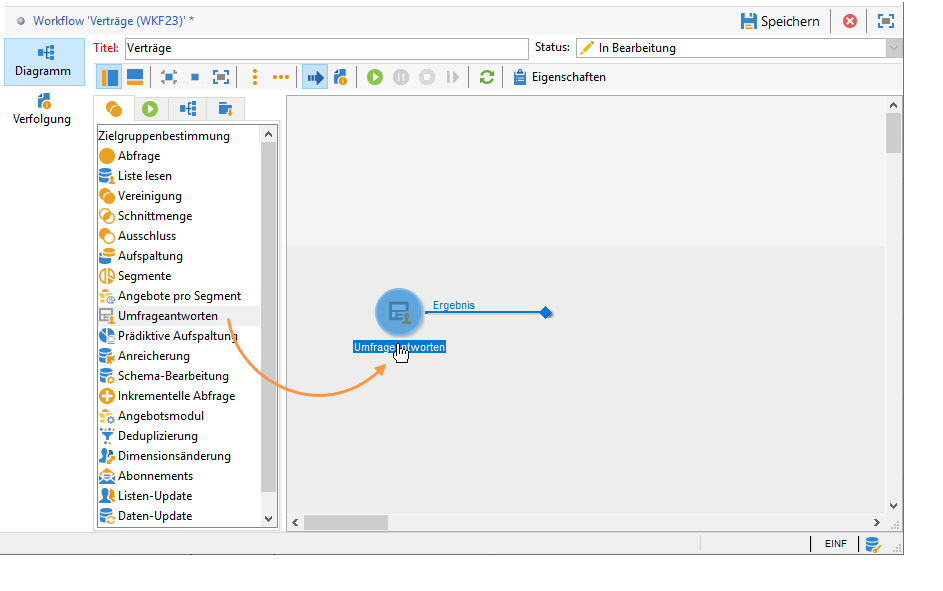

Erstellen Sie Ihre Abfrage auf der Basis der gewünschten Profile. Im folgenden Beispiel erfahren Sie, wie Sie über die Abfrage Profile auswählen, die mindestens zwei Verträge besitzen, darunter einen Vertrag vom Typ A.

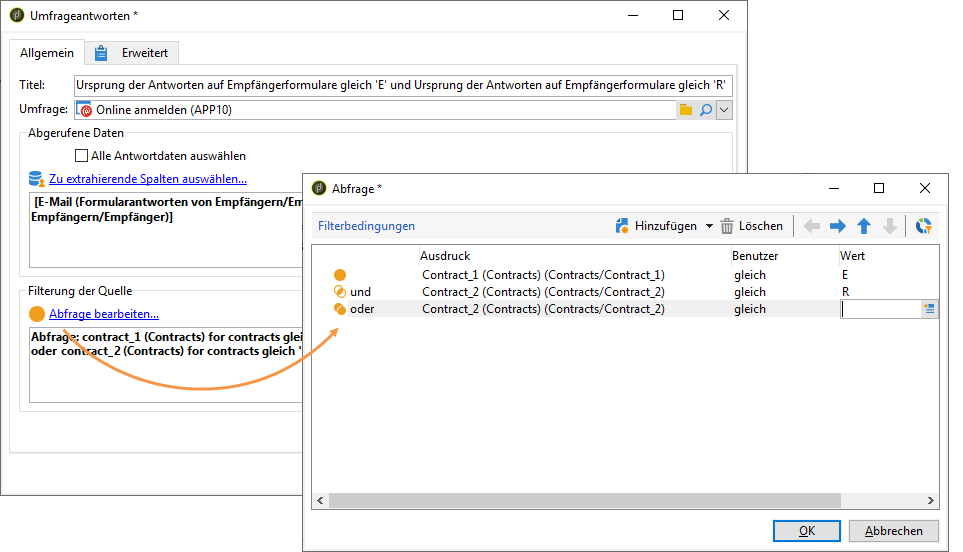

Die gegebenen Antworten können in allen Formularen in Feldern oder Titeln verwendet werden. Der in einem archivierten Feld gespeicherte Inhalt muss die folgende Syntax aufweisen:

```
<%= ctx.webAppLogRcpData.name of the archived field %
```

>[!NOTE]
>
>Die Syntax für andere Feldtypen wird in [diesem Abschnitt](../../platform/using/about-queries-in-campaign.md) beschrieben.

### Speichereinstellungen {#storage-settings}

Antworten auf Umfragen können im XML-Format archiviert werden. Auf diese Weise können Sie eine Rohkopie der gesammelten Antworten speichern, was bei übermäßiger Standardisierung der Daten in einer Auflistung nützlich sein kann (Weitere Informationen hierzu finden Sie unter [Daten vereinheitlichen](../../web/using/publish--track-and-use-collected-data.md#standardizing-data)).

>[!CAUTION]
>
>Durch die Archivierung der Originalantworten erhöht sich der benötigte Speicherplatz aber maßgeblich. Diese Option sollte deshalb mit Vorsicht verwendet werden.

Gehen Sie dazu wie folgt vor:

* Öffnen Sie die Umfrageeigenschaften über die Schaltfläche **[!UICONTROL Eigenschaften]** im Tab **[!UICONTROL Bearbeiten]**.
* Wählen Sie den Link **[!UICONTROL Erweiterte Parameter]** aus und aktivieren Sie die Option **[!UICONTROL Kopie der Originalantworten speichern]**.

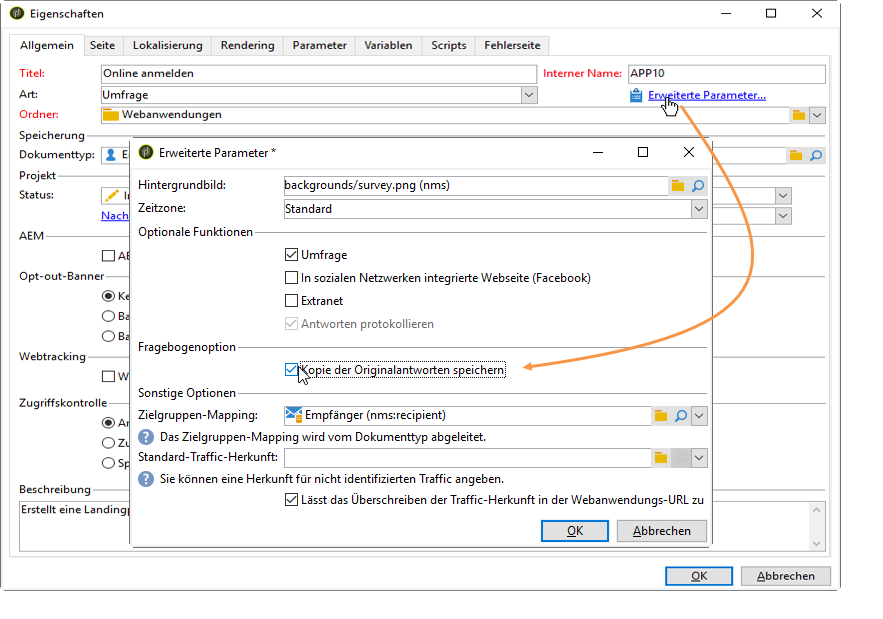

Sie können diese Option standardmäßig für alle Umfragen aktivieren (diese Option wird bei der Publikation der Umfrage angewendet). Erstellen Sie dazu die Option **[!UICONTROL NmsWebApp_XmlBackup]** und weisen Sie ihr den Wert **[!UICONTROL 1]** wie unten dargestellt zu:


## Verwaltung der Punktzahl {#score-management}

Sie können den auf den Formularseiten bereitgestellten Optionen eine Punktzahl zuweisen. Die Punktzahl kann nur mit geschlossenen Fragen verknüpft werden: Checkbox, Wert aus einer Dropdown-Liste, Abonnement usw.

>[!CAUTION]
>
>Die Verwaltung der Punktzahl ist nur für **Umfragen** verfügbar.

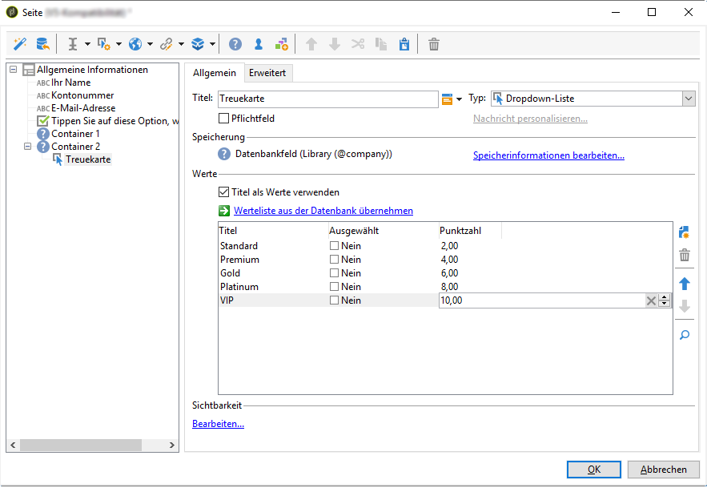

Die Punkte werden kumuliert und auf dem Server gespeichert, wenn die Seite bestätigt wird, d. h. wenn der Benutzer auf die Schaltfläche **[!UICONTROL Weiter]** oder **[!UICONTROL Beenden]** klickt.

>[!NOTE]
>
>Sie können dafür positive oder negative sowie ganzzahlige oder nicht-ganzzahlige Werte verwenden.

Die Punktzahl kann in Tests oder Skripts verwendet werden.

>[!CAUTION]
>
>Die Punktzahl kann nicht in den Sichtbarkeitsbedingungen für Felder verwendet werden, die sich auf derselben Seite befinden. Sie kann aber auf aufeinanderfolgenden Seiten verwendet werden.

* Um Punkte in Tests einzubeziehen, verwenden Sie in der Test-Berechnungsformel wie unten gezeigt das Feld **[!UICONTROL Punktzahl]**:

   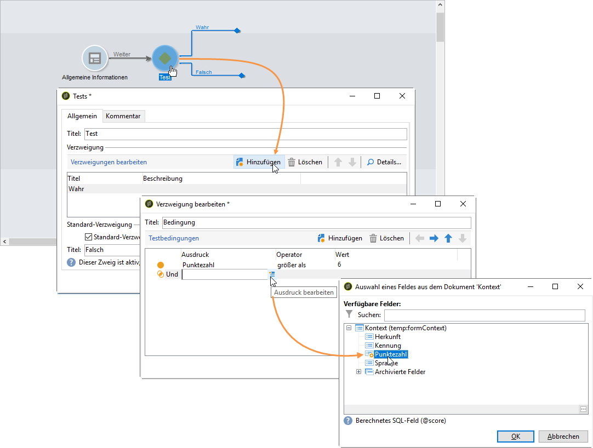

* Sie können die Punktzahl in einem Skript verwenden.

**Beispiel**: Berechnen Sie eine Punktzahl und verwenden Sie sie als Bedingung für die Anzeige der nächsten Seite:

* In einer Umfrage können Sie Benutzern mithilfe der Auswahl für die nächste Seite unterschiedliche Punktzahlen entsprechend dem in der Dropdown-Liste ausgewählten Wert zuweisen.

   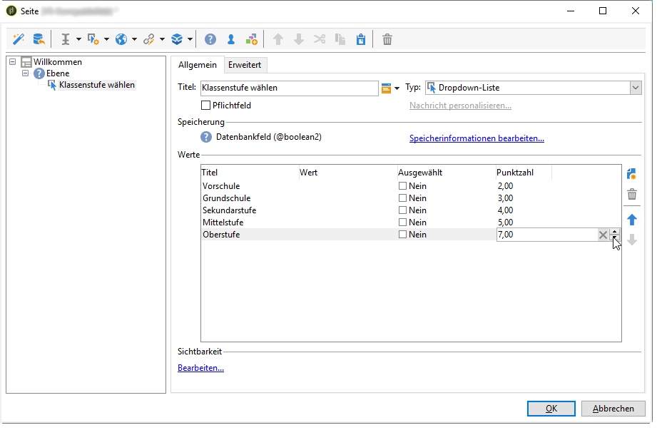

* Diese Punktzahl kann abhängig von der ausgewählten Option mit einem zweiten Wert kombiniert werden:

   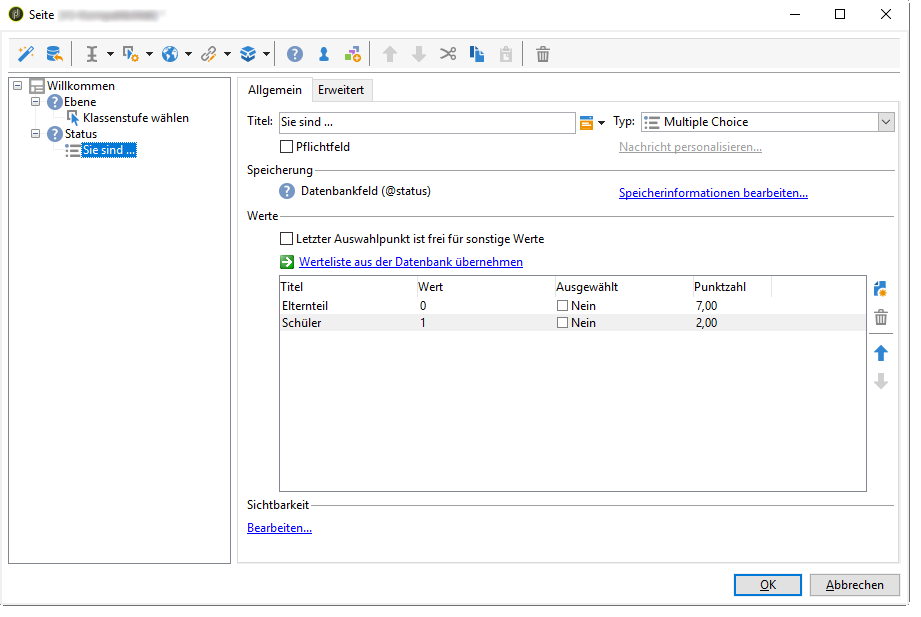

* Wenn der Benutzer die Schaltfläche **[!UICONTROL Weiter]** auswählt, werden die beiden Werte addiert.

   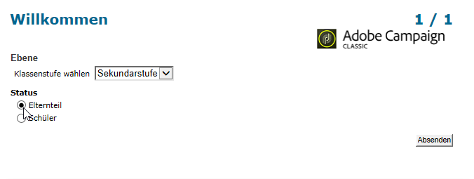

* Auf die anzuzeigende Seite können entsprechend der Punktzahl Bedingungen angewendet werden. Die Konfiguration wird wie folgt durchgeführt:

   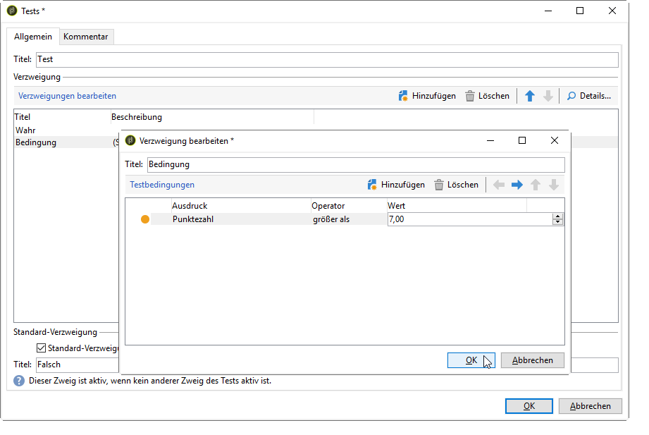

   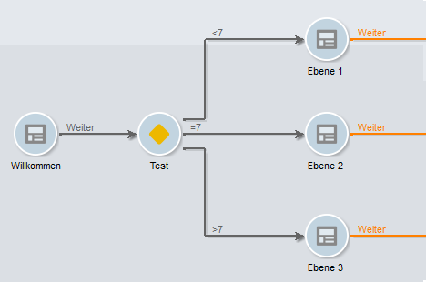

