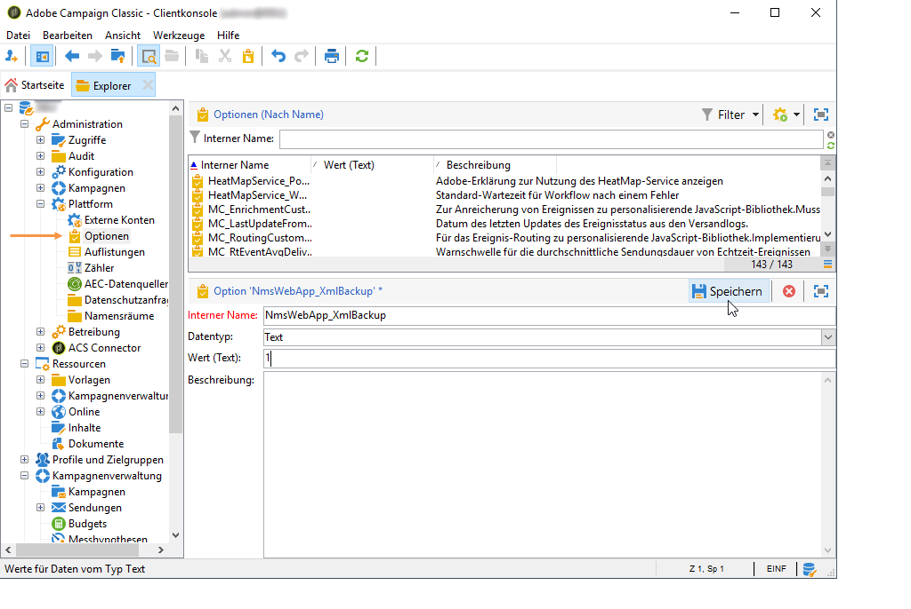

# Antworten verwalten{#managing-answers}

## Erfasste Antworten speichern {#storing-collected-answers}

Zusätzlich zu den Standard-Speichermodi, die für alle Webformulare in Adobe Campaign bereitstehen (Datenbankfeld und lokale Variable), ist bei Umfragen auch die dynamische Erweiterung des Datenmodells mithilfe archivierter Felder möglich.

>[!CAUTION]
>
>Diese Option ist nur für Webanwendungen vom Typ **Umfrage** verfügbar, nicht aber für andere Typen von Webformularen.

### In einem archivierten Feld speichern {#storing-in-an-archived-field}

Die Datenvorlage lässt sich einfach erweitern, indem neue Speicherräume hinzugefügt werden, um die in Umfragen bereitgestellten Antworten zu speichern. Wählen Sie dazu beim Erstellen des Eingabefelds die **[!UICONTROL Store answers to a question]** Option aus. Klicken Sie auf den **[!UICONTROL New field...]** Link und geben Sie dessen Eigenschaften an:


Geben Sie den Titel und den Namen des Felds ein und wählen Sie den Typ des Felds aus: Text, boolesch, ganze Zahl oder Dezimalzahl, Datum etc.

Der ausgewählte Feldtyp beinhaltet eine Steuerung der Daten, wenn Antworten von Benutzern eingegeben werden. Bei **Textfeldern** können Sie eine Einschränkung (Groß-/Kleinschreibung, Format) oder eine Verknüpfung zu einer vorhandenen Aufzählung hinzufügen, um die Auswahl zu erzwingen.

Um eine Einschränkung hinzuzufügen, wählen Sie sie aus der Dropdownliste aus. Es gibt zwei Arten von Einschränkungen:

1. Groß- und Kleinschreibung von Buchstaben

   Die eingegebenen Informationen können im Feld in den folgenden Formaten gespeichert werden: durchgehend Großbuchstaben, durchgehend Kleinbuchstaben oder erster Buchstabe groß geschrieben. Durch diese Einschränkung ist der Benutzer nicht gezwungen, die Daten im ausgewählten Format einzugeben, sondern der im Feld eingegebene Inhalt wird bei der Speicherung entsprechend umgewandelt.

1. Datenformat

If this field is used in a list, the values of the enumeration can be retrieved automatically in the table of values using the **[!UICONTROL Initialize the list of values from the database]** link above the list of values.

Beispielsweise können Sie eine Dropdown-Liste erstellen, aus der der Benutzer seine Muttersprache auswählen kann. Das entsprechende archivierte Feld kann mit der Auflistung **Sprache** verknüpft werden, die eine Liste von Sprachen enthält:


The **[!UICONTROL Edit link]** icon located to the right of the field lets you edit the content of this enumeration:


Auf der **[!UICONTROL General]** Registerkarte des Felds können Sie über den **[!UICONTROL Initialize the list of values from the database]** Link automatisch die Liste der angebotenen Beschriftungen eingeben.


**Beispiel**: Die Verträge eines Empfängers sollen gemeinsam in einem Feld gespeichert werden.

To store different types of contracts in one field, create a **[!UICONTROL Text]** input field and select the **[!UICONTROL Store answers to a question]** option.

Klicken Sie auf den **[!UICONTROL New field...]** Link und geben Sie die Feldeigenschaften ein. Wählen Sie die **[!UICONTROL Multiple values]** Option, um die Speicherung mehrerer Werte zu aktivieren.


Erstellen Sie für die anderen Verträge Eingabefelder und speichern Sie die Daten im selben archivierten Feld.


When users approve the survey, their answers will be stored in the **[!UICONTROL Contracts]** field.

In unserem Beispiel betrifft das die folgenden Antworten:


Die vier eingegebenen Verträge werden im Profil des Benutzers gespeichert.

They can be viewed in the **[!UICONTROL Answers]** tab of the survey by displaying the relevant columns.


Sie können Empfänger auch nach Antworten filtern, um nur die Benutzer anzuzeigen, die Sie interessieren. Erstellen Sie dazu einen Targeting-Workflow und verwenden Sie das **[!UICONTROL Survey responses]** Kontrollkästchen.


Erstellen Sie Ihre Abfrage auf der Basis der gewünschten Profile. Im folgenden Beispiel erfahren Sie, wie Sie über die Abfrage Profile auswählen, die mindestens zwei Verträge besitzen, darunter einen Vertrag vom Typ A.


Die gegebenen Antworten können in allen Formularen in Feldern oder Titeln verwendet werden. Der in einem archivierten Feld gespeicherte Inhalt muss die folgende Syntax aufweisen:

```
<%= ctx.webAppLogRcpData.name of the archived field %
```

>[!NOTE]
>
>Die Syntax für andere Feldtypen wird in [diesem Abschnitt](../../platform/using/about-queries-in-campaign.md) beschrieben.

### Speichereinstellungen {#storage-settings}

Antworten auf Umfragen können im XML-Format archiviert werden. Auf diese Weise können Sie eine Rohkopie der gesammelten Antworten speichern, was bei einer übermäßigen Standardisierung der Daten in einer Einzelliste nützlich sein kann (weitere Informationen finden Sie unter [Standarddaten](../../web/using/publish--track-and-use-collected-data.md#standardizing-data)).

>[!CAUTION]
>
>Durch die Archivierung der Originalantworten erhöht sich der benötigte Speicherplatz aber maßgeblich. Diese Option sollte deshalb mit Vorsicht verwendet werden.

Gehen Sie dazu wie folgt vor:

* Edit the survey properties via the **[!UICONTROL Properties]** button of the **[!UICONTROL Edit]** tab.
* Klicken Sie auf den **[!UICONTROL Advanced parameters]** Link und aktivieren Sie die **[!UICONTROL Save a copy of raw answers]** Option.


Sie können sie standardmäßig für alle Umfragen aktivieren (diese Option wird angewendet, wenn die Umfrage veröffentlicht wird). Erstellen Sie dazu die **[!UICONTROL NmsWebApp_XmlBackup]** Option und weisen Sie ihr einen Wert **[!UICONTROL 1]** zu, wie nachfolgend gezeigt:



## Verwaltung der Punktzahl {#score-management}

Sie können den auf den Formularseiten bereitgestellten Optionen eine Punktzahl zuweisen. Die Punktzahl kann nur mit geschlossenen Fragen verknüpft werden: Checkbox, Wert aus einer Dropdown-Liste, Abonnement usw.

>[!CAUTION]
>
>Die Verwaltung der Punktzahl ist nur für **Umfragen** verfügbar.


The scores are accumulated and saved on the server side when the page is confirmed, i.e. when the user clicks the **[!UICONTROL Next]** or **[!UICONTROL Finish]** button.

>[!NOTE]
>
>Sie können dafür positive oder negative sowie ganzzahlige oder nicht-ganzzahlige Werte verwenden.

Die Punktzahl kann in Tests oder Skripts verwendet werden.

>[!CAUTION]
>
>Die Punktzahl kann nicht in den Sichtbarkeitsbedingungen für Felder verwendet werden, die sich auf derselben Seite befinden. Sie kann aber auf aufeinanderfolgenden Seiten verwendet werden.

* To use scores in tests, use the **[!UICONTROL Score]** field in the test calculation formula, as shown below:

   

* Sie können die Punktzahl in einem Skript verwenden.

**Beispiel**: Berechnen Sie eine Punktzahl und verwenden Sie sie als Bedingung für die Anzeige der nächsten Seite:

* In einer Umfrage können Sie Benutzern mithilfe der Auswahl für die nächste Seite unterschiedliche Punktzahlen entsprechend dem in der Dropdown-Liste ausgewählten Wert zuweisen.

   

* Diese Punktzahl kann abhängig von der ausgewählten Option mit einem zweiten Wert kombiniert werden:

   

* When the user clicks the **[!UICONTROL Next]** button, the two values are added up.

   

* Auf die anzuzeigende Seite können entsprechend der Punktzahl Bedingungen angewendet werden. Die Konfiguration wird wie folgt durchgeführt:

   

   

