# Webformular publizieren{#publishing-a-web-form}

## Formulardaten vorausfüllen {#pre-loading-the-form-data}

Wenn Sie die in der Datenbank gespeicherten Profile mithilfe eines Webformulars aktualisieren möchten, können Sie eine Vorausfüllen-Komponente verwenden. Über diese Komponente können Sie angeben, wie der in der Datenbank zu aktualisierende Datensatz gefunden werden soll.

Folgende Identifizierungsmöglichkeiten gibt es:

* **[!UICONTROL Adobe Campaign-Verschlüsselung]**

   Diese Verschlüsselungsmethode verwendet die verschlüsselte Adobe Campaign-Kennung (ID). Diese Methode ist nur für Adobe Campaign-Objekte möglich. Die verschlüsselte Kennung darf außerdem nur von der Adobe Campaign-Plattform generiert werden.

   Wenn Sie diese Methode verwenden, müssen Sie die URL des Formulars anpassen, das an die E-Mail-Adresse gesendet wird. Fügen Sie zu diesem Zweck den Parameter **`<%=escapeUrl(recipient.cryptedId) %>`** hinzu. Weitere Informationen hierzu finden Sie unter [Formular per E-Mail versenden](#delivering-a-form-via-email).

* **[!UICONTROL DES-Verschlüsselung]**

   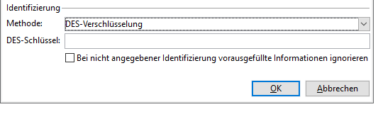

   Diese Verschlüsselungsmethode verwendet eine extern bereitgestellte Kennung (ID), die mit einem Schlüssel verknüpft ist, der von Adobe Campaign und dem externen Anbieter gemeinsam verwendet wird. Dieser Schlüssel wird im Feld **[!UICONTROL DES-Schlüssel]** eingegeben.

* **[!UICONTROL Feldliste]**

   Mit dieser Option können Sie aus den im aktuellen Kontext des Formulars bereitgestellten Feldern auswählen. Anhand dieser Felder wird das entsprechende Profil in der Datenbank gesucht.

   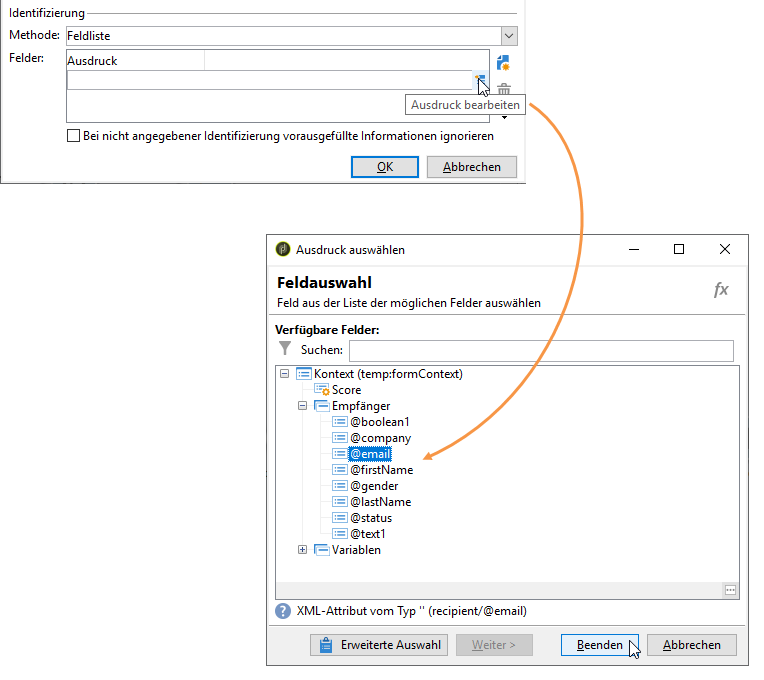

   Felder können den Formulareigenschaften über den Tab **[!UICONTROL Parameter]** hinzugefügt werden (siehe [Parameter hinzufügen](../../web/using/defining-web-forms-properties.md#adding-parameters)). Sie werden in der Formular-URL oder den Eingabefeldern platziert.

   >[!CAUTION]
   >
   >Die Daten in den ausgewählten Feldern sind nicht verschlüsselt. Sie dürfen nicht verschlüsselt bereitgestellt werden, da sie Adobe Campaign nicht entschlüsseln kann, wenn die Option **[!UICONTROL Feldliste]** ausgewählt ist.

   Im folgenden Beispiel wird das Vorausfüllen des Profils auf Basis der E-Mail-Adresse durchgeführt.

   In der URL kann die unverschlüsselte E-Mail-Adresse enthalten sein. In diesem Fall haben Benutzer direkten Zugriff auf Seiten.

   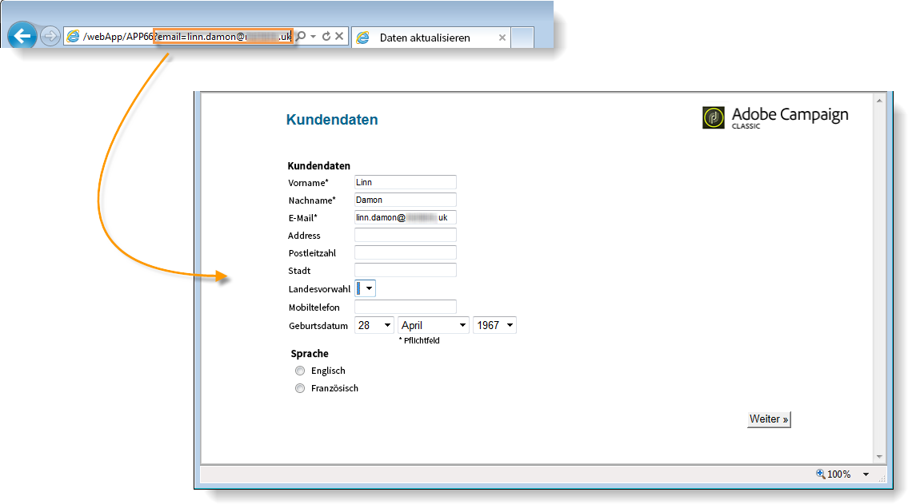

   Ansonsten werden sie nach ihrem Passwort gefragt.

   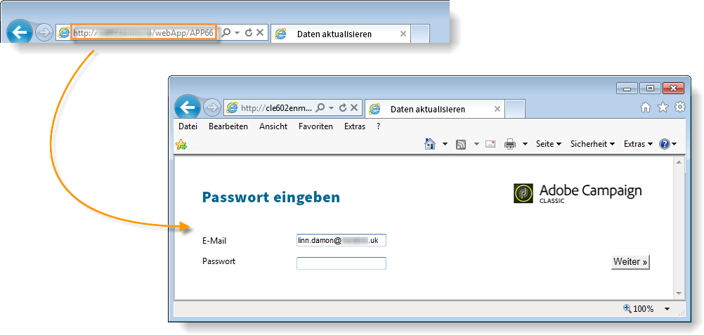

   >[!CAUTION]
   >
   >Wenn mehrere Felder in der Liste spezifiziert sind, müssen die Daten **ALLER FELDER** mit den in der Datenbank gespeicherten Daten übereinstimmen, damit das Profil aktualisiert wird. Ansonsten wird ein neues Profil erstellt.
   > 
   >Diese Funktion ist besonders nützlich für Webanwendungen, aber nicht empfohlen für öffentliche Formulare. Als Zugriffskontrolloption muss &quot;Zugriffskontrolle aktivieren&quot; ausgewählt werden.

Wenn Sie Profile aktualisieren möchten, müssen Sie die Option **[!UICONTROL Bei nicht angegebener Identifizierung vorausgefüllte Informationen ignorieren]** auswählen. In diesem Fall wird jedes eingegebene Profil zur Datenbank hinzugefügt, nachdem das Formular validiert wurde. Diese Option wird beispielsweise verwendet, wenn ein Formular auf einer Website öffentlich zugänglich ist.

Mit der Option **[!UICONTROL Referenzierte Daten werden automatisch in das Formular geladen]** können Sie automatisch Daten, die den Eingabe- und Verbindungsfeldern des Formulars entsprechen, vorausfüllen. Dies betrifft aber keine Daten, die in den Aktivitäten **[!UICONTROL Script]** und **[!UICONTROL Test]** referenziert werden. Ist diese Option nicht ausgewählt, müssen Sie die Felder mit der Option **[!UICONTROL Ladung zusätzlicher Daten]** definieren.

Mit der Option **[!UICONTROL Ladung zusätzlicher Daten]** können Sie Felder mit Daten vorausfüllen, auch wenn diese Informationen nicht auf den Seiten des Formulars verwendet werden.

So können Sie beispielsweise das Geschlecht des Empfängers vorausfüllen und ihn über eine Test-Komponente automatisch zur entsprechenden Seite weiterleiten.

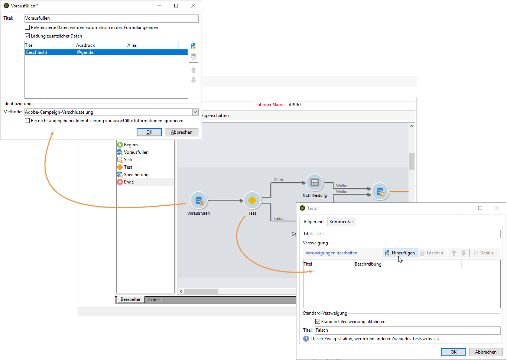

## Versand und Tracking von Webformularen verwalten {#managing-web-forms-delivery-and-tracking}

Nachdem ein Formular erstellt, konfiguriert und veröffentlicht wurde, können Sie es bereitstellen und die Benutzerantworten tracken.

### Lebenszyklus eines Formulars {#life-cycle-of-a-form}

Der Lebenszyklus eines Formulars besteht aus drei Phasen:

1. **Das Formular wird bearbeitet**

   Dies ist die anfängliche Phase, in der ein neues Formular erstellt wird; es befindet sich in der Bearbeitungsphase. Um auf das Formular zugreifen zu können, muss (ausschließlich für Testzwecke) der Parameter **[!UICONTROL __uuid]** in seine URL eingegeben werden. Auf diese URL können Sie über den Unter-Tab **[!UICONTROL Vorschau]** zugreifen. Siehe [Parameter der Formular-URL](../../web/using/defining-web-forms-properties.md#form-url-parameters).

   >[!CAUTION]
   >
   >Der Zugriff auf das Formular erfolgt in der gesamten Bearbeitungsphase über diese spezielle URL.

1. **Das Formular ist online**

   Nach Abschluss der Konzeptionsphase kann das Formular versendet werden. Zuerst muss es publiziert werden. Weitere Informationen finden Sie unter [Formular publizieren ](#publishing-a-form).

   Das Formular ist so lange **[!UICONTROL Live]**, bis seine Gültigkeit erlischt.

   >[!CAUTION]
   >
   >Damit eine Umfrage bereitgestellt werden kann, darf ihre URL nicht den Parameter **[!UICONTROL __uuid]** enthalten.

1. **Das Formular ist nicht verfügbar**

   Wenn die Bereitstellungsphase vorüber ist, ist das Formular geschlossen und nicht mehr verfügbar. Benutzer können dann nicht mehr darauf zugreifen.

   Das Ablaufdatum kann im Fenster mit den Formulareigenschaften definiert werden. Weitere Informationen hierzu finden Sie unter [Formular online verfügbar machen](#making-a-form-available-online).

Der Publikationsstatus eines Formulars wird in der Formularliste angezeigt.

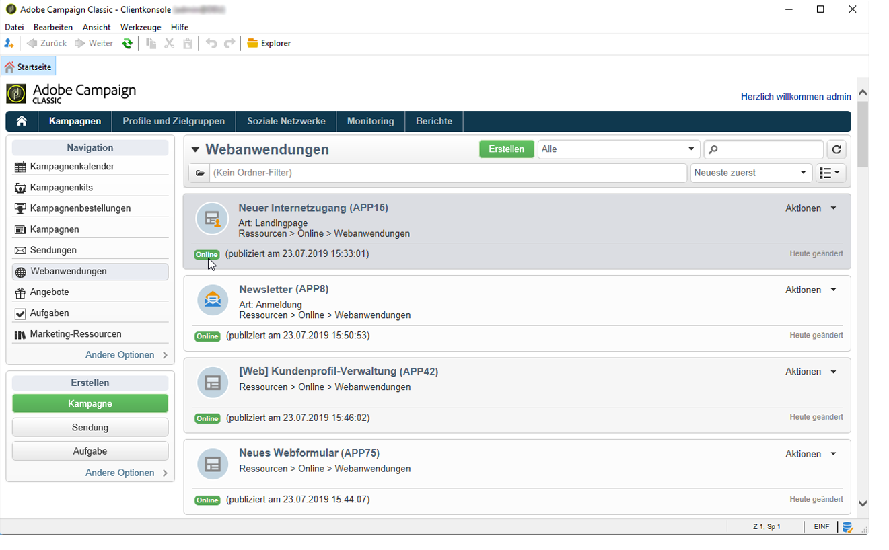

### Formular publizieren {#publishing-a-form}

Um den Status eines Formulars zu ändern, müssen Sie es publizieren. Klicken Sie dazu oberhalb der Liste der Webformulare auf die Schaltfläche **[!UICONTROL Publikation]** und wählen Sie in der Dropdown-Liste den Status aus.

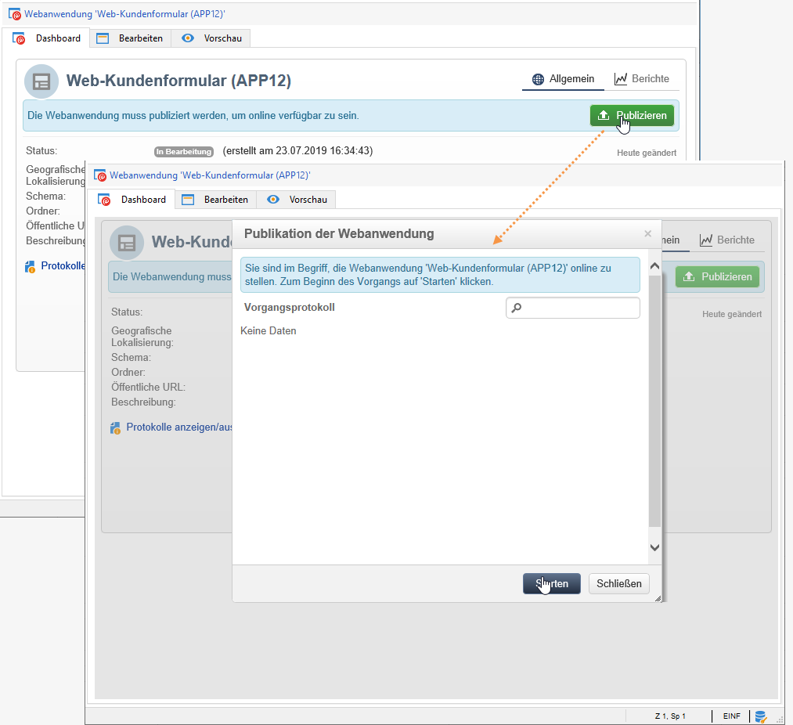

### Formular online verfügbar machen {#making-a-form-available-online}

Damit Benutzer auf das Formular zugreifen können, muss es sich in Produktion befinden und gestartet worden sein, d. h. sich innerhalb seines Gültigkeitszeitraums befinden. Die Gültigkeitsdaten werden über den Link **[!UICONTROL Eigenschaften]** des Formulars eingegeben.

* Geben Sie im Bereich **[!UICONTROL Projekt]** über die entsprechenden Felder das Start- und Enddatum für das Formular ein.

   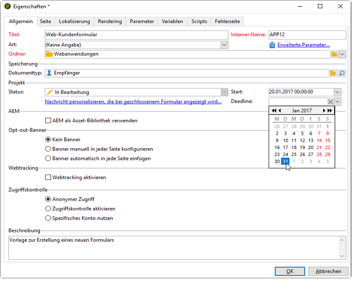

* Wählen Sie den Link **[!UICONTROL Nachricht personalisieren, die bei geschlossenem Formular angezeigt wird...]** aus, um eine Fehlernachricht zu definieren. Diese wird angezeigt, wenn ein Benutzer versucht, auf das Formular zuzugreifen, das nicht gültig ist;

   Siehe [Zugriff auf das Formular](../../web/using/defining-web-forms-properties.md#accessibility-of-the-form).

### Formular per E-Mail versenden {#delivering-a-form-via-email}

Wenn Sie eine Einladung per E-Mail versenden, können Sie die Option **[!UICONTROL Adobe-Campaign-Verschlüsselung]** zur Abstimmung der Daten verwenden. Gehen Sie dazu zum Versand-Assistenten und passen Sie den Link an das Formular an, indem Sie die folgenden Parameter hinzufügen:

```
<a href="https://server/webApp/APP264?&id=<%=escapeUrl(recipient.cryptedId) %>">
```

In diesem Fall muss der Abstimmschlüssel für die Datenspeicherung die verschlüsselte Kennung des Empfängers sein. Weitere Informationen finden Sie unter [Formulardaten vorausfüllen](#pre-loading-the-form-data).

In diesem Fall müssen Sie im Datensatzfeld die Option **[!UICONTROL Vorausgefüllten Datensatz aktualisieren]** aktivieren. Weiterführende Informationen finden Sie unter [Antworten in Webformularen speichern](../../web/using/web-forms-answers.md#saving-web-forms-answers).

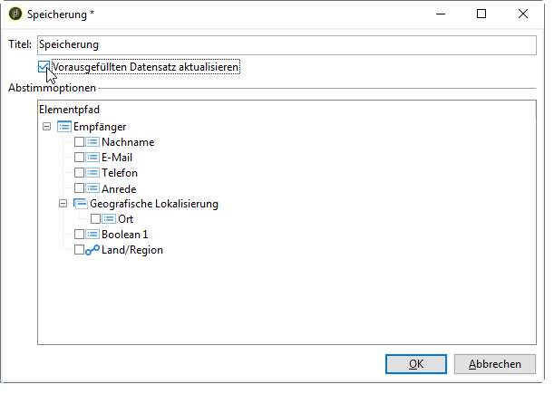

### Log responses {#log-responses}

Das Tracking der Antworten kann in einem speziellen Tab aktiviert werden, um die Wirkung Ihres Webformulars zu überwachen. Wählen Sie dazu im Fenster mit den Formulareigenschaften den Link **[!UICONTROL Erweiterte Parameter...]** und dann die Option **[!UICONTROL Antworten protokollieren]** aus.

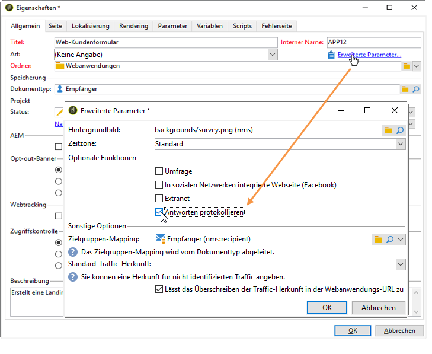

Im Tab **[!UICONTROL Antworten]** sehen Sie die Identität der reagierenden Kontakte.

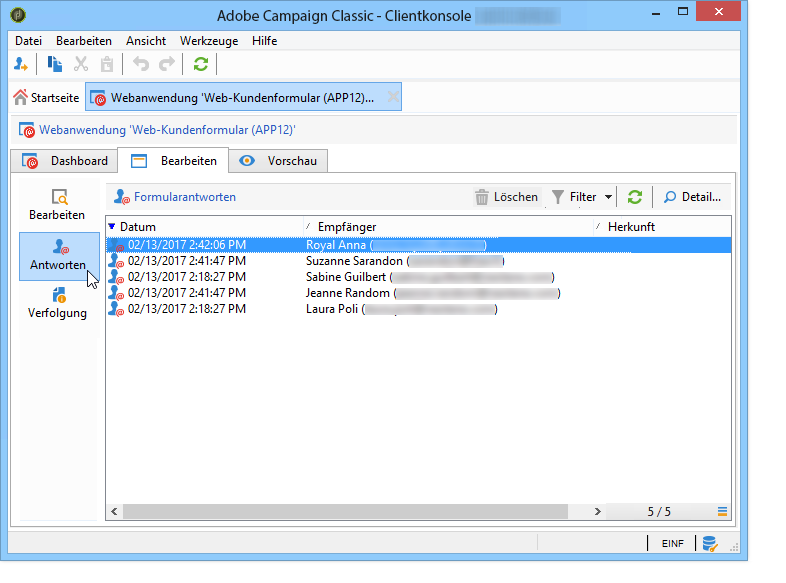

Selektieren Sie einen Empfänger und wählen Sie dann die Schaltfläche **[!UICONTROL Details...]** aus, um die Antworten aufzurufen.

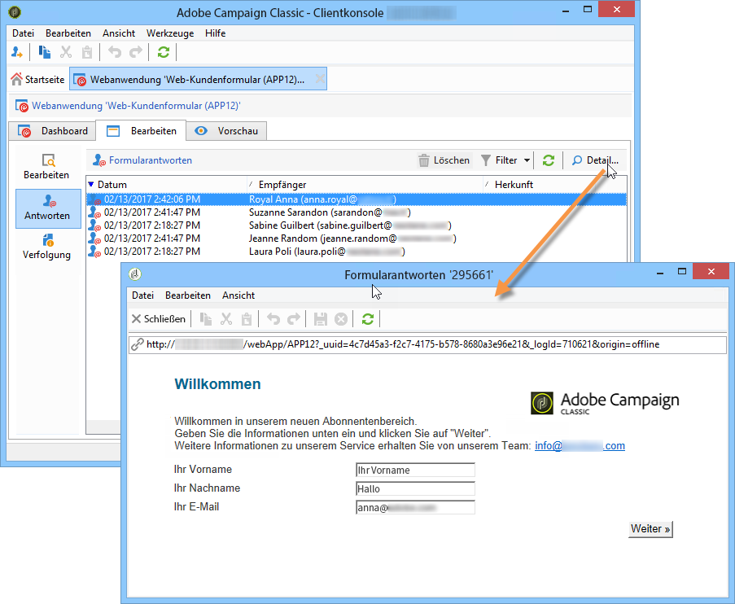

Sie können die Antwortprotokolle zu den Fragen verwenden, um beispielsweise Erinnerungen nur an Kontakte zu senden, die nicht geantwortet haben, oder um reagierenden Kontakten spezielle Nachrichten zukommen zu lassen.

>[!NOTE]
>
>Für ein vollständiges Tracking der bereitgestellten Antworten exportieren Sie die Antworten und erstellen Sie spezielle Berichte. Verwenden Sie dazu das optionale **Umfragemodul**. Weiterführende Informationen dazu finden Sie in [diesem Abschnitt](../../web/using/about-surveys.md).

