<?xml version="1.0" encoding="UTF-8"?>
<xliff xmlns="urn:oasis:names:tc:xliff:document:1.2" xmlns:okp="okapi-framework:xliff-extensions" xmlns:its="http://www.w3.org/2005/11/its" xmlns:itsxlf="http://www.w3.org/ns/its-xliff/" version="1.2" its:version="2.0">
<file original="help/web/using/static-elements-in-a-web-form.md.mdsc" source-language="en-US" target-language="en-XX" datatype="x-text/markdown">
<body>
<trans-unit id="tu15" xml:space="preserve">
<source xml:lang="en-US">https://experienceleague.adobe.com/de/tools/campaign-api</source>
<target xml:lang="en-XX">https://experienceleague.adobe.com/de/tools/campaign-api</target>
</trans-unit>
<trans-unit id="tu31" xml:space="preserve">
<source xml:lang="en-US">https://www.adobe.com</source>
<target xml:lang="en-XX">https://www.adobe.com</target>
</trans-unit>
<trans-unit id="tu1" restype="x-YAML_METADATA_HEADER_VALUE" xml:space="preserve">
<source xml:lang="en-US">Static elements in a web form</source>
<target xml:lang="en-XX">Statische Elemente in einem Webformular</target>
</trans-unit>
<trans-unit id="tu2" restype="x-YAML_METADATA_HEADER_VALUE" xml:space="preserve">
<source xml:lang="en-US">Static elements in a web form</source>
<target xml:lang="en-XX">Statische Elemente in einem Webformular</target>
</trans-unit>
<trans-unit id="tu3" xml:space="preserve">
<source xml:lang="en-US">Also applies to v8</source>
<target xml:lang="en-XX">Gilt auch für v8</target>
</trans-unit>
<trans-unit id="tu4" xml:space="preserve">
<source xml:lang="en-US">Also applies to Campaign v8</source>
<target xml:lang="en-XX">Gilt auch für Campaign v8</target>
</trans-unit>
<trans-unit id="tu5" xml:space="preserve">
<source xml:lang="en-US">Static elements in a web form</source>
<target xml:lang="en-XX">Statische Elemente in einem Web-Formular</target>
</trans-unit>
<trans-unit id="tu6" xml:space="preserve">
<source xml:lang="en-US">You can include elements with which the user has no interaction in the pages of the form; these are static elements such as images, HTML content, a horizontal bar, or a hypertext link. These elements are created via the first button in the toolbar, by selecting <ph id="1" ctype="x-STRONG_EMPHASIS">**[!UICONTROL </ph>Static elements<ph id="3" ctype="x-LINK_REF">]**</ph>.</source>
<target xml:lang="en-XX">Sie können Elemente, mit denen der Benutzer keine Interaktion hat, in die Seiten des Formulars einfügen; dies sind statische Elemente wie Bilder, HTML-Inhalte, eine horizontale Leiste oder ein Hypertext-Link. Diese Elemente werden über die erste Schaltfläche in der Symbolleiste erstellt, indem Sie <ph id="1" ctype="x-STRONG_EMPHASIS">**[!UICONTROL </ph>Statische Elemente<ph id="3" ctype="x-LINK_REF">]**</ph> auswählen.</target>
</trans-unit>
<trans-unit id="tu7" xml:space="preserve">
<source xml:lang="en-US"><ph id="1" ctype="x-IMAGE">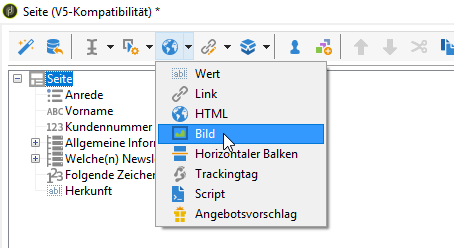</ph></source>
<target xml:lang="en-XX"><ph id="1" ctype="x-IMAGE"></ph></target>
</trans-unit>
<trans-unit id="tu8" xml:space="preserve">
<source xml:lang="en-US">The following types of field are available:</source>
<target xml:lang="en-XX">Folgende Feldtypen sind verfügbar:</target>
</trans-unit>
<trans-unit id="tu9" xml:space="preserve">
<source xml:lang="en-US">Value based on previously provided answers (in the context of the form) or on the database.</source>
<target xml:lang="en-XX">Wert auf der Basis der zuvor eingegebenen Antworten (im Kontext des Formulars) oder der Datenbank.</target>
</trans-unit>
<trans-unit id="tu10" xml:space="preserve">
<source xml:lang="en-US">Hypertext link, HTML, horizontal bar. See <ph id="1" ctype="x-LINK">[</ph>Inserting HTML content<ph id="2" ctype="x-LINK">](#inserting-html-content)</ph>.</source>
<target xml:lang="en-XX">Hypertext-Link, HTML, horizontaler Balken. Siehe <ph id="1" ctype="x-LINK">[</ph>HTML-Inhalt einfügen<ph id="2" ctype="x-LINK">](#inserting-html-content)</ph>.</target>
</trans-unit>
<trans-unit id="tu11" xml:space="preserve">
<source xml:lang="en-US">Image saved in the resource library or on a server accessible by users. See <ph id="1" ctype="x-LINK">[</ph>Inserting images<ph id="2" ctype="x-LINK">](#inserting-images)</ph>.</source>
<target xml:lang="en-XX">Bild, das in der Ressourcenbibliothek oder auf einem für Benutzer zugänglichen Server gespeichert ist. Siehe <ph id="1" ctype="x-LINK">[</ph>Bilder einfügen<ph id="2" ctype="x-LINK">](#inserting-images)</ph>.</target>
</trans-unit>
<trans-unit id="tu12" xml:space="preserve">
<source xml:lang="en-US">Script executed on client side and/or server side. It must be written in JavaScript and be compatible with most browsers to ensure correct execution on the client side.</source>
<target xml:lang="en-XX">Skript, das Client- und/oder Server-seitig ausgeführt wird Es muss in JavaScript verfasst und mit den gängigen Browsern kompatibel sein, um die korrekte Ausführung auf dem Client zu gewährleisten.</target>
</trans-unit>
<trans-unit id="tu13" xml:space="preserve">
<source xml:lang="en-US"><ph id="1" ctype="x-regxph" equiv-text="&lbrack;!NOTE">[!NOTE]</ph></source>
<target xml:lang="en-XX"><ph id="1" ctype="x-regxph" equiv-text="&lbrack;!NOTE">[!NOTE]</ph></target>
</trans-unit>
<trans-unit id="tu14" xml:space="preserve">
<source xml:lang="en-US">On the server side, the script can use the functions defined in <ph id="1" ctype="x-LINK">&lbrack;</ph>Campaign JSAPI documentation<ph id="2" ctype="x-LINK">[#$tu15]</ph>.</source>
<target xml:lang="en-XX">Auf der Serverseite kann das Script die in der <ph id="1" ctype="x-LINK">&lbrack;</ph>Campaign JSAPI-Dokumentation<ph id="2" ctype="x-LINK">[#$tu15]</ph> definierten Funktionen verwenden.</target>
</trans-unit>
<trans-unit id="tu16" xml:space="preserve">
<source xml:lang="en-US">Insert HTML content</source>
<target xml:lang="en-XX">HTML-Inhalt einfügen</target>
</trans-unit>
<trans-unit id="tu17" xml:space="preserve">
<source xml:lang="en-US">You can include HTML content in a form page: hypertext links, images, formatted paragraphs, videos, etc.</source>
<target xml:lang="en-XX">Sie können in eine Formularseite HTML-Inhalte einfügen, wie z. B. Hypertext-Links, Bilder, formatierte Absätze, Videos usw.</target>
</trans-unit>
<trans-unit id="tu18" xml:space="preserve">
<source xml:lang="en-US">The HTML editor lets you enter the content to insert into the form page. To open the editor, click <ph id="1" ctype="x-STRONG_EMPHASIS">**[!UICONTROL </ph>Static elements<ph id="3" ctype="x-LINK_REF">]**</ph> > <ph id="5" ctype="x-STRONG_EMPHASIS">**[!UICONTROL </ph>HTML<ph id="7" ctype="x-LINK_REF">]**</ph> .</source>
<target xml:lang="en-XX">Mit dem HTML-Editor können Sie den Inhalt eingeben, der in die Formularseite eingefügt werden soll. Um den Editor zu öffnen, klicken Sie auf <ph id="1" ctype="x-STRONG_EMPHASIS">**[!UICONTROL </ph>Statische Elemente<ph id="3" ctype="x-LINK_REF">]**</ph> > <ph id="5" ctype="x-STRONG_EMPHASIS">**[!UICONTROL </ph>HTML<ph id="7" ctype="x-LINK_REF">]**</ph>.</target>
</trans-unit>
<trans-unit id="tu19" xml:space="preserve">
<source xml:lang="en-US">You can enter and format your content directly or display the source code window to paste in some external content. To switch to "source code" mode, click the first icon in the toolbar:</source>
<target xml:lang="en-XX">Sie können Inhalte direkt eingeben und formatieren oder das Fenster mit dem Quell-Code öffnen, um externen Code einzufügen. Um in den Modus „Quell-Code“ zu wechseln, klicken Sie auf das erste Symbol in der Symbolleiste:</target>
</trans-unit>
<trans-unit id="tu20" xml:space="preserve">
<source xml:lang="en-US"><ph id="1" ctype="x-IMAGE">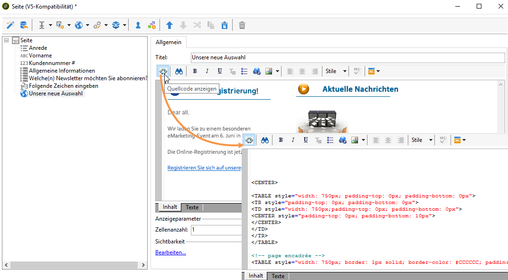</ph></source>
<target xml:lang="en-XX"><ph id="1" ctype="x-IMAGE"></ph></target>
</trans-unit>
<trans-unit id="tu21" xml:space="preserve">
<source xml:lang="en-US">To insert a database field, use the personalization button.</source>
<target xml:lang="en-XX">Um ein Datenbankfeld einzufügen, verwenden Sie die Personalisierungs-Schaltfläche.</target>
</trans-unit>
<trans-unit id="tu22" xml:space="preserve">
<source xml:lang="en-US"><ph id="1" ctype="x-IMAGE">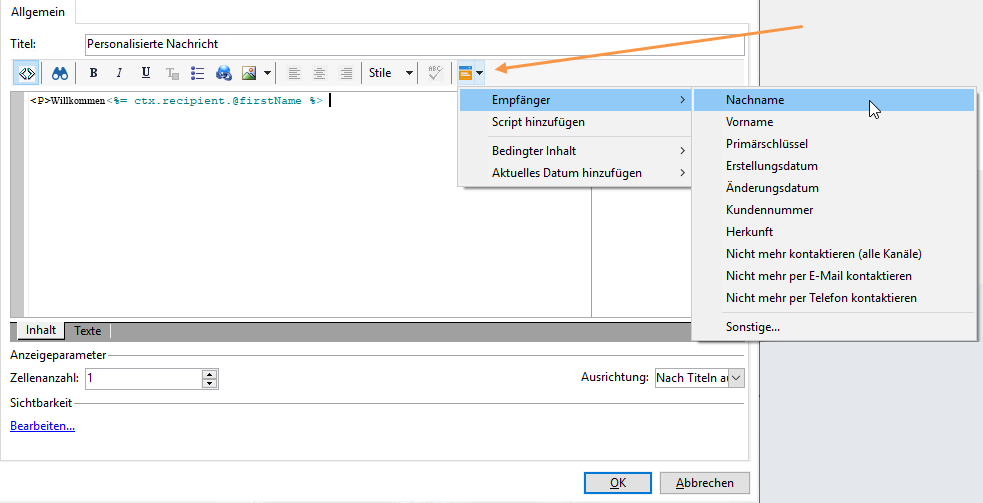</ph></source>
<target xml:lang="en-XX"><ph id="1" ctype="x-IMAGE"></ph></target>
</trans-unit>
<trans-unit id="tu23" xml:space="preserve">
<source xml:lang="en-US"><ph id="1" ctype="x-regxph" equiv-text="&lbrack;!NOTE">[!NOTE]</ph></source>
<target xml:lang="en-XX"><ph id="1" ctype="x-regxph" equiv-text="&lbrack;!NOTE">[!NOTE]</ph></target>
</trans-unit>
<trans-unit id="tu24" xml:space="preserve">
<source xml:lang="en-US">The strings entered in the HTML editor are only translated if they are defined in the <ph id="1" ctype="x-STRONG_EMPHASIS">**[!UICONTROL </ph>Texts<ph id="3" ctype="x-LINK_REF">]**</ph> sub-tab. Otherwise they will not be collected. For more on this, refer to <ph id="5" ctype="x-LINK">[</ph>Translating a web form<ph id="6" ctype="x-LINK">](translating-a-web-form.md)</ph>.</source>
<target xml:lang="en-XX">Die im HTML-Editor eingegebenen Strings werden nur übersetzt, wenn sie in der Unterregisterkarte <ph id="1" ctype="x-STRONG_EMPHASIS">**[!UICONTROL </ph>Texte<ph id="3" ctype="x-LINK_REF">]**</ph> definiert sind. Anderenfalls werden sie nicht erfasst. Weitere Informationen finden Sie unter <ph id="5" ctype="x-LINK">[</ph>Webformular übersetzen<ph id="6" ctype="x-LINK">](translating-a-web-form.md)</ph>.</target>
</trans-unit>
<trans-unit id="tu25" xml:space="preserve">
<source xml:lang="en-US">Insert a link</source>
<target xml:lang="en-XX">Links einfügen</target>
</trans-unit>
<trans-unit id="tu26" xml:space="preserve">
<source xml:lang="en-US">Fill in the fields in the editing window as shown in the following example:</source>
<target xml:lang="en-XX">Füllen Sie im Bearbeitungsfenster die Felder wie im folgenden Beispiel gezeigt aus:</target>
</trans-unit>
<trans-unit id="tu27" xml:space="preserve">
<source xml:lang="en-US">To add a hypertext link, go to <ph id="1" ctype="x-STRONG_EMPHASIS">**[!UICONTROL </ph>Static elements<ph id="3" ctype="x-LINK_REF">]**</ph> > <ph id="5" ctype="x-STRONG_EMPHASIS">**[!UICONTROL </ph>Link<ph id="7" ctype="x-LINK_REF">]**</ph>.</source>
<target xml:lang="en-XX">Um einen Hypertext-Link hinzuzufügen, gehen Sie zu <ph id="1" ctype="x-STRONG_EMPHASIS">**[!UICONTROL </ph>Statische Elemente<ph id="3" ctype="x-LINK_REF">]**</ph> > <ph id="5" ctype="x-STRONG_EMPHASIS">**[!UICONTROL </ph>Link<ph id="7" ctype="x-LINK_REF">]**</ph>.</target>
</trans-unit>
<trans-unit id="tu28" xml:space="preserve">
<source xml:lang="en-US"><ph id="1" ctype="x-IMAGE">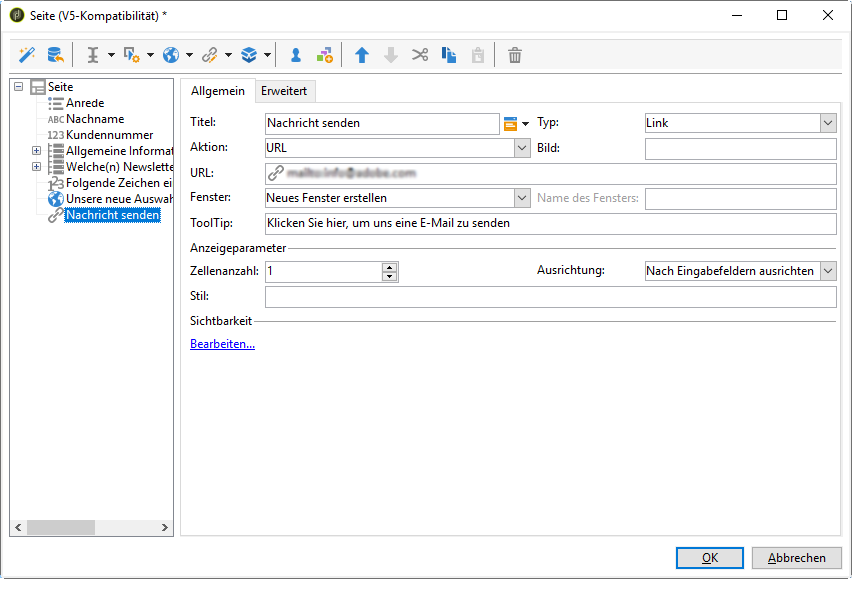</ph></source>
<target xml:lang="en-XX"><ph id="1" ctype="x-IMAGE"></ph></target>
</trans-unit>
<trans-unit id="tu29" xml:space="preserve">
<source xml:lang="en-US">The <ph id="1" ctype="x-STRONG_EMPHASIS">**[!UICONTROL </ph>Label<ph id="3" ctype="x-LINK_REF">]**</ph> is the content of the hypertext link as it will be displayed on the form page.</source>
<target xml:lang="en-XX">Im <ph id="1" ctype="x-STRONG_EMPHASIS">**[!UICONTROL </ph>Titel<ph id="3" ctype="x-LINK_REF">]**</ph> wird der Inhalt des Hypertext-Links so dargestellt, wie er auf der Formularseite erscheinen wird.</target>
</trans-unit>
<trans-unit id="tu30" xml:space="preserve">
<source xml:lang="en-US">The <ph id="1" ctype="x-STRONG_EMPHASIS">**[!UICONTROL </ph>URL<ph id="3" ctype="x-LINK_REF">]**</ph> is the desired address, e.g.: <ph id="5" ctype="x-LINK">&lbrack;</ph>https://www.adobe.com<ph id="6" ctype="x-LINK">[#$tu31]</ph> for a website, or <ph id="7" ctype="x-LINK">[</ph>info@adobe.com<ph id="8" ctype="x-LINK">](mailto:info@adobe.com)</ph> to send a message.</source>
<target xml:lang="en-XX">Die <ph id="1" ctype="x-STRONG_EMPHASIS">**[!UICONTROL </ph>URL<ph id="3" ctype="x-LINK_REF">]**</ph> ist die gewünschte Adresse, z. B.: <ph id="5" ctype="x-LINK">&lbrack;</ph>https://www.adobe.com<ph id="6" ctype="x-LINK">[#$tu31]</ph> für eine Website oder <ph id="7" ctype="x-LINK">[</ph>info@adobe.com<ph id="8" ctype="x-LINK">](mailto:info@adobe.com)</ph>, um eine Nachricht zu senden.</target>
</trans-unit>
<trans-unit id="tu32" xml:space="preserve">
<source xml:lang="en-US">The <ph id="1" ctype="x-STRONG_EMPHASIS">**[!UICONTROL </ph>Window<ph id="3" ctype="x-LINK_REF">]**</ph> field lets you select the display mode for the link in the case of a site. You can decide to open the link in a new window, the current window, or another window.</source>
<target xml:lang="en-XX">Im Feld <ph id="1" ctype="x-STRONG_EMPHASIS">**[!UICONTROL </ph>Fenster<ph id="3" ctype="x-LINK_REF">]**</ph> können Sie im Fall einer Website einen Anzeigemodus für den Link auswählen. Sie können den Link in einem neuen Fenster, dem aktuellen Fenster oder einem anderen Fenster öffnen.</target>
</trans-unit>
<trans-unit id="tu33" xml:space="preserve">
<source xml:lang="en-US">You can add a ToolTip, as shown below:</source>
<target xml:lang="en-XX">Sie können eine QuickInfo wie unten gezeigt hinzufügen:</target>
</trans-unit>
<trans-unit id="tu34" xml:space="preserve">
<source xml:lang="en-US"><ph id="1" ctype="x-IMAGE">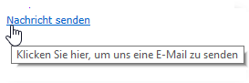</ph></source>
<target xml:lang="en-XX"><ph id="1" ctype="x-IMAGE"></ph></target>
</trans-unit>
<trans-unit id="tu35" xml:space="preserve">
<source xml:lang="en-US">You can choose to display the link as a button or an image. To do this, select the type of display in the <ph id="1" ctype="x-STRONG_EMPHASIS">**[!UICONTROL </ph>Type<ph id="3" ctype="x-LINK_REF">]**</ph> field.</source>
<target xml:lang="en-XX">Der Link kann als Schaltfläche oder Bild dargestellt werden. Wählen Sie dazu im Feld <ph id="1" ctype="x-STRONG_EMPHASIS">**[!UICONTROL </ph>Typ<ph id="3" ctype="x-LINK_REF">]**</ph> den Typ der Anzeige aus.</target>
</trans-unit>
<trans-unit id="tu36" xml:space="preserve">
<source xml:lang="en-US">Types of links</source>
<target xml:lang="en-XX">Link-Typen</target>
</trans-unit>
<trans-unit id="tu37" xml:space="preserve">
<source xml:lang="en-US">By default, the links are associated with a URL-type action, so that a link destination address can be entered in the URL field.</source>
<target xml:lang="en-XX">Standardmäßig sind Links mit einer Aktion vom Typ "URL" verknüpft, sodass eine URL-Zieladresse im URL-Feld eingegeben werden kann.</target>
</trans-unit>
<trans-unit id="tu38" xml:space="preserve">
<source xml:lang="en-US"><ph id="1" ctype="x-IMAGE">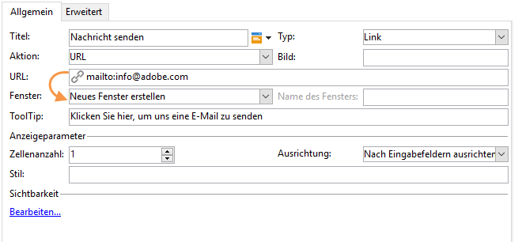</ph></source>
<target xml:lang="en-XX"><ph id="1" ctype="x-IMAGE"></ph></target>
</trans-unit>
<trans-unit id="tu39" xml:space="preserve">
<source xml:lang="en-US">You can define other actions for the link, so that the user can click the link to do the following:</source>
<target xml:lang="en-XX">Sie können auch andere Aktionen für den Link definieren, sodass der Benutzer durch Anklicken des Links folgende Aktionen ausführen kann:</target>
</trans-unit>
<trans-unit id="tu40" xml:space="preserve">
<source xml:lang="en-US">Refresh the page</source>
<target xml:lang="en-XX">Die Seite aktualisieren</target>
</trans-unit>
<trans-unit id="tu41" xml:space="preserve">
<source xml:lang="en-US">To do this, select the <ph id="1" ctype="x-STRONG_EMPHASIS">**[!UICONTROL </ph>Refresh page<ph id="3" ctype="x-LINK_REF">]**</ph> option in the drop-down box of the <ph id="5" ctype="x-STRONG_EMPHASIS">**[!UICONTROL </ph>Action<ph id="7" ctype="x-LINK_REF">]**</ph> field.</source>
<target xml:lang="en-XX">Wählen Sie dazu im Dropdown-Fenster des Felds <ph id="5" ctype="x-STRONG_EMPHASIS">**[!UICONTROL </ph>Aktion<ph id="7" ctype="x-LINK_REF">]**</ph> die Option <ph id="1" ctype="x-STRONG_EMPHASIS">**[!UICONTROL </ph>Seite aktualisieren<ph id="3" ctype="x-LINK_REF">]**</ph> aus.</target>
</trans-unit>
<trans-unit id="tu42" xml:space="preserve">
<source xml:lang="en-US"><ph id="1" ctype="x-IMAGE">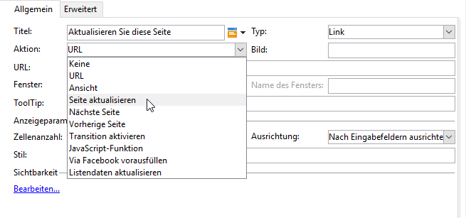</ph></source>
<target xml:lang="en-XX"><ph id="1" ctype="x-IMAGE"></ph></target>
</trans-unit>
<trans-unit id="tu43" xml:space="preserve">
<source xml:lang="en-US">Display the next/previous page</source>
<target xml:lang="en-XX">Die nächste/vorherige Seite anzeigen</target>
</trans-unit>
<trans-unit id="tu44" xml:space="preserve">
<source xml:lang="en-US">To do this, select the <ph id="1" ctype="x-STRONG_EMPHASIS">**[!UICONTROL </ph>Next page<ph id="3" ctype="x-LINK_REF">]**</ph> or <ph id="5" ctype="x-STRONG_EMPHASIS">**[!UICONTROL </ph>Previous page<ph id="7" ctype="x-LINK_REF">]**</ph> option in the drop-down box of the <ph id="9" ctype="x-STRONG_EMPHASIS">**[!UICONTROL </ph>Action<ph id="11" ctype="x-LINK_REF">]**</ph> field.</source>
<target xml:lang="en-XX">Wählen Sie dazu im Dropdown-Fenster des Felds <ph id="9" ctype="x-STRONG_EMPHASIS">**[!UICONTROL </ph>Aktion<ph id="11" ctype="x-LINK_REF">]**</ph> die Option <ph id="1" ctype="x-STRONG_EMPHASIS">**[!UICONTROL </ph>Nächste Seite<ph id="3" ctype="x-LINK_REF">]**</ph> oder <ph id="5" ctype="x-STRONG_EMPHASIS">**[!UICONTROL </ph>Vorherige Seite<ph id="7" ctype="x-LINK_REF">]**</ph> aus.</target>
</trans-unit>
<trans-unit id="tu45" xml:space="preserve">
<source xml:lang="en-US"><ph id="1" ctype="x-IMAGE">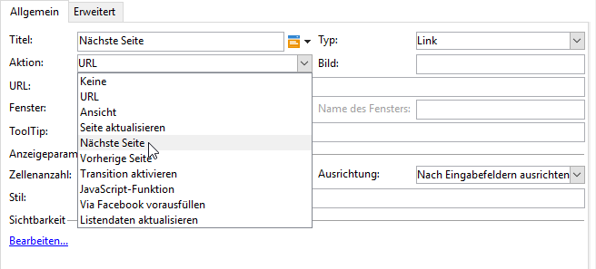</ph></source>
<target xml:lang="en-XX"><ph id="1" ctype="x-IMAGE"></ph></target>
</trans-unit>
<trans-unit id="tu46" xml:space="preserve">
<source xml:lang="en-US">You can hide the <ph id="1" ctype="x-STRONG_EMPHASIS">**[!UICONTROL </ph>Next<ph id="3" ctype="x-LINK_REF">]**</ph> and/or <ph id="5" ctype="x-STRONG_EMPHASIS">**[!UICONTROL </ph>Back<ph id="7" ctype="x-LINK_REF">]**</ph> buttons if they are to be replaced by a link. Refer to this <ph id="9" ctype="x-LINK">[</ph>page<ph id="10" ctype="x-LINK">](defining-web-forms-page-sequencing.md)</ph>.</source>
<target xml:lang="en-XX">Sie können die Schaltflächen <ph id="1" ctype="x-STRONG_EMPHASIS">**[!UICONTROL </ph>Weiter<ph id="3" ctype="x-LINK_REF">]**</ph> und/oder <ph id="5" ctype="x-STRONG_EMPHASIS">**[!UICONTROL </ph>Zurück<ph id="7" ctype="x-LINK_REF">]**</ph> verbergen, wenn diese durch einen Link ersetzt werden sollen. Mehr dazu erfahren Sie auf <ph id="9" ctype="x-LINK">[</ph>dieser Seite<ph id="10" ctype="x-LINK">](defining-web-forms-page-sequencing.md)</ph>.</target>
</trans-unit>
<trans-unit id="tu47" xml:space="preserve">
<source xml:lang="en-US">The link will replace the <ph id="1" ctype="x-STRONG_EMPHASIS">**[!UICONTROL </ph>Next<ph id="3" ctype="x-LINK_REF">]**</ph> button used by default.</source>
<target xml:lang="en-XX">Der Link ersetzt die standardmäßig verwendete Schaltfläche <ph id="1" ctype="x-STRONG_EMPHASIS">**[!UICONTROL </ph>Weiter<ph id="3" ctype="x-LINK_REF">]**</ph>.</target>
</trans-unit>
<trans-unit id="tu48" xml:space="preserve">
<source xml:lang="en-US"><ph id="1" ctype="x-IMAGE">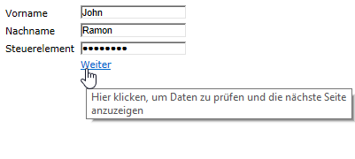</ph></source>
<target xml:lang="en-XX"><ph id="1" ctype="x-IMAGE"></ph></target>
</trans-unit>
<trans-unit id="tu49" xml:space="preserve">
<source xml:lang="en-US">Display another page</source>
<target xml:lang="en-XX">Eine weitere Seite anzeigen</target>
</trans-unit>
<trans-unit id="tu50" xml:space="preserve">
<source xml:lang="en-US">The <ph id="1" ctype="x-STRONG_EMPHASIS">**[!UICONTROL </ph>Enable a transition<ph id="3" ctype="x-LINK_REF">]**</ph> option lets you display a specific page associated with the outgoing transition selected in the <ph id="5" ctype="x-STRONG_EMPHASIS">**[!UICONTROL </ph>Transition<ph id="7" ctype="x-LINK_REF">]**</ph> field.</source>
<target xml:lang="en-XX">Mit der Option <ph id="1" ctype="x-STRONG_EMPHASIS">**[!UICONTROL </ph>Transition aktivieren<ph id="3" ctype="x-LINK_REF">]**</ph> können Sie eine bestimmte Seite anzeigen, die mit der im Feld <ph id="5" ctype="x-STRONG_EMPHASIS">**[!UICONTROL </ph>Transition<ph id="7" ctype="x-LINK_REF">]**</ph> ausgewählten ausgehenden Transition verknüpft ist.</target>
</trans-unit>
<trans-unit id="tu51" xml:space="preserve">
<source xml:lang="en-US"><ph id="1" ctype="x-IMAGE">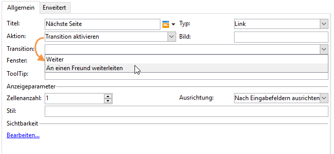</ph></source>
<target xml:lang="en-XX"><ph id="1" ctype="x-IMAGE"></ph></target>
</trans-unit>
<trans-unit id="tu52" xml:space="preserve">
<source xml:lang="en-US">By default, a page has only one output transition. To create new transitions, select the page and then click the <ph id="1" ctype="x-STRONG_EMPHASIS">**[!UICONTROL </ph>Add<ph id="3" ctype="x-LINK_REF">]**</ph> button in the <ph id="5" ctype="x-STRONG_EMPHASIS">**[!UICONTROL </ph>Output transitions<ph id="7" ctype="x-LINK_REF">]**</ph> section, as shown below:</source>
<target xml:lang="en-XX">Standardmäßig hat eine Seite nur eine ausgehende Transition. Um neue Transitionen zu erstellen, wählen Sie wie unten gezeigt die Seite und klicken Sie danach im Bereich <ph id="5" ctype="x-STRONG_EMPHASIS">**[!UICONTROL </ph>Ausgehende Transitionen<ph id="7" ctype="x-LINK_REF">]**</ph> auf die Schaltfläche <ph id="1" ctype="x-STRONG_EMPHASIS">**[!UICONTROL </ph>Hinzufügen<ph id="3" ctype="x-LINK_REF">]**</ph>:</target>
</trans-unit>
<trans-unit id="tu53" xml:space="preserve">
<source xml:lang="en-US"><ph id="1" ctype="x-IMAGE">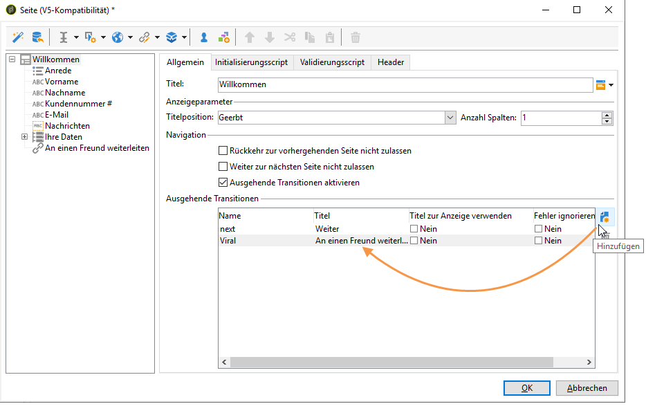</ph></source>
<target xml:lang="en-XX"><ph id="1" ctype="x-IMAGE"></ph></target>
</trans-unit>
<trans-unit id="tu54" xml:space="preserve">
<source xml:lang="en-US">In the diagram, this addition will look like this:</source>
<target xml:lang="en-XX">Im Diagramm sieht dies so aus:</target>
</trans-unit>
<trans-unit id="tu55" xml:space="preserve">
<source xml:lang="en-US"><ph id="1" ctype="x-IMAGE">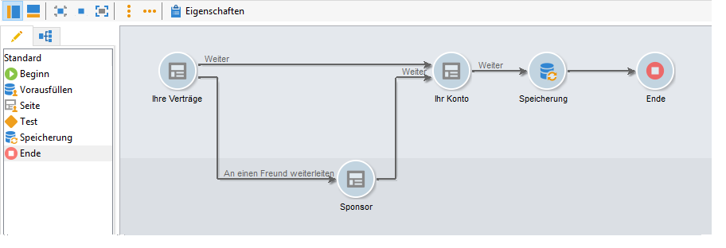</ph></source>
<target xml:lang="en-XX"><ph id="1" ctype="x-IMAGE"></ph></target>
</trans-unit>
<trans-unit id="tu56" xml:space="preserve">
<source xml:lang="en-US"><ph id="1" ctype="x-regxph" equiv-text="&lbrack;!NOTE">[!NOTE]</ph></source>
<target xml:lang="en-XX"><ph id="1" ctype="x-regxph" equiv-text="&lbrack;!NOTE">[!NOTE]</ph></target>
</trans-unit>
<trans-unit id="tu57" xml:space="preserve">
<source xml:lang="en-US">For more on page sequencing in a Web form, refer to <ph id="1" ctype="x-LINK">[</ph>Defining web forms page sequencing<ph id="2" ctype="x-LINK">](defining-web-forms-page-sequencing.md)</ph>.</source>
<target xml:lang="en-XX">Weitere Informationen zur Seitenreihenfolge in einem Webformular finden Sie unter <ph id="1" ctype="x-LINK">[</ph>Seitenreihenfolge eines Webformulars definieren<ph id="2" ctype="x-LINK">](defining-web-forms-page-sequencing.md)</ph>.</target>
</trans-unit>
<trans-unit id="tu58" xml:space="preserve">
<source xml:lang="en-US">Personalize HTML content</source>
<target xml:lang="en-XX">HTML-Inhalt personalisieren</target>
</trans-unit>
<trans-unit id="tu59" xml:space="preserve">
<source xml:lang="en-US">You can personalize the HTML content of a form page with data recorded in a previous page. For example, you can create a car insurance Web form whose first page lets you provide contact information and the brand of the car.</source>
<target xml:lang="en-XX">Sie können den HTML-Inhalt einer Formularseite mit Daten personalisieren, die auf einer vorherigen Seite aufgezeichnet wurden. So können Sie beispielsweise ein Web-Formular für eine Kfz-Versicherung erstellen, auf dessen erster Seite Sie die Möglichkeit haben, Kontaktinformationen und die Automarke einzugeben.</target>
</trans-unit>
<trans-unit id="tu60" xml:space="preserve">
<source xml:lang="en-US"><ph id="1" ctype="x-IMAGE">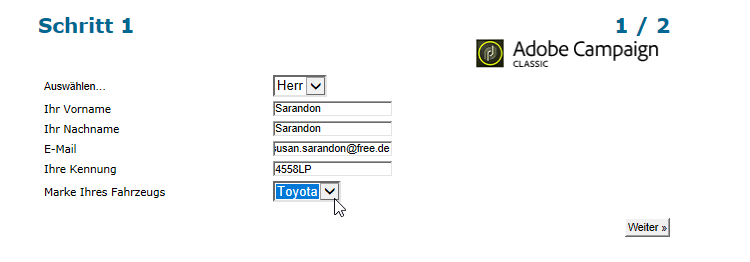</ph></source>
<target xml:lang="en-XX"><ph id="1" ctype="x-IMAGE"></ph></target>
</trans-unit>
<trans-unit id="tu61" xml:space="preserve">
<source xml:lang="en-US">Use personalization fields to re-inject the user name and selected brand into the next page. The syntax to use depends on the information storage mode. For more on this, refer to <ph id="1" ctype="x-LINK">[</ph>Using collected information<ph id="2" ctype="x-LINK">](web-forms-answers.md#using-collected-information)</ph>.</source>
<target xml:lang="en-XX">Mit Personalisierungsfeldern können Sie den Benutzernamen und die ausgewählte Marke nochmals auf der nächsten Seite einfügen. Die zu verwendende Syntax hängt vom Informationsspeichermodus ab. Weitere Informationen hierzu finden Sie unter <ph id="1" ctype="x-LINK">[</ph>Erfasste Informationen verwenden<ph id="2" ctype="x-LINK">](web-forms-answers.md#using-collected-information)</ph>.</target>
</trans-unit>
<trans-unit id="tu62" xml:space="preserve">
<source xml:lang="en-US"><ph id="1" ctype="x-regxph" equiv-text="&lbrack;!NOTE">[!NOTE]</ph></source>
<target xml:lang="en-XX"><ph id="1" ctype="x-regxph" equiv-text="&lbrack;!NOTE">[!NOTE]</ph></target>
</trans-unit>
<trans-unit id="tu63" xml:space="preserve">
<source xml:lang="en-US">For security reasons, the value entered in the <ph id="1" ctype="x-STRONG_EMPHASIS">**`&lt;%=`**</ph> formula is replaced with escaped characters.</source>
<target xml:lang="en-XX">Aus Sicherheitsgründen wird der in die Formel <ph id="1" ctype="x-STRONG_EMPHASIS">**`&lt;%=`**</ph> eingegebene Wert durch Maskierungszeichen ersetzt.</target>
</trans-unit>
<trans-unit id="tu64" xml:space="preserve">
<source xml:lang="en-US">In our example, the first and last name of the recipient are stored in a field of the database, while the brand of their car is stored in a variable. The syntax of the message personalized on page 2 will be as follows:</source>
<target xml:lang="en-XX">In unserem Beispiel werden der Vor- und Nachname der empfangenden Person in einem Feld der Datenbank gespeichert, während das Automodell in einer Variablen gespeichert wird. Die Syntax der auf Seite 2 personalisierten Nachricht sieht wie folgt aus:</target>
</trans-unit>
<trans-unit id="tu65" xml:space="preserve">
<source xml:lang="en-US"><ph id="1" ctype="x-IMAGE">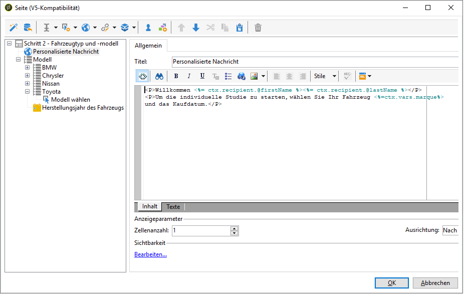</ph></source>
<target xml:lang="en-XX"><ph id="1" ctype="x-IMAGE"></ph></target>
</trans-unit>
<trans-unit id="tu66" xml:space="preserve">
<source xml:lang="en-US">This produces the following result:</source>
<target xml:lang="en-XX">Das Ergebnis sieht folgendermaßen aus:</target>
</trans-unit>
<trans-unit id="tu67" xml:space="preserve">
<source xml:lang="en-US"><ph id="1" ctype="x-IMAGE">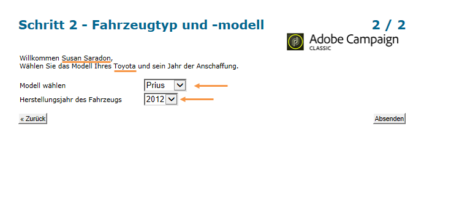</ph></source>
<target xml:lang="en-XX"><ph id="1" ctype="x-IMAGE"></ph></target>
</trans-unit>
<trans-unit id="tu68" xml:space="preserve">
<source xml:lang="en-US">Use text variables</source>
<target xml:lang="en-XX">Textvariablen verwenden</target>
</trans-unit>
<trans-unit id="tu69" xml:space="preserve">
<source xml:lang="en-US">The <ph id="1" ctype="x-STRONG_EMPHASIS">**[!UICONTROL </ph>Text<ph id="3" ctype="x-LINK_REF">]**</ph> tab lets you create variable fields which can be used in the HTML between the &lt;%= and %> characters with the following syntax: <ph id="5" ctype="x-STRONG_EMPHASIS">**</ph>$(IDENTIFIER)<ph id="6" ctype="x-STRONG_EMPHASIS">**</ph>.</source>
<target xml:lang="en-XX">Im Tab <ph id="1" ctype="x-STRONG_EMPHASIS">**[!UICONTROL </ph>Text<ph id="3" ctype="x-LINK_REF">]**</ph> können Sie Variablenfelder erstellen, die in HTML zwischen den Zeichen &lt;%= und %> mit der folgenden Syntax verwendet werden können: <ph id="5" ctype="x-STRONG_EMPHASIS">**</ph>$(IDENTIFIER)<ph id="6" ctype="x-STRONG_EMPHASIS">**</ph>.</target>
</trans-unit>
<trans-unit id="tu70" xml:space="preserve">
<source xml:lang="en-US">Use this method to easily have your strings localized. See <ph id="1" ctype="x-LINK">[</ph>Translating a web form<ph id="2" ctype="x-LINK">](translating-a-web-form.md)</ph></source>
<target xml:lang="en-XX">Verwenden Sie diese Methode zur einfachen Lokalisierung Ihrer Strings. Siehe <ph id="1" ctype="x-LINK">[</ph>Webformular übersetzen<ph id="2" ctype="x-LINK">](translating-a-web-form.md)</ph>.</target>
</trans-unit>
<trans-unit id="tu71" xml:space="preserve">
<source xml:lang="en-US">For example, you can create a <ph id="1" ctype="x-STRONG_EMPHASIS">**</ph>Contact<ph id="2" ctype="x-STRONG_EMPHASIS">**</ph> field that will enable you to display the "Date of last contact:" string to the HTML content. To do this, follow the steps below:</source>
<target xml:lang="en-XX">Sie können beispielsweise das Feld <ph id="1" ctype="x-STRONG_EMPHASIS">**</ph>Kontakt<ph id="2" ctype="x-STRONG_EMPHASIS">**</ph> erstellen. Damit haben Sie die Möglichkeit, den String „Datum des letzten Kontakts:“ im HTML-Inhalt anzuzeigen. Gehen Sie dazu wie folgt vor:</target>
</trans-unit>
<trans-unit id="tu72" xml:space="preserve">
<source xml:lang="en-US">Click on the <ph id="1" ctype="x-STRONG_EMPHASIS">**[!UICONTROL </ph>Text<ph id="3" ctype="x-LINK_REF">]**</ph> tab of the HTML text.</source>
<target xml:lang="en-XX">Wählen Sie den Tab <ph id="1" ctype="x-STRONG_EMPHASIS">**[!UICONTROL </ph>Text<ph id="3" ctype="x-LINK_REF">]**</ph> des HTML-Texts aus.</target>
</trans-unit>
<trans-unit id="tu73" xml:space="preserve">
<source xml:lang="en-US">Click the <ph id="1" ctype="x-STRONG_EMPHASIS">**[!UICONTROL </ph>Add<ph id="3" ctype="x-LINK_REF">]**</ph> icon.</source>
<target xml:lang="en-XX">Wählen Sie das Symbol <ph id="1" ctype="x-STRONG_EMPHASIS">**[!UICONTROL </ph>Hinzufügen<ph id="3" ctype="x-LINK_REF">]**</ph> aus.</target>
</trans-unit>
<trans-unit id="tu74" xml:space="preserve">
<source xml:lang="en-US">In the <ph id="1" ctype="x-STRONG_EMPHASIS">**[!UICONTROL </ph>Identifier<ph id="3" ctype="x-LINK_REF">]**</ph> column, enter the name of the variable</source>
<target xml:lang="en-XX">Geben Sie in der Spalte <ph id="1" ctype="x-STRONG_EMPHASIS">**[!UICONTROL </ph>Kennung<ph id="3" ctype="x-LINK_REF">]**</ph> den Namen der Variablen ein.</target>
</trans-unit>
<trans-unit id="tu75" xml:space="preserve">
<source xml:lang="en-US">In the <ph id="1" ctype="x-STRONG_EMPHASIS">**[!UICONTROL </ph>Text<ph id="3" ctype="x-LINK_REF">]**</ph> column, enter the default value.</source>
<target xml:lang="en-XX">Geben Sie in der Spalte <ph id="1" ctype="x-STRONG_EMPHASIS">**[!UICONTROL </ph>Text<ph id="3" ctype="x-LINK_REF">]**</ph> den Standardwert ein.</target>
</trans-unit>
<trans-unit id="tu76" xml:space="preserve">
<source xml:lang="en-US"><ph id="1" ctype="x-IMAGE">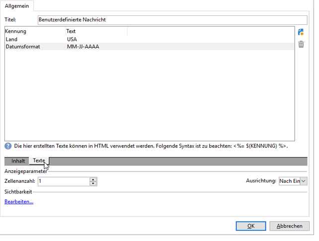</ph></source>
<target xml:lang="en-XX"><ph id="1" ctype="x-IMAGE"></ph></target>
</trans-unit>
<trans-unit id="tu77" xml:space="preserve">
<source xml:lang="en-US">In the HTML content, insert this text variable via the <ph id="1" ctype="x-STRONG_EMPHASIS">**</ph>&lt;%= $(Contact) %><ph id="2" ctype="x-STRONG_EMPHASIS">**</ph> syntax.</source>
<target xml:lang="en-XX">Geben Sie im HTML-Inhalt diese Textvariable mithilfe der Syntax <ph id="1" ctype="x-STRONG_EMPHASIS">**</ph>&lt;%= $(Contact) %><ph id="2" ctype="x-STRONG_EMPHASIS">**</ph> ein.</target>
</trans-unit>
<trans-unit id="tu78" xml:space="preserve">
<source xml:lang="en-US"><ph id="1" ctype="x-IMAGE">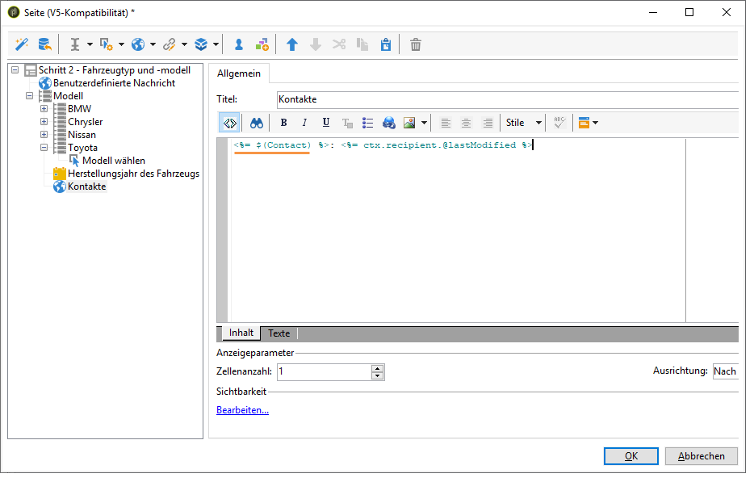</ph></source>
<target xml:lang="en-XX"><ph id="1" ctype="x-IMAGE"></ph></target>
</trans-unit>
<trans-unit id="tu79" xml:space="preserve">
<source xml:lang="en-US"><ph id="1" ctype="x-regxph" equiv-text="&lbrack;!CAUTION">[!CAUTION]</ph></source>
<target xml:lang="en-XX"><ph id="1" ctype="x-regxph" equiv-text="&lbrack;!CAUTION">[!CAUTION]</ph></target>
</trans-unit>
<trans-unit id="tu80" xml:space="preserve">
<source xml:lang="en-US">If you enter these characters in the HTML editor, the <ph id="1" ctype="x-STRONG_EMPHASIS">**</ph>&lt;<ph id="2" ctype="x-STRONG_EMPHASIS">**</ph> and <ph id="3" ctype="x-STRONG_EMPHASIS">**</ph>><ph id="4" ctype="x-STRONG_EMPHASIS">**</ph> fields will be replaced with their escaped characters. In this case, you need to correct the source code by clicking the <ph id="5" ctype="x-STRONG_EMPHASIS">**[!UICONTROL </ph>Display source code<ph id="7" ctype="x-LINK_REF">]**</ph> icon of the HTML text editor.</source>
<target xml:lang="en-XX">Wenn Sie diese Zeichen in den HTML-Editor eingeben, werden die Felder <ph id="1" ctype="x-STRONG_EMPHASIS">**</ph>&lt;<ph id="2" ctype="x-STRONG_EMPHASIS">**</ph> und <ph id="3" ctype="x-STRONG_EMPHASIS">**</ph><ph id="4" ctype="x-STRONG_EMPHASIS">**</ph> durch deren Maskierungszeichen ersetzt. In diesem Fall müssen Sie den Quellcode korrigieren, indem Sie auf das Symbol <ph id="5" ctype="x-STRONG_EMPHASIS">**[!UICONTROL </ph>Quellcode anzeigen<ph id="7" ctype="x-LINK_REF">]**</ph> des HTML-Texteditors klicken.</target>
</trans-unit>
<trans-unit id="tu81" xml:space="preserve">
<source xml:lang="en-US">Open the <ph id="1" ctype="x-STRONG_EMPHASIS">**[!UICONTROL </ph>Preview<ph id="3" ctype="x-LINK_REF">]**</ph> label of the form to view the value entered in the HTML:</source>
<target xml:lang="en-XX">Öffnen Sie den Titel <ph id="1" ctype="x-STRONG_EMPHASIS">**[!UICONTROL </ph>Vorschau<ph id="3" ctype="x-LINK_REF">]**</ph> des Formulars, um den in HTML eingegebenen Wert anzuzeigen:</target>
</trans-unit>
<trans-unit id="tu82" xml:space="preserve">
<source xml:lang="en-US"><ph id="1" ctype="x-IMAGE">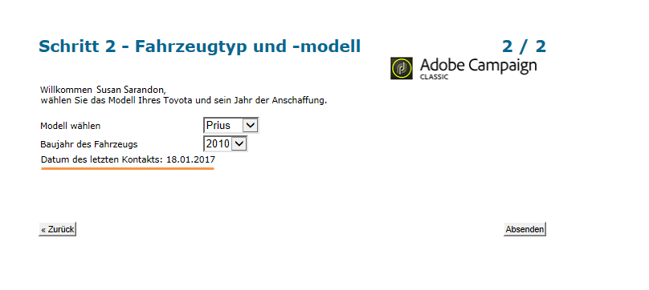</ph></source>
<target xml:lang="en-XX"><ph id="1" ctype="x-IMAGE"></ph></target>
</trans-unit>
<trans-unit id="tu83" xml:space="preserve">
<source xml:lang="en-US">This operating mode lets you define the text of Web forms only once, and manage translations using the integrated translation tool. For more on this, refer to <ph id="1" ctype="x-LINK">[</ph>Translating a web form<ph id="2" ctype="x-LINK">](translating-a-web-form.md)</ph>.</source>
<target xml:lang="en-XX">Mit diesem Verfahren können Sie den Text von Web-Formularen nur einmal festlegen und Übersetzungen mit dem integrierten Übersetzungs-Tool verwalten. Weitere Informationen finden Sie unter <ph id="1" ctype="x-LINK">[</ph>Web-Formular übersetzen<ph id="2" ctype="x-LINK">](translating-a-web-form.md)</ph>.</target>
</trans-unit>
<trans-unit id="tu84" xml:space="preserve">
<source xml:lang="en-US">Insert images</source>
<target xml:lang="en-XX">Bilder einfügen</target>
</trans-unit>
<trans-unit id="tu85" xml:space="preserve">
<source xml:lang="en-US">For images to be included in forms, they must be saved on a server that is accessible from outside.</source>
<target xml:lang="en-XX">Um in Formulare Bilder einzufügen, müssen diese auf einem Server gespeichert werden, auf den von außen zugegriffen werden kann.</target>
</trans-unit>
<trans-unit id="tu86" xml:space="preserve">
<source xml:lang="en-US">Select the <ph id="1" ctype="x-STRONG_EMPHASIS">**[!UICONTROL </ph>Static elements<ph id="3" ctype="x-LINK_REF">]**</ph> > <ph id="5" ctype="x-STRONG_EMPHASIS">**[!UICONTROL </ph>Image<ph id="7" ctype="x-LINK_REF">]**</ph> menu.</source>
<target xml:lang="en-XX">Wählen Sie das Menü <ph id="1" ctype="x-STRONG_EMPHASIS">**[!UICONTROL </ph>Statische Elemente<ph id="3" ctype="x-LINK_REF">]**</ph> > <ph id="5" ctype="x-STRONG_EMPHASIS">**[!UICONTROL </ph>Bild<ph id="7" ctype="x-LINK_REF">]**</ph> aus.</target>
</trans-unit>
<trans-unit id="tu87" xml:space="preserve">
<source xml:lang="en-US">Select the source of the image to be inserted: it can come from the public resource library or be stored on an external server accessible from outside.</source>
<target xml:lang="en-XX">Wählen Sie die Quelle des Bildes aus, das eingefügt werden soll: Es kann in einer öffentlichen Ressourcen-Bibliothek oder auf einem externen, von außen zugreifbaren Server gespeichert sein.</target>
</trans-unit>
<trans-unit id="tu88" xml:space="preserve">
<source xml:lang="en-US"><ph id="1" ctype="x-IMAGE">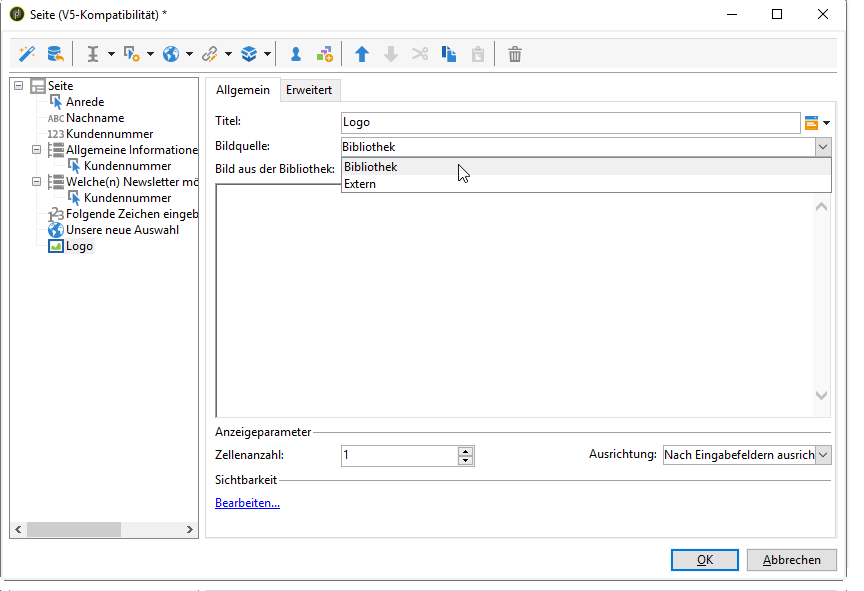</ph></source>
<target xml:lang="en-XX"><ph id="1" ctype="x-IMAGE"></ph></target>
</trans-unit>
<trans-unit id="tu89" xml:space="preserve">
<source xml:lang="en-US">If this is an image from the library, select it in the combo-box of the field; if it is located in an external file, enter the access path. The label will be displayed by passing the cursor over the image (coincides with an ALT field in HTML), or when the image isn't displayed.</source>
<target xml:lang="en-XX">Wenn das Bild aus einer Bibliothek stammt, wählen Sie es in der Dropdown-Liste des Felds aus. Wenn es in einer externen Datei gespeichert ist, geben Sie den Zugriffspfad ein. Der Titel wird angezeigt, wenn Sie den Cursor über das Bild bewegen (entspricht einem ALT-Feld in HTML) oder wenn das Bild nicht dargestellt wird.</target>
</trans-unit>
<trans-unit id="tu90" xml:space="preserve">
<source xml:lang="en-US">The image can be viewed in the central section of the editor.</source>
<target xml:lang="en-XX">Das Bild kann im mittleren Bereich des Editors angezeigt werden.</target>
</trans-unit>
</body>
</file>
</xliff>