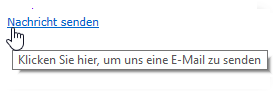

# Statische Elemente in einem Webformular{#static-elements-in-a-web-form}

Sie können Elemente einfügen, mit denen der Benutzer auf den Formularseiten nicht interagiert. Hierzu zählen statische Elemente wie Bilder, HTML-Inhalte, ein horizontaler Balken oder ein Hypertext-Link. Diese Elemente werden über die erste Schaltfläche der Symbolleiste durch Anklicken des Menüs **[!UICONTROL Add static element]** erstellt.


Folgende Feldtypen sind verfügbar:

* Wert auf der Basis der zuvor eingegebenen Antworten (im Kontext des Formulars) oder der Datenbank.
* Hypertext-Link, HTML, horizontaler Balken. Siehe [HTML-Inhalt einfügen](#inserting-html-content).
* Bild, das in der Ressourcenbibliothek oder auf einem für Benutzer zugänglichen Server gespeichert ist. Siehe [Bilder einfügen](#inserting-images).
* Skript, das Client- und/oder Server-seitig ausgeführt wird. Es muss in JavaScript verfasst und mit den gängigen Browsern kompatibel sein, um die korrekte Ausführung beim Client zu gewährleisten.

   >[!NOTE]
   >
   >Auf der Serverseite kann das Skript die in der [Campaign JSAPI-Dokumentation](https://docs.adobe.com/content/help/en/campaign-classic/technicalresources/api/index.html) definierten Funktionen verwenden.

## HTML-Inhalt einfügen {#inserting-html-content}

Sie können in eine Formularseite HTML-Inhalte einfügen, wie z. B. Hypertext-Links, Bilder, formatierte Absätze, Videos oder Flash-Objekte.

Einfügen können Sie die Inhalte mit dem HTML-Editor. Um den Editor zu öffnen, gehen Sie zu **[!UICONTROL Statische Elemente > HTML]** .

Sie können Inhalte direkt eingeben und formatieren oder das Fenster mit dem Quellcode öffnen, um externen Code einzukopieren. Wählen Sie dazu das erste Symbol in der Symbolleiste aus, um zum Quellcode-Modus zu wechseln.


Um ein Datenbankfeld einzufügen, verwenden Sie die Personalisierungs-Schaltfläche.


>[!NOTE]
>
>Die im HTML-Editor eingegebenen Strings werden nur übersetzt, wenn sie im Unter-Tab **[!UICONTROL Texte]** definiert sind. Ansonsten werden sie nicht erfasst. Weitere Informationen finden Sie unter [Webformular übersetzen](../../web/using/translating-a-web-form.md).

### Link einfügen {#inserting-a-link}

Füllen Sie im Bearbeitungsfenster die Felder wie im folgenden Beispiel gezeigt aus:

Um einen Hypertext-Link hinzuzufügen, gehen Sie zu **[!UICONTROL Statische Elemente > Link]**.


* Im **[!UICONTROL Titel]** wird der Inhalt des Hypertext-Links so dargestellt, wie er auf der Formularseite erscheinen wird.
* Die **[!UICONTROL URL]** ist die gewünschte Adresse, z. B.: [https://www.adobe.com](https://www.adobe.com) für eine Website oder [info@adobe.com](mailto:info@adobe.com), um eine Nachricht zu senden.
* Im Feld **[!UICONTROL Fenster]** können Sie im Fall einer Website einen Anzeigemodus für den Link auswählen. Sie können den Link in einem neuen Fenster, dem aktuellen Fenster oder einem anderen Fenster öffnen.
* Sie können einen ToolTip wie unten gezeigt hinzufügen:

   

* Der Link kann als Schaltfläche oder Bild dargestellt werden. Wählen Sie dazu im Feld **[!UICONTROL Typ]** den Typ der Anzeige aus.

### Link-Typen {#types-of-links}

Standardmäßig sind Links mit einer Aktion vom Typ &quot;URL&quot; verknüpft, sodass eine URL-Zieladresse im URL-Feld eingegeben werden kann.


Sie können auch andere Aktionen für den Link definieren, sodass der Benutzer durch Anklicken des Links folgende Aktionen ausführen kann:

* Die Seite aktualisieren

   Wählen Sie dazu im Dropdown-Fenster des Felds **[!UICONTROL Aktion]** die Option **[!UICONTROL Seite aktualisieren]** aus.

   

* Die nächste/vorherige Seite anzeigen

   Wählen Sie dazu im Dropdown-Fenster des Felds **[!UICONTROL Aktion]** die Option **[!UICONTROL Nächste Seite]** oder **[!UICONTROL Vorherige Seite]** aus.

   

   Sie können die Schaltflächen **[!UICONTROL Weiter]** und/oder **[!UICONTROL Zurück]** verbergen, wenn diese durch einen Link ersetzt werden sollen. Weiterführende Informationen dazu finden Sie auf dieser [Seite](../../web/using/defining-web-forms-page-sequencing.md).

   Der Link ersetzt die standardmäßig verwendete Schaltfläche **[!UICONTROL Weiter]**.

   

* Eine weitere Seite anzeigen

   Mit der Option **[!UICONTROL Transition aktivieren]** können Sie eine bestimmte Seite anzeigen, die mit der im Feld **[!UICONTROL Transition]** ausgewählten ausgehenden Transition verknüpft ist.

   

   Standardmäßig hat eine Seite nur eine einzige ausgehende Transition. Um neue Transitionen zu erstellen, wählen Sie wie unten gezeigt die Seite und danach im Bereich **[!UICONTROL Ausgehende Transitionen]** die Schaltfläche **[!UICONTROL Hinzufügen]** aus:

   

   Im Diagramm sieht dies so aus:

   

   >[!NOTE]
   >
   >Weitere Informationen zur Seitenreihenfolge in einem Webformular finden Sie unter [Seitenreihenfolge eines Webformulars definieren](../../web/using/defining-web-forms-page-sequencing.md).

* Füllen Sie die Formularfelder vorab mit Daten aus dem Facebook-Profil aus.

   >[!CAUTION]
   >
   >Diese Funktion ist nur verfügbar, wenn Sie die Anwendung **[!UICONTROL Social Marketing]** installiert haben. Um diese Option verwenden zu können, müssen Sie eine Facebook-Anwendung sowie ein externes Konto vom Typ **[!UICONTROL Facebook Connect]** erstellen. Weiterführende Informationen dazu finden Sie auf [dieser Seite](../../social/using/creating-a-facebook-application.md#configuring-external-accounts).

   Die Option **[!UICONTROL Via Facebook vorausfüllen]** ermöglicht Ihnen das Einfügen einer Schaltfläche in ein Formular, um Felder mit Informationen aus dem Facebook-Profil vorauszufüllen.

   

   Wenn ein Benutzer die Schaltfläche **[!UICONTROL Automatisch ausfüllen]** auswählt, öffnet sich das Facebook-Fenster mit einer Anfrage zur Genehmigung.

   

   >[!NOTE]
   >
   >Sie können die Liste erweiterter Berechtigungen bei der Konfiguration des externen Kontos ändern. Wenn Sie keine erweiterten Berechtigungen eingeben, leitet Facebook automatisch die allgemeinen Profilinformationen weiter.\
   >Wenn Sie die Liste der erweiterten Berechtigungen und deren Syntax ansehen möchten, klicken Sie hier: [https://developers.facebook.com/docs/reference/api/permissions/](https://developers.facebook.com/docs/reference/api/permissions/)

   Wenn der Benutzer damit einverstanden ist, seine Informationen zu teilen, werden die Felder des Formulars vorausgefüllt.

   

Für dieses Anwendungsbeispiel wird eine Webanwendung erstellt, die die folgenden Elemente enthält:

* Eine Seite mit dem Formular
* Die Aktivität **[!UICONTROL Speicherung]**
* Die Aktivität **[!UICONTROL Ende]**


Gehen Sie wie folgt vor, um eine Schaltfläche zum Vorausfüllen hinzuzufügen:

1. Erstellen Sie ein Formular.

   

1. Gehen Sie auf die Ebene der Formularfelder und fügen Sie einen Link hinzu.

   

1. Geben Sie den Titel ein und wählen Sie den Typ **[!UICONTROL Schaltfläche]** aus.

   

1. Gehen Sie zum Feld **[!UICONTROL Aktion]** und wählen Sie **[!UICONTROL Via Facebook vorausfüllen]** aus.

   

1. Gehen Sie zum Feld **[!UICONTROL Anwendung]** und wählen Sie das zuvor erstellte externe Konto vom Typ **[!UICONTROL Facebook Connect]** aus. Weiterführende Informationen dazu finden Sie auf [dieser Seite](../../social/using/creating-a-facebook-application.md#configuring-external-accounts).

   

### HTML-Inhalt personalisieren {#personalizing-html-content}

Sie können den HTML-Inhalt einer Formularseite mit auf einer vorherigen Seite erfassten Daten personalisieren. So können Sie beispielsweise ein Webformular für eine Kfz-Versicherung erstellen, auf deren erster Seite Sie die Möglichkeit bieten, Kontaktinformationen und die Automarke einzugeben.


Mit Personalisierungsfeldern können Sie den Benutzernamen und die ausgewählte Marke nochmals auf der nächsten Seite einfügen. Die zu verwendende Syntax hängt vom Speichermodus der Informationen ab. Weitere Informationen hierzu finden Sie unter [Erfasste Informationen verwenden](../../web/using/web-forms-answers.md#using-collected-information).

>[!NOTE]
>
>Aus Sicherheitsgründen wird der in der Formel **`<%=`** eingegebene Wert durch Escape-Zeichen ersetzt. Um dies zu verhindern, können Sie bei Bedarf die folgende Syntax verwenden: **`<%=`**.

In unserem Beispiel werden der Vor- und Nachname des Empfängers in einem Feld der Datenbank gespeichert, während das Automodell in einer Variablen gespeichert wird. Die Syntax der personalisierten Nachricht auf Seite 2 sieht folgendermaßen aus:


```
<P>Welcome <%= ctx.recipient.@firstName %> <%= ctx.recipient.@lastName %>,</P>
<P>To start your customized study, please select your car <%=ctx.vars.marque%> and its year of purchase.</P>
```

Das Ergebnis sieht folgendermaßen aus:


### Textvariablen verwenden {#using-text-variables}

Im Tab **[!UICONTROL Text]** können Sie Variablenfelder erstellen, die in HTML zwischen den Zeichen &lt;%= und %> mit der folgenden Syntax verwendet werden können: **$(IDENTIFIER)**.

Verwenden Sie diese Methode zur einfachen Lokalisierung Ihrer Strings. Siehe [Webformular übersetzen](../../web/using/translating-a-web-form.md).

Sie können beispielsweise das Feld **Kontakt** erstellen. Damit haben Sie die Möglichkeit, den String „Datum des letzten Kontakts:“ im HTML-Inhalt anzuzeigen. Gehen Sie dazu wie folgt vor:

1. Wählen Sie den Tab **[!UICONTROL Text]** des HTML-Texts aus.
1. Wählen Sie das Symbol **[!UICONTROL Hinzufügen]** aus.
1. Geben Sie in der Spalte **[!UICONTROL Kennung]** den Namen der Variablen ein.
1. Geben Sie in der Spalte **[!UICONTROL Text]** den Standardwert ein.

   

1. Geben Sie im HTML-Inhalt diese Textvariable mithilfe der Syntax **&lt;%= $(Contact) %>** ein.

   

   >[!CAUTION]
   >
   >Wenn Sie diese Zeichen in den HTML-Editor eingeben, werden die Felder **&lt;** und **>** durch ihre Escape-Zeichen ersetzt. In diesem Fall müssen Sie den Quellcode durch Auswahl des Symbols **[!UICONTROL Quellcode anzeigen]** im HTML-Texteditor korrigieren.

1. Öffnen Sie den Titel **[!UICONTROL Vorschau]** des Formulars, um den in HTML eingegebenen Wert anzuzeigen:

   

Mit diesem Verfahren können Sie den Text von Webformularen aufgliedern und Übersetzungen mit dem integrierten Übersetzungs-Tool durchführen. Weitere Informationen finden Sie unter [Webformular übersetzen](../../web/using/translating-a-web-form.md).

## Bilder einfügen {#inserting-images}

Um in Formulare Bilder einzufügen, müssen diese auf einem Server gespeichert werden, auf den von außen zugegriffen werden kann.

Wählen Sie das Menü **[!UICONTROL Statische Elemente > Bild]** aus.

Wählen Sie die Quelle des Bildes aus, das eingefügt werden soll: Es kann in einer öffentlichen Ressourcen-Bibliothek oder auf einem externen, von außen zugreifbaren Server gespeichert sein.


Wenn das Bild aus einer Bibliothek stammt, wählen Sie es in der Dropdown-Liste des Felds aus. Wenn es in einer externen Datei gespeichert ist, geben Sie den Zugriffspfad ein. Der Titel wird angezeigt, wenn Sie den Cursor über das Bild bewegen (entspricht einem ALT-Feld in HTML) oder wenn das Bild nicht dargestellt wird.

Das Bild kann im mittleren Bereich des Editors angezeigt werden.
