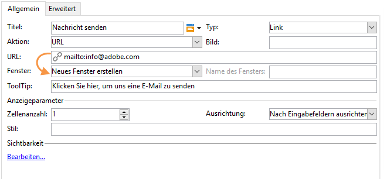
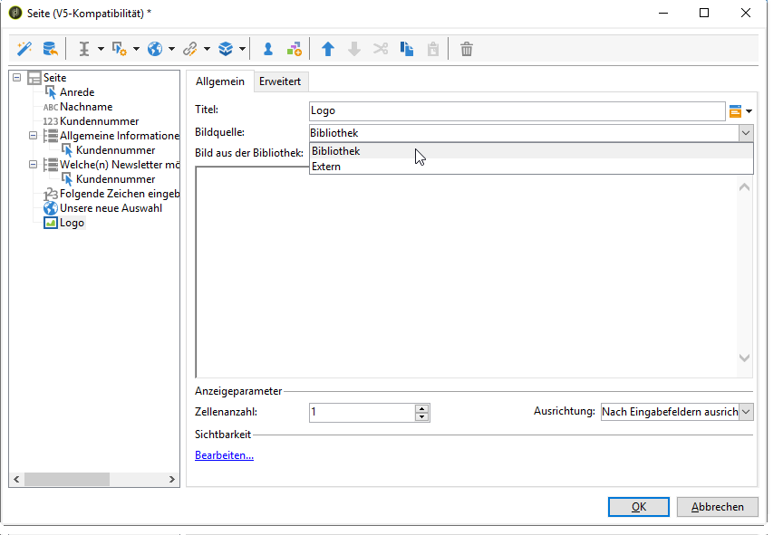

# Statische Elemente in einem Webformular{#static-elements-in-a-web-form}

Sie können Elemente einschließen, mit denen der Benutzer keine Interaktion auf den Seiten des Formulars hat; Dies sind statische Elemente wie Bilder, HTML-Inhalt, eine horizontale Leiste oder ein Hyperlink. Diese Elemente werden über die erste Schaltfläche in der Symbolleiste durch Klicken auf das **[!UICONTROL Add static element]** Menü erstellt.


Folgende Feldtypen sind verfügbar:

* Wert auf der Basis der zuvor eingegebenen Antworten (im Kontext des Formulars) oder der Datenbank.
* Hyperlink, HTML, horizontale Leiste Siehe [Einfügen von HTML-Inhalten](#inserting-html-content).
* Bild, das in der Ressourcenbibliothek oder auf einem für Benutzer zugänglichen Server gespeichert wird. Siehe [Bilder einfügen](#inserting-images).
* Skript, das Client- und/oder Server-seitig ausgeführt wird. Es muss in JavaScript verfasst und mit den gängigen Browsern kompatibel sein, um die korrekte Ausführung beim Client zu gewährleisten.

   >[!NOTE]
   >
   >Auf der Serverseite kann das Skript die in der [Campaign JSAPI-Dokumentation](http://docs.campaign.adobe.com/doc/AC/en/jsapi/index.html) definierten Funktionen verwenden.

## HTML-Inhalt einfügen {#inserting-html-content}

Sie können in eine Formularseite HTML-Inhalte einfügen, wie z. B. Hypertext-Links, Bilder, formatierte Absätze, Videos oder Flash-Objekte.

The HTML editor lets you enter the content to insert into the form page. To open the editor, go to **[!UICONTROL Static elements>HTML]** .

Sie können Inhalte direkt eingeben und formatieren oder das Fenster mit dem Quellcode öffnen, um externen Code einzukopieren. Wählen Sie dazu das erste Symbol in der Symbolleiste aus, um zum Quellcode-Modus zu wechseln.


Um ein Datenbankfeld einzufügen, verwenden Sie die Personalisierungs-Schaltfläche.


>[!NOTE]
>
>Die im HTML-Editor eingegebenen Zeichenfolgen werden nur dann übersetzt, wenn sie in der **[!UICONTROL Texts]** Unterregisterkarte definiert sind. Andernfalls werden sie nicht erfasst. Weitere Informationen finden Sie unter [Übersetzen eines Webformulars](../../web/using/translating-a-web-form.md).

### Link einfügen {#inserting-a-link}

Füllen Sie im Bearbeitungsfenster die Felder wie im folgenden Beispiel gezeigt aus:

Um einen Hyperlink hinzuzufügen, gehen Sie zu **[!UICONTROL Static elements>Link]**.


* The **[!UICONTROL Label]** is the content of the hypertext link as it will be displayed on the form page.
* The **[!UICONTROL URL]** is the desired address, e.g.: [https://www.adobe.com](https://www.adobe.com) for a website, or [info@adobe.com](mailto:info@adobe.com) to send a message.
* Im **[!UICONTROL Window]** Feld können Sie den Anzeigemodus für den Link im Fall einer Site auswählen. Sie können den Link in einem neuen Fenster, im aktuellen Fenster oder in einem anderen Fenster öffnen.
* Sie können einen ToolTip wie unten gezeigt hinzufügen:

   

* Sie können den Link als Schaltfläche oder Bild anzeigen. Wählen Sie dazu den Anzeigetyp im **[!UICONTROL Type]** Feld aus.

### Link-Typen {#types-of-links}

Standardmäßig sind Links mit einer Aktion vom Typ &quot;URL&quot; verknüpft, sodass eine URL-Zieladresse im URL-Feld eingegeben werden kann.



Sie können auch andere Aktionen für den Link definieren, sodass der Benutzer durch Anklicken des Links folgende Aktionen ausführen kann:

* Die Seite aktualisieren

   To do this, select the **[!UICONTROL Refresh page]** option in the drop-down box of the **[!UICONTROL Action]** field.

   

* Die nächste/vorherige Seite anzeigen

   To do this, select the **[!UICONTROL Next page]** or **[!UICONTROL Previous page]** option in the drop-down box of the **[!UICONTROL Action]** field.

   

   Sie können die Schaltflächen **[!UICONTROL Next]** und/oder **[!UICONTROL Back]** ausblenden, wenn sie durch einen Link ersetzt werden sollen. Mehr dazu erfahren Sie auf [dieser Seite](../../web/using/defining-web-forms-page-sequencing.md).

   The link will replace the **[!UICONTROL Next]** button used by default.

   

* Eine weitere Seite anzeigen

   The **[!UICONTROL Enable a transition]** option lets you display a specific page associated with the outgoing transition selected in the **[!UICONTROL Transition]** field.

   

   Standardmäßig hat eine Seite nur einen Ausgabeübergang. Um neue Übergänge zu erstellen, wählen Sie die Seite aus und klicken Sie dann auf die **[!UICONTROL Add]** Schaltfläche im **[!UICONTROL Output transitions]** Abschnitt, wie unten dargestellt:

   

   Im Diagramm sieht dies so aus:

   

   >[!NOTE]
   >
   >Weitere Informationen zur Seitensequenzierung in einem Webformular finden Sie unter [Definieren der Seitensequenzierung](../../web/using/defining-web-forms-page-sequencing.md)für Webformulare.

* Füllen Sie die Formularfelder vorab mit Daten aus dem Facebook-Profil aus.

   >[!CAUTION]
   >
   >Diese Funktion ist nur verfügbar, wenn Sie die **[!UICONTROL Social Marketing]** Anwendung installiert haben. Um diese Option zu verwenden, müssen Sie eine Facebook-Anwendung zusammen mit einem externen **[!UICONTROL Facebook Connect]** Konto erstellen. Weiterführende Informationen hierzu finden Sie auf dieser [Seite](../../social/using/creating-a-facebook-application.md#configuring-external-accounts).

   The **[!UICONTROL Preload with Facebook]** option lets you insert a button into a form to preload fields using Facebook profile information.

   

   When a user clicks the **[!UICONTROL Fill in automatically]** button, the Facebook request for permission window opens.

   

   >[!NOTE]
   >
   >Sie können die Liste erweiterter Berechtigungen bei der Konfiguration des externen Kontos ändern. Wenn Sie keine erweiterten Berechtigungen eingeben, leitet Facebook automatisch die allgemeinen Profilinformationen weiter.\
   >Wenn Sie die Liste der erweiterten Berechtigungen und deren Syntax ansehen möchten, klicken Sie hier: [https://developers.facebook.com/docs/reference/api/permissions/](https://developers.facebook.com/docs/reference/api/permissions/)

   Wenn der Benutzer damit einverstanden ist, seine Informationen zu teilen, werden die Felder des Formulars vorausgefüllt.

   

Für dieses Anwendungsbeispiel wird eine Webanwendung erstellt, die die folgenden Elemente enthält:

* Eine Seite mit dem Formular
* eine **[!UICONTROL Record]** Aktivität
* eine **[!UICONTROL End]** Aktivität


Gehen Sie wie folgt vor, um eine Schaltfläche zum Vorausfüllen hinzuzufügen:

1. Erstellen Sie ein Formular.

   

1. Gehen Sie auf die Ebene der Formularfelder und fügen Sie einen Link hinzu.

   

1. Enter the label and select the **[!UICONTROL Button]** type.

   

1. Gehen Sie zum **[!UICONTROL Action]** Feld und wählen Sie **[!UICONTROL Preload with Facebook]**.

   

1. Wechseln Sie zum **[!UICONTROL Application]** Feld und wählen Sie den zuvor erstellten **[!UICONTROL Facebook Connect]** Typ Externes Konto aus. Weiterführende Informationen hierzu finden Sie auf dieser [Seite](../../social/using/creating-a-facebook-application.md#configuring-external-accounts).

   

### HTML-Inhalt personalisieren {#personalizing-html-content}

Sie können den HTML-Inhalt einer Formularseite mit auf einer vorherigen Seite erfassten Daten personalisieren. So können Sie beispielsweise ein Webformular für eine Kfz-Versicherung erstellen, auf deren erster Seite Sie die Möglichkeit bieten, Kontaktinformationen und die Automarke einzugeben.


Verwenden Sie Personalisierungsfelder, um den Benutzernamen und die ausgewählte Marke erneut in die nächste Seite einzufügen. Die zu verwendende Syntax hängt vom Informationsspeichermodus ab. Weitere Informationen finden Sie unter [Verwenden erfasster Informationen](../../web/using/web-forms-answers.md#using-collected-information).

>[!NOTE]
>
>For security reasons, the value entered in the **`<%=`** formula is replaced with escape characters. To avoid this, and only when necessary, use the following syntax: **`<%=`**.

In unserem Beispiel werden der Vor- und Nachname des Empfängers in einem Feld der Datenbank gespeichert, während das Automodell in einer Variablen gespeichert wird. Die Syntax der personalisierten Nachricht auf Seite 2 sieht folgendermaßen aus:


```
<P>Welcome <%= ctx.recipient.@firstName %> <%= ctx.recipient.@lastName %>,</P>
<P>To start your customized study, please select your car <%=ctx.vars.marque%> and its year of purchase.</P>
```

Das Ergebnis sieht folgendermaßen aus:


### Textvariablen verwenden {#using-text-variables}

Im Tab **[!UICONTROL Text]** können Sie Variablenfelder erstellen, die in HTML zwischen den Zeichen &lt;%= und %> mit der folgenden Syntax verwendet werden können: **$(IDENTIFIER)**.

Verwenden Sie diese Methode, um Ihre Zeichenfolgen einfach zu lokalisieren. See [Translating a web form](../../web/using/translating-a-web-form.md)

For example, you can create a **Contact** field that will enable you to display the &quot;Date of last contact:&quot; string to the HTML content. Gehen Sie dazu wie folgt vor:

1. Wählen Sie den Tab **[!UICONTROL Text]** des HTML-Texts aus.
1. Click the **[!UICONTROL Add]** icon.
1. In the **[!UICONTROL Identifier]** column, enter the name of the variable
1. Geben Sie in der Spalte **[!UICONTROL Text]** den Standardwert ein.

   

1. Geben Sie im HTML-Inhalt diese Textvariable mithilfe der Syntax **&lt;%= $(Contact) %>** ein.

   

   >[!CAUTION]
   >
   >Wenn Sie diese Zeichen im HTML-Editor eingeben, werden die Felder **&lt;** und **>** durch Escape-Zeichen ersetzt. In diesem Fall müssen Sie den Quellcode korrigieren, indem Sie auf das **[!UICONTROL Display source code]** Symbol des HTML-Texteditors klicken.

1. Open the **[!UICONTROL Preview]** label of the form to view the value entered in the HTML:

   

In diesem Betriebsmodus können Sie den Text von Webformularen factorisieren und Übersetzungen mithilfe des integrierten Übersetzungstools verwalten. Weitere Informationen finden Sie unter [Übersetzen eines Webformulars](../../web/using/translating-a-web-form.md).

## Bilder einfügen {#inserting-images}

Um in Formulare Bilder einzufügen, müssen diese auf einem Server gespeichert werden, auf den von außen zugegriffen werden kann.

Wählen Sie das **[!UICONTROL Static elements>Image]** Menü aus.

Wählen Sie die Quelle des Bildes aus, das eingefügt werden soll: Es kann in einer öffentlichen Ressourcen-Bibliothek oder auf einem externen, von außen zugreifbaren Server gespeichert sein.



Wenn das Bild aus einer Bibliothek stammt, wählen Sie es in der Dropdown-Liste des Felds aus. Wenn es in einer externen Datei gespeichert ist, geben Sie den Zugriffspfad ein. Der Titel wird angezeigt, wenn Sie den Cursor über das Bild bewegen (entspricht einem ALT-Feld in HTML) oder wenn das Bild nicht dargestellt wird.

Das Bild kann im mittleren Bereich des Editors angezeigt werden.
