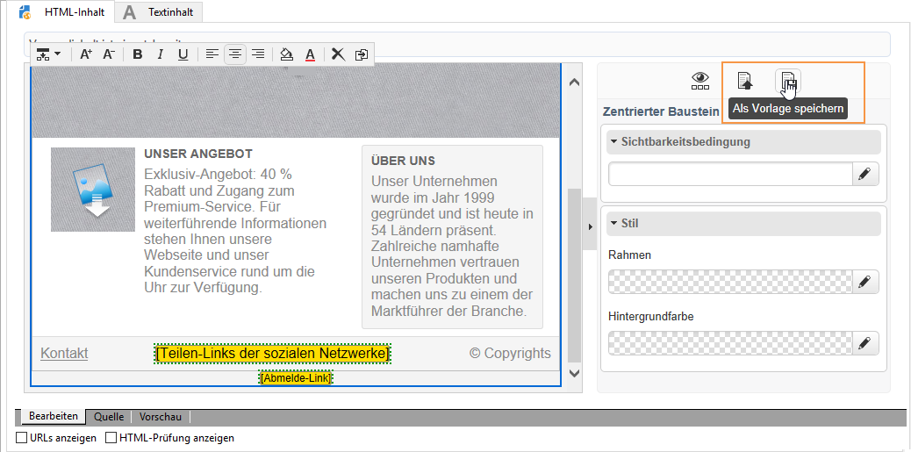

# Vorlagenverwaltung{#template-management}

Der Digital Content Editor bietet **Standardvorlagen** für Webanwendungen und Sendungen.

Bei der Erstellung einer Web-Anwendung des Typs „Landingpage“ können Sie eine dieser Vorlagen auswählen. Sie können auch eine HTML-Vorlage importieren, die außerhalb von Adobe Campaign erstellt wurde.

Weiterführende Informationen zum Hinzufügen einer Vorlage finden Sie im Abschnitt [Globale Optionen](content-editor-interface.md#global-options).

## Versand als Vorlage speichern {#saving-a-delivery-as-a-template}

Nach der Konfiguration eines Versands können Sie diesen als Vorlage für künftige Aktionen speichern.

Öffnen Sie im Tab **Kampagnen** den ausgewählten Versand. Klicken Sie auf die Schaltfläche **Als Vorlage speichern**, geben Sie der Vorlage einen Namen und speichern Sie sie.

Die neue Vorlage wird im Explorer im Knoten **Ressourcen > Vorlagen > Inhaltsvorlagen** gespeichert.
