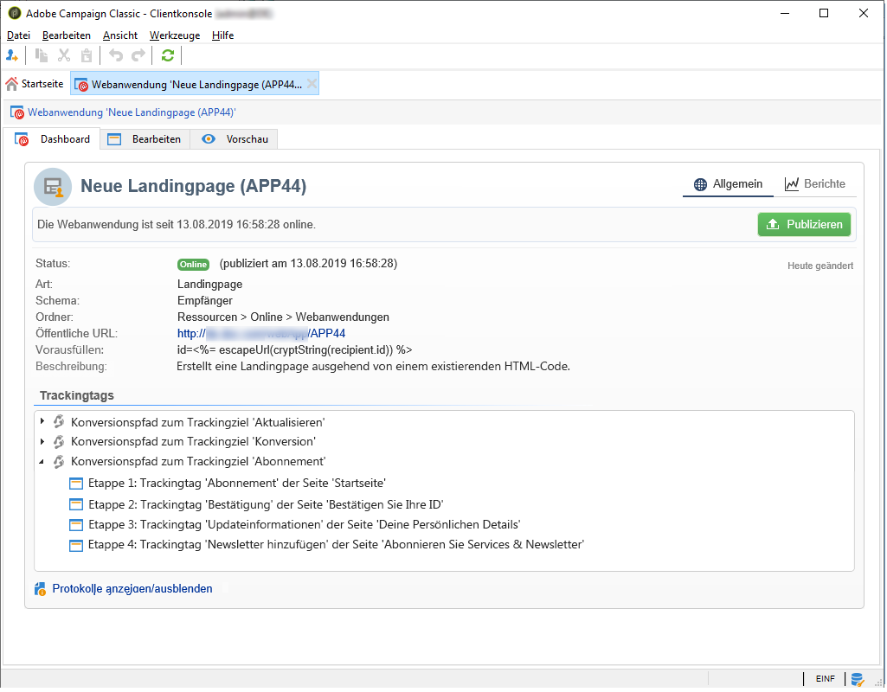
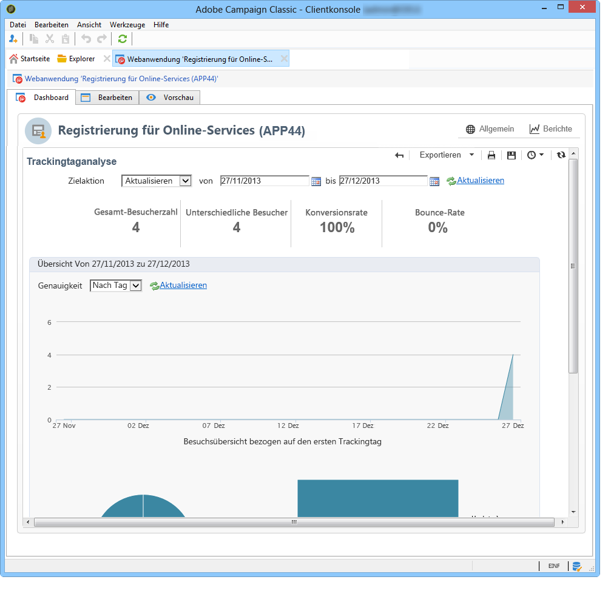
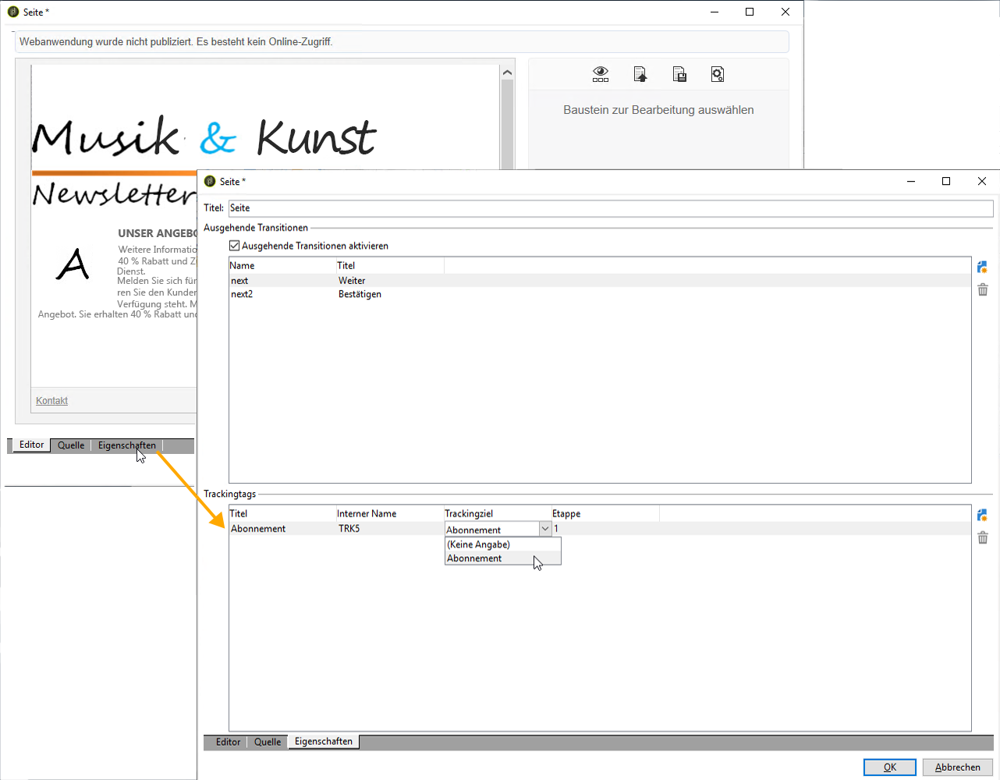
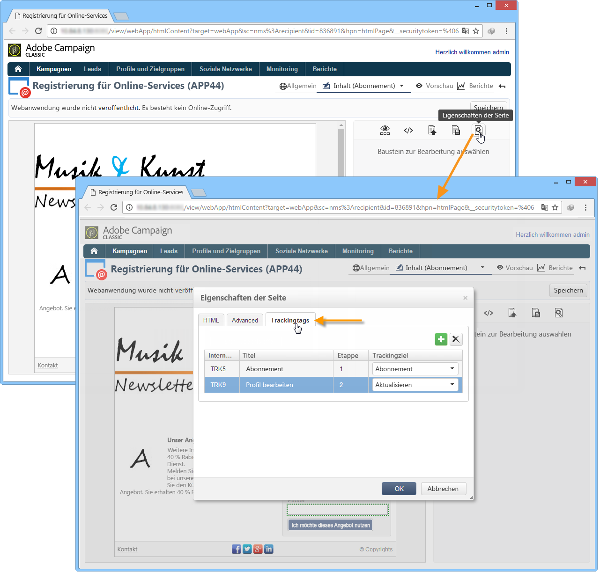
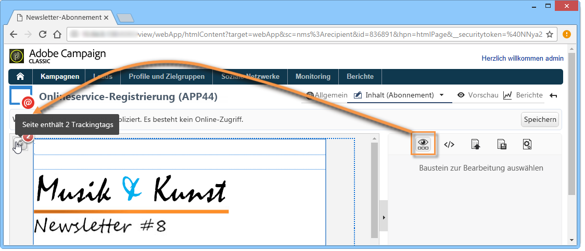

# Webanwendung tracken{#tracking-a-web-application}

Mit Adobe Campaign können Sie Besuche auf Seiten von Webanwendungen verfolgen und messen, indem Sie Tracking-Tags einfügen. Diese Funktion kann für alle Webanwendungstypen verwendet werden (Formulare, Online-Umfragen, mit DCE erstellte Webseiten usw.).

Auf diese Weise können Sie mehrere Navigationspfade definieren und ihren Erfolg bewerten. Diese Daten sind in den Berichten einer jeden Anwendung verfügbar.

Die wichtigsten Verbesserungen in dieser Version sind:

* Möglichkeit, mehrere Trackingtags auf derselben Seite einzufügen, um die Definition des Navigationspfads zu vereinfachen (z. B. Bestellung, Abonnement, Rückgabe)
* Ansicht der Navigationspfade und Trackingtags auf den unterschiedlichen Seiten im Webanwendungs-Dashboard.

   

* Erstellen eines vollständigen Tracking-Berichts

   

   Die wichtigsten Indikatoren sind:

   * **Konvertierungsrate**: Anzahl der Personen, die alle Schritte eines Vorgangs durchlaufen haben.
   * **Bounce-Rate**: Anzahl der Personen, für die nur der erste Schritt angezeigt wurde.
   * **Konvertierungstunnel:** Verlustrate von einem Schritt zum nächsten.

   Zusätzlich wird in einer **Sektorgrafik** die Population entsprechend ihrer Herkunft dargestellt.

## Traffic-Herkunft identifizieren {#identifying-the-traffic-source}

Es können zwei verschiedene Modi verwendet werden, um festzustellen, woher der Besucher beim Zugriff auf eine Webanwendung kommt:

1. Senden einer speziellen Nachricht, in der Sie ihm Zugriff auf die Webanwendungsseiten gewähren: In diesem Fall ist die Traffic-Herkunft dieser Versand.
1. Verknüpfen der Webanwendung mit einer bestimmten Traffic-Herkunft: In diesem Fall muss es sich um eine externe „Traffic-Herkunft“ handeln. Sie kann aus den Eigenschaften der Webanwendung oder dem Zielgruppen-Mapping ausgewählt werden.

   

Um die Traffic-Herkunft in einer Webanwendung festzustellen, sucht Adobe Campaign nach den folgenden Informationen:

1. Die Versandkennung der Quelle, sofern eine vorhanden ist (nlId-Cookie),
1. Die in den Eigenschaften der Webanwendung definierte Kennung des externen Versands, sofern vorhanden,
1. Die im Zielgruppen-Mapping definierte Kennung des externen Versands, sofern vorhanden.

>[!NOTE]
>
>Beachten Sie, dass Anonym-Tracking nur möglich ist, wenn die entsprechende Option im Softwareverteilungs-Assistenten aktiviert wurde.
>
>Weitere Informationen hierzu finden Sie im [Installationshandbuch](../../installation/using/deploying-an-instance.md).

## Mit dem Digital Content Editor (DCE) erstellte Webanwendungen {#web-applications-designed-with-digital-content-editor--dce-}

Wenn eine Webanwendung mit dem HTML-Contenteditor – dem **Digital Content Editor (DCE)** – erstellt wird, werden Trackingtags über den Tab **[!UICONTROL Eigenschaften]** des Editors eingefügt. Weiterführende Informationen zum Digital Content Editor (DCE) finden Sie in [diesem Abschnitt](../../web/using/about-campaign-html-editor.md).

Bei der Verwendung der Webschnittstelle werden Trackingtags über die Seiteneigenschaften eingefügt.

Mit dem Symbol **[!UICONTROL Bausteine anzeigen]** können Sie die Anzahl der für die Seite definierten Trackingtags anzeigen.

