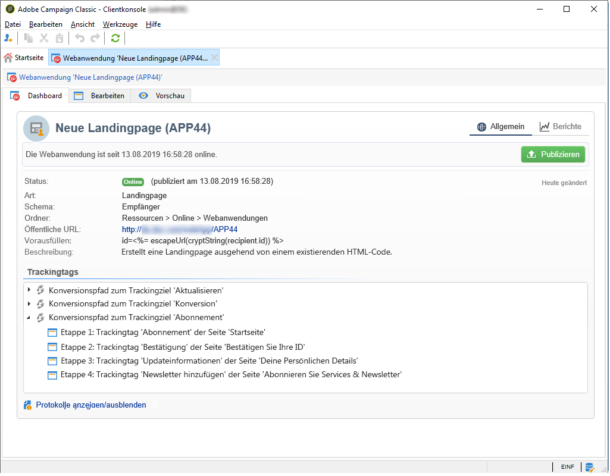
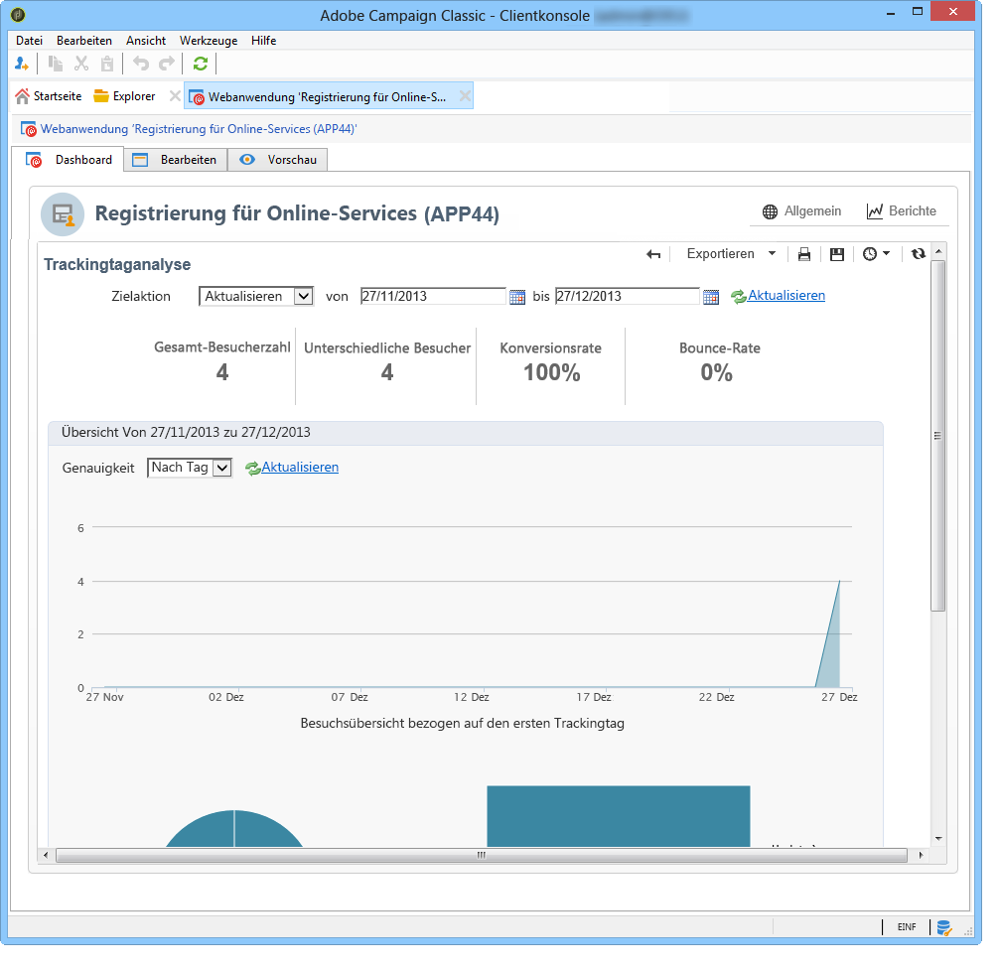
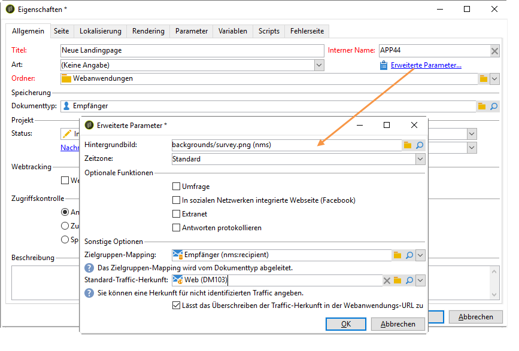
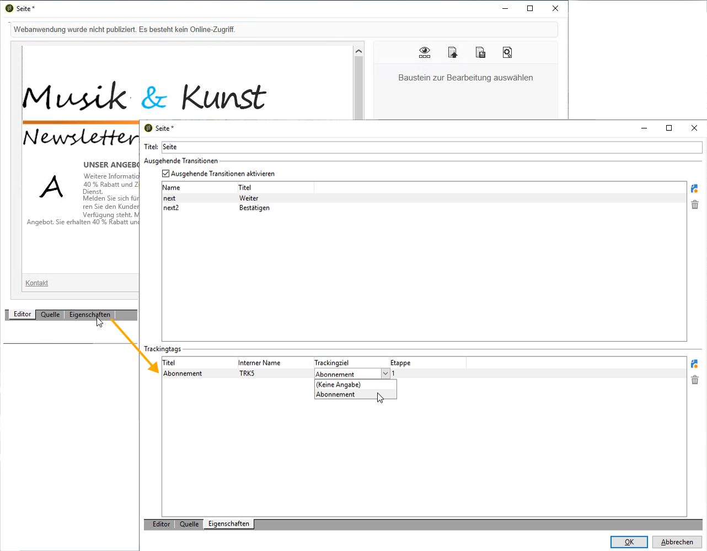
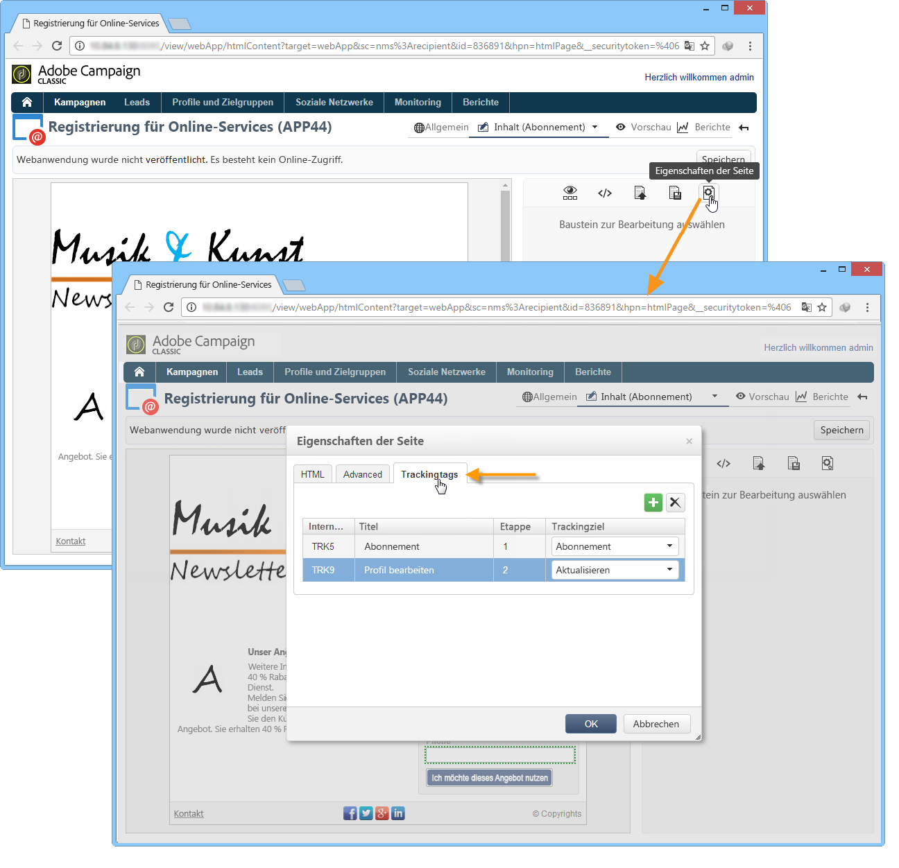
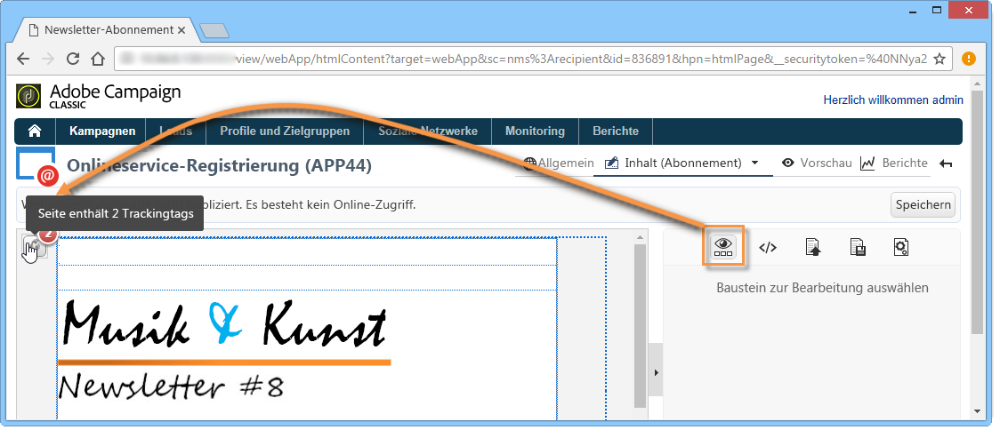

# Besuche in einer Web-Anwendung tracken{#tracking-a-web-application}

Mit Adobe Campaign können Sie Besuche auf Seiten von Web-Anwendungen verfolgen und messen, indem Sie Tracking-Tags einfügen. Diese Funktion kann für alle Typen von Web-Anwendungen (Formulare, Web-Seiten usw.) verwendet werden.

So können Sie mehrere Navigationspfade definieren und deren Erfolg bewerten. Die gewonnenen Daten stehen dann in den Berichten der einzelnen Anwendungen zur Verfügung.

Die wichtigsten Verbesserungen in dieser Version sind:

* Möglichkeit, mehrere Trackingtags auf derselben Seite einzufügen, um die Definition des Navigationspfads zu vereinfachen (z. B. Kauf, Abonnement, Rückgabe)
* Ansicht der Navigationspfade und Trackingtags auf den unterschiedlichen Seiten im Webanwendungs-Dashboard.

  

* Erstellen eines vollständigen Tracking-Berichts

  

  Die wichtigsten Indikatoren sind:

   * **Konversionsrate**: Anzahl der Personen, die alle Schritte eines Vorgangs durchlaufen haben.
   * **Bounce-Rate**: Anzahl der Personen, für die nur der erste Schritt angezeigt wurde.
   * **Konversionstrichter**: Verlustrate von einem Schritt zum nächsten.

  Zusätzlich wird in einer **Sektorgrafik** die Population entsprechend ihrer Herkunft dargestellt.

## Traffic-Herkunft identifizieren {#identifying-the-traffic-source}

Es können zwei verschiedene Modi verwendet werden, um festzustellen, woher der Besucher beim Zugriff auf eine Webanwendung kommt:

1. Senden einer speziellen Nachricht, in der Sie ihm Zugriff auf die Webanwendungsseiten gewähren: In diesem Fall ist die Traffic-Herkunft dieser Versand.
1. Verknüpfen der Webanwendung mit einer bestimmten Traffic-Herkunft: In diesem Fall muss es sich um eine externe „Traffic-Herkunft“ handeln. Sie kann aus den Eigenschaften der Webanwendung oder dem Zielgruppen-Mapping ausgewählt werden.

   

Um die Traffic-Herkunft in einer Webanwendung festzustellen, sucht Adobe Campaign nach den folgenden Informationen:

1. Die Versandkennung der Quelle, sofern eine vorhanden ist (nlId-Cookie),
1. Die in den Eigenschaften der Webanwendung definierte Kennung des externen Versands, sofern vorhanden,
1. Die im Zielgruppen-Mapping definierte Kennung des externen Versands, sofern vorhanden.

>[!NOTE]
>
>Das anonyme Tracking ist nur verfügbar, wenn die Option bei der Installation von Campaign im Bereitstellungassistenten aktiviert wurde.

## Mit dem Digital Content Editor (DCE) erstellte Web-Anwendungen {#web-applications-designed-with-digital-content-editor--dce-}

Wenn eine Webanwendung mit dem HTML-Contenteditor – dem **Digital Content Editor (DCE)** – erstellt wird, werden Trackingtags über den Tab **[!UICONTROL Eigenschaften]** des Editors eingefügt. Weiterführende Informationen zum Digital Content Editor (DCE) finden Sie in [diesem Abschnitt](about-campaign-html-editor.md).

Bei der Verwendung der Webschnittstelle werden Trackingtags über die Seiteneigenschaften eingefügt.

Mit dem Symbol **[!UICONTROL Bausteine anzeigen]** können Sie die Anzahl der für die Seite definierten Trackingtags anzeigen.

