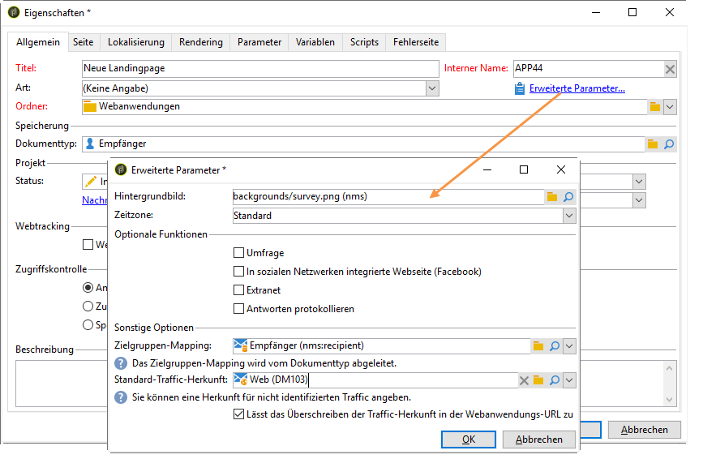

# Webanwendung tracken{#tracking-a-web-application}

Mit Adobe Campaign können Sie Besuche auf Webseiten von Webanwendungen verfolgen und messen, indem Sie Tracking-Tags einfügen. Diese Funktion kann für alle Webanwendungstypen verwendet werden (Formulare, Online-Umfragen, mit DCE erstellte Webseiten usw.).

Auf diese Weise können Sie mehrere Navigationspfade definieren und ihren Erfolg bewerten. Diese Daten sind in den Berichten einer jeden Anwendung verfügbar.

Die wichtigsten Verbesserungen in dieser Version sind:

* Möglichkeit, mehrere Trackingtags auf derselben Seite einzufügen, um die Definition des Navigationspfads zu vereinfachen (z. B. Bestellung, Abonnement, Rückgabe)
* Ansicht der Navigationspfade und Trackingtags auf den unterschiedlichen Seiten im Webanwendungs-Dashboard.

   

* Erstellen eines vollständigen Tracking-Berichts

   

   Die wichtigsten Indikatoren sind:

   * **Konversionsrate**: Anzahl der Personen, die alle Stufen eines Navigationspfads angezeigt haben.
   * **Absprungrate**: Anzahl der Personen, die nur den ersten Schritt angezeigt haben
   * **Umrechnungstunnel**: Verlustrate zwischen den einzelnen Schritten.
   In addition, a **Sector** type chart shows the population according to its source.

## Identifizieren der Traffic-Quelle {#identifying-the-traffic-source}

Mit zwei verschiedenen Modi können Sie identifizieren, woher der Besucher beim Zugriff auf eine Webanwendung kommt:

1. Senden einer bestimmten Bereitstellung, um Zugriff auf die Webseiten der Webanwendung zu gewähren: in diesem Fall ist die Traffic-Quelle diese Bereitstellung,
1. Verknüpfen der Webanwendung mit einer dedizierten Traffic-Quelle: in diesem Fall muss es sich um eine externe &quot;Traffic-Quelle&quot;handeln. Sie kann aus den Webanwendungseigenschaften oder aus der Zielzuordnung ausgewählt werden.

   

Um die Traffic-Herkunft in einer Webanwendung festzustellen, sucht Adobe Campaign nach den folgenden Informationen:

1. Die Versandkennung der Quelle, sofern eine vorhanden ist (nlId-Cookie),
1. Die in den Eigenschaften der Webanwendung definierte Kennung des externen Versands, sofern vorhanden,
1. Die im Zielgruppen-Mapping definierte Kennung des externen Versands, sofern vorhanden.

>[!NOTE]
>
>Beachten Sie, dass Anonym-Tracking nur möglich ist, wenn die entsprechende Option im Softwareverteilungs-Assistenten aktiviert wurde.
>
>For more on this, refer to the [Installation guide](../../installation/using/deploying-an-instance.md).

## Web applications designed with Digital Content Editor (DCE) {#web-applications-designed-with-digital-content-editor--dce-}

Wenn eine Webanwendung mit dem HTML-Inhaltseditor - **Digital Content Editor (DCE)** - erstellt wird, werden Verfolgungs-Tags aus der **[!UICONTROL Properties]** Registerkarte des Editors eingefügt. Weitere Informationen zum Digital Content Editor (DCE) finden Sie in [diesem Abschnitt](../../web/using/about-campaign-html-editor.md).

Bei der Verwendung der Webschnittstelle werden Trackingtags über die Seiteneigenschaften eingefügt.

The **[!UICONTROL Display blocks]** icon lets you view the number of tracking tags defined for the page.

