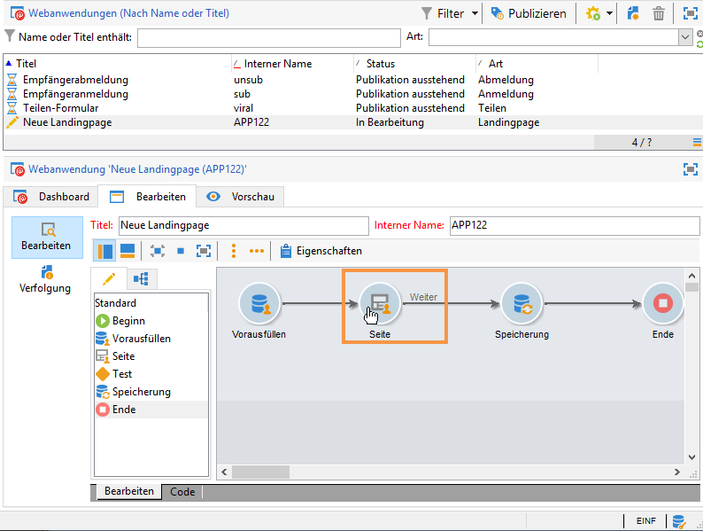
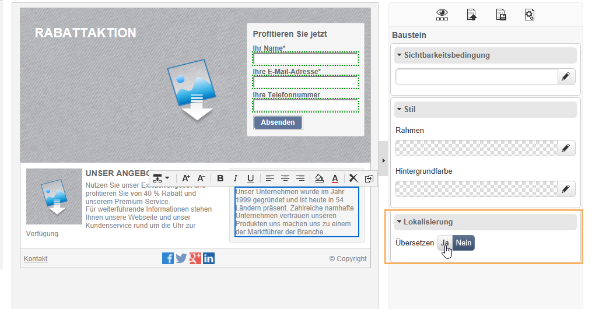
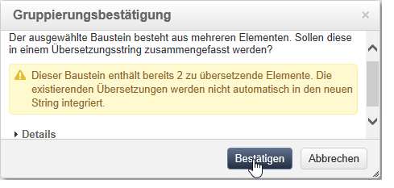
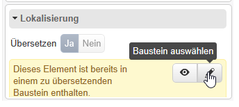

# Webanwendung übersetzen{#translating-a-web-application}

Sie können Webanwendungsseiten übersetzen, die mit dem Adobe Campaign Digital Content Editor (DCE) erstellt wurden.

Wählen Sie mindestens eine weitere Sprache im Tab **[!UICONTROL Lokalisierung]** in den **[!UICONTROL Eigenschaften]** einer Webanwendung aus. Dadurch wird eine neue Option verfügbar, wenn Sie einen HTML-Inhaltsbaustein auf einer mit dem DCE bearbeiteten Seite hinzufügen.

Mit dieser Option können Sie angeben, ob der Inhaltsbaustein übersetzt werden muss oder nicht.

Zu übersetzende Strings werden auf dieselbe Weise erfasst wie die anderen Strings der Webanwendung, nämlich über den Tab der Anwendung **[!UICONTROL Übersetzungen]**. Weiterführende Informationen dazu finden Sie auf [dieser Seite](../../web/using/translating-a-web-form.md).

So kennzeichnen Sie die zu übersetzenden Strings:

1. Öffnen Sie in einer Webanwendung eine mit dem DCE bearbeitete Inhaltsseite.

   

1. Wählen Sie einen HTML-Baustein aus.
1. In den Baustein-Parametern auf der rechten Seite können Sie über die Option **[!UICONTROL Lokalisierung]** den Inhalt des ausgewählten Bausteins kennzeichnen. Standardmäßig ist nur der Seitentitel zur Übersetzung ausgewählt.

   

   >[!NOTE]
   >
   >Strings dürfen maximal 1.023 Zeichen enthalten.

   Es gibt drei Fälle:

   * Wenn der ausgewählte Baustein mehrere Strings/Bausteine enthält, wird er als ein einzelner zu übersetzender String gekennzeichnet. Der String enthält dann den HTML-Code der Elemente innerhalb dieses Bausteins.
   * Wenn Sie einen Baustein kennzeichnen möchten, der mehrere Strings enthält und mindestens einer dieser Strings bereits gekennzeichnet ist, wird ein Warnhinweis angezeigt. Sie haben dann die Möglichkeit, die Kennzeichnung von dem einzelnen String zu entfernen und dem gesamten Baustein hinzuzufügen.

      

   * Wenn Sie die Kennzeichnung von einem String entfernen möchten, der in einem bereits gekennzeichneten Baustein enthalten ist, können Sie die Übersetzungsoption für den String nicht direkt ändern. Sie können jedoch auf den Baustein zugreifen, der den String enthält, und die Übersetzungsoption dort ändern.

      

1. Nachdem Sie die Strings fertig gekennzeichnet haben, kehren Sie zur Webanwendung zurück und wählen Sie den Tab **[!UICONTROL Übersetzungen]** aus.
1. Wählen Sie **[!UICONTROL Zu übersetzende Strings abrufen]** aus. Die im DCE gekennzeichneten Strings werden daraufhin zu den Strings der Webanwendung hinzugefügt.

   >[!NOTE]
   >
   >Nach dem Erfassen der Strings werden diese auch dann nicht aus der Liste entfernt, wenn Sie die Übersetzungskennzeichnung im DCE entfernen. Die Strings bleiben im Übersetzungsspeicher.

1. Übersetzen und validieren Sie die Strings.

   Sie können die Übersetzungen in der Vorschau betrachten, indem Sie die gewünschte Sprache in der Webanwendung im Tab **[!UICONTROL Vorschau]** auswählen.

