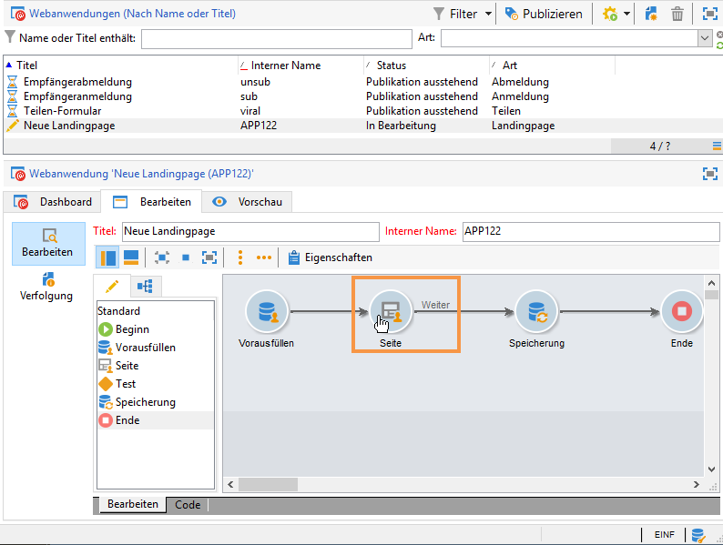
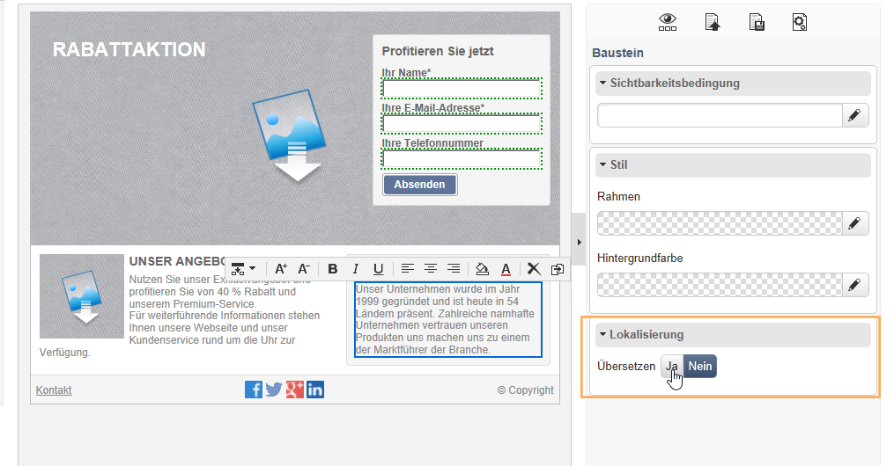
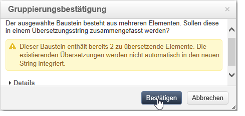
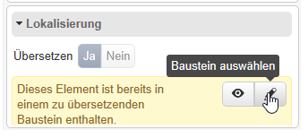

# Übersetzen eines Web-Programms{#translating-a-web-application}

Sie können Webanwendungsseiten übersetzen, die mit dem Adobe Campaign Digital Content Editor (DCE) erstellt wurden.

Wählen Sie mindestens eine weitere Sprache im Tab **[!UICONTROL Lokalisierung]** in den **[!UICONTROL Eigenschaften]** einer Webanwendung aus. Dadurch wird eine neue Option verfügbar, wenn Sie einen HTML-Inhaltsbaustein auf einer mit dem DCE bearbeiteten Seite hinzufügen.

Mit dieser Option können Sie angeben, ob der Inhaltsbaustein übersetzt werden muss oder nicht.

Zu übersetzende Strings werden auf dieselbe Weise erfasst wie die anderen Strings der Webanwendung, nämlich über den Tab der Anwendung **[!UICONTROL Übersetzungen]**. Weitere Informationen hierzu finden Sie auf [dieser Seite](translating-a-web-form.md).

So kennzeichnen Sie die zu übersetzenden Strings:

1. Öffnen Sie in einer Webanwendung eine mit dem DCE bearbeitete Inhaltsseite.

   

1. Wählen Sie einen HTML-Baustein aus.
1. Im Parameterblock auf der rechten Seite können Sie mit der Option **[!UICONTROL Lokalisierung]** den Inhalt des ausgewählten Blocks kennzeichnen. Standardmäßig wird nur der Seitentitel übersetzt.

   

   >[!NOTE]
   >
   >Strings dürfen maximal 1.023 Zeichen enthalten.

   Es gibt drei Fälle:

   * Wenn ein ausgewählter Block mehrere Zeichenfolgen/Blöcke enthält, wird er als eine einzige zu übersetzende Zeichenfolge gekennzeichnet. Die Zeichenfolge enthält dann den HTML-Code der Elemente innerhalb dieses Blocks.
   * Wenn Sie einen Block mit mehreren Zeichenfolgen kennzeichnen möchten und bereits mindestens eine dieser Zeichenfolgen gekennzeichnet ist, wird eine Warnung angezeigt. Anschließend können Sie das Flag aus der isolierten Zeichenfolge entfernen und den gesamten Block hinzufügen.

     

   * Wenn Sie die Markierung aus einer Zeichenfolge entfernen möchten, die sich in einem bereits markierten Block befindet, können Sie die Option für die Zeichenfolgenübersetzung nicht direkt ändern. Sie können jedoch auf den Block zugreifen, der die Zeichenfolge enthält, um sie zu ändern.

     

1. Nachdem Sie die Strings fertig gekennzeichnet haben, kehren Sie zur Webanwendung zurück und wählen Sie den Tab **[!UICONTROL Übersetzungen]** aus.
1. Wählen Sie **[!UICONTROL Sammeln der zu übersetzenden Zeichenfolgen]**. Die in DCE gekennzeichneten Zeichenfolgen werden den Zeichenfolgen der Webanwendung hinzugefügt.

   >[!NOTE]
   >
   >Nachdem die Zeichenfolgen erfasst wurden, werden sie nicht mehr aus der Liste entfernt, wenn Sie die Übersetzungs-Markierung in DCE entfernen. Auf diese Weise können sie im Translation Memory gespeichert werden.

1. Übersetzen und validieren Sie die Strings.

   Sie können die Übersetzungen in der Vorschau betrachten, indem Sie die gewünschte Sprache in der Webanwendung im Tab **[!UICONTROL Vorschau]** auswählen.
