# Übersetzen eines Web-Formulars{#translating-a-web-form}


Sie können eine Webanwendung in mehrere Sprachen lokalisieren.

Übersetzungen können direkt in der Adobe Campaign-Konsole durchgeführt werden (siehe [Übersetzungen im Editor verwalten](#managing-translations-in-the-editor)). Andernfalls können auch Strings exportiert und wieder importiert werden, um die Übersetzung extern durchzuführen (siehe [Übersetzungen extern durchführen](#externalizing-translation)).

Die Liste der standardmäßig verfügbaren Übersetzungssprachen finden Sie in [Anzeigesprache in Formularen ändern](#changing-forms-display-language).

Die Webanwendung ist in einer Bearbeitungssprache erstellt: Dies ist die Referenzsprache für die Eingabe von Titeln und anderen zu übersetzenden Inhalten.

Die Standardsprache ist die Sprache, in der die Webanwendung dargestellt wird, wenn keine Spracheinstellung zu ihrer Zugriffs-URL hinzugefügt wird.

>[!NOTE]
>
>Standardmäßig entsprechen die Bearbeitungssprache und die Standardsprache der Konsolensprache.

## Sprachen wählen {#choosing-languages}

Um eine oder mehr Zielsprachen zu definieren, wählen Sie in der Webanwendung die Schaltfläche **[!UICONTROL Eigenschaften]** und dann den Tab **[!UICONTROL Lokalisierung]** aus. Wählen Sie dann die Schaltfläche **[!UICONTROL Hinzufügen]** aus, um eine neue Zielsprache für die Webanwendung zu definieren.

>[!NOTE]
>
>In diesem Fenster können Sie auch die Standardsprache und die Bearbeitungssprache ändern.

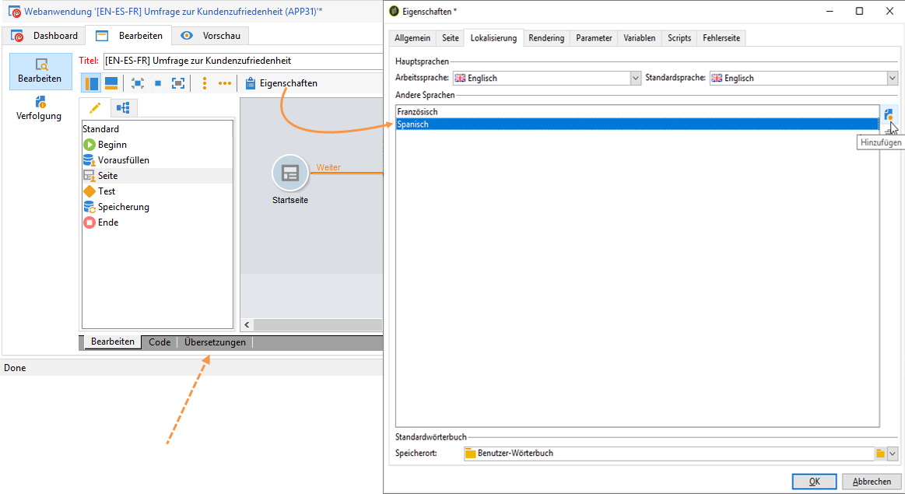

Wenn Sie zu einer Webanwendung Zielsprachen hinzufügen (oder wenn die Standardsprache oder die Bearbeitungssprache unterschiedlich sind), erscheint im Tab **[!UICONTROL Bearbeiten]** der Untertab **[!UICONTROL Übersetzungen]**, über den Übersetzungen verwaltet werden können.

Adobe Campaign enthält ein Tool für die Übersetzung und Verwaltung mehrsprachiger Übersetzungen. Mit diesem Editor können Sie die zu übersetzenden oder zu validierenden Zeichenfolgen anzeigen, Übersetzungen direkt in die Benutzeroberfläche eingeben oder Zeichenfolgen importieren/exportieren, um Übersetzungen zu externalisieren.

## Übersetzungen im Editor verwalten {#managing-translations-in-the-editor}

### Strings abrufen {#collecting-strings}

Im Tab **[!UICONTROL Übersetzungen]** können Sie die Übersetzungen der Zeichenfolgen der Webanwendung eingeben.

Wenn Sie diesen Tab das erste Mal öffnen, sind keine Daten vorhanden. Wählen Sie den Link **[!UICONTROL Zu übersetzende Strings abrufen]** aus, um die Strings in der Webanwendung zu aktualisieren.

Adobe Campaign erfasst Beschriftungen von Feldern und Zeichenfolgen, die auf den Registerkarten **[!UICONTROL Texte]** aller statischen Elemente definiert sind: HTML-Blöcke, JavaScript usw. Statische Elemente werden unter [Statische Elemente in einem Web-Formular](static-elements-in-a-web-form.md) beschrieben.

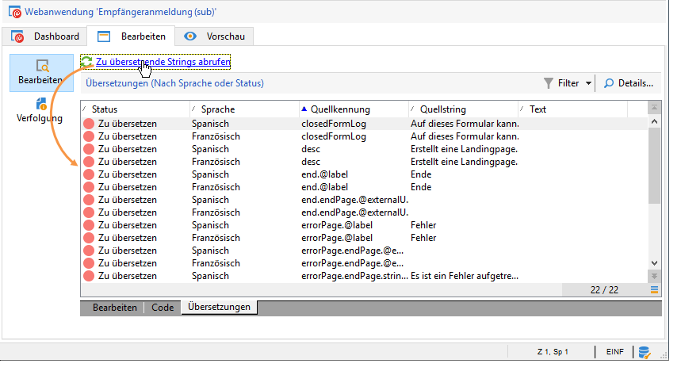

>[!CAUTION]
>
>Dieser Vorgang kann je nach dem zu verarbeitenden Datenvolumen mehrere Minuten dauern.
> 
>Wenn eine Warnung mit dem Hinweis erscheint, dass einige Übersetzungen im System-Wörterbuch fehlen, lesen Sie [Systemstrings übersetzen](#translating-the-system-strings).

Immer wenn ein String übersetzt wurde, wird die Übersetzung zum Übersetzungswörterbuch hinzugefügt.

Wenn beim Abrufen festgestellt wird, dass eine Übersetzung bereits vorhanden ist, wird diese Übersetzung in der Spalte **[!UICONTROL Text]** des Strings angezeigt. Der Status des Strings ändert sich in **[!UICONTROL Übersetzt]**.

Bei noch nicht übersetzten Zeichenfolgen ist das Feld **[!UICONTROL Text]** leer und der Status lautet **[!UICONTROL Zu übersetzen]**.

### Strings filtern {#filtering-strings}

Standardmäßig wird jede Übersetzungssprache der Web-Anwendung angezeigt. Es gibt zwei Standardfilter: Sprache und Status. Wählen Sie die Schaltfläche **[!UICONTROL Filter]** und dann die Option **[!UICONTROL Nach Sprache oder Status]** aus, um die jeweiligen Dropdown-Listen anzuzeigen. Sie können auch einen erweiterten Filter erstellen. Weitere Informationen zu Filtern finden Sie in der [Dokumentation zu Campaign v8 (Konsole)](https://experienceleague.adobe.com/de/docs/campaign/campaign-v8/audience/create-filters){target=_blank}.

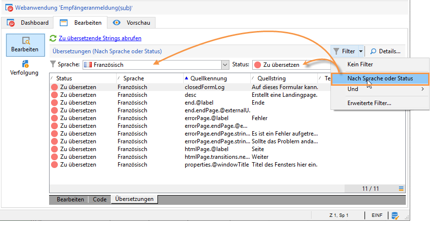

Gehen Sie zur Dropdown-Liste **[!UICONTROL Sprache]**, um die Übersetzungssprache auszuwählen.

Um nur nicht übersetzte Zeichenfolgen anzuzeigen, wählen **[!UICONTROL Zu übersetzen]** in der Dropdown-**„Status** aus. Sie können auch nur übersetzte oder genehmigte Zeichenfolgen anzeigen.

### Strings übersetzen {#translating-strings}

1. Um ein Wort zu übersetzen, führen Sie einen Doppelklick auf die entsprechende Zeile in der Liste der Strings aus.

   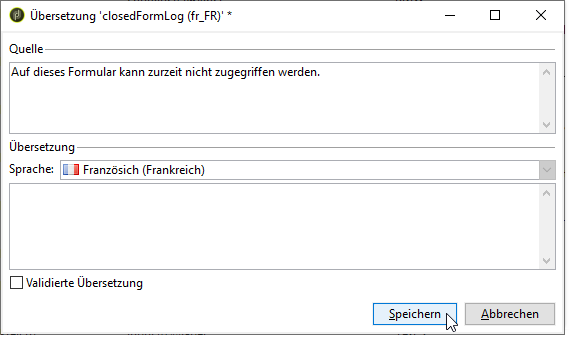

   Im oberen Bereich des Fensters wird der Quellstring angezeigt.

1. Geben Sie im unteren Bereich die Übersetzung ein. Aktivieren Sie zur Validierung die Option **[!UICONTROL Validierte Übersetzung]**.

   >[!NOTE]
   >
   >Die Validierung von Übersetzungen ist optional und blockiert nicht den Vorgang.

   Nicht-validierte Übersetzungen werden als **[!UICONTROL Übersetzt]** angezeigt. Validierte Übersetzungen werden als **[!UICONTROL Validiert]** angezeigt.

## Übersetzungen extern durchführen {#externalizing-translation}

Zeichenfolgen können exportiert und dann wieder importiert werden, um sie mit einem anderen Tool als Adobe Campaign zu übersetzen.

>[!CAUTION]
>
>Nachdem Sie die Zeichenfolgen exportiert haben, führen Sie mit dem integrierten Tool keine Übersetzungen mehr durch. Dies würde zu einem Konflikt führen, wenn Sie die Übersetzungen erneut importieren, und diese gehen verloren.

### Dateien exportieren {#exporting-files}

1. Wählen Sie die Web-Anwendung(en) aus, deren Strings Sie exportieren möchten. Führen Sie dann einen Rechtsklick darauf aus und wählen Sie **[!UICONTROL Aktionen > Strings zur Übersetzung exportieren...]** aus.

   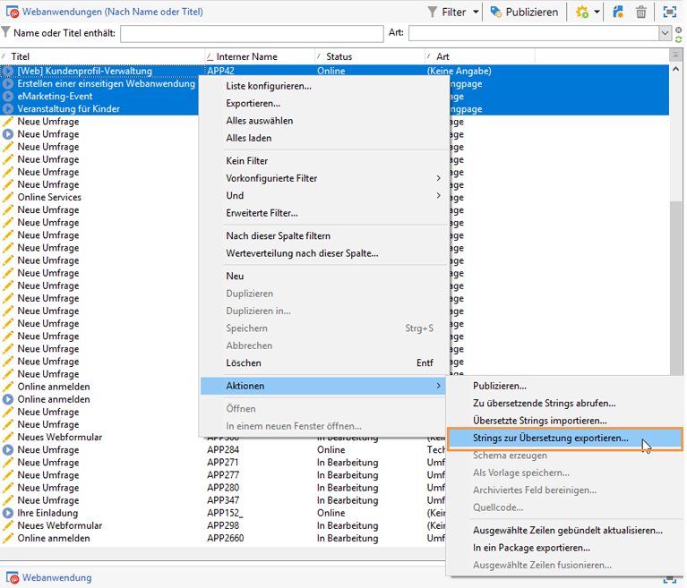

1. Wählen Sie eine **[!UICONTROL Exportstrategie]** aus :

   * **[!UICONTROL Eine Datei pro Sprache]**: Der Export generiert eine Datei pro Übersetzungssprache. Jede Datei wird für alle ausgewählten Web-Anwendungen verwendet.
   * **[!UICONTROL Eine Datei pro Webanwendung]**: Der Export generiert eine Datei pro ausgewählter Webanwendung. Jede Datei enthält alle Übersetzungssprachen.

     >[!NOTE]
     >
     >Dieser Exporttyp ist nicht für XLIFF-Exporte verfügbar.

   * **[!UICONTROL Eine Datei pro Sprache und Web-Anwendung]**: Beim Export werden mehrere Dateien generiert. Jede Datei enthält eine Übersetzungssprache pro Webanwendung.
   * **[!UICONTROL Eine Datei für alle]**: Der Export generiert eine einzelne mehrsprachige Datei für alle Web-Anwendungen. Es enthält alle Übersetzungssprachen für alle ausgewählten Web-Anwendungen.

     >[!NOTE]
     >
     >Dieser Exporttyp ist nicht für XLIFF-Exporte verfügbar.

1. Wählen Sie dann den **[!UICONTROL Zielordner]**, in dem die Dateien gespeichert werden sollen.
1. Wählen Sie das Dateiformat (**[!UICONTROL CSV]** oder **[!UICONTROL XLIFF]**) und danach **[!UICONTROL Start]** aus.

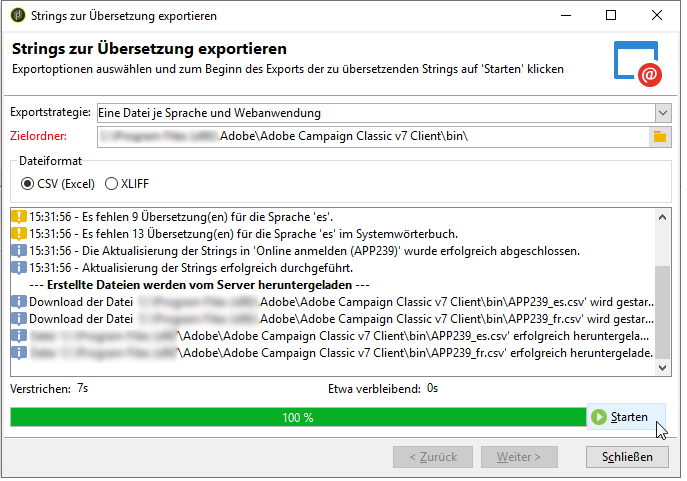

>[!NOTE]
>
>Die Namen der Exportdateien werden automatisch generiert. Wenn Sie denselben Export mehrmals durchführen, ersetzen Sie vorhandene Dateien durch die neuen. Wenn Sie die vorherigen Dateien behalten möchten, ändern Sie den **[!UICONTROL Zielordner]** und wählen Sie erneut **[!UICONTROL Start]** aus, um den Export durchzuführen.

Wenn Sie Dateien im **CSV-Format** exportieren, wird jede Sprache mit einem Status und einem Validierungsstatus verknüpft. Die **Genehmigen?** ermöglicht die Validierung einer Übersetzung. Diese Spalte kann die Werte **Ja** oder **Nein** enthalten. Wie beim integrierten Editor (siehe [Übersetzungen im Editor verwalten](#managing-translations-in-the-editor)) ist das Validieren von Übersetzungen optional und blockiert den Fortschritt nicht.

### Dateien importieren {#importing-files}

Nach dem Abschluss der externen Übersetzung können Sie die übersetzten Dateien importieren.

1. Gehen Sie zur Liste der Webanwendungen, klicken Sie mit der rechten Maustaste und wählen Sie dann **[!UICONTROL Aktionen > Übersetzte Strings importieren...]** aus.

   >[!NOTE]
   >
   >Es ist nicht erforderlich, die von der Übersetzung betroffenen Webanwendungen auszuwählen. Platzieren Sie den Cursor an einer beliebigen Stelle in der Liste der Webanwendungen.

   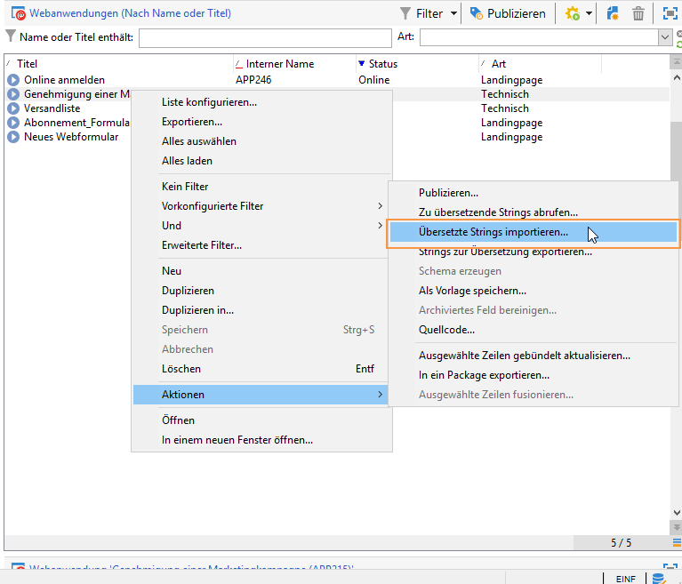

1. Wählen Sie die zu importierende Datei und dann **[!UICONTROL Upload]** aus.

   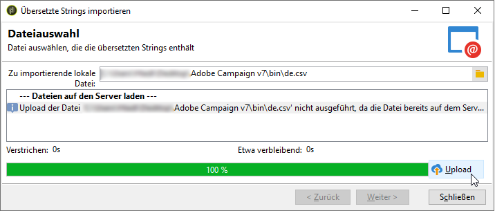

>[!NOTE]
>
>Externe Übersetzungen haben immer Vorrang vor internen Übersetzungen. Bei Konflikten wird die interne Übersetzung mit der externen Übersetzung überschrieben.

## Anzeigesprache in Formularen ändern {#changing-forms-display-language}

Webformulare werden in der Standardsprache angezeigt, die auf der Registerkarte **[!UICONTROL Lokalisierung]** in den Eigenschaften der Web-Anwendung angegeben ist. Um Sprachen zu ändern, müssen Sie die folgenden Zeichen am Ende der URL hinzufügen (wobei **xx** das Symbol der Sprache ist):

```
?lang=xx
```

wenn die Sprache der erste oder einzige Parameter der URL ist. Beispiel: **https://myserver/webApp/APP34**

```
&lang=xx
```

wenn es in der URL vor der Sprache noch andere Parameter gibt. Beispiel: **https://myserver/webApp/APP34?status=1&lang=en**

Die standardmäßig verfügbaren Übersetzungssprachen und Wörterbücher sind unten aufgeführt.

**Standard-System-Wörterbuch**: Einige Sprachen enthalten ein Standardwörterbuch, das die Übersetzung der Systemstrings enthält. Weitere Informationen finden Sie unter [Systemstrings übersetzen](#translating-the-system-strings).

**Kalenderverwaltung**: Die Seiten einer Web-Anwendung können einen Kalender zur Eingabe von Datumsangaben enthalten. Standardmäßig ist dieser Kalender in mehreren Sprachen verfügbar (Übersetzung von Tagen, Datumsformat).

<table> 
 <tbody> 
  <tr> 
   <td> <strong>Sprache (Symbole)</strong><br /> </td> 
   <td> <strong>Standard-System-Wörterbücher</strong><br /> </td> 
   <td> <strong>Kalenderverwaltung</strong><br /> </td> 
  </tr> 
  <tr> 
   <td> Deutsch (de)<br /> </td> 
   <td> ja<br /> </td> 
   <td> ja<br /> </td> 
  </tr> 
  <tr> 
   <td> Englisch (EN)<br /> </td> 
   <td> ja<br /> </td> 
   <td> ja<br /> </td> 
  </tr> 
  <tr> 
   <td> Englisch (USA) (en_US)<br /> </td> 
   <td> </td> 
   <td> </td> 
  </tr> 
  <tr> 
   <td> Englisch (UK) (en_GB)<br /> </td> 
   <td> </td> 
   <td> </td> 
  </tr> 
  <tr> 
   <td> Arabisch (ar)<br /> </td> 
   <td> </td> 
   <td> </td> 
  </tr> 
  <tr> 
   <td> Chinesisch (zh)<br /> </td> 
   <td> </td> 
   <td> </td> 
  </tr> 
  <tr> 
   <td> Koreanisch (ko)<br /> </td> 
   <td> </td> 
   <td> </td> 
  </tr> 
  <tr> 
   <td> Dänisch (da)<br /> </td> 
   <td> ja<br /> </td> 
   <td> ja<br /> </td> 
  </tr> 
  <tr> 
   <td> Spanisch (es)<br /> </td> 
   <td> ja<br /> </td> 
   <td> ja<br /> </td> 
  </tr> 
  <tr> 
   <td> Estnisch (et)<br /> </td> 
   <td> </td> 
   <td> </td> 
  </tr> 
  <tr> 
   <td> Finnisch (fi)<br /> </td> 
   <td> </td> 
   <td> ja<br /> </td> 
  </tr> 
  <tr> 
   <td> Französisch (fr)<br /> </td> 
   <td> ja<br /> </td> 
   <td> ja<br /> </td> 
  </tr> 
  <tr> 
   <td> Französisch (Belgien) (fr_BE)<br /> </td> 
   <td> </td> 
   <td> </td> 
  </tr> 
  <tr> 
   <td> Französisch (Frankreich) (fr_FR)<br /> </td> 
   <td> </td> 
   <td> </td> 
  </tr> 
  <tr> 
   <td> Griechisch (el)<br /> </td> 
   <td> </td> 
   <td> ja<br /> </td> 
  </tr> 
  <tr> 
   <td> Hebräisch (he)<br /> </td> 
   <td> </td> 
   <td> </td> 
  </tr> 
  <tr> 
   <td> Ungarisch (hu)<br /> </td> 
   <td> </td> 
   <td> ja<br /> </td> 
  </tr> 
  <tr> 
   <td> Indonesisch (id)<br /> </td> 
   <td> </td> 
   <td> </td> 
  </tr> 
  <tr> 
   <td> Irisch (ga)<br /> </td> 
   <td> </td> 
   <td> </td> 
  </tr> 
  <tr> 
   <td> Italienisch (it)<br /> </td> 
   <td> ja<br /> </td> 
   <td> ja<br /> </td> 
  </tr> 
  <tr> 
   <td> Italienisch (Italien) (it_IT)<br /> </td> 
   <td> </td> 
   <td> </td> 
  </tr> 
  <tr> 
   <td> Italienisch (Schweiz) (it_CH)<br /> </td> 
   <td> </td> 
   <td> </td> 
  </tr> 
  <tr> 
   <td> Japanisch (ja)<br /> </td> 
   <td> </td> 
   <td> </td> 
  </tr> 
  <tr> 
   <td> Lettisch (lv)<br /> </td> 
   <td> </td> 
   <td> ja<br /> </td> 
  </tr> 
  <tr> 
   <td> Litauisch (lt)<br /> </td> 
   <td> </td> 
   <td> </td> 
  </tr> 
  <tr> 
   <td> Maltesisch (mt)<br /> </td> 
   <td> </td> 
   <td> </td> 
  </tr> 
  <tr> 
   <td> Niederländisch (nl)<br /> </td> 
   <td> </td> 
   <td> ja<br /> </td> 
  </tr> 
  <tr> 
   <td> Niederländisch (Belgien) (nl_BE)<br /> </td> 
   <td> </td> 
   <td> </td> 
  </tr> 
  <tr> 
   <td> Niederländisch (Niederlande) (nl_NL)<br /> </td> 
   <td> </td> 
   <td> </td> 
  </tr> 
  <tr> 
   <td> Norwegisch (Norwegen) (no_NO)<br /> </td> 
   <td> </td> 
   <td> ja<br /> </td> 
  </tr> 
  <tr> 
   <td> Polnisch (pl)<br /> </td> 
   <td> </td> 
   <td> ja<br /> </td> 
  </tr> 
  <tr> 
   <td> Portugiesisch (pt)<br /> </td> 
   <td> </td> 
   <td> ja<br /> </td> 
  </tr> 
  <tr> 
   <td> Portugiesisch (Brasilien) (pt_BR)<br /> </td> 
   <td> </td> 
   <td> </td> 
  </tr> 
  <tr> 
   <td> Portugiesisch (Portugal) (pt_PT)<br /> </td> 
   <td> </td> 
   <td> </td> 
  </tr> 
  <tr> 
   <td> Russisch (ru)<br /> </td> 
   <td> </td> 
   <td> ja<br /> </td> 
  </tr> 
  <tr> 
   <td> Slowenisch (sl)<br /> </td> 
   <td> </td> 
   <td> </td> 
  </tr> 
  <tr> 
   <td> Slowakisch (sk)<br /> </td> 
   <td> </td> 
   <td> </td> 
  </tr> 
  <tr> 
   <td> Schwedisch (sv)<br /> </td> 
   <td> ja<br /> </td> 
   <td> ja<br /> </td> 
  </tr> 
  <tr> 
   <td> Schwedisch (Finnland) (sv_FI)<br /> </td> 
   <td> </td> 
   <td> </td> 
  </tr> 
  <tr> 
   <td> Schwedisch (Schweden) (sv_SE)<br /> </td> 
   <td> </td> 
   <td> </td> 
  </tr> 
  <tr> 
   <td> Tschechisch (cs)<br /> </td> 
   <td> </td> 
   <td> </td> 
  </tr> 
  <tr> 
   <td> Thailändisch (th)<br /> </td> 
   <td> </td> 
   <td> </td> 
  </tr> 
  <tr> 
   <td> Vietnamesisch (vi)<br /> </td> 
   <td> </td> 
   <td> </td> 
  </tr> 
  <tr> 
   <td> Wallonisch (wa)<br /> </td> 
   <td> </td> 
   <td> </td> 
  </tr> 
 </tbody> 
</table>

>[!NOTE]
>
>Weitere Informationen zum Hinzufügen anderer als standardmäßig angebotener Sprachen finden Sie unter [Sprache hinzufügen, in die übersetzt werden soll](#adding-a-translation-language).

## Beispiel: eine Web-Anwendung in mehreren Sprachen anzeigen {#example--displaying-a-web-application-in-several-languages}

Das folgende Webformular ist in vier Sprachen verfügbar: Deutsch, Englisch, Französisch und Spanisch. Die Zeichenfolgen wurden alle über den Tab **[!UICONTROL Übersetzung]** des Webformulars übersetzt. Da die Standardsprache Englisch ist, verwenden Sie bei der Veröffentlichung der Umfrage die Standard-URL, um den Inhalt auf Englisch anzuzeigen.

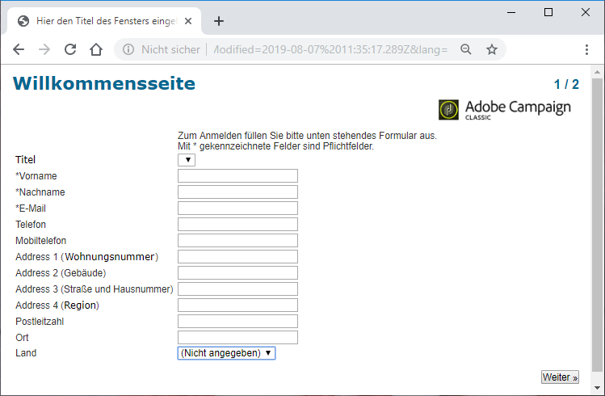

Fügen Sie **?lang=fr** an das Ende der URL hinzu, um den Inhalt auf Französisch anzuzeigen:

>[!NOTE]
>
>Die Liste der Symbole für jede Sprache finden Sie in [Anzeigesprache in Formularen ändern](#changing-forms-display-language).

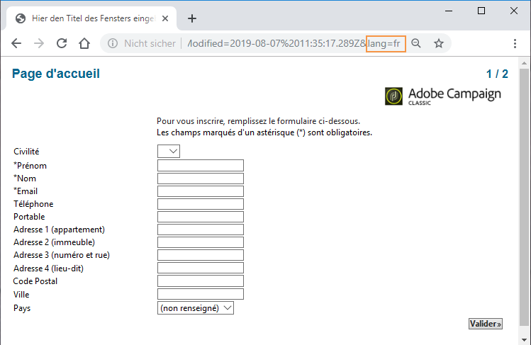

Fügen Sie **?lang=es** oder **?lang=de** hinzu, um den Inhalt auf Spanisch oder Deutsch anzuzeigen.

>[!NOTE]
>
>Wenn für diese Webanwendung bereits andere Parameter verwendet werden, fügen Sie **&amp;lang=** hinzu.\
>Beispiel: **https://myserver/webApp/APP34?status=1&lang=en**

## Erweiterte Übersetzungskonfiguration {#advanced-translation-configuration}

>[!CAUTION]
>
>Dieser Abschnitt ist nur für erfahrene Benutzer.

### System-Strings übersetzen {#translating-the-system-strings}

System-Strings sind native Strings, die von allen Web-Anwendungen verwendet werden. Beispiel: **[!UICONTROL Weiter]** , **[!UICONTROL Zurück]**, **[!UICONTROL Genehmigen]** Schaltflächen, **[!UICONTROL Laden]** Meldungen usw. Standardmäßig enthalten einige Sprachen ein Wörterbuch mit Übersetzungen für diese Zeichenfolgen. Die Liste der Sprachen finden Sie in [Anzeigesprache in Formularen ändern](#changing-forms-display-language).

Wenn Sie Ihre Webanwendung in eine Sprache übersetzen, für die es kein System-Wörterbuch gibt, erscheint ein Warnhinweis, der Ihnen mitteilt, dass manche Übersetzungen fehlen.

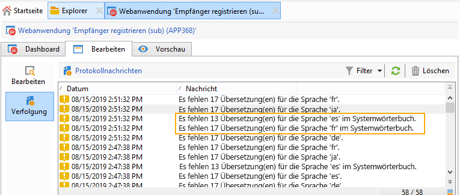

Gehen Sie wie folgt vor, um eine Sprache hinzuzufügen:

1. Gehen Sie zum Adobe Campaign-Baum und wählen Sie **[!UICONTROL Administration > Konfiguration > Allgemeines Wörterbuch > System-Wörterbuch]** aus .
1. Wählen Sie im oberen Bereich des Fensters den zu übersetzenden Systemstring und danach im unteren Bereich die Option **[!UICONTROL Hinzufügen]** aus.

   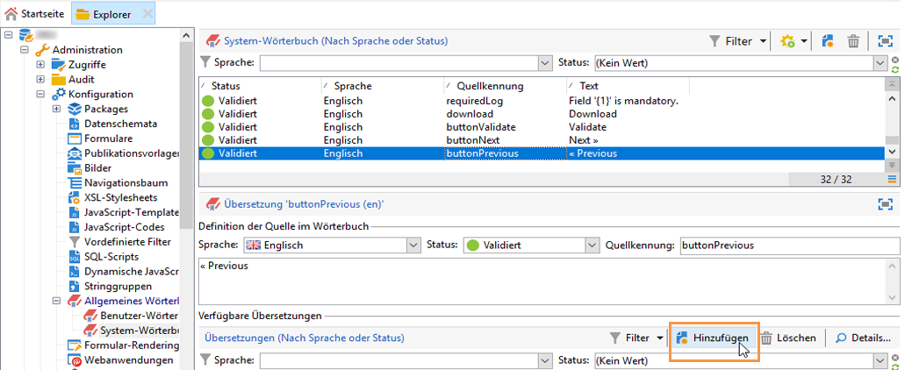

1. Wählen Sie die Übersetzungssprache aus und geben Sie eine Übersetzung für die Zeichenfolge ein. Sie können die Übersetzung genehmigen, indem Sie die Option **[!UICONTROL Übersetzung genehmigt]** aktivieren.

   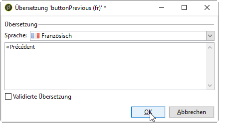

   >[!NOTE]
   >
   >Die Validierung von Übersetzungen ist optional und blockiert nicht den Vorgang.

>[!CAUTION]
>
>Löschen Sie nicht die nativen Systemstrings.

### Sprache hinzufügen, in die übersetzt werden soll {#adding-a-translation-language}

Um Web-Anwendungen in andere Sprachen als die Standardsprachen zu übersetzen (siehe [Anzeigesprache in Formularen ändern](#changing-forms-display-language)), müssen Sie eine neue Übersetzungssprache hinzufügen.

1. Klicken Sie auf den Knoten **[!UICONTROL Administration > Plattform > Aufzählungen]** der Adobe Campaign-Baumstruktur und wählen Sie **[!UICONTROL Für die Übersetzung verfügbare Sprachen]** aus der Liste aus. Die Liste der verfügbaren Übersetzungen wird im unteren Bereich des Fensters angezeigt.

   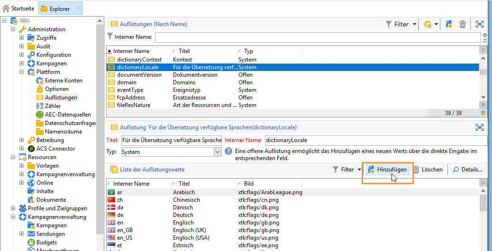

1. Klicken Sie auf **[!UICONTROL Hinzufügen]** und geben Sie dann den **[!UICONTROL Internen Namen]**, **[!UICONTROL Titel]** und die Kennung des Bildes (Flag) ein. Wenden Sie sich an Ihren Administrator, um ein neues Bild hinzuzufügen.

   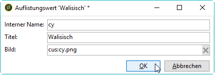
